

 
 
 
 
 
 
 
 
 

 
 
 
 
 
 
 
 
 

OPEN SOUND DATA MANUAL 
~オープンサウンドデータの活用法~ 
6 (Aug 14, 2021)
 
 
 
 

 

INDEX

<!-- TOC -->

- [1. オープンサウンドデータとは](#1-%E3%82%AA%E3%83%BC%E3%83%97%E3%83%B3%E3%82%B5%E3%82%A6%E3%83%B3%E3%83%89%E3%83%87%E3%83%BC%E3%82%BF%E3%81%A8%E3%81%AF)
    - [1.1. はじめに](#11-%E3%81%AF%E3%81%98%E3%82%81%E3%81%AB)
    - [1.2. 利用規約](#12-%E5%88%A9%E7%94%A8%E8%A6%8F%E7%B4%84)
    - [1.3. おことわり](#13-%E3%81%8A%E3%81%93%E3%81%A8%E3%82%8F%E3%82%8A)
    - [1.4. サウンドデータの一覧](#14-%E3%82%B5%E3%82%A6%E3%83%B3%E3%83%89%E3%83%87%E3%83%BC%E3%82%BF%E3%81%AE%E4%B8%80%E8%A6%A7)
        - [1.4.1. ディーゼル・気動車](#141-%E3%83%87%E3%82%A3%E3%83%BC%E3%82%BC%E3%83%AB%E3%83%BB%E6%B0%97%E5%8B%95%E8%BB%8A)
        - [1.4.2. 機関車](#142-%E6%A9%9F%E9%96%A2%E8%BB%8A)
        - [1.4.3. 国鉄・JR 特急型](#143-%E5%9B%BD%E9%89%84%E3%83%BBjr-%E7%89%B9%E6%80%A5%E5%9E%8B)
        - [1.4.4. 国鉄・JR 通勤型他](#144-%E5%9B%BD%E9%89%84%E3%83%BBjr-%E9%80%9A%E5%8B%A4%E5%9E%8B%E4%BB%96)
        - [1.4.5. 私鉄](#145-%E7%A7%81%E9%89%84)
    - [1.5. 心構え](#15-%E5%BF%83%E6%A7%8B%E3%81%88)
    - [1.6. 用意するもの](#16-%E7%94%A8%E6%84%8F%E3%81%99%E3%82%8B%E3%82%82%E3%81%AE)
- [2. LokSoundデコーダ](#2-loksound%E3%83%87%E3%82%B3%E3%83%BC%E3%83%80)
    - [2.1. 開発元のESU社とは](#21-%E9%96%8B%E7%99%BA%E5%85%83%E3%81%AEesu%E7%A4%BE%E3%81%A8%E3%81%AF)
    - [2.2. LokSoundの歴史](#22-loksound%E3%81%AE%E6%AD%B4%E5%8F%B2)
    - [2.3. LokSound 5シリーズ](#23-loksound-5%E3%82%B7%E3%83%AA%E3%83%BC%E3%82%BA)
    - [2.4. LokSoundをなぜ使うのか](#24-loksound%E3%82%92%E3%81%AA%E3%81%9C%E4%BD%BF%E3%81%86%E3%81%AE%E3%81%8B)
- [3. LokProgrammerの使い方](#3-lokprogrammer%E3%81%AE%E4%BD%BF%E3%81%84%E6%96%B9)
    - [3.1. LokProgrammerソフトのダウンロードとインストール](#31-lokprogrammer%E3%82%BD%E3%83%95%E3%83%88%E3%81%AE%E3%83%80%E3%82%A6%E3%83%B3%E3%83%AD%E3%83%BC%E3%83%89%E3%81%A8%E3%82%A4%E3%83%B3%E3%82%B9%E3%83%88%E3%83%BC%E3%83%AB)
    - [3.2. LokProgrammerの起動](#32-lokprogrammer%E3%81%AE%E8%B5%B7%E5%8B%95)
    - [3.3. 書込み装置の接続](#33-%E6%9B%B8%E8%BE%BC%E3%81%BF%E8%A3%85%E7%BD%AE%E3%81%AE%E6%8E%A5%E7%B6%9A)
    - [3.4. オープンサウンドデータの書込み](#34-%E3%82%AA%E3%83%BC%E3%83%97%E3%83%B3%E3%82%B5%E3%82%A6%E3%83%B3%E3%83%89%E3%83%87%E3%83%BC%E3%82%BF%E3%81%AE%E6%9B%B8%E8%BE%BC%E3%81%BF)
    - [3.5. サウンドの編集画面の説明](#35-%E3%82%B5%E3%82%A6%E3%83%B3%E3%83%89%E3%81%AE%E7%B7%A8%E9%9B%86%E7%94%BB%E9%9D%A2%E3%81%AE%E8%AA%AC%E6%98%8E)
    - [3.6. サウンドスロットとは？](#36-%E3%82%B5%E3%82%A6%E3%83%B3%E3%83%89%E3%82%B9%E3%83%AD%E3%83%83%E3%83%88%E3%81%A8%E3%81%AF)
    - [3.7. ファンクション番号の変更](#37-%E3%83%95%E3%82%A1%E3%83%B3%E3%82%AF%E3%82%B7%E3%83%A7%E3%83%B3%E7%95%AA%E5%8F%B7%E3%81%AE%E5%A4%89%E6%9B%B4)
- [4. サウンドの作り方](#4-%E3%82%B5%E3%82%A6%E3%83%B3%E3%83%89%E3%81%AE%E4%BD%9C%E3%82%8A%E6%96%B9)
    - [4.1. はじめに](#41-%E3%81%AF%E3%81%98%E3%82%81%E3%81%AB)
    - [4.2. 機材の入手](#42-%E6%A9%9F%E6%9D%90%E3%81%AE%E5%85%A5%E6%89%8B)
    - [4.3. 収録に向けた心構え](#43-%E5%8F%8E%E9%8C%B2%E3%81%AB%E5%90%91%E3%81%91%E3%81%9F%E5%BF%83%E6%A7%8B%E3%81%88)
    - [4.4. 収録のコツ](#44-%E5%8F%8E%E9%8C%B2%E3%81%AE%E3%82%B3%E3%83%84)
    - [4.5. 収録しなければならない音](#45-%E5%8F%8E%E9%8C%B2%E3%81%97%E3%81%AA%E3%81%91%E3%82%8C%E3%81%B0%E3%81%AA%E3%82%89%E3%81%AA%E3%81%84%E9%9F%B3)
    - [4.6. サウンド加工・ノイズ低減](#46-%E3%82%B5%E3%82%A6%E3%83%B3%E3%83%89%E5%8A%A0%E5%B7%A5%E3%83%BB%E3%83%8E%E3%82%A4%E3%82%BA%E4%BD%8E%E6%B8%9B)
    - [4.7. 走行音の加工・編集](#47-%E8%B5%B0%E8%A1%8C%E9%9F%B3%E3%81%AE%E5%8A%A0%E5%B7%A5%E3%83%BB%E7%B7%A8%E9%9B%86)
    - [4.8. 発車ベル切出し](#48-%E7%99%BA%E8%BB%8A%E3%83%99%E3%83%AB%E5%88%87%E5%87%BA%E3%81%97)
    - [4.9. VVVFサウンドの作り方](#49-vvvf%E3%82%B5%E3%82%A6%E3%83%B3%E3%83%89%E3%81%AE%E4%BD%9C%E3%82%8A%E6%96%B9)
    - [4.10. ディーゼルサウンドの作り方](#410-%E3%83%87%E3%82%A3%E3%83%BC%E3%82%BC%E3%83%AB%E3%82%B5%E3%82%A6%E3%83%B3%E3%83%89%E3%81%AE%E4%BD%9C%E3%82%8A%E6%96%B9)
    - [4.11. SpectraLayersの使い方](#411-spectralayers%E3%81%AE%E4%BD%BF%E3%81%84%E6%96%B9)
- [5. 搭載方法](#5-%E6%90%AD%E8%BC%89%E6%96%B9%E6%B3%95)
    - [5.1. 搭載するにあたり注意事項](#51-%E6%90%AD%E8%BC%89%E3%81%99%E3%82%8B%E3%81%AB%E3%81%82%E3%81%9F%E3%82%8A%E6%B3%A8%E6%84%8F%E4%BA%8B%E9%A0%85)
    - [5.2. 搭載補助基板を活用しよう](#52-%E6%90%AD%E8%BC%89%E8%A3%9C%E5%8A%A9%E5%9F%BA%E6%9D%BF%E3%82%92%E6%B4%BB%E7%94%A8%E3%81%97%E3%82%88%E3%81%86)
    - [5.3. DCCコネクタ](#53-dcc%E3%82%B3%E3%83%8D%E3%82%AF%E3%82%BF)
    - [5.4. AUX,HEAD,TAIL配線](#54-auxheadtail%E9%85%8D%E7%B7%9A)
        - [5.4.1. 両極性モードのHEAD,TAIL](#541-%E4%B8%A1%E6%A5%B5%E6%80%A7%E3%83%A2%E3%83%BC%E3%83%89%E3%81%AEheadtail)
        - [5.4.2. DCC標準配線方法のAUX,HEAD,TAILオープンコレクタ](#542-dcc%E6%A8%99%E6%BA%96%E9%85%8D%E7%B7%9A%E6%96%B9%E6%B3%95%E3%81%AEauxheadtail%E3%82%AA%E3%83%BC%E3%83%97%E3%83%B3%E3%82%B3%E3%83%AC%E3%82%AF%E3%82%BF)
    - [5.5. KATO HO単行車クモハ40, キハ110等](#55-kato-ho%E5%8D%98%E8%A1%8C%E8%BB%8A%E3%82%AF%E3%83%A2%E3%83%8F40-%E3%82%AD%E3%83%8F110%E7%AD%89)
    - [5.6. KATO HO動力車,キハ80等](#56-kato-ho%E5%8B%95%E5%8A%9B%E8%BB%8A%E3%82%AD%E3%83%8F80%E7%AD%89)
    - [5.7. KATO HO機関車,EF81,EF510](#57-kato-ho%E6%A9%9F%E9%96%A2%E8%BB%8Aef81ef510)
    - [5.8. Tomix HO](#58-tomix-ho)
    - [5.9. トラムウェイ HO](#59-%E3%83%88%E3%83%A9%E3%83%A0%E3%82%A6%E3%82%A7%E3%82%A4-ho)
    - [5.10. エンドウ HO](#510-%E3%82%A8%E3%83%B3%E3%83%89%E3%82%A6-ho)
    - [5.11. でんてつ工房 プラHO](#511-%E3%81%A7%E3%82%93%E3%81%A6%E3%81%A4%E5%B7%A5%E6%88%BF-%E3%83%97%E3%83%A9ho)
    - [5.12. Nゲージ](#512-n%E3%82%B2%E3%83%BC%E3%82%B8)
        - [5.12.1. KATO 113系](#5121-kato-113%E7%B3%BB)
        - [5.12.2. KATO C59 DCCサウンド加工](#5122-kato-c59-dcc%E3%82%B5%E3%82%A6%E3%83%B3%E3%83%89%E5%8A%A0%E5%B7%A5)
        - [5.12.3. KATO E233 DCCフレンドリー](#5123-kato-e233-dcc%E3%83%95%E3%83%AC%E3%83%B3%E3%83%89%E3%83%AA%E3%83%BC)
- [6. よく使う設定](#6-%E3%82%88%E3%81%8F%E4%BD%BF%E3%81%86%E8%A8%AD%E5%AE%9A)
    - [6.1. よく使うCVの設定](#61-%E3%82%88%E3%81%8F%E4%BD%BF%E3%81%86cv%E3%81%AE%E8%A8%AD%E5%AE%9A)
    - [6.2. RailComの設定](#62-railcom%E3%81%AE%E8%A8%AD%E5%AE%9A)
- [7. コラム](#7-%E3%82%B3%E3%83%A9%E3%83%A0)
    - [7.1. オープンサウンドデータを始めるきっかけ](#71-%E3%82%AA%E3%83%BC%E3%83%97%E3%83%B3%E3%82%B5%E3%82%A6%E3%83%B3%E3%83%89%E3%83%87%E3%83%BC%E3%82%BF%E3%82%92%E5%A7%8B%E3%82%81%E3%82%8B%E3%81%8D%E3%81%A3%E3%81%8B%E3%81%91)
    - [7.2. オープンサウンドデータのこれから](#72-%E3%82%AA%E3%83%BC%E3%83%97%E3%83%B3%E3%82%B5%E3%82%A6%E3%83%B3%E3%83%89%E3%83%87%E3%83%BC%E3%82%BF%E3%81%AE%E3%81%93%E3%82%8C%E3%81%8B%E3%82%89)
    - [7.3. LokSound V3.5との出会い](#73-loksound-v35%E3%81%A8%E3%81%AE%E5%87%BA%E4%BC%9A%E3%81%84)
- [8. サポート](#8-%E3%82%B5%E3%83%9D%E3%83%BC%E3%83%88)
- [9. FAQ](#9-faq)
    - [9.1. どのメーカーのコマンドステーションで動かせますか？](#91-%E3%81%A9%E3%81%AE%E3%83%A1%E3%83%BC%E3%82%AB%E3%83%BC%E3%81%AE%E3%82%B3%E3%83%9E%E3%83%B3%E3%83%89%E3%82%B9%E3%83%86%E3%83%BC%E3%82%B7%E3%83%A7%E3%83%B3%E3%81%A7%E5%8B%95%E3%81%8B%E3%81%9B%E3%81%BE%E3%81%99%E3%81%8B)
    - [9.2. 欧米のサウンドデータは公開しないのですか？](#92-%E6%AC%A7%E7%B1%B3%E3%81%AE%E3%82%B5%E3%82%A6%E3%83%B3%E3%83%89%E3%83%87%E3%83%BC%E3%82%BF%E3%81%AF%E5%85%AC%E9%96%8B%E3%81%97%E3%81%AA%E3%81%84%E3%81%AE%E3%81%A7%E3%81%99%E3%81%8B)
    - [9.3. オープンサウンドデータはESU以外のデコーダに書き込めますか？](#93-%E3%82%AA%E3%83%BC%E3%83%97%E3%83%B3%E3%82%B5%E3%82%A6%E3%83%B3%E3%83%89%E3%83%87%E3%83%BC%E3%82%BF%E3%81%AFesu%E4%BB%A5%E5%A4%96%E3%81%AE%E3%83%87%E3%82%B3%E3%83%BC%E3%83%80%E3%81%AB%E6%9B%B8%E3%81%8D%E8%BE%BC%E3%82%81%E3%81%BE%E3%81%99%E3%81%8B)
    - [9.4. LokProgrammerでカンタムなどを書き換えできますか](#94-lokprogrammer%E3%81%A7%E3%82%AB%E3%83%B3%E3%82%BF%E3%83%A0%E3%81%AA%E3%81%A9%E3%82%92%E6%9B%B8%E3%81%8D%E6%8F%9B%E3%81%88%E3%81%A7%E3%81%8D%E3%81%BE%E3%81%99%E3%81%8B)
    - [9.5. デコーダを壊さないようにするにはどうすればよいですか](#95-%E3%83%87%E3%82%B3%E3%83%BC%E3%83%80%E3%82%92%E5%A3%8A%E3%81%95%E3%81%AA%E3%81%84%E3%82%88%E3%81%86%E3%81%AB%E3%81%99%E3%82%8B%E3%81%AB%E3%81%AF%E3%81%A9%E3%81%86%E3%81%99%E3%82%8C%E3%81%B0%E3%82%88%E3%81%84%E3%81%A7%E3%81%99%E3%81%8B)
    - [9.6. オープンサウンドデータを書き込んだら、ギクシャクした動きになった](#96-%E3%82%AA%E3%83%BC%E3%83%97%E3%83%B3%E3%82%B5%E3%82%A6%E3%83%B3%E3%83%89%E3%83%87%E3%83%BC%E3%82%BF%E3%82%92%E6%9B%B8%E3%81%8D%E8%BE%BC%E3%82%93%E3%81%A0%E3%82%89%E3%82%AE%E3%82%AF%E3%82%B7%E3%83%A3%E3%82%AF%E3%81%97%E3%81%9F%E5%8B%95%E3%81%8D%E3%81%AB%E3%81%AA%E3%81%A3%E3%81%9F)
    - [9.7. デコーダが動かない、反応しない、故障してしまった。](#97-%E3%83%87%E3%82%B3%E3%83%BC%E3%83%80%E3%81%8C%E5%8B%95%E3%81%8B%E3%81%AA%E3%81%84%E5%8F%8D%E5%BF%9C%E3%81%97%E3%81%AA%E3%81%84%E6%95%85%E9%9A%9C%E3%81%97%E3%81%A6%E3%81%97%E3%81%BE%E3%81%A3%E3%81%9F)
    - [9.8. PWMパワーパックで動かせますか？](#98-pwm%E3%83%91%E3%83%AF%E3%83%BC%E3%83%91%E3%83%83%E3%82%AF%E3%81%A7%E5%8B%95%E3%81%8B%E3%81%9B%E3%81%BE%E3%81%99%E3%81%8B)
    - [9.9. 線路電圧はどうすればよいですか？](#99-%E7%B7%9A%E8%B7%AF%E9%9B%BB%E5%9C%A7%E3%81%AF%E3%81%A9%E3%81%86%E3%81%99%E3%82%8C%E3%81%B0%E3%82%88%E3%81%84%E3%81%A7%E3%81%99%E3%81%8B)
    - [9.10. LokProgrammerでサウンドを書き込んでもうまく書き込めない](#910-lokprogrammer%E3%81%A7%E3%82%B5%E3%82%A6%E3%83%B3%E3%83%89%E3%82%92%E6%9B%B8%E3%81%8D%E8%BE%BC%E3%82%93%E3%81%A7%E3%82%82%E3%81%86%E3%81%BE%E3%81%8F%E6%9B%B8%E3%81%8D%E8%BE%BC%E3%82%81%E3%81%AA%E3%81%84)
    - [9.11. LokProgrammerで書き込んだサウンドがおかしい](#911-lokprogrammer%E3%81%A7%E6%9B%B8%E3%81%8D%E8%BE%BC%E3%82%93%E3%81%A0%E3%82%B5%E3%82%A6%E3%83%B3%E3%83%89%E3%81%8C%E3%81%8A%E3%81%8B%E3%81%97%E3%81%84)
    - [9.12. ECoS2で、勝手にアドレスが書き変わる](#912-ecos2%E3%81%A7%E5%8B%9D%E6%89%8B%E3%81%AB%E3%82%A2%E3%83%89%E3%83%AC%E3%82%B9%E3%81%8C%E6%9B%B8%E3%81%8D%E5%A4%89%E3%82%8F%E3%82%8B)
    - [9.13. アドレスが分からなくなった](#913-%E3%82%A2%E3%83%89%E3%83%AC%E3%82%B9%E3%81%8C%E5%88%86%E3%81%8B%E3%82%89%E3%81%AA%E3%81%8F%E3%81%AA%E3%81%A3%E3%81%9F)
    - [9.14. コマンドステーションによって動かないアドレスがある](#914-%E3%82%B3%E3%83%9E%E3%83%B3%E3%83%89%E3%82%B9%E3%83%86%E3%83%BC%E3%82%B7%E3%83%A7%E3%83%B3%E3%81%AB%E3%82%88%E3%81%A3%E3%81%A6%E5%8B%95%E3%81%8B%E3%81%AA%E3%81%84%E3%82%A2%E3%83%89%E3%83%AC%E3%82%B9%E3%81%8C%E3%81%82%E3%82%8B)
    - [9.15. LokSoundV4に、LokSound5向けのサウンドデータを書き込みできますか？](#915-loksoundv4%E3%81%ABloksound5%E5%90%91%E3%81%91%E3%81%AE%E3%82%B5%E3%82%A6%E3%83%B3%E3%83%89%E3%83%87%E3%83%BC%E3%82%BF%E3%82%92%E6%9B%B8%E3%81%8D%E8%BE%BC%E3%81%BF%E3%81%A7%E3%81%8D%E3%81%BE%E3%81%99%E3%81%8B)
    - [9.16. LokSound5に、LokSoundV4向けのサウンドデータを書き込みできますか？](#916-loksound5%E3%81%ABloksoundv4%E5%90%91%E3%81%91%E3%81%AE%E3%82%B5%E3%82%A6%E3%83%B3%E3%83%89%E3%83%87%E3%83%BC%E3%82%BF%E3%82%92%E6%9B%B8%E3%81%8D%E8%BE%BC%E3%81%BF%E3%81%A7%E3%81%8D%E3%81%BE%E3%81%99%E3%81%8B)
    - [9.17. 音量が小さいので調整したい](#917-%E9%9F%B3%E9%87%8F%E3%81%8C%E5%B0%8F%E3%81%95%E3%81%84%E3%81%AE%E3%81%A7%E8%AA%BF%E6%95%B4%E3%81%97%E3%81%9F%E3%81%84)
    - [9.18. ○○のサウンドデータを提供して欲しい・リクエストしたい](#918-%E2%97%8B%E2%97%8B%E3%81%AE%E3%82%B5%E3%82%A6%E3%83%B3%E3%83%89%E3%83%87%E3%83%BC%E3%82%BF%E3%82%92%E6%8F%90%E4%BE%9B%E3%81%97%E3%81%A6%E6%AC%B2%E3%81%97%E3%81%84%E3%83%BB%E3%83%AA%E3%82%AF%E3%82%A8%E3%82%B9%E3%83%88%E3%81%97%E3%81%9F%E3%81%84)
    - [9.19. アナログで動かせますか？](#919-%E3%82%A2%E3%83%8A%E3%83%AD%E3%82%B0%E3%81%A7%E5%8B%95%E3%81%8B%E3%81%9B%E3%81%BE%E3%81%99%E3%81%8B)
    - [9.20. LokSoundデコーダからサウンドデータが取り出しできません](#920-loksound%E3%83%87%E3%82%B3%E3%83%BC%E3%83%80%E3%81%8B%E3%82%89%E3%82%B5%E3%82%A6%E3%83%B3%E3%83%89%E3%83%87%E3%83%BC%E3%82%BF%E3%81%8C%E5%8F%96%E3%82%8A%E5%87%BA%E3%81%97%E3%81%A7%E3%81%8D%E3%81%BE%E3%81%9B%E3%82%93)
    - [9.21. LokSoundデコーダは種類が色々ありますが、どれが良いですか？](#921-loksound%E3%83%87%E3%82%B3%E3%83%BC%E3%83%80%E3%81%AF%E7%A8%AE%E9%A1%9E%E3%81%8C%E8%89%B2%E3%80%85%E3%81%82%E3%82%8A%E3%81%BE%E3%81%99%E3%81%8C%E3%81%A9%E3%82%8C%E3%81%8C%E8%89%AF%E3%81%84%E3%81%A7%E3%81%99%E3%81%8B)
    - [9.22. オープンサウンドデータで商業利用する場合、ESUとのライセンスは必要か？](#922-%E3%82%AA%E3%83%BC%E3%83%97%E3%83%B3%E3%82%B5%E3%82%A6%E3%83%B3%E3%83%89%E3%83%87%E3%83%BC%E3%82%BF%E3%81%A7%E5%95%86%E6%A5%AD%E5%88%A9%E7%94%A8%E3%81%99%E3%82%8B%E5%A0%B4%E5%90%88esu%E3%81%A8%E3%81%AE%E3%83%A9%E3%82%A4%E3%82%BB%E3%83%B3%E3%82%B9%E3%81%AF%E5%BF%85%E8%A6%81%E3%81%8B)
    - [9.23. XX年以上前に書き込んだLokSoundV4が動かない・音が出ない](#923-xx%E5%B9%B4%E4%BB%A5%E4%B8%8A%E5%89%8D%E3%81%AB%E6%9B%B8%E3%81%8D%E8%BE%BC%E3%82%93%E3%81%A0loksoundv4%E3%81%8C%E5%8B%95%E3%81%8B%E3%81%AA%E3%81%84%E3%83%BB%E9%9F%B3%E3%81%8C%E5%87%BA%E3%81%AA%E3%81%84)
    - [9.24. 鉄道会社の許諾は必要ですか？](#924-%E9%89%84%E9%81%93%E4%BC%9A%E7%A4%BE%E3%81%AE%E8%A8%B1%E8%AB%BE%E3%81%AF%E5%BF%85%E8%A6%81%E3%81%A7%E3%81%99%E3%81%8B)
    - [9.25. サウンドデータの著作権はどうなっていますか](#925-%E3%82%B5%E3%82%A6%E3%83%B3%E3%83%89%E3%83%87%E3%83%BC%E3%82%BF%E3%81%AE%E8%91%97%E4%BD%9C%E6%A8%A9%E3%81%AF%E3%81%A9%E3%81%86%E3%81%AA%E3%81%A3%E3%81%A6%E3%81%84%E3%81%BE%E3%81%99%E3%81%8B)
    - [9.26. 模型店・模型メーカーです。オープンサウンドデータを使ってビジネスを行うにはどうすればよいか？](#926-%E6%A8%A1%E5%9E%8B%E5%BA%97%E3%83%BB%E6%A8%A1%E5%9E%8B%E3%83%A1%E3%83%BC%E3%82%AB%E3%83%BC%E3%81%A7%E3%81%99%E3%82%AA%E3%83%BC%E3%83%97%E3%83%B3%E3%82%B5%E3%82%A6%E3%83%B3%E3%83%89%E3%83%87%E3%83%BC%E3%82%BF%E3%82%92%E4%BD%BF%E3%81%A3%E3%81%A6%E3%83%93%E3%82%B8%E3%83%8D%E3%82%B9%E3%82%92%E8%A1%8C%E3%81%86%E3%81%AB%E3%81%AF%E3%81%A9%E3%81%86%E3%81%99%E3%82%8C%E3%81%B0%E3%82%88%E3%81%84%E3%81%8B)
    - [9.27. LokProgrammerは商用利用できないと聞いたのですが？](#927-lokprogrammer%E3%81%AF%E5%95%86%E7%94%A8%E5%88%A9%E7%94%A8%E3%81%A7%E3%81%8D%E3%81%AA%E3%81%84%E3%81%A8%E8%81%9E%E3%81%84%E3%81%9F%E3%81%AE%E3%81%A7%E3%81%99%E3%81%8C)
    - [9.28. 「LokProgrammer Not Found」と表示される](#928-lokprogrammer-not-found%E3%81%A8%E8%A1%A8%E7%A4%BA%E3%81%95%E3%82%8C%E3%82%8B)
    - [9.29. 「No Supported Decoder could be detected」「The detected decoder is not supported」と表示される](#929-no-supported-decoder-could-be-detectedthe-detected-decoder-is-not-supported%E3%81%A8%E8%A1%A8%E7%A4%BA%E3%81%95%E3%82%8C%E3%82%8B)
    - [9.30. サウンド編集中にバツ印がブロックに出ます](#930-%E3%82%B5%E3%82%A6%E3%83%B3%E3%83%89%E7%B7%A8%E9%9B%86%E4%B8%AD%E3%81%AB%E3%83%90%E3%83%84%E5%8D%B0%E3%81%8C%E3%83%96%E3%83%AD%E3%83%83%E3%82%AF%E3%81%AB%E5%87%BA%E3%81%BE%E3%81%99)
    - [9.31. 書込みボタンを押すと「Sound Schedule container error」が出ます](#931-%E6%9B%B8%E8%BE%BC%E3%81%BF%E3%83%9C%E3%82%BF%E3%83%B3%E3%82%92%E6%8A%BC%E3%81%99%E3%81%A8sound-schedule-container-error%E3%81%8C%E5%87%BA%E3%81%BE%E3%81%99)
    - [9.32. 集電不良対策用のコンデンサをデコーダに接続すると、LokProgrammerからサウンドが書き込めません](#932-%E9%9B%86%E9%9B%BB%E4%B8%8D%E8%89%AF%E5%AF%BE%E7%AD%96%E7%94%A8%E3%81%AE%E3%82%B3%E3%83%B3%E3%83%87%E3%83%B3%E3%82%B5%E3%82%92%E3%83%87%E3%82%B3%E3%83%BC%E3%83%80%E3%81%AB%E6%8E%A5%E7%B6%9A%E3%81%99%E3%82%8B%E3%81%A8lokprogrammer%E3%81%8B%E3%82%89%E3%82%B5%E3%82%A6%E3%83%B3%E3%83%89%E3%81%8C%E6%9B%B8%E3%81%8D%E8%BE%BC%E3%82%81%E3%81%BE%E3%81%9B%E3%82%93)
- [10. 最後に](#10-%E6%9C%80%E5%BE%8C%E3%81%AB)
    - [10.1. クリエイター・音源提供](#101-%E3%82%AF%E3%83%AA%E3%82%A8%E3%82%A4%E3%82%BF%E3%83%BC%E3%83%BB%E9%9F%B3%E6%BA%90%E6%8F%90%E4%BE%9B)
    - [10.2. 団体・組織](#102-%E5%9B%A3%E4%BD%93%E3%83%BB%E7%B5%84%E7%B9%94)
    - [10.3. 著作/Copyright](#103-%E8%91%97%E4%BD%9Ccopyright)
    - [10.4. MIT License](#104-mit-license)

<!-- /TOC -->

# 1. オープンサウンドデータとは

## 1.1. はじめに

オープンサウンドデータは、日本型のDCCサウンドデータを無償で公開し、ユーザーみんなで協力してDCCを盛り上げていくプロジェクトです。

DCCサウンドを実現するには、無数の方法がありますが、その中でも日本で比較的普及していたESU社のLokSoundデコーダを用いる方法に絞ることで、DCCの普及を加速することを狙っています。ZIMO社やその他DCCメーカーのDCCサウンドのシステムは存在していますが、ESU社のDCCサウンドシステムに絞り込むことで、有限の資金・マンパワー・リソースを最大限に活用しています。

オープンサウンドデータの利用規約は、一般的な著作権フリーの概念とは異なっており、完全に自由に利用できるわけではありませんが、比較的緩和されたものとしており、個人でオープンサウンドデータのコンセプトに共感頂ける方は問題なく、オープンサウンドデータが楽しめるようにしております。

また、小規模な鉄道模型店の方々がオープンサウンドデータを活用し、ロングテールな部分でビジネスを発展していけるよう、ビジネスも可能な規約を設けております。

詳細については、オープンサウンドデータのWebページを参照頂ければ幸いです。

オープンサウンドデータは、DCC電子工作連合加盟メンバーとDesktopStationが運営資金を提供するスポンサー下で、日本のDCCユーザーならびにクラブと連携や協力の上で、独自に運営しています。なお、本書で取り上げているLokSoundの開発元であるドイツESU社や各鉄道模型メーカーとの関係はございません。

オープンサウンドデータ 
https://desktopstation.net/sounds/

## 1.2. 利用規約

サウンドデータをダウンロードもしくはデータファイルを受け取った方、デコーダに書き込んで利用する方を"ユーザー"と記述します。

本ページで公開されているサウンドデータをダウンロードもしくは入手した場合には、本利用規約に同意したものとします。

同意されない場合、オープンサウンドデータのデータを利用中に利用規約を遵守できない場合は、オープンサウンドデータを利用することができません。直ちにデコーダならびに保存したデータの全てを保有のコンピュータや記憶媒体から削除を行ってください。

- オープンサウンドデータのコンセプト・趣旨に賛同または共感していること
- 本サービスの管理者、クリエイター、他のユーザーまたはその他の第三者に不利益，損害，不快感を与える行為を行わないこと
- 利用規約を遵守するユーザーは、本ページに掲載されているサウンドデータを無料で自身の保有するDCCデコーダに書き込んで、利用することができます。
- オープンサウンドデータを許諾のない者から有償で購入した場合、販売した者に返金を請求することができます。
- ユーザーは、本ページのサウンドデータを改変することができる。ただし、その改変したデータを後述する鉄道模型店・模型メーカーが行えるサービスを除き、不特定多数の他人に渡す行為や、Webやその他の媒体を通じて再頒布を行う際にはデスクトップステーション株式会社まで連絡を行い、本サイトで配布しなければなりません。また、利用規約をそのまま適用しなければなりません。
- 本ページのサウンドデータを改変することが許容されていますが、改変したデータ単独の販売は行ってはいけません。デコーダへの書込みサービスでの提供、書き込んだ模型の販売が許容されます。なお、販売やサービスを行う際には、オープンサウンドデータをベースに作成したことを顧客に明示しなければなりません。
- 頒布されるサウンドデータを用いてデコーダに書き込む行為、または書き込んだデコーダ自体・もしくはデコーダを搭載した車両の販売を、生業（ビジネス）の一環として行うユーザー（企業または個人事業主、個人）は、サービスを開始する旨を事前に、デスクトップステーション株式会社とビジネス利用に関する契約を行い、許諾を得なければなりません。
- 生業（ビジネス）の一環としてオープンサウンドデータを扱うユーザー（企業または個人事業主、個人）は、サービスを実施する場合には、作業金額を店舗内またはホームページで明示すること、サウンドデータまたはそのサウンドデータ自体によって発生する価値に相当する費用・代金を、最終的に支払う顧客に対して請求・上乗せしないこと、を制約事項として設けます。
- 許諾には、過去の経緯や評判、与信情報、その他の情報から、DCCの活動を阻害する、もしくは公序良俗として不適切と判断される場合には、サウンドデータの許諾を許可しない、もしくは許諾を取り消す場合があります。
- 本ページのサウンドデータファイルへの直接リンクを禁止します。リンクは必ず本ページに行ってください。
- 本ページのサウンドデータファイルの他のページへの転載、DVD等の媒体での不特定多数への頒布を禁止します。許可は出しません。
- オープンサウンドデータ自体、関連するデータ、開発者、協力者等に、根拠無く違法性を公の場で指摘・公開し、活動を妨害するといった行為を禁止します。
- サウンドデータを不正に利用した業者・個人事業主が、不正利用の補償について解決に応じない場合、業者の名称・住所・代表者の名前を不特定多数の場で掲示することをダウンロードもしくは入手の時点で了承したものとします。
- サウンドデータの著作権は放棄されていません。
- サウンドデータによって引き起こされる故障、事故、損害などについて、一切の保証を行わない旨を承諾すること。個別のサポートは実施しないことを了承すること。
- 本利用規約は予告・通告なしに変更されることがあります。

## 1.3. おことわり

ここで公開してるサウンドデータは、記載の鉄道会社や車両、その他略称、名称が書かれておりますが、一切の関係はございません。商標となっている名称が記載されている場合、その名称は商標権を保有する会社のものであり、オープンサウンドデータは一切の関係はございません。
あくまでも、記載の車両や時代、雰囲気をモチーフにしてサウンドを作成しており、実車以外のサウンドや、合成された音を多々、使用して作成しております。

オープンサウンドデータでは、著作権や著作隣接権の権利の及ばない形となるよう、音源の収録には協力者が行っており、加工についても独自に実施しています。また法律上で権利が有効となる、発車メロディの使用や鉄道会社の商標となる部分には抵触しないよう、データの作成には十分な注意を行っております。

走行音は、実時間に合わせた厳密な加減速となっておらず、模型映えを重視した設計となっています。また、細かい形式が異なる、更新前・後など様々な形式があり、それらを全て考慮して作成されたサウンドではございません。気になる場合には、ご自分でカスタマイズしてディテールアップをお願いいたします。

>著作権法では、著作権の対象となる範囲や定義が明確に定められています。サウンドは全てが対象とならず、権利を主張できないものも多数あります。たとえば、ブザーや機械の音、警告音、創作性を有しないもの等は法律上で権利を主張できません。ただし録音者に発生する著作隣接権など、著作権とは別の権利は関連することもあります。また、法律の上権利が認められる場合であっても、権利を主張できる期間・期限が定められています。この期間を過ぎると権利が消失し、第三者が自由に使用できるようになります。
>これらの解釈は、Web上で弁理士事務所や著作権管理団体で解説されています。各自で参照ください。

- LokSound, LokProgrammerは、独ESU electronic solutions ulm GmbH & Co KG社の商標です。
- RailComは、独Lenz社の商標です。
- Windowsはマイクロソフト社の商標です。
- その他製品名、会社名はそれぞれの会社が商標等の権利を有しています。

## 1.4. サウンドデータの一覧

2021年5月現在で公開されているサウンドデータは以下の通りです。

### 1.4.1. ディーゼル・気動車

- キハ40系ディーゼル車 
- DML30HSE キハ183系
- DMH17 キハ82系
- DML30HSE キハ181系
- DMH17C 縦型エンジン(汎用) キハ10/20/55等、小湊 キハ200
- DMH17H 横型エンジン(汎用) キハ81/82/58/52/45/35/23/28等、名鉄キハ8000
- DMF15HSA (汎用) キハ40,47,48等, キハ183/184
- DMF15HSA 晩年ワンマン仕様(汎用)
- DMF13S 鹿島臨海鉄道6000形
- DMF13HZA キハ261
- DMF13HZA キハ110
- N-DMF11HZA キハ283
- NTA-855-R-1 キハ110
- SA6D125H HOT7000系
- SA6D125H キハ120系
- SA6D125H キハ281
- SA6D125H 四国2000系, N2000系
- SA6D140HE キハE130系, キハE120系
- NTA-855-R-1 キハ75系
- NTA-855-R-1 キハ85系,名鉄キハ8500系、会津キハ8500系

### 1.4.2. 機関車

- JNR 8620 蒸気機関車
- JNR 9600 蒸気機関車
- JNR C53タイプ 蒸気機関車
- JNR C56,C12  蒸気機関車
- JNR C58 蒸気機関車
- JNR C57,C59 蒸気機関車
- JNR D51 蒸気機関車
- JNR C61 蒸気機関車
- JNR C62 蒸気機関車
- JNR DE10 ディーゼル機関車
- JNR DD51 ディーゼル機関車
- JNR EF64 0番台/EF62 直流電気機関車
- JNR EF64 1000番台 直流電気機関車
- JNR EF81形 交流直流両用電気機関車
- JRF EF210形 0番台 GTO VVVF 電気機関車
- JRF EF210形 100番台,300番台/EF510形 IGBT VVVF 電気機関車
- JRF EH200形 直流電気機関車
- 大井川鐡道 DD20 ディーゼル機関車

### 1.4.3. 国鉄・JR 特急型

- MT54・国鉄急行・特急型 165,183系等
- JNR 781系 交流特急電車
- JNR 381系 直流特急電車
- JRE E257系0番台 VVVF直流特急電車
- JRE E259系/E657系 VVVF直流特急電車/交流特急電車
- JRE E353系 VVVF直流特急電車
- JRW 683系・289系 特急電車
- JRW 285系 特急電車 サンライズエクスプレス (東芝IGBT/三菱IGBT)
- JRC 373系,383系(東芝GTO VVVF)
- JRE E4系 新幹線 更新後IGBT VVVF
- JRE E5系新幹線
- JRW 500系新幹線
- JRW/JRC N700A系新幹線
- JRW/JRC 700系新幹線

### 1.4.4. 国鉄・JR 通勤型他

- 旧型国電タイプ(吊り掛け)  クモハ12,40等
- 旧国吊り掛け４種(TDK-528,TDK-544,HS-266-A,DK-91B)
- MT54・国鉄近郊型  113,115系,185系等
- 国鉄(JNR) 211系/213系 直流電車
- 国鉄(JNR) 205系 (外扇)
- 国鉄(JNR) 205系5000番台 (東洋IGBT VVVF)
- 国鉄(JNR) 209系
- E231系
- E233系 通勤型
- E233系 近郊型
- E235系 通勤型
- JRW 207系1000番台 東芝GTO VVVF
- JRW 221系 界磁チョッパ
- JRW 223系 日立IGBT VVVF
- JRW 223系 三菱IGBT VVVF
- JRW 223系 東芝IGBT VVVF
- JRW 225系 東洋IGBT VVVF
- JRW 321系 東洋IGBT VVVF
- JRW 323系 三菱SiC VVVF
- JRC 313系5000番台 東芝IGBT VVVF

### 1.4.5. 私鉄

- 東急 1000系
- 東急 8500系
- 東急 9000系
- 東急 7200系・豊鉄1800系 東洋車
- 東急 5050系, 5000系 ※開発中
- 東急 2020系, 6020系, 3020系 ※開発中
- 東急・伊豆急 8000系
- 伊豆急 100系 クモハ100形
- 京王 1000系 日立2レベルIGBT VVVF
- 京王 1000系 東洋IGBT VVVF
- 京王 1000系(2代目) 東洋GTO VVVF
- 京王 5100タイプ TDK-544
- 京王 3000系 界磁チョッパ車
- 京王 8000系 日立GTO VVVF
- 京王 8000系 東芝IGBT-PMSM VVVF
- 京王 8000系 日立ハイブリッドSiC VVVF
- 京急 600形 東洋GTO VVVF
- 京急 新1000系 1033F シーメンス GTO VVVF(ドレミファインバータ) ※2100系にもどうぞ。
- 京急 新1000系風 東洋IGBT VVVF
- 京成 3700形 東洋GTO VVVF
- 東武 8000系
- 東武 6050系
- 東武 500系 VVVF特急電車
- 東武 7800系タイプ TDK-544
- 東武 3000系 DK-91B
- 東武 3050系 HS-266-A
- 東武 3070系 TDK-528
- 東武 5050系 TDK-544
- 東武 5700系 TDK-528
- 阪急 8300系 東洋GTO VVVF
- 近鉄特急電車 MB3127初期型汎用サウンド  (12000系,12200系,12400系,12410系,12600系,30000系向け)
- 近鉄特急電車 MB3127後期型汎用サウンド  (12200系,12400系,12410系,12600系,30000系向け)
- 近鉄 22000系 三菱GTO VVVF特急電車
- 近鉄 22600系(ソフト更新後) 三菱IGBT VVVF特急電車
- 近鉄 21020系/22600系(ソフト更新前) 三菱IGBT VVVF特急電車
- 近鉄 抵抗制御通勤車  (1800,1810,2400,2410,2430,2444,2600,2610,2800系)
- 近鉄 1000系タイプ TDK-544
- 静岡 A3000
- 静岡 1000
- 長野電鉄 2000系
- 名鉄 旧5000系/5200系
- 名鉄6500系/6800系 界磁チョッパ
- 名鉄6750系/6650系 吊り掛け
- 名鉄5500系 TDK-825
- 名鉄5300系 歯車比変更前
- 名鉄5300系 歯車比変更後
- 名鉄7000系 パノラマカー TDK-825
- 名鉄8800系 TDK-825
- 阪神 7861・7961形電車
- 西武2000/N2000 界磁チョッパ
- 西武10000 抵抗制御
- 西武30000 日立2レベルIGBT VVVF
- 西武40000 東芝IGBT-PMSM VVVF
- 小田急1000形(リニューアル工事前) 三菱GTO ソフト更新前 VVVF
- 小田急1000形(リニューアル工事前) 三菱GTO ソフト更新後 VVVF
- 小田急4000形 三菱IGBT VVVF
- 小田急5000形 三菱SiC VVVF

## 1.5. 心構え

オープンサウンドデータは、決して簡単で平易なものではありません。DCCを用いるデジタル鉄道模型で楽しむ仕組みであるため、ただ単に使うだけでも、それなりの知識や勉強を要求される物となります。DCCやオープンサウンドデータを始めることで、今までよりも遥かに厳しい失敗も多く経験することとなります。

このため、オープンサウンドデータは万人向け、誰でも楽しめる簡単なものとは申しません。今までなかったようなギミックで鉄道模型を楽しくしたい、音を出したい、自動運転やコンピュータ制御をしたい、という飽くなき探求を追い求める方々向けとなります。

費用も、鉄道模型趣味として今まで支出してきた金額に加えて、コマンドステーションやデコーダ等の費用が増えます。サウンドの編集や作業を行うレベルになると、機材の導入費用だけでも数万円～１０万円近くの出費となる可能性もあります。

もし、そんなことは絶対できない、難しい、失敗したくない、と思ってしまう場合は、オープンサウンドデータを使いこなすことはできないでしょう。失敗する後悔を気にする場合には、DCCやオープンサウンドデータではなく、エントリー向けのアナログサウンドシステム等、他のサウンドシステムを使うことをおススメします。

逆に、失敗は自分の技術を高めるためにある、勉強することにはハードルを感じない、もっとより深くギミックやサウンドを楽しみたい、というポジティブな思考をお持ちの場合には、オープンサウンドデータは大きな力となるでしょう。

オープンサウンドデータに触れる覚悟はできましたでしょうか。覚悟ができたら、次の章に進みましょう。

## 1.6. 用意するもの

ここでは、既にDCCを導入されているという前提で、必要な機材を記載しております。もし、まだDCCを導入されていない場合には、DCCコマンドステーション(デスクトップステーションのDSair2を推奨します)と、DCCデコーダを搭載した車両を導入し、事前にDCCに慣れておくことをお勧めします。

下記に、オープンサウンドデータを始めるにあたって必要な機材を示します。

* Windows 10のパソコン (安価なものでも構いません)
* LokProgrammer ソフト (Windows専用)
* LokProgrammer ハードウェア本体(ESU 53451または53452)
* デコーダテスタ(ESU  または LaisDcc など)、またはLokSound5を搭載した車両
* LokSound5デコーダ(後述)
* ACアダプタ(たとえば12V/2A)

# 2. LokSoundデコーダ

## 2.1. 開発元のESU社とは

ESU社の創立は1998年で、ドイツのウルムに本社を持ちます。正式には、Electronic Solutions Ulmという会社名で、その頭文字でESU社と呼ばれます。

メルクリンの制御器やデコーダ部品のOEMメーカーとして以前は活動しており、メルクリンのフラグシップコマンドステーションであるセントラルステーション1(CS1)の時代はESU ECoS1と共通だった事もあります。セントラルステーション2(CS2)以降はメルクリンの内製に移行しています。2021年現在、最新はCS3となります。

2021年現在は、メルクリンのOEMメーカーとしては活動していないようですが、中小の模型メーカーへのOEM提供や、技術力や資金を武器に、ESUブランドとしてドイツ型のオリジナル鉄道模型車両(1番ゲージ及びHOゲージ)の販売をしています。

ESU社の製品は、ドイツ企業らしく安定性に定評があります。日本では普及初期の2000年代に一時期問題となった、DCCメーカー間の互換が取れない相性問題もそれほど聞かれず、安心して使用できるDCCメーカーの１つです。

日本ではいくつか代理店があり、コマンドステーション、デコーダ、模型車両(HO)といった商品が展開されております。特に車両は、音、連結開放/パンタ上げ下げ、スチーム、ライトなどの派手なギミックが最初から組み込まれており、定評があります。

## 2.2. LokSoundの歴史

1999年に最初に製品として出されたのは、LokSound 1(classic)とのことです。サイズは43mm x 16mmと小型だったことが特徴と記載されています。その後、1Mbit～3MbitのROMを搭載したLokSound2が登場し、当初は44mm x 19.5mmのサイズだったものが、大容量化しつつ小型化し、36mm x 15.5mmのサイズを実現しました。

>http://www.esu.eu/produkte/fruehere-produkte/fruehere-loksound-decoder/

日本で、紹介され始めたのは、LokSound2 (2001)からであると思います。その時には、SOUNDTRAXXよりも小型という点で、評価されていたようです。それから、LokSound 3が2005年に登場します。

LokSound V3.5は、日本国内でも雑誌や書籍などで紹介されたことから、輸入販売の模型店や、個人輸入で手に入れる方がおり、サウンドデータをブロック図で作成できるということで、DCCサウンドのユーザーに普及が進みました。

LokSound V4は2011年に登場しました。V4では、メモリやサウンドプログラミングの制約が大幅に緩和され、現在の形に近いレベルのサウンドデータの作成ができるようになりました。V3.5から、あまりにも大きな更新だったため、多くのユーザーはデータを作り直したり勉強をし直すなどが求められました。しかし、その代わりに高音質で様々なシーンの再現が可能となりました。

そして、満を持して、現行版であるLokSound 5が2019年に登場しました。2021年には、LokSound 5のアップデート版として機能の強化と小型化を実現したNanoシリーズ、KATO DCCフレンドリー互換のシリーズなどが登場しました。

|名称 |時期 | 特徴 |
|:----|:---|:-----|
|LokSound 1 | 1999 | LokSound classicと呼ばれる。  |
|LokSound 2 | 2002 | 大容量ROM搭載(1Mbit→3Mbit)。RocoへのOEM品も存在。  |
|LokSound 3 | 2005 | 16Mbit大容量ROM, mfx(M4)のサポート。同時発音数4ch。  |
|LokSound 3.5 | 2006 | 16Mbit大容量ROM,同時発音数4ch。  |
|LokSound V4 | 2011 | サウンドプログラミングの大幅進化、32MBit大容量ROM、同時発音数8ch。 |
|LokSound 5 | 2019 | 書込みスピード高速化,MicroシリーズがNext18に統一、大容量ROM 128MBit、同時発音数10ch。 |
|LokSound 5 (Update) | 2021 | Nanoシリーズ登場、DCCフレンドリ対応。同時発音数12chに拡大。 |

## 2.3. LokSound 5シリーズ

LokSound 5シリーズは、2019年1月に発表されたもので、大きく、3種類のプラットフォームで構成されます。この区分けは以前と変わりませんが、小型化などの改良が加えられています。

内部の性能は基本的に同じで、モータの出力電流や、AUX信号の数などの差異が中心となっています。オープンサウンドデータでは、LokSound 5シリーズすべてに対応できるようにしており、データの設定が例えばmicro用であっても、問題なく無印版に書込みが可能です。

内部のアーキテクチャも大きく変更され、旧ATMELのAVRマイコンから、MicrochipのSAMDシリーズのARMマイコンに変更され、性能が強化されています。詳しくは、ATSAMC21G17A(ARM Cortex-M0+ 48MHz, FLASH 128KB, RAM 16KB)で、外付けにwinbond W25Q128JV 16MB(128MBit) 外部SPI FLASH)やDC/DCコンバータなどが搭載されています。

性能としては、同時発音数が10チャンネル、音質も16000Hzから32500Hzと大きく改善されました。内部のユーザー変数、シフト変数も追加され、サウンドデータの表現の幅も強化されています。さらに、サウンドデータの書込み速度も2倍程度に改良され、サウンドの書込み時間が30分以上だったものが、データによっては10分程度になり、開発効率の向上が図れます。

アメリカ・オセアニア向けにメルクリンモトローラ・mfx(メルクリン社の双方向模型通信技術の名称。M4とも呼ばれる。)の機能を除去したDCC専用版が安価に設定されています。これは、SOUNDTRAXXやデジトラックスなど、アメリカの有力サウンドDCCメーカーとの競合との価格戦略上で設けられた物と推定されます。また、加減速時間の単位が、欧州・世界版と異なっており、非常に長く設定ができます。

|Art.No|名称|Scale|容量|解説|
|:---|:--------|:----|:----|:--------------|
|58410,58412, 58416,58419 |LokSound 5 | HO, O |1.5A|いわゆる無印。|
|58420,58429 |LokSound 5 DCC | HO, O |1.5A|いわゆる無印。アメリカ・オセアニア向け商品で、mfxやMM2等のサポートがない。代わりに10%程安価。スピーカは付属しません。|
|58810,58813, 58816,58818 |LokSound 5 micro | N | 0.75A| 超小型でNext18コネクタ標準搭載。|
|58820,58823, 58828 |LokSound 5 micro DCC | N | 0.75A|超小型でNext18コネクタ標準搭載。無印より10%ほど高い。アメリカ・オセアニア向け商品で、mfxやMM2等のサポートが無い。代わりに10%程安価。スピーカは付属しません。|
|58315 |LokSound 5 L| O, G| 3.0A| 大容量モータ出力、O, Gゲージ向け。 |
|58325 |LokSound 5 L DCC| O, G| 3.0A| 大容量モータ出力。アメリカ・オセアニア向け商品。 スピーカは付属しません。|
|58513,58515 |LokSound 5 XL| O, G| 4.0A| 超大容量モータ出力。 |
|58731| LokSound 5 micro DCC Direct Kato Japan| N | 0.9A| DCCフレンドリ対応。KATO向け。|
|58741| LokSound 5 micro DCC Direct Kato USA| N | 0.9A | 機関車搭載用|
|58721| LokSound 5 micro DCC Direct 無印| N |0.9A | 機関車搭載用  |
|58923| LokSound 5 Nano DCC| z,N,TT|0.9A|超小型LokSound5|
|58210| LokSound 5 Fx DCC/MM/SX/M4|HO| - |8ピン NEM652,モータ機能削除の廉価版|
|58219| LokSound 5 Fx DCC/MM/SX/M4|HO| - |21MTC,モータ機能削除の廉価版|

LokSound5デコーダでのmicro(N)と無印(HO)のサイズの違いを以下に示します。

|micro|無印|
|:--- |:----|
|||

LokSound 5 micro DCC Direct Kato JapanはDCCフレンドリーに対応したデコーダで、下記のようにEM13と同様のDCCフレンドリー型デコーダサイズとなっております。スピーカーが標準ではんだ付けされています。 なお、EM13から部品の高さが変わっていること、コンデンサの位置に問題があり、カプトンテープで絶縁対策を必ず実施する必要があります。詳細は、車両搭載の項を参照ください。

 

## 2.4. LokSoundをなぜ使うのか

オープンサウンドデータはなぜ、ESU社のLokSoundデコーダを採用するのかというと、サウンドデータを開発するプラットフォームが、しっかりと整えられているからです。

まとめると、以下の3点が大きな選定理由です。

- パソコンでサウンドデータを容易に開発できる環境が整っている（サウンドデータ開発ツールが提供されている）
- サウンドデコーダの性能・音質・動作の安定性が確保されている
- 日本で使用しているユーザーが一定数以上いる

デジトラックス、ZIMOも同様にサウンドの開発環境が提供されていますが、この3つを完全にはクリアできていません。入手性でも、デジトラックスは入手性はKATOが代理店となっているため良好ですが、全ての製品が入手できるわけではありません。また在庫もお店によってまちまちで、タイミングによっては長い時間、待たされるケースがあります。ZIMOのサウンドデコーダの入手性においては非常に悪く、入手する場合は輸入が第一の選択肢となります。

容易に開発できると言うことは、DCCサウンドを入門した人でも、とっかかり安い、多少の変更作業でカスタマイズできる、というメリットに繋がります。プロしか編集できない・カスタマイズできないデータでは、オープンサウンドデータのコンセプトは成立しません。ZIMO、デジトラックスはスクリプト（特殊なプログラミングのこと）を入力してサウンドの動きを実装する形であり、一般の人がサウンドデータを作成するには大きなハードルがあります。

ESU社の商品は総じて高価寄りですが、要らぬトラブルや不安定性で悩むことを考えれば、トータルでの満足度では確実に上であると判断しております。
また、入手方法も年々改善され、通販であれば国内でも入手しやすくなっています。DCCに強い模型店の店頭での購入も、可能になってきています。オープンサウンドデータではESU社のLokSound5シリーズを前提とします。

そして、LokSoundは2001年頃から、日本にも使用者がいて、LokSound V3.5の時代には雑誌や書籍にも紹介されるほど、広がりを見せていました。この頃と、LokProgrammerソフトは進化していますが、書込み装置となるLokProgrammerハードは全く変わらず、そのまま今でも使用できます。

# 3. LokProgrammerの使い方

ここでは、LokProgrammerのよく使う機能が、どこにあるのかをまとめていきたいと思います。なお、LokProgrammerは全く同じ名前で、書込み装置（ハードウェア, ESU ）と、編集書込みソフト（ソフトウェア）の２種類があります。どちらもセットで使用するので、混同しないようにしましょう。

## 3.1. LokProgrammerソフトのダウンロードとインストール

LokProgrammerソフト(フリーソフト、無償)をESUのページからダウンロードしてインストールしておいてください。

> LokProgrammer
> http://www.esu.eu/en/downloads/software/lokprogrammer/

なお、書込みや試運転をしないのであれば、ハードウェアのLokProgrammer(ESU 53451または53452)は不要です。パソコンだけでOKです。繋ぐ必要もありません。

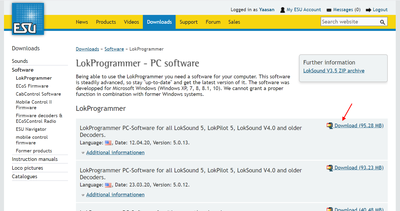

## 3.2. LokProgrammerの起動

起動直後は、以下のような画面です。オープンサウンドデータのファイルを開くと色々な機能にアクセスできるようになります。新規作成しても良いですが、難易度が高いので、既存のファイルを使うのが良いでしょう。

たとえば、キハ110のサウンドを開くと以下のようになります。

>オープンサウンドデータ キハ110  
>https://desktopstation.net/sounds/osd25.html

左側のタブにいろいろ増えましたが、説明すると以下のような感じです。画面が切り替わって編集したり設定できるようになります。

## 3.3. 書込み装置の接続

LokProgrammer書込み装置は、LokSoundデコーダにサウンドや設定を書き込むときに使用する装置です。パソコンと、デコーダの間に繋いで使用する物です。LokSoundデコーダとは線路経由でサウンドデータ等を書込みできるため、車両の中に組み込んで問題ありません。Windowsにのみ対応しています。

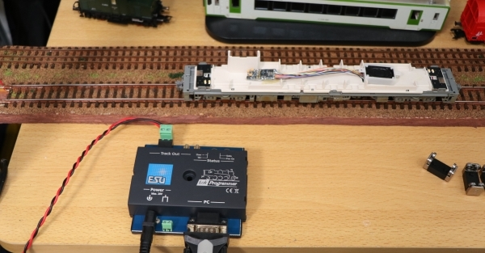

USBケーブルで接続するLokProgrammer書込み装置は、FTDI社のUSBシリアルドライバをインストールする必要があります。通常はUSBケーブルを差し込むと自動でインストールされ、特に操作は不要なのですが、環境によっては自動でインストールされない場合があります。

この場合は、FTDI社のUSBシリアルドライバをFTDI社またはESUのダウンロードページから自分でダウンロードし、予め、インストールしておく必要があります。インストール方法や、チェック方法は検索すればでてきますのでご確認ください。

> FTDI社のUSBドライバページ 
> https://ftdichip.com/drivers/vcp-drivers/

> ESUのダウンロードページ(一番下にドライバがあります) 
> http://www.esu.eu/en/downloads/software/lokprogrammer/

USBケーブルを繋げただけでは動作しません。ACアダプタを接続しないと、正常に認識や書込みができないのでご注意ください。ACアダプタを付け忘れて動かないというトラブルは、よくやりがちです。

ACアダプタの付け忘れ、USBケーブルの差し込み忘れ、またはその両方をした場合、LokProgrammerでサウンドデータの書込みを行うと、以下のメッセージが表示されます。

ACアダプタは、Φ2.5mmのDCジャックに対応した、12V～16Vのものであれば問題ありません。以下に、秋月電子で販売されている、LokProgrammerでも動作を確認したアダプタを示します。なお、ESU社が推奨しているわけではありませんので、自己責任の下でご利用ください。

|メーカー|	型式|	仕様|	販売場所|	備考|
|:------------------|:--------|:-----|:------|:------|
|GO FORWARD ENTERPRISE|GF48-US1240	|DC12V/4A	|秋月電子 M-00244	|Z,N,HO向け
|GO FORWARD ENTERPRISE|GF65I-US1640|DC16V/4A	|秋月電子 M-00407	|HO向け|
|Adapter Technology|STD-12020U|DC12V/2A|秋月電子 M-06239|	Z,N,HO向け|
|XIAMEN UME ELECTRONICS|AD-D120P200|DC12V/2A|秋月電子 M-10659	Z|N,HO向け|

古いLokProgrammerをお持ちで、Windows10で動かない！という方は、秋月電子のUSBシリアルアダプタがそのまま使えます。これは、最新のLokProgrammerに付属の物と同じものです。秋月電子で、ACアダプタと一緒に購入されるのをお勧めします。

>秋月電子のUSBシリアルアダプタ 
>http://akizukidenshi.com/catalog/g/gM-08343/

## 3.4. オープンサウンドデータの書込み

LokProgrammerの画面で、オープンサウンドデータの事前にダウンロードし、ZIPファイルを解凍した上で、esuxファイルを開きます。
LokProgrammer書込み装置をUSBケーブルで接続し、ACアダプタを繋げて電源供給ができた状況で、以下の音符のアイコンを押すと、サウンドデータとCV設定データを書込みにすることになります。

なお、LokSoundデコーダのファームウェアが古い場合には、サウンドデータの書き込みの前に、ファームウェアの書き込みが行われます。この場合、数分、書き込み時間が伸びますが、ファームウェアがアップデートされた後は、LokProgrammerのバージョンが同じであれば、次回以降、ファームウェア書き込み作業が行われることはありません。LokProgrammerがアップデートされた場合は、またファームウェアが更新されるケースもあります。

ドキュメントのアイコンの書込みボタンは、Decoderタブで設定したデータを書き込めます。

デコーダとの接続がうまくいかない場合、エラーメッセージが表示されます。フィーダ線が繋がっているか、配線が切れていないか、車両に搭載した場合には配線ミスや、車輪とレールとの接触不良が無いかを確認しましょう。

なお、オープンサウンドデータのデータは、ほとんどがLokSound5シリーズ向けです。LokSound5で作成されたデータや、LokSound5 microで作成されたもの等、混ざっておりますが、LokSound5シリーズであれば自動的に変換処理がされますので、問題なく書込みできます。

ただし、LokSoundV4シリーズのデコーダに、LokSound5向けのサウンドデータは書込みできません。また、デコーダからサウンドデータを読み出すことはできません。設定値のみ、取り出しができます。

## 3.5. サウンドの編集画面の説明

Soundのタブをクリックすると、以下のような画面になります。この画面が、サウンド編集で一番よく使うものになります。

## 3.6. サウンドスロットとは？

サウンドスロットとは、サウンドデータを鳴らすためのチャンネルと思ってください。LokSound5は10個のサウンドスロットを用いて同時に音を再生できます。
MGの音、ブロアの音、走行音の音に重ねて、様々な音を重ねることができるため、より音や状況の再現性を高めることができます。

サウンドスロットに、様々な音を個別に登録して、条件に応じて鳴らしたりすることで、車両の動きを表現します。以下は、VVVFのサウンドスロットの例です。

なお、*１つのサウンドスロットで同時に再生できる音は１つだけ*です。サウンドスロットで再生が終わったら、次のブロックに遷移して違う音を鳴らすことができます。よって、同時に複数の音を鳴らしたいときは、他のサウンドスロットを呼び出して鳴らすこととなります。他のサウンドスロットを呼び出す方法としては、他のサウンドスロットを関連づけて呼び出す機能が一つ一つのブロックに設定できます。

## 3.7. ファンクション番号の変更

オープンサウンドデータで、予め設定したファンクション番号(F0,F1,F2など)を、変更したい場合があるかと思います。LokProgrammerを使うと変更ができますので、紹介していきます。

まず、変更したいオープンサウンドデータのサウンドデータをLokProgrammerで開いてください。

Decoderタブから、Function Mappingをクリックすると、ファンクションの一覧が出てきます。この画面は、ファンクション番号に、サウンドの機能や、AUXの出力、内部の特殊機能を自由に割り当てられる、重要な設定箇所となります。

変更したいファンクション番号のプルダウンを押すと、DrivingやDirectionなど、色々出てくると思います。以下説明の表で示します。

|項目名| 解説 |
|:---|:---|
|Driving| 運転中か、停止中か |
|Direction| 進行方向がFwdかRevか  |
|F0| ファンクション0(F0)の設定か |
|F1| ファンクション1(F1)の設定か|
|F2-F28| ファンクション2(F2)～F28までの設定か |

実際の画面は以下の通りです。

それぞれのファンクション番号に、有効無効の設定が可能です。複数のファンクションを紐付けて、条件を分けることも可能です。さらに走行中かどうか、進行方向がどちらか、というように条件を分けることもできます。

設定としては、以下の項目が選択できますが、意味は以下の通りです。

|選択項目名| 解説 |
|:---|:---|
|Ignore | 無視する(無効)  |
|On | このファンクション番号がONとなったとき有効|
|Off | このファンクション番号がOFFとなったとき有効|
|Yes | Drivingの項目でのみ有効。走行中のとき有効。
|No  | Drivingの項目でのみ有効。停止中のとき有効。|
|Forward | Directionの項目でのみ有効。進行方向が前のとき有効。
|Reverse | Directionの項目でのみ有効。進行方向が後ろのとき有効。

通常は、Onのみ設定すれば良いですが、たとえば、電機機関車の入換表示灯などを再現する場合には、複数のAUX信号を操作しつつ、進行方向やその他のファンクション状態を加味して条件を設定する必要があります。
自分で作りたいファンクションの動きに合わせて、様々な条件を設定する事ができます。

ファンクションマッピングの設定が終わったら、以下の設定データのみの書込みボタンで、デコーダに書込みを行います。サウンドデータは書き込まれません（変更されません）ので、すぐに書込みは終了します。サウンドデータと一緒に書き込みたい場合は、右隣の音符のアイコンを選択すると、ファンクションマッピングの変更済みデータと、サウンドデータの両方を書き込みます。10分以上掛かりますので、ゆっくりお待ちください。

# 4. サウンドの作り方

## 4.1. はじめに

ここでは、サウンドの作成に必要な物、機材の揃え方（輸入方法）、録音の手段やコツを挙げていきます。必要な物は以下の通りです。

<strong>編集で使うもの：</strong>
* Windowsパソコン（Macの方はBootcampやParallels等の仮想PCソフトをどうぞ）
* <a href="http://www.esu.eu/en/downloads/software/lokprogrammer/" target="_blank">LokProgrammer</a>(ソフト、無料）
* <a href="http://www.esu.eu/en/products/lokprogrammer/" target="_blank">LokProgrammer</a>(ハード、輸入で１５０００円くらい）
* <a href="http://www.esu.eu/en/products/loksound/" target="_blank">LokSound5デコーダ</a>(microでもOK）
* デコーダテスタ（ESU でもLaisDcc でも何でもOK）
* <a href="https://www.audacityteam.org/" target="_blank">Audacity</a>(音編集ソフト、無料、好みがあれば他でも可）
* SpectraLayers 音編集ソフト。特定の音をピンポイントに消せる。

## 4.2. 機材の入手

LokProgrammerとLokSound、デコーダテスタを入手しないと始まりません。既に、<a href="https://desktopstation.net/sounds/" target="_blank">オープンサウンドデータ</a>を活用されている方々は、持っていらっしゃるかと思います。これから購入するには、どうすればいいか、ここでお店をご紹介したいと思います。

国内では、デスクトップステーションのオンラインストア（通販）か、デスクトップステーションと提携する模型店が、安価で入手性が良いです。

* Web通販専門 (https://desktopstation.net/shop/products/list?category_id=15)[デスクトップステーションオンラインストア]
* 実店舗 (http://mokei.ishida-funabashi.com/web/)[石田商店] 千葉県船橋市夏見台3丁目5-14 新京成バス 夏見台団地バス停 徒歩すぐ
* 実店舗 (https://www.level-upper.jp/)[レベルアッパー] ※2021年中に開始予定 東京都中野区中野5-52-15 中野ブロードウェイ2階
* その他の模型店様も販売準備中！

## 4.3. 収録に向けた心構え

形で入らないようにしてください。一番大事なことはテクニックや、ノウハウです。機材よりもそれが重要です。
スマホ持ってますか？収録で使うものは、<strong>ぶっちゃけますと、スマホ１台でもOK</strong>です。ただし、収録がやりにくい、雑音や風切り音が入りやすいので、そこそこ性能の良いスマホ向けの外付けマイクがあるとベターです。<a href="https://desktopstation.net/sounds/osd23.html" target="_blank">キハ261</a>の音も、iPhoneと外付けマイクで収録したと聞いております。

なお、録音設定は必ず、最高音質としてください。低い音質で録音すると、ほとんど使い物になりません。

ただ、良いレコーダがあればそれに越したことはありません。周りを見ると、TASCAMを使われる方が多い印象です。レコーダよりも、風防（ウィンドジャマー）の付いたマイクが一番重要に思ってます。

形から入らずに、まずはお手持ちの機材や、少しお金を出せば買える風防付マイクで、まずは収録にチャレンジしましょう。お金に余裕が出れば、レコーダを買うのも良いです。

## 4.4. 収録のコツ

* 収録のとき、風が吹いていないか確認する
* マイクに風が当たることによる風切り音に気をつける
* 可能な限り、風防付マイクを使う

収録の際に、マイクに風防（フワフワしたネコの毛みたいなもの）がついているかないかで、収録したデータに雲泥の差が出ます。風防無しで録音したものを聞いたら風切り音だらけで使い物にならない・・・なんてことは、音鉄の皆さんを始め、頻繁にあります。このようなとき、気づいた時点でマイクを覆うようにタオルやハンカチを使うだけでも多少は違います。

風切り音とは違いますが、感度が良いマイクでは、マイクを触る音も拾ってしまうケースがあります。この場合は、マイクをなるべく触らないようにするか、スポンジや防音シートを付けて触る音を低減するなどの工夫が必要です。レコーダ付属のマイクだと、対策されてますが、外付けマイクで超高いようなものは気をつけましょう。

> <b>音の出るところまで限界まで近づく（YOMIXさんの収録テクニックより）</b> http://blog.livedoor.jp/yomi_tetu/archives/5467087.html  
>音は距離の二乗で減衰するためそれらを意識したものとしました。
明瞭なエンジン音というのは窓が開かない限り厳しいものです。
しかも、距離の二乗ということはエンジンから離れた車端部では
エンジン音はほぼ聞こえないというものになってしまいます。
しかし、エンジン直上では床で遮音されkHzオーダー以上の音はほぼ聞こえなくなってしまいます。
>今回は窓が開かない車両なので色々悩んだ結果エンジン直上での収録を試みました。
結果、距離が近いほうが勝ち、タービン音の収録をすることができました。
>ところでエンジン直上とは言ったのですが本当に直上の席の床で撮りました。
>それも席の下の空間にマイクを床に直置きし、その空間をカバンで密閉しました。
>これにより、エアコンの音、車内のガサガサ音や放送などを削減することができました。
>個人でできる最大のS/N比を持ったエンジンとタービンのサウンドを録ることができました。

音は、距離が遠くなると、ものすごく音量が下がります。安全を最優先にしながら、できる限り近づけるように収録する場所を工夫しましょう。

たとえば、車内アナウンスは、スピーカーのすぐ目の前にマイクを置いて収録。床下音は、VVVFならモータの近く、ディーゼルエンジンならば、エンジンの直上の座席に着席後、周囲の音を拾わないように、マイクを鞄や吸音材で被って抑え付けてしまう等です。

SIVやコンプレッサーの音は、駅のホームでは無く、そばに道路があればそこから収録する方がより近づけて品質が良くなります。

* 何度も何度も堪え忍ぶ

周りのお客さんが咳をする、会話をすることはよくあることです。反対側のホームに電車が来て音が被るのも当たり前に発生します。１つの音を録るために、何十回も収録し直すことを想定しましょう。１発で取れることは、非常に困難、ほぼムリと言えます。

## 4.5. 収録しなければならない音

何を収録すれば良いのか、必要な物を以下に挙げます。なお、できる限り何度も同じ音を録りましょう。まともに使えるのは、ほんのわずかなケースが多いです。

<strong>車内で収録する物</strong>
* 車内アナウンス
* 電車内での、走行音（停車～加速～惰行～減速～停車）
* ドアの開閉音
* ATS、ATCなどの信号系の音（運転席）

<strong>駅で収録</strong>（なるべく、トンネル内や開削して作られた駅では無く、開けた駅で録りましょう）
* 床下のブーキ緩解、緩め音
* ブレーキ音
* コンプレッサーの音
* SIVの音
* 駅のアナウンス

道路から収録、駅のスピーカーが一番背の低いところを探すなど、入念に知らべていきましょう。なお自撮り棒で録音してる人いらっしゃいますが、絶対にNGです。架線に当たって感電します。鉄道会社さんに絶対に迷惑のならないようにしましょう。迷惑をかける人は、オープンサウンドデータを使う資格がありません。

<strong>車庫や夜間に泊まる駅で収録</strong>
* パンタ上げ、下げ
* 起動音、電源オフ音

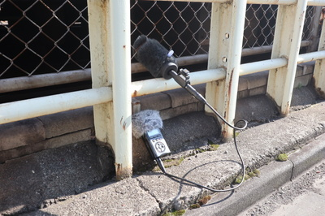

この次は、音の編集のコツです。ノイズを消したり、小さかった音を大きめに直す作業です。主に使うのは、Audacityです。その他に、SoundEngineなど、別のソフトもありますが、お好みのソフトをご利用ください。DCCサウンドユーザーのほとんどがAudacityを使用しているということは事実です。

>Audacity 
>https://www.audacityteam.org/

## 4.6. サウンド加工・ノイズ低減

収録してきたサウンドの加工について挙げます。加工で行う作業は以下のものです。

* 必要な音を収録データから取り出す
* 収録データから不要な音を消す（ノイズ低減処理、ハイパスフィルタ、ローパスフィルタなど）
* 音の大きさを適切に直す（増幅、ノーマライズ）
* 音のループを作る（警笛、SIV、ベル、ディーゼルのアイドル音、吹き上がり音など）

これらは、先ほど紹介した無料のサウンド編集ソフトのAudacityで行えます。

基本的な操作は、入門サイトなど自分で調べて頂ければ幸いです。私がよく使うフィルタは以下です。

特に使うのが”ノイズ低減”です。たとえば、以下のように、ドア開閉音があるとします。

ホワイトノイズやバックの音を消したい時、以下のようにバックグラウンドの音が入り込んだエリアを選択します。

<a href="./audacity/Audacity_door2.png" target="_blank">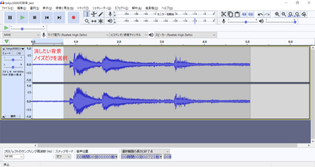</a>

ノイズ低減を選択して、選択エリアをノイズとして登録します。

次に、ノイズを低減したいエリアを選択します。ここでは全部です。バックグラウンドの音は、ドア開の音全体に入り込んでいます。この音を消すことで、ドア開の音だけを抽出できるのです。

再度、ノイズ低減を呼び出して、調整します。除去のレベルはさじ加減をプレビューで確認しながら行います。かけ過ぎると、キンキンな変な音になるので、ギリギリを狙って再調整を繰り返します。

ノイズ低減処理でOKを押すと以下のように低減されます。バックグラウンドの音が小さくなって、キレイになっているのが分かります。

前後を切り落として、ドア開だけの音になるように長さを調整します。

あとは、音の大きさを調整するために増幅したりするなどして、微調整すれば完了です。WAV形式で保存すれば、LokProgrammerに登録して、DCCデコーダから音を出すことができます。

## 4.7. 走行音の加工・編集

まず、走行音。以下はYOMIXさんのディーゼル音(キハ261)の例。

次は、かわけいさんにもらった、東急50x0電車の例。

ディーゼルと電車では、作成のアプローチがまったく異なります。

ディーゼルは、エンジンを吹かす音、ギアチェンジの音、ターボ音などが変速ごとに変わるので、その組み合わせを順に切り替えていくようにサウンドを加工していきます。変速が切り替わった後に、自然なように音を弄るのがポイントです。惰行は、アイドル音のガラガラ音だけなので、走行風の音や、レール継ぎ目音を入れて自然になるように調整する形です。減速はブレーキ音のキキー音や、機関ブレーキの音が中心なので、そこを重ねて出せば良いです。

電車の場合は、加速と減速の両方の音を６～７の段階に切り刻んで作成します。VVVFは減速でも特有の音がありますので、速度に応じて鳴るように、減速音をきちんと作らないといけません。

作り方や編集のアプローチが違うので、そこは気をつけて作っていきましょう。それではディーゼルの走行音の切り刻み方を説明します。

## 4.8. 発車ベル切出し

突然、ディーゼルの走行音の話になってややこしくなったので、小休憩します。

ここでは、発車ベルを切り出すノウハウについて説明していきたいと思います。これまた、かわけいさんの東急の発車ベルの音です。

>5050_発車ベル_20200423.wav
>http://buin2gou.sakura.ne.jp/sblo_files/powerele/image/5050_E799BAE8BB8AE38399E383AB_20200423.wav

まずは、適当に、start、loop、endという３つのラベルで発車ベルの中身を区切っていきます。

ここから、ループ音(繰り返し流す音の範囲）を探索して、切り出していきます。

まず、波形をよーく見ると、似たような形が何度も繰り返しているのが見えると思います。つまり、似たような所の範囲をうまく決めてあげれば、同じ音を鳴らし続けることができるわけです。

<a href="./lok/LokProgrammer_loop_2.png" target="_blank">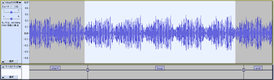</a>

まず、startとloopの間を調べていきます。一番、音の振幅が小さくなるところを調べて、そこを拡大します。すると、以下のような部分が見つかりました。ここのゼロクロス部分をstartラベルとloopラベルの境目になるように位置をずらして調整します。○の部分をD&Dするとずらせます。

同じように、loopとendのラベルの境目も探します。ちゃんと、先ほど決めたstartとloopの間の境目とキレイに繋がるように、波の上なのか下なのかをきちんと決めておいてください。ここでは、上側の振幅がゼロになる部分で切ります。

音を鳴らして確認しましょう。loopの範囲を選択して、Shift+Spaceを押すと、ループ再生してくれます。

狙ったとおりにできたら、複数ラベルの書き出しで、保存します。私は以下のようなファイルを書き出せました。

> bell.zip 
> http://buin2gou.sakura.ne.jp/sblo_files/powerele/image/bell.zip

## 4.9. VVVFサウンドの作り方

まずは、VVVF音の編集について、次に説明していきたいと思います。

オープンサウンドデータの走行音は、加速と減速、走行音（風切り音）の３つで大きく構成されてます。

走行風の音は、速度に応じて低くなったり高くなったりします。これは、サウンドスロットの設定で速度に応じて変わるように設定してありますが、今後、細かいことは説明します。

オープンサウンドデータのVVVF系のデータは、MBさん、かわけいさんの作ったデータをベースにしているので、ほとんど同じテンプレートになっています。以下の図の赤矢印で書かれたスロット（音が出るチャンネル）が該当します。

ここで紹介するのは、走行風の音では無く、加速と減速の独特の音をLokSoundから出すための音の編集作業になります。収録する際は、レコーダ（スマホでもOK）で、車内で録音すると思いますが、停車～加速～惰行～減速～停車の流れになるはずです。この中から、加速と減速の部分だけを切り出します。

切り出すのは、加速と減速の２つの種類になりますが、それぞれを６つに分割します。７つでも８つでも良いのですが、オープンサウンドデータでは６つで分割することを基本にしてます。６つと言うことは、つまり、速度の段階が６つあると思って頂いて構いません。DCCでは127 Speed Stepで127段階の速度がありますが、サウンドと連動させるために、これをあえて6つに区切るわけです。127で区切っても良いんですが、非常に複雑になるので、今までの知見から６つに分割という方針に落ち着いています。

LokProgrammerでの、VVVFの実際のサウンドプログラムは以下の通りです。見ての通り、６つの黄色のブロックに、加速の６つの分割した音、減速の６つの分割した音をはめ込んで、速度に応じて音を鳴らしているだけなのです。

加速：

減速：

それでは、東急50X0系の加速～惰行～減速の音から、走行音の切り出しを行っていきます。なお、切り出す前には、音の修正などいろいろ弄らないといけないのですが、既に修正は終わった物として、理想的な加速・減速サウンドになっている前提で進めます。

発車～惰行までの範囲を、予め聞きながら把握しておきます。この範囲を６つに分割します。分割の仕方は様々ですが、なるべく低速を短くするのがコツです。まず、発車直後の部分をラベル付けしていきます。

選択範囲にラベルを付けます。ラベルを付けた後からでも位置の調整はできます。

Audacityでは、ラベルを付けることで、いつでもラベルに沿ってWAVファイルを書き出すことができ、非常に楽ができます。DCCサウンド作成には必須の機能と思います。これは、VVVFだけではなく、他でも使用できます。今後紹介する、ディーゼル走行音の切り出しでも同じです。

これを繰り返して、加速完了まで６つのブロックを作っていきます。

加速部分のブロックを作り終えました。

なお、ブロックの間は、ゼロクロスする部分（値がゼロのところ）にするのがコツです。と言うのも、ゼロ以外で切ると、ブツ音がする場合があるためです。このちょっとした編集で、確実にブツ音を消せます。また、さらに調整できるのであれば、VVVFの音の区切りの部分のゼロクロスで切るのが一番良いです。

このテクニックは、ループ音（同じ音を繰り返し再生する）の作り方にも使用します。特にディーゼルでは必須のテクニックなので、絶対に覚えておきましょう。ループの場合は、ループ前後の似た波形とゼロクロスを探すという追加の根気の要る作業も加わります。

次に減速のブロックを作っていきます。同じように減速の始まりの所を選択してラベルを付けていきます。

減速の始まりの所のラベル付けをしました。これを繰り返していきます。

停車までの区間を、ほどよく調整して、ラベル付けを完了しました。

ファイルメニューから、複数のファイルの書き出しを選択して、実際にWAVファイルを書き出していきます。

出力先フォルダを指定します。走行音だけのフォルダを作ると良いでしょう。

以下のように、ラベル付けした範囲が個別にWAVファイルに書き出されます。

<a href="./audacity/Audacity_VVVF12.png" target="_blank">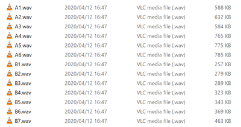</a>

書き出したWAVファイルは、LokProgrammerのサウンドファイルリストを上書きする（エクスプローラー等からドラッグアンドドロップ）ことで、データに反映させることができます。このファイルは、上で説明した加速・減速のプログラムに紐付いているサウンドファイルです。差し替えれば、自動的に音が差し替えた物に切り替わります。

今回は、説明が足りてなかったVVVFの惰行、加速、減速についてブロック図を説明します。とは言っても、ディーゼルよりはシンプルな動きです。

VVVF走行音は、サウンドスロットを以下のように３つを使う事になります。それ以外にもドア開閉音やブレーキ緩解・緩め音などいろいろありますが、タイミングに応じてマッピングで設定しておき、同時に鳴らすという動作だけなので、走行音とは別に作っておくこととなります。

まず惰行音。ファンクションオフ、停車、走行の３つのブロックに大まかに分かれます。走行の部分が一番大きいですが、やってることは、走行風や台車のうなりを速度に応じて高くしたり低くしたり、大きくしたり小さくしたりしているだけ。

ブロックに分けて示すと以下のような感じです。一番重要なのは、加速と減速の部分が分かれてるところです。つまり、加速しているとき（スピードが上がる）は、上の方のブロックが使われて、減速しているとき（スピードが下がる）ときは、下の方のブロックが使われます。

加速の赤枠の中に入っている物には、以下のようにMappingに加速のサウンドスロットを割り付けます。
そうすることで、加速中は必ず、加速のサウンドが鳴るようになります。

加速のサウンドスロットは以下のブロックです。各スロットに、分割した加速の音を当てはめていきます。減速のサウンドスロットは別となります。加速の範囲に居る場合のみ、速度に応じて加速のサウンドが惰行音と同時に鳴ります。

減速は、減速の赤枠のブロックのMappingで、以下のように減速のサウンドスロットを割り付けておきます。

割り付ける減速のサウンドスロットの中身は以下の通りです。

<a href="./lok/LokProgrammer_VVVF_3.png" target="_blank">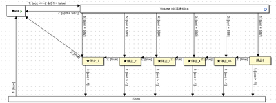</a>

なお、停車の時にキキーとかプシューとか音を出すのは、以下のようにD-Sブロックで実装しています。このブロックで、他のサウンドスロットで作り込んである音を鳴らすわけですが、鳴らすタイミングは矢印にあるreq=0 & spd <= 5とあるように、速度が5/255以下になったら鳴るようにしてます。この数値は、音の長さとか車両の癖とかもあると思うので、ケースバイケースで決めていきます。

という感じで、VVVFのサウンドを鳴らすことができます。電車は全般的に、上記の作り方となるかと思います。

## 4.10. ディーゼルサウンドの作り方

ディーゼルサウンドについて、説明していきます。まず、キハ110やキハ261で使用しているディーゼル走行音の動きを見ていきましょう。

>キハ110 
>https://desktopstation.net/sounds/osd25.html
> 
>キハ261 
>https://desktopstation.net/sounds/osd23.html

VVVFの場合は単純なので、説明するまでも無いですが、ディーゼルは加速する際にエンジンの速度と実際の速度が異なります。これは変速機というものがあるためで、変速する段数に応じて音が変わるためです。少し複雑なので、順に解説していきます。

まず全体のブロック図は以下のようになってます。速度に応じて、ブロックから違うブロックに移動していく流れです。大きくは、ファンクションオフ、停車時、アイドル時、加速、の４つの塊に分かれます。

ファンクションオフ→停車→加速→アイドル→加速→・・・・→アイドル→停車→ファンクションオフ、のようにこのブロック図の中で動いていくことで、走行音を実現しているのです。

オレンジ色の矢印は、速度が上がるとブロックをどんどん移動していく流れを示しています。速度は最高速度が255、停車が0という数値の範囲になってます。プログラミングをされる方はすんなり理解されると思いますが、慣れていない方は最大値が100ではないことに、ご注意を。

たとえば、速度が10から30に変化したらここまでこのブロックは音を鳴らす、などとなってます。速度は少しずつ上がるように設定してありますので、ブロックはすぐに一番右には行きません。おおよそ１分程度の時間が掛かりますが、これはDriving Characteristics(デコーダタブで設定可能）の加減速時間で決まります。この時間は、サウンドの再生時間の絡みで自分で決めます。最初はエイヤでだいたい合ってれば大丈夫です。

加速が終わると、一番下の”アイドル”ブロックに移動します。このとき、DCxというブロックを通過しますが、加速が終わった音をすぐにアイドルに切り替えると不自然なので、吹き上がる良いタイミングでアイドルになるように、音をクロスフェード加工したり、キリの良いところで切るように作り込んでおきます。CDxはその逆で、アイドルから加速音に移行するときの音を作って配置するために置いています。

分かりにくいと思うので、キハ261の走行音データとブロック図の対応付けをしてみました。
囲った部分の音波形を切り刻んで、ブロックに音を割り付けて鳴らす形です。完全にこれらのブロックにセットする音データをこの生波形から全て作れる訳では無いですが、イメージとしてはこの通りです。

それでは、各ブロックはどのように設定されているのかを説明します。

ブロック内部のプロパティの説明をします。

>・Restore 
>チェックを入れると、優先順位が高いサウンドが割り込んで再生された後、再生を終えるときに、中断されていたこのサウンドが再開されるという機能です。類似の機能で、Unlimitedのチェックボックスがサウンドスロットに用意されています。こちらは、このブロックではなく、スロット単位で動くものです。

>・Sample 
>このブロックに入ったときに再生される音を、音ファイルリストから選びます。

>・Repeat Playback 
>loopにチェックすると、Sampleで設定した音を再生し続けます。次のブロックに移動する条件が成立すると（矢印に条件を記載する）、自動的にloopは止まって次のブロックに移動します。
>loopにチェックしない場合は、MinとMaxに数値を入れて鳴らしたいループ回数を指定します。minとmaxで数値を変えると、ランダムにその中の間でループ回数を決めて鳴らしてくれます。

>・Flags 
>Drivestopにチェックを入れると、このブロックにいる間は車両を動かさないようにします。

>・Mapping 
>このブロックに紐付けるサウンドスロットなどを設定できます。紐付けたサウンドスロットは、このスロットと一緒に同時に動くようになります。たくさんのスロットを割り付けると、同時再生スロット数を超えておかしな動きをするので注意して設定しましょう。

具体的に、どんな風に音を変えて行くのかを説明します。

まず、Sという所に居る（＝F1をONして、停車している。音はガラガラとアイドル音がしているが走行中では無い。）とします。赤い矢印に注目してください。
最初のSから出て行く矢印に「2 :[share1 != 200 & S1 = false & req > 0]」と書かれているはずです。

<a href="./lok/LokProgrammer_kiha261_6.png" target="_blank">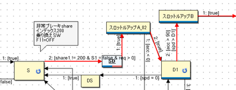</a>

最初の数字は優先番号で、小さい数字ほど優先されます。一つのブロックから複数の矢印を出すときに、この番号で、どの矢印を優先するかを決めてあげます。その後、share1 != 200 & S1 = false & req > 0という謎の文字列がありますが、ややこしいので、最後のreq>0だけ見てください。

reqは、「速度のリクエスト」という意味になります。つまり、req>0は「速度のリクエストが0より大きい」という意味と理解してください。この条件が成立したとき、矢印に沿ってブロックを移動します。
速度のリクエストって何だっと言うと、お手持ちのスロットルを使って車両のスピードを０より高く変えて速度を指定したときということです。

注意なのが、spd(スピード)という言葉がこの後出てきますが、これは車両(モーター）の実際の速度です。速度のリクエストは、遊んでいる人が指定した速度です。加減速があるので、常に一致するとは限りません。加減速中は必ず異なると思ってください。混同しやすいので注意です。

話を戻すと、そのあと、SDというブロックに入ります。実は、このブロックは「コンテナ」というブロックで、中にブロックが入っています。ブロックをまとめる箱と思ってください。中では、ブレーキ緩解・緩め音を出すブロックが配置してあるだけです。プシューとかヒューーーンとかの音を出してるだけです。

SDブロック（コンテナ）の中身：
<a href="./lok/LokProgrammer_kiha261_7.png" target="_blank">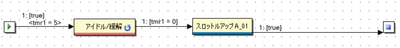</a>

その後、1:[true] という矢印がスロットルアップA_02というブロックに繋がっています。これは、「どんな条件であっても」という意味になります。つまり、特に条件は無いけど動いて良いよ、と理解してください。

SDブロックの中で、ブレーキ緩解・緩め音が再生終わったら、無条件に、スロットルアップA_02に移動するわけです。

スロットルアップA_02に注目しましょう。矢印が２本でているはずです。赤矢印はD1のブロックに、青矢印は下の方を向いてます。D1に向かう矢印は、2:[true]となってます。一方下に向かう矢印は1:[acc<0]となってます。

<a href="./lok/LokProgrammer_kiha261_8.png" target="_blank">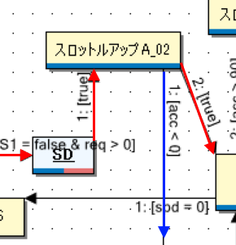</a>

どういうことかというと、<strong>acc<0 というのは、「加速がマイナスだったら」という意味</strong>です。つまり減速していたら、ということです。発車直後に、飛び乗ろうとしたお客さんがいたんでしょうか、急停車ってことです。減速が始まったのに音を加速させるD1のブロックに移動したら不自然なので、アイドルの方に行く青い矢印を作っているのです。

矢印の条件は、以下の左側のところに記述します。

条件のところをダブルクリックすると、内容を編集できます。

とりあえず、D1ブロックまで説明できました。

ご参考までに、S～D1までに割り当てている音データを以下に置いておきます。

>データ協力： YOMIX様、yusa様 
>[kiha261_A.zip](http://buin2gou.sakura.ne.jp/sblo_files/powerele/image/kiha261_A.zip)

ブロックの割付は以下の通りです。

| ブロック名 | 割付ファイル |
|:------------------|:--------|
|S| Idle.wav|
|スロットルアップA01| A01.wav|
|スロットルアップA02| A02.wav|
|D1| Aloop.wav|
|DC1| AX.wav|
|アイドル| Idle.wav|

## 4.11. SpectraLayersの使い方

周波数分析してサウンドを編集できるソフト SpectraLayersProを使って、DCCサウンド向けに収録した音の加工がサクサクできてしまったので、その機能の使い方を紹介したいと思います。

有料のソフトですが、数ヶ月に１回程度、オンラインセールで5000円前後で購入が可能です。

>SpectraLayers
>https://www.sourcenext.com/product/vegas/spectralayers/

まず、起動直後は以下のような画面が表示されます。

<a href="./slayer/SpectraLayers_inst_1.png" target="_blank">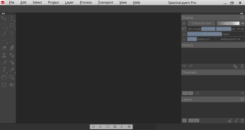</a>

ここに、収録したMP3ファイルやWAVファイル(レコーダーで録音したナマのサウンドデータ）をD&Dか、メニューから開きます。E5系の走行音から、ちょうど連結部の音が入り込んだモノを用意しました。

>E5系収録音 
>http://buin2gou.sakura.ne.jp/sblo_files/powerele/image/E5_test1.wav

Audacityで開くとこんな感じです。

開くと、モヤモヤしたものが出てくると思います。これが、サウンドデータを周波数別に表示したデータになります。音がなんで周波数別にできるのかは、小学校や中学や高校の理科の授業を思い出して頂ければ。

ここで、音を再生してください。雑音がいくつかあるのが分かると思います。

見ると、怪しい縦の筋がいくつか見えると思います。このソフトは、特定の範囲だけを再生することができます。範囲選択ツールを使って、縦の筋を囲んで再生ボタンを押してください。縦の筋の音付近が聞こえるはずです。

この縦の筋が雑音で、消した方が良いことは見えてきました。どう消せば良いか、悩みます。いくつか方法はあるのですが、一番良いのはスタンプと思いますので、スタンプツールで消していきましょう。
まず、PickSourceボタンを押してからスタンプする元の場所を選びます。スタンプのサイズや縦横の比率は、上のツールメニュー(Size, Aspect Ratio)で選べます。

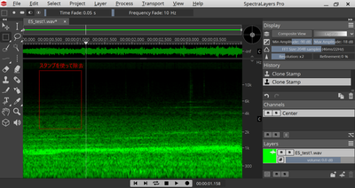

まずはスタンプで綺麗に消せました。
スタンプ以外には、縦の選択ツールと、マジック選択ツールが使えます。選択後に、Deleteキーを押せば、その範囲を除去できます。

マジック選択ツールは、混ざり込んだ雑音を消すのにちょうど良いです。

とりあえず、これを駆使すれば、データの作成ができます。最終的に綺麗にしたモノが以下です。縦の筋を全て除去しました。

>完成したサウンドデータ 
>http://buin2gou.sakura.ne.jp/sblo_files/powerele/image/E5_testAfter.wav

あと最後に保存の時の注意事項を。WAV形式で保存する場合は、Int 16bitにして保存してください。Float 32bitなども選べますが、LokProgrammerには登録できません。もし、間違えてFloat形式でWavファイルを書き出しても、AudacityではFloat 32bitも問題なく開けます。AudacityでInt形式で保存できますのでご安心を。

なお、Spectra Layers Proだけでは、前後のカットや音量調整などが使いにくいので、Audacityで音量などを含めて最終的な仕上げをする事になると思います。Audacityと組み合わせて使用することをお勧めいたします。

# 5. 搭載方法

## 5.1. 搭載するにあたり注意事項

車両へのDCCデコーダ搭載にあたり、重要なことがあります。

- 配線、デコーダの絶縁を徹底すること。
- 必要最低限の内部配線にすること。配線は短くすること。
- テスターを使用して必ずショートのチェック、線路から来る配線とファンクションやスピーカーとの接触が無いことを確認する。
- 必ずLokSoundデコーダを装着前に、安価なデコーダを装着して試運転すること。安価なデコーダで、ならし運転すること
- デコーダテスタを使って、LokSoundデコーダの走行・サウンド・ファンクションが正常に動くことを確認すること。

チェックリストをご用意してます。搭載の時には必ず確認しましょう。

|チェック |確認すること | 
|:-|:-|
| |コマンドステーションで電流制限、もしくはACアダプタの電流容量を小さいものにしたか|
| |スピーカーの導電部は絶縁したか|
| |スピーカー配線と、線路からの配線の接触はないか、近くに接近していないか |
| |テスタで、すべての個所を確認したか|
| |安価なデコーダで停車時に動作チェックしたか|
| |安価なデコーダで停車時に慣らし運転したか|

電気は、抵抗が少ない方に流れやすい性質があります。抵抗が堤防やダム等のようなもので、水が低い方に流れることと似ています。
せき止めるものが無いと、一気にたくさん流れることとなります。水は粘性があるのでそこまで大きく水流は大きく流れませんが、電気には粘性は存在しませんので、抵抗が無ければ電源の限界まで流れるだけ流れます。よって電流が流れることによって発熱（オーブンと同じ）が起きて、破壊に至ります。

よって、ショート（抵抗ゼロとしてしまうポカミス）を防ぐには、絶縁対策がもっとも重要なのであります。絶対に手を抜いてはいけない部分です。

## 5.2. 搭載補助基板を活用しよう

Next18やMTC21といった、デコーダを差し替え可能な構造になっている場合には絶対に動作チェックを先に実施してください。動作チェックには1000円台の安価なDCCデコーダを使うと、最悪の事態でも被害は少なくすみます。

今まで多くの人が、高価なLokSoundデコーダを壊してきました。Next18やMTC21と言った、壊さずに動作テストできる手段が今はあります。これを活用しない手はありません。

搭載するにあたり、ExpBoardと呼ばれる、日本型車両をDCC化しやすくする補助基板を頒布しています。ぜひご活用ください。

|メーカー |製品名 | コネクタ | Scale | ArtNo |URL  |
|:-|:-|:-|:-:|:-|:-|
|TRAINO |ExpBoard EC-Slim Easy | Next18 | N | ECS-E1 |[URL](https://desktopstation.net/wiki/lib/exe/fetch.php/ecslim-ver2amanual.pdf) |
|TRAINO |ExpBoard EC-Slim Standard | Next18 | N | ECS-S2 |[URL](https://desktopstation.net/wiki/lib/exe/fetch.php/ecslim-ver2amanual.pdf) |
|TRAINO |ExpBoard EC-Slim Economy | Next18 | N | ECS-C6 | [URL](https://desktopstation.net/wiki/lib/exe/fetch.php/ecslim-ver2amanual.pdf) |
|TRAINO |ExpBoard EC-Slim Type T | Next18 | N |ECT-S2 | [URL](https://desktopstation.net/wiki/lib/exe/fetch.php/ectmanual.pdf) |
|TRAINO |ExpBoard EC-Slim Type F | Next18 | N |ECF-S2,ECF-E4 |[URL](https://desktopstation.net/wiki/lib/exe/fetch.php/ecfmanual.pdf) |
|TRAINO |ExpBoard EC-Slim Type H | Next18 | N |ELH-S1,ELH-E1 |[URL](https://desktopstation.net/wiki/lib/exe/fetch.php/ELH-Manual.pdf) |
|TRAINO |ExpBoard EC-Slim SL Type A | Next18 | N |SL-C57/D51 |[URL](https://desktopstation.net/wiki/lib/exe/fetch.php/expforsl-manual.pdf) |
|TRAINO |ExpBoard EC-Slim SL Type B | Next18 | N |SL-C59/C62	 |[URL](https://desktopstation.net/wiki/lib/exe/fetch.php/expforsl-manual.pdf) |
|TRAINO |ExpBoard EC-Slim SL Type C | Next18 | N |SL-C58 |[URL](https://desktopstation.net/wiki/lib/exe/fetch.php/expforsl-manual.pdf) |
|DesktopStation|ExpBoard for KATO HO| Next18 | HO |10024 |[URL](https://desktopstation.net/wiki/doku.php/expboardnext18)|
|DesktopStation|ExpBoard for General HO| Next18 | HO |10023 |[URL](https://desktopstation.net/wiki/doku.php/expboardgeneral)|
|DesktopStation|ExpBoard for YP| MTC21 | HO | 10026 |[URL](https://desktopstation.net/wiki/doku.php/expboardendo)|
|DesktopStation|ExpBoard for YP SHORT| MTC21 | HO | 10035 |[URL](https://desktopstation.net/wiki/doku.php/expboardendo)|
|DesktopStation|EF81 Light Board| - | HO |10031 |[URL](https://desktopstation.net/wiki/doku.php/ef81lightpcb)|
|DesktopStation|ExpBoard EH200| MTC21 | HO | 10030 |[URL](https://desktopstation.net/shop/products/detail/55)|
|Fujigaya2|ExpBoard for KATO HO DE10| Next18 | HO | 10033 |[URL](https://desktopstation.net/shop/products/detail/65)|

## 5.3. DCCコネクタ

DCCデコーダを車両に搭載する場合、コネクタを使用することで、デコーダ交換を容易にすることができます。また、ピン数が20ピン前後となった高機能なコネクタが現在では欧米を中心に主流となりつつあります。

従来は、デコーダに直接配線する方法が中心であったため、トラブル時には配線のやり直しが必要で、非常にとっつきにくいものでありました。

日本では、KATOのHO動力ではNEM652が標準的に搭載されている場合が多いですが、台車モータのタイプ(E5系、EF81、EF510)ではDCCはあまり考慮されていないケースもあります。TOMIX、エンドウ、カツミ、でんてつ工房、U-TRAINS等では、アナログ専用となっており、標準でDCC対応がされていないのが実情です。

オープンサウンドデータでは、MTC21とNext18をDCCコネクタの標準として推奨しております。以下に代表的なDCCコネクタの一覧を示します。

|コネクタ |ピン数 | スケール | Notes  |
|:-|:-|:-|:-|:-|	
|NEM651 | 6 | N | 後継はNext18 |
|NEM652 | 8 | HO | 後継はPluXまたはMTC21 |
|NEM662 Next18 | 18 | N | Nゲージで普及が進む  |
|NEM660 MTC21 | 21 | HO | メルクリンが開発。PluXと規格争い中 |
|NEM658 PluX22 | 21 | HO | PluX8, 16はフェードアウトの模様 |
|ESU Nano| 

> MTC21では、全く同じコネクタを使用しつつ、２つのファンクション出力が異なる種類があるので注意が必要です。メルクリン対応のAUX3,AUX4がパワー出力になっているものと、DCC向けにAUX3,AUX4はロジック出力になっているものです。デコーダを購入される場合には、AUX3,AUX4の出力方式がどうなっているかをよくご確認して、購入ください。設定変更で切り替えできるタイプのデコーダもありますが、ハードウェアの制約で固定になっているケースもあります。

KATO HO標準動力や、10年以上前に設計されたHO車両では、NEM652(NMRA 8ピン)が多く使われています。ピン配置は以下の通りです。

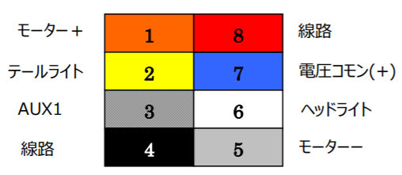

Next18のコネクタのピン配置は以下の通りです。なお、このピン配置はNext18-Sというサウンド向けの配置となっています。Next18のコネクタは、海外のメーカーが製造しているものであり、日本国内では入手の難しい状況となっています。

| |Pin | Pin | |
|:-|:-|:-|:-|		
|RAIL_A|	9 |	10 |RAIL_A|
|Head	|8	|11	|Motor-|
|Speaker+	|7	|12	|AUX2|
|COM+	|6	|13	|AUX4|
|GND	|5	|14	|GND|
|AUX3	|4	|15	|COM+|
|AUX1	|3	|16	|Speaker-|
|Motor+	|2	|17	|Tail|
|RAIL_B	|1	|18	|RAIL_B|

MTC21のコネクタの仕様は以下の通りです。1.27mmピッチのピンヘッダ・ピンフレームを使用するため、日本国内でもコネクタ部品の入手性は非常に良好です。

|Assignment|	Pin| Pin | Assignment|
|:-|:-|:-|:-|	
|センサ1|	1	|22	|線路 左|
|センサ2|	2	|21	|線路 右|
|AUX6(L)	|3	|20	|GND|
|AUX4(L)	|4	|19	|モータ+|
|SUSI CLK|	5	|18	|モータ-|
|SUSI DAT|	6	|17	|AUX5(L)|
|テールライト	|7	|16	|COM+|
|ヘッドライト	|8	|15	|AUX1|
|スピーカー2|	9	|14	|AUX2|
|スピーカー1|	10	|13	|AUX3(L)|
|ピンなし	|×|	12	|VCC +5V|

Nanoコネクタの仕様(2021年5月入手可能版)は以下の通りです。デコーダ側がMolex 505270-2412 (SlimStack .35MM SSB)、車両側がMolex 505070-2422(.35mm SlimStack Conn)となります。現状では規格化されておらず、ESU独自に定めたもののため、変更される可能性があります。

|Assignment|	Pin| Pin | Assignment|
|:-|:-|:-|:-|	
|線路 左(黒)| - | - |線路 左(黒) | 
|-|	1	|24	|Sp-(Brown)|
|-|	2	|23	|Sp+(Brown)|
|-| 3	|22	|-|
|-| 4	|21	|モータ-(Gray)|
|-|	5	|20	|モータ-(Gray)|
|-|	6	|19	|モータ+(Orange)|
|-| 7	|18	|モータ+(Orange)|
|COM+|8	|17	|-|
|AUX5|9	|16	|ヘッドライト|
|AUX6|10|15	|テールライト|
|AUX7|11|14	|AUX1|
|AUX8|12|13	|AUX2|
|線路 右(赤)| - | - |線路 右(赤) | 

## 5.4. AUX,HEAD,TAIL配線

DCCでライトの配線を行う場合には、両極性モードと、オープンコレクタモードの２種類があります。両極性モードはアナログで一般的に使われるのでなじみがあると思います。一方でオープンコレクタモードは、電気屋さんはご存じとは思いますが、模型ではあまり聞きなれないかと思います。ようは、「ONすると内部のスイッチもONして電流が流れるようになる」モードと思ってください。

### 5.4.1. 両極性モードのHEAD,TAIL

以下のように配線を繋げることになります。これは、通常のアナログのライトユニットと全く同じ配線構成です。ライトユニットは、テールライトのLEDと、ヘッドライトのLEDが、ちょうど逆同士でつながっている形（逆並列と呼びます）になります。

ライトユニットが、DCCの方式(COM+と、HEAD/TAILの３つの配線)に対応していない場合で、改造が困難な場合には、両極性モードに対応したExpBoardや両極性変換基板を用いて配線することで、ライトユニットを改造せずに使用できます。

### 5.4.2. DCC標準配線方法のAUX,HEAD,TAIL(オープンコレクタ)

COM+という配線はプラス側の電圧がかかっています。

一方、AUX1,2やHEAD,TAILは、ファンクションなどでONされると、マイナス側に内部のスイッチが繋げてくれます（電気屋界隈では、この動きを、引き込む(sink)と言います。台所のシンクに排水が流れるのと同じです。）。OFFのときは、内部のスイッチがOFFなので、マイナス側につながらないので、電流が流れず、ライトがつきません。

抵抗の位置は、LEDの前後のどちらでも問題ありませんが、LEDの極性はCOM+側になる方がLEDの線が長い方（A,アノード）となるように選びます。

## 5.5. KATO HO(単行車クモハ40, キハ110等)

KATOのHO キハ110 200番台(1-615)は、NMRAコネクタが搭載されていますが、完全なDCC readyではありません。

ただし、基板上は、一部パターンカットして改造すれば、完全なDCCreadyにできることが分かってるので、説明書に１文字もDCC対応とは書いてませんが、DCCサウンドへの改造を行いました。

床板の下は以下のようになっています。ウェイトとなっている鉄板が入っていますが、これをExpBoard Next18 for KATO HOで置き換える事となります。

改造前の基板は以下の通りです。

カットしろ、ジャンパしろ、と指示をしているパターンがありますので、基板が言うとおりにパターンカットとジャンパをしました。

一応、箇所を明示すると以下の通りです。

> 重要！
> C,T,Hと、LED照明基板に書かれてますが、そのまんま配線すると、おかしなことになります。全く同じ基板を使っているので、筐体というか、車両の照明の位置関係が反対なので配線を入れ替えないと進行方向と合いません。
> 
> FWD側（→の先）
> C：同じ配線でOK
> T：H(Rear,NMRA Pin2)を繋げる
> H：T(Head,NMRA Pin6)を繋げる
> 
> REV側(→のおしり側)
> C：同じ配線でOK
> T：T(Head,NMRA Pin6)を繋げる
> H：H(Rear,NMRA Pin2)を繋げる

床板の開口部は、Next18コネクタのサイズ分しか空いていません。よって、デコーダをこのままでは入れることができません。

そこで、開口部をくりぬいて、デコーダを搭載できるようにします。

## 5.6. KATO HO(動力車,キハ80等)

KATOのHO キハ80のM車に、LokSound5 microを搭載していきます。

* 半田ごて等、ハンダ付道具一式
* ピンバイス,ピンセット
* スピーカー
* LokSound5 micro
* ExpBoard Next18 for KATO HO https://desktopstation.net/wiki/doku.php/expboardnext18
* KATO HO キハ80(M) 1-611 https://www.katomodels.com/product/ho/kiha82

搭載作業をしていきます。

<a href="./img/KATO_kiha80M_Next18_4.jpg" target="_blank">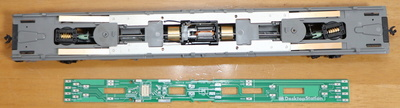</a>

リン青銅の銅板を半田付けします。変に曲げすぎると、しっかりと下の金属ウェイトに当たらず、接触不良の原因となるので、写真と同じように半田付けします。

板バネのように、下の金属ウェイトに接触していることを確認してください。

ハンダ付して取り付けます。

赤線部分を切り取ります。座席部分もカッターなどでカットします。ここをカットしないと、Next18のデコーダが搭載できません。

デコーダが入るか確認します。

問題無さそう。

スピーカーの音を下に抜かすための穴をピンバイスで開けます。

トイレなどの部分にスピーカーを隠せるので、ここにピンバイスで穴を開けてスピーカー配線をして半田付けします。隠し方は、スピーカーのサイズに依ると思うので、皆様の工夫が出てくるかと思います。

あとは車両を被せて、動作確認して完成です！

## 5.7. KATO HO(機関車,EF81,EF510)

KATOのHO機関車(パワトラ式動力)のDCCサウンド化をご紹介していきます。なお、従来のNEM652搭載のダイキャスト内にモータを搭載したタイプ(EF65,EF58等)は、ここでは範囲外とさせていただきます。

EF81は入手性もよく、価格も２万円を切るなど安価で、さらに作りも非常に素晴らしと三拍子整っています。さらにさらに、DCCサウンド化の改造ハードルも、他のメーカーの機関車と比べればかなり低いほう（とはいえ少々時間は掛かりますが）であります。2020年にくみ上げてから、ライトユニット基板のアップデートもあったり、MTC21で使うノウハウもたまりましたので、内容を見直したものをここでご紹介させていただきます。

> ・KATO HO EF81のページ 
> ・オープンサウンドデータEF81のページ 
> ・DCCサウンド化のためのライトユニット基板(10031)のwikiと頒布ページ 
> ・ESUのLokSound5 micro Next18(+10023 ExpBoard General HO)か、LokSound5 MTC21 (入手ルートは国内の模型店、もしくは海外模型店からの輸入) 

ここでご紹介するのは、KATO HO EF81をフルDCC化します。フルDCCとは、サウンド以外に、テールライトの４つをAUX1,2,3,4に割り当てて、入換灯、テールライトを完全に再現するものであります。機回しで遊ぶには必須の機能。しかしアナログだと、わざわざ屋根を外してスイッチを切り替える手間があり、これはいただけません。しかしDCCなら、コマンドステーションからボタン操作で簡単に切り替えできるのです。もう、このためだけでもDCC化をお勧めしたいところです。

実際の遊んでいる様子は以下の通りです。本記事を実践することで、こんなことができるようになります。

> オープンサウンドデータ 国鉄/JNR EF81 電機機関車 
> https://www.youtube.com/watch?v=vDMwoAPxFb4

本記事を試してみるにあたり、必要な部材を以下に示します。はんだごてやドライバー、ニッパなどの電子工作に必要な最低限の工具は既にお持ちであるという前提としております。必要に応じて別途お買い求めください。また、DCCデコーダを搭載した経験があり、LokSound5も使い慣れている方を対象としています。初めての方は、相談できる身近な方のアドバイスを受けられるようにしてください。トラブルがあっても、DesktopStationは一切のサポートや故障・損傷時の補償などはいたしません。デジタル鉄道模型フォーラムは自由にご利用いただけますが、確実に解決することを保証するものでもありません。

- ESU LokSound5 サウンドデコーダ(ESUデコーダ型番 58429,58419,58420,58410,58813,58818,58823,58828のいずれか、詳細は後述)
- 10031 ライトユニット基板
- 10027 YP用電子部品
- スピーカー (CES-26138-16L030が音量も大きく、小型でお勧め）
- AWG32程度の電線 数メートル分
- 絶縁テープ（アセテートテープを推奨。ビニールテープはベトベトして耐久性に難があるため非推奨。）
- マスキングテープ（仮固定用、なくてもよい）

KATO HO EF81は、デコーダ搭載スペース、スピーカースペースが用意されていることや、テールライトも個別に制御ができるため、DCCサウンド化のための全体の工程としてはハードルは低くなっています。とはいえ、細かい作業が多くありますので、注意して作業を行っていきます。

実際にDCCサウンド化していくにあたって、大きな作業項目は以下の通りとなります。順に説明していきます。

- ライトユニット基板10031に抵抗とLED、（G3のIC1）をはんだ付けしておく
- EF81のダイキャストボディにデコーダ配線を通す加工を行う一部を切り取る）、少し彫り込む（MTC21デコーダを使用する場合）、デコーダポケットを絶縁する
- モータ付台車からモーター配線を引き出して延長する(10-20cmくらい）
- モータ配線をライトユニット基板10031に配線する
- デコーダとライトユニット基板10031を配線する
- スピーカーをスピーカーポケット（モータ付台車の上の空間）に置いて、デコーダに配線する。１つでも良いが、２つ付けるときは直列・並列にするかはスピーカーのインピーダンスによって決めること。位相にも注意。
- オープンサウンドデータをLokSoundデコーダに書き込む（最初でもよい）

当方が作成・頒布している、DCC化を容易にするライトユニット基板10031の内容物は以下の通りです。

説明書は、以下のようになっています。使用するデコーダの種類に応じて、配線が少々変わります。DesktopStationとしては、LokSound5 microを使う事はあまりお勧めしません。Nゲージ向けのデコーダなので、EF81のようなダイキャストで重量のある機関車に使うには、少々心もとないところがあるためです。どうしても使う場合には、Nagodenさんの#9909トマランコンデンサをU＋（COM+)とGNDに繋げることを検討してください。トマランコンデンサは集電不良用ではなく、モータの逆起電力を吸収させてデコーダの故障につながる過電圧となることを防ぐために使用します。

- (1) 58429,58419 :LokSound5 (DCC) MTC21を使う
- (2) 58420,58410: LokSound5 (DCC) NEM652、またはLokSound5 MTC21のピンに直接はんだ付けする
- (3) 58813,58818,58823,58828: LokSound5 (DCC) microを使う

(1)と(3)の場合は、10031基板のIC1には別売の10027 YP用電子部品に含まれているG3と印字されたICをはんだ付けします。(2)の場合は、以下の図のようにIC1(G3と書かれたところ）のパッドに電線を使ってジャンパ（ショート）させます。

半田付けの方法は、インターネットを検索していただければたくさん出てきます。上達するには、とにかく数をこなすしかないというところであります。表にLED2か所、抵抗６か所、裏にLED4か所をはんだ付けします。LEDは、非常に小さく、熱に弱いのではんだ付けは手早く正確に行う必要があります。LEDをもしダメにしてしまった場合は、草心デジタル(https://www.sousin.net/)から個別購入ができます。秋月電子からも、ピンの長さが非常に短いですが、類似品があります。

はんだ付けが終わったら、モータ内蔵台車（いわゆるパワトラ）を外して、配線を引き出します。こちらは依然と特に変わりません。

ダイキャストにあるデコーダのスペースとライト基板の間の配線を取出せるように、カットします。

赤線のところに切り込みを入れると、手で折れるようになります。

ダイキャストをカットできました。

また、MTC21デコーダのように少し深さが必要なデコーダを用いる場合は、ダイキャストのポケットを少し掘って、深さを確保してください。そのあと、絶縁テープ等でダイキャストとデコーダが接触しないようにします。デコーダが熱収縮チューブで絶縁されている場合でも、念のため行っておくと良いです。というのも、配線のはんだ付けをしたときに接触してしまうケースもあるためです。

次に、モータ付き台車の改造になります。モータから配線を取り出します。このモータ台車は、EF510系やE5系などでも使われていて、非常にボディから取れやすいので加工も注意が必要です。

配線を継いでいきます。このとき、モータの上側の灰色（グレー）のプラ部品のところに電線を固定させておくと良いです。というのも、このモータ配線は、カーブで首振りするときに動くので、なるべく可動部分（真ん中の黒い部分）に近いところまで配線を持ってくると、配線の首振りによる移動範囲は狭くなり、ストレスのかかり方が緩和されます。ちょっとした工夫と細工で、模型車両を末永く使用できますので、面倒くさがらずに丁寧に作業していきましょう。DCCのトラブルの要因や発生頻度は、作業の雑さ・丁寧さの違いで変わってきます。

プラスチックの固定部とダイキャストボディにモータ付台車を取り付けて確認します。配線を噛んだりストレスがかからないかを確認してください。

ダイキャストボディも取付けて配線を引き出すと、以下のようになると思います。ポイントとなるのは、赤の矢印で示した通り、ダイキャストボディの真ん中の隙間を通すことです。なぜこんなことをするかというと、配線を上に通すと、ライトの導光板と干渉するためです。このため、電線はAWG32など細いものを使わざるを得ません。また、ライトユニット基板10031のサイド（側面）から配線を引き出すようにしてください。LEDと配線が当たって、テールライトの点灯に支障が無いようにするためです。

モータ配線は、10031基板のモータ用パッドにはんだ付けしてしまいましょう。デコーダに配線しても構いませんが、10031ライトユニット基板にいったんはんだ付けした方が、スムーズに作業を進められると思います。この際、モータ配線は可動部分を通ってきますので、少し長めにして、カーブ通過などの際にモータ配線にストレスが掛からないようにしましょう。

この後は、デコーダの配線です。MTC21を使うか、NEM652で配線するか、Next18(LokSound5 micro)でするかはお任せですが、微妙に異なるのでご注意ください。以下は、MTC21のESU 58429 LokSound5 DCCを使って、MTC21を使わずに直接はんだ付けしている様子です。実質的にNEM652版(ESU 58410または58420)と同じ配線方法です。

配線が大変ですが、はんだ付けを進めていきます。スピーカーも忘れずに配線しておきましょう。お気軽にスピーカーを選びたい方は、CES-26138-16L030をお勧めします。１つでも十分に大きな音が出せると個人的に思ってます。ただし、重低音をもっと増やしたい場合は、先人のノウハウを活用いただければと思います。当方が配線したものは以下の通りです。

まとめとなります。ちょっと大変ではありますが、KATO HO EF81はダイキャストボディの大改造が不要、デコーダポケット・スピーカーポケットが最初から用意されていて、DCCサウンドを意識した設計となっていることがよくわかります。大きな作業に見えてしまうかもしれませんが、今までいろいろな機関車を改造した中では、ハードルは非常に低いレベルです。ダイキャスト部分と、テールライトの制御の部分をきちんと考慮していることが、ポイントです。

## 5.8. Tomix HO

TomixのHO車両はいつものごとく、DCC化を全く考慮しない設計ですので、分解して配線を引っ張り回す必要があります。また、モータ周りがコロコロと微妙に変わります。KATOのHO車両とはハードルが大きく違うということを覚悟の上で、DCC化して頂ければ幸いです。

ここでは、キハ261(HO-9047, HO-9097)を題材に、DCCサウンド化作業を行っていきます。まずはモータからの配線をし直す作業から実施しました。まずは、上側を外して、床板とモータなどを取り出します。

座席を外しますと、モータが見えます。

金属ウェイトを外します。

銅バーも外します。

はんだごてを使って、モータについている銅板を取り外します。

別に用意しておいた細めの電線(AWG30やAWG32を推奨）を半田付けして取り付けます。

配線を引き出したので、組み立てし直していきます。

モータを元の位置に押し込んで戻します。

銅バーを戻します。

金属ウェイトを戻します。

電線を引き出す際に、座席部分と干渉するので、引き出す位置を確認します。
確認したら、ピンバイスなどで穴をあけて、電線を引き出します。

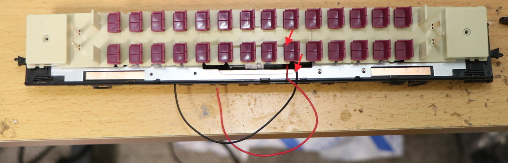

座席部分まで、電線を引き出しました。なお、引き出さずに、床部分を引き回す方法もあると思います。
ご自分の好みで配線をしましょう。

ここでは、ExpBoard Next18 for General HO(https://desktopstation.net/wiki/doku.php/expboardgeneral)と、PUI Audio社のASE02506MS-LW90-DSM-Rスピーカーを用意しました。ディーゼル車なので、ディーゼルエンジン音がクリアーに出るスピーカーを選ぶのがコツです。ASE02506MSは、薄型でかなり音が良いと思います。
 

LokSound5 microを取り付けしました。

デコーダとExpBoardは、うまく隠してしまいましょう。
 

DCC化作業が完了しました！

## 5.9. トラムウェイ HO

トラムウェイのキハ40-500のDCCサウンド化にチャレンジしてきます。それでは箱から、取り出すまでを以下に並べます。

<a href="./img/Tramway_HO_Kiha40_500_3.jpg" target="_blank">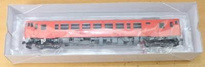</a>

<a href="./img/Tramway_HO_Kiha40_500_5.jpg" target="_blank">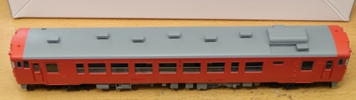</a>

<a href="./img/Tramway_HO_Kiha40_500_6.jpg" target="_blank">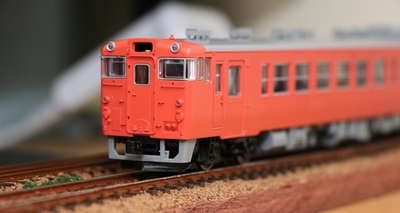</a>

DCC化するための調査で、バラバラにします。残念ながらNEM652の8ピンなどのコネクタは装着されていませんでした。

トラムウェイの車両を買うのは初めてですが、外側筐体に重りの鉄板があります。おかげで、床下部分についてはプラ部品のみのため車内工作しやすいです。代わりに剛性が犠牲になっていますが・・・。

上部の照明基板との接続はポゴピンです。こういう使い方も有りと言えば有りですが・・・。

ライト基板（下）。線路からの配線、モータ、反対側基板への配線がしてあります。
最終的には、コモンとF0出力、室内灯制御の信号だけ配線することになります。

<a href="https://www.mmjp.or.jp/tramway/goods/pg350.html" target="_blank">照明基板の回路図がトラムウェイにあった</a>ので、BSChで書き直して、DCCに割り付けるとこうかな？というのを書いてみました。まだ検証していないので、間違っている可能性があります！要注意です。

>注：この回路図通りに改造して動作を確認しましたが、動作を保証するものではありません。

基板に図示してみました。赤線はパターンカットです。カッターなどを使って、基板上の銅パターンを削って除去してください。両極性タイプから、オープンコレクタ出力のNMRA 8ピンに対応させるための作業となります。

>なお、NMRAピンの色とピン番号を図示していますが、ライト系ではFWD/REVで意味が変わるため、そのまま配線する意味ではないので注意してください！

ここでは、よくあるFL12やワンコインデコーダFL等のライトデコーダを２個追加するのではなく、ESU LokSoundのピンをそのまま使うようにするため、基板にパターンカットや配線追加を行って、対応しています。複雑な車内の配線工事必須で、上級者向けなので、難しそうと思ったら、FLデコーダを使う方が良いと思います。

それでは作業していきます。まず、線路と直結されている配線を半田ごてで取り外します。テールライト配線で、LEDに配線を追加しています。

基板に配線を足しました。ヘッドライト、テールライト、室内灯用です。なお、筐体側の基板は一切改造しなくても良いように工夫しています。

<a href="./img/Tramway_HO_Kiha40_500_15.jpg" target="_blank">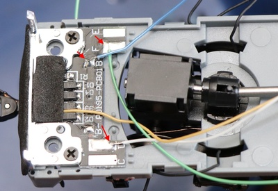</a>

配線を半田付けしたら、配線を固定していきます。もともとある、粘着テープをそのまま使用しました。

カバーを取り付けました。配線引き出し用に、一部、穴を開けて配線を取り出しています。配線は、ExpBoard Next18 for General HOのパッドに繋げていきました。

<a href="./img/kiha40_next18_4.jpg" target="_blank">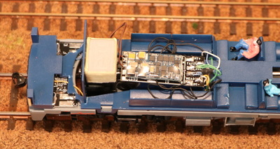</a>

振動で動いても困るので、アセテート粘着テープ(絶縁性があり施工性抜群！)で固定。スピーカーも黒に塗りました。

<a href="./img/kiha40_next18_5.jpg" target="_blank">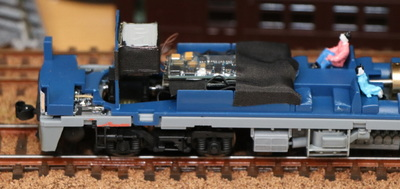</a>

Next18を使う事で、車体を被せても、配線の山が大きく目立つことはありません。

次に、室内灯の取り付けを検討しました。キハ40の天井側には、室内灯の端子が出ています。テスタで測定したところ、回路図は4.7kΩとなってましたが実際は2.2kΩでした。あの回路図の定数は信用しない方が良さそうですね・・・。配線は合っているようです。
あと気になった点としては、どちらがプラス側か一切書いてません。みなさん、テスタであたって調べてるんでしょうか？基板裏側にシルクで書いてくれれば良かったのですが。一応、写真の中にあるようにマスキングテープで印を付けました。ご参考ください。

高い照明を買うのも大変ですし、手配も面倒でしたので、社内に落ちていたテープLEDを使用しました。３直列LEDで電流制限抵抗は150Ωです。電線とタブ端子を付けました。

一応、計算して多少は光るか確認します。

LED 3直列なので、Vf=2.5*3=7.5V (白色LEDのVfは2.5Vくらいと仮定)
抵抗値は、2.2kΩ+150Ω=2.35kΩ
電圧が12Vのとき、V=IR→V-Vf=IRなので、12-7.5=I*2.35k, I=(12-7.5)/2.35 = 1.9[mA]

ぼんやりと、かろうじて光るな、ということは計算で分かりました。

LEDテープを装着した後は以下のような感じです。

<a href="./img/Tramway_HO_Kiha40_500_23.jpg" target="_blank">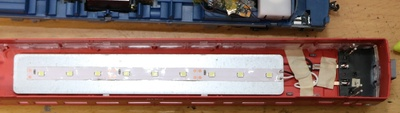</a>

光らせてみました。計算通り、微妙に光っていますが、模型の室内灯としては結構良い感じと思います。DCCなので、ヘッドライト・テールライトとは別に、室内灯をファンクションでちゃんとON/OFFできるので、使い勝手も良い感じです。車庫への回送なのに光り続ける間抜けな運用は避けられそうです。

<a href="./img/Tramway_HO_Kiha40_500_24.jpg" target="_blank">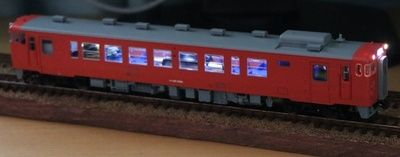</a>

## 5.10. エンドウ HO

ExpBoard YPを使って、近鉄22000系塗装済みキットのDCCサウンド化を行っていきます。

> ExpBoard YP
> https://desktopstation.net/wiki/doku.php/expboardendo

まず、ExpBoard YPの半田付けをしました。細かい部品ばかりなので、難易度は高いです。電子工作上級者なことが前提になります。MTC21コネクタは、1.27mmのピンヘッダですが、インデックスピンという黒い■のあるところは、ピンをあらかじめ抜いておきます。誤挿入防止用のようです。

IC1とIC2は同じ形状ですが、部品は違うので用意注意です。IC1には<strong>A1</strong>というマークが書いてあります。IC2には<strong>G3</strong>というマークが書かれてます。そこで判断してください。D1とD2には、ショットキーダイオードと定電流ダイオードを付けますが、万が一間違えて逆にしても普通に動きます。ただし、アノード・カソードの位置は間違えないようにしてくださいね。

半田付け後、スピーカーも付けてみました。

実際に組み込んでいくので、その準備工事。

はんだ付けした基板を天井に搭載して位置チェック。

ExpBoard YPのおかげで、ヘッドライト・テールライト、室内灯、サウンドなどなどは凄く楽なのですが、床下部分は全く考慮されていないので、コネクタの取り付けなどに意外と時間を費やしました。

両極性機能の動作チェック。ExpBoard YPは、両極性基板の機能を搭載しているので、通常DCCで使用されるオープンコレクタ出力ではなく、両極性出力を使えます。という事は、アナログ車両のヘッドライト・テールライトのユニットは通常、両極性専用なので、日本型車両に搭載がしやすくなるわけです。

こんな感じで、とりあず動きました。

## 5.11. でんてつ工房 プラHO

でんてつ工房は、東京・神田神保町にある1/80 HOブラスの模型メーカーです。精密で再現の高さで定評があり、模型マニアに人気があります。

> でんてつ工房 
> 千代田区神田神保町1-52-12 神田耀ビル1F1号室 
> https://dentetsukobo.jimdofree.com/

ここでは、ちょっと前に発売した115系について、DCCサウンド化をしていきます。

ネットには特に在庫情報は出てませんが（でんてつ工房さんは、Webに在庫情報を掲載してないので直接行くか、電話するしか在庫確認の方法が無い・・・）、あるということなので、気になっている方は、ぜひ問い合わせするか、金曜・土曜の営業日に訪問してみてはどうでしょうか。

ちなみに価格は以下の定価です。4両編成基本セットの価格です。

- 湘南色 ￥46,800(税別)
- 横須賀(スカ)色 ￥47,250(税別)

でんてつ工房さんで湘南色とスカ色を目の前に置かれて、悩みに悩んでおりましたが、私は長い編成が作れない状況（置き場所が無い、たくさんあると怒られるなど）で、湘南色よりスカ色の方が３両編成でも見栄えが良いということで、スカ色をチョイスしました。

湘南色の場合は、M車は中間車になります。スカ色はM車が先頭車になるので、スカ色の方が工数は多いです。ここに紹介する加工方法は、先頭車とM車の両方で使える方法になりますので、より参考になるかと思います。

と言うことで、でんてつ工房さんの１１５系をDCC化していきます！もちろん、オープンサウンドデータを使います。

■部材準備

オープンサウンドデータをいろいろいじった方は気づいているかも知れませんが、実はサウンドによってスピーカーの選定が異なります。シュガーキューブ的なものが合うサウンドもあれば、低音が強いのでエンクロージャーが大きくないと実力を出せないサウンドもあります。
MT54にピッタリなのは、やはり、デカいですがASE02808MR-LW150-Rです。

DCC化は、プラHOなこともあるのでNext18ということで、ExpBoard General HOを選定しました。
あと、ライト基板はいじりたくなかったので、DCC館の両極性基板(AYA014-2)を使用しました。もうコレが無いと、日本型のDCC化したくないです（笑

| 部品 | 個数 |
|:-----|:-----|
|でんてつ工房 115系 800番台スカ色 基本４両(1/80)  | 1 |
| ESU LokSound5 micro DCC (Next18版) | 1 |
| ExpBoard Next18 for General HO | 3 |
| PUI Audio ASE02808MR-LW150-R | 1 |
| DCC館 AYA014-2 両極性基板 | 2 |
| LaisDcc Next18 デコーダ | 3 |

■車両のDCC化改造(M車)

以前買ったトミックスの113系よりも、シンプルな作りで、配線引き出しはとてもラク。

銅板から配線を引き出します。モータの配線は、取り付け済みのものをそのまま使います。

元に戻していきます。

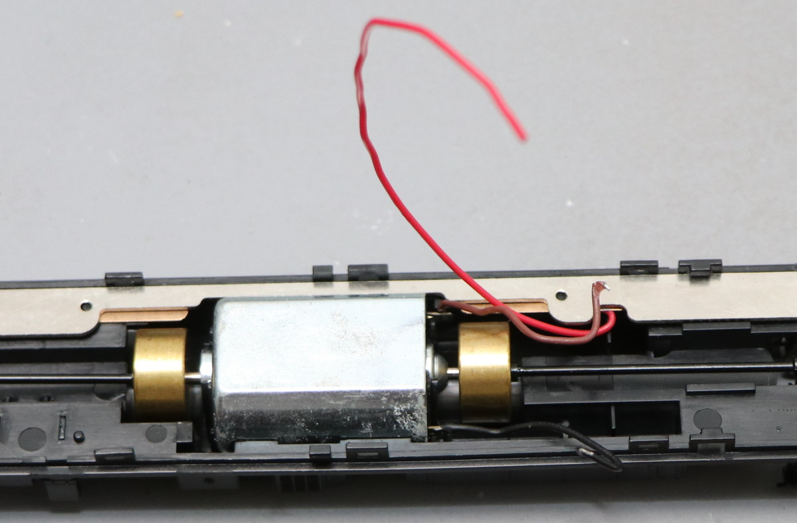

床板のカバーは予め穴開けします。あと、室内灯の出力の端子はテープなどで絶縁しておきます。あとでAUX1配線を行うためです。

穴開け箇所は、ケーブルを引き出せるように、工夫して場所を選びましょう。

スピーカーの位置を選びます。私は中間車側にしました。背もたれはカットした方が良いです。また、床板カバーに穴を開けて、音が抜けるようにすると良い感じです。

ExpBoard General HOに配線します。すぐに終わるでしょう。終わったら必ずテスターでショートのチェック！！！

室内灯の準備です。室内灯のポゴピンのあたる端子は、既に絶縁済みなので、以下のように半田付けして、COM+とAUX1を配線します。

ヘッドライト・テールライトの配線では、両極性基板を使用してラクに実装します。また、今回はあまり手を付けない方法で取り付けしていきます。まず、スイッチに配線されている銅板を取り外します。事故防止。

もう片方は絶縁テープを貼って、その上に銅板を置いて配線します。こうすることで、ヘッドライト・テールライトのスプリングの接点を乗っ取ってDCCで使用できます。

両極性基板を固定し、完成。

問題なく上側のカバーというか筐体というかケースというか、装着完了。

■サウンドの書込み

世界で一番良い音質と話題の、MT54国鉄近郊型を使うしか無いですね！
115よりも、113系サウンドのほうが近いという話を聞いたので、113系サウンドデータ(V5_JNR_113･415ｖ2.33_Open sound)を選択しました。
なお、F0ヘッドライト・テールライト、AUX1室内灯の出力は、標準では0になってるので、書き込む前に、25あたりまで出力値を変更する方が良いです。

■動かしてみた

動かしてみたところ・・・かなり控えめに言いますが、ヤバい！本物にしか見えない（聞こえない）。サウンドが無いなんて、もう想像もできなくなってしまう、スゴいヤバさ。たぶん、初めてDCCサウンドを体感する人は、笑いが止まらないでしょう。ヤバすぎて笑いが出てくるはず。

> Youtubeでの動画 
> https://www.youtube.com/watch?v=hJqH0iEmcyQ&feature=emb_title

次はでんてつ工房115系スカ色のT車の加工に移ります。モータの無い先頭車のDCC対応加工です。

まず開けます。

さらに床板を外します。精密マイナスドライバーがあると便利。

先頭のLEDはこのスイッチで分岐してます。デコーダで制御なので、スイッチには配線しないように、銅板をはんだごてで外してしまいます。

床板プラの室内灯引き出し銅板への絶縁加工と、配線引き出し用の穴開けです。ピンバイスで簡単に空きます。

金属ウェイトに無理矢理半田付け、銅板がきれいに出ている箇所が無かったので・・・。

床板プラを取り付けし直し、Next18のデコーダを搭載するためのExpBoard General HOを取り付けです。

あとは室内灯を配線し（COM+とAUX1を半田付け。でんてつ工房１１５の室内灯は極性は関係ありません。）、ヘッドライト・テールライトはDCC館の両極性基板を中継して配線しました。とても簡単。
アセテートテープで絶縁して、スプリングを当ててDCCデコーダからの配線に使えるように銅板を置きました。

動作確認して完成。

■デコーダ設定

デコーダには、laisdccの860015 Next18 DCC Decoder(PanGuシリーズ)を使いました。
デフォルトではAUX1(室内灯)がF1に割付いているので、これをF3に変更するだけです。
LaisDccのデコーダ説明書の「h）ファンクションの再マッピング」ところで、CV35がAUX1で、デフォルトは4(F1)になってるので、これを16にすれば良いです。

## 5.12. Nゲージ

### 5.12.1. KATO 113系

ついに、KATO 113系東海道線色がリニューアルされましたね～。もちろん、あの懐かしいMT54サウンドを再現したく、いつものLokSoundデコーダを搭載することにしました。

まずは、M車モハ113のDCC化です。

ExpBoard EC-Slimは、スタンダードセット相当で、さらに室内灯を付けたものを利用します。

>ExpBoard EC-Slim 
>https://desktopstation.net/wiki/doku.php/expboardecn

モハ113の ボディと床下カバーを外して、どのように取り付けるか検討します。画面左側の室内灯ユニットが取り付く側にサウンドデコーダを配置します。
 

また、スピーカーは右側に取り付けることにしました。タカチのケース(SW-15B)とaliで購入したスピーカーを使います。
 

タカチのケースは半分くらいに薄く削っています。組み立てる前はこのような形です。

ユニットとケースは透明ゴム系接着剤で固定しています。また、今回両側についている金属端子を上向きにしてボディに当てることで、床下に押し付けて固定する効果も狙ってます。

さて組み立てです。EC-Slimはいつものとおり、EM13装着部に差し込みます。今回は室内が青いので青いケーブルを使います。ケーブルが同色ですと接続先を間違る可能性があるので、信号名を書いたシールを貼るとよいでしょう。

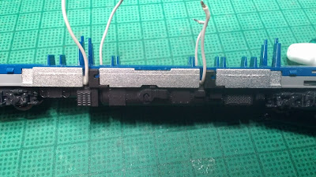

ケーブルを床下パーツの隙間から出して、床下パーツがしっかり取り付いてることを確認します。（実は今回、いつものグレーのケーブルで製作を初めて、途中で青ケーブルに付け直してます）。

この姿にして、一度走行試験をするとよいでしょう。

動力ユニットの上に、EC-Slimとスピーカーを載せて位置決めして配線の長さを決めます。

配線をカットして、先端の被覆をむきハンダメッキしておきます。

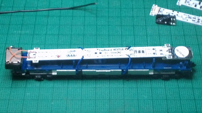

基板を載せてTLK1,2 MT1,2を配線します。レール側とモーター側の配線が間違いないことを再確認してください。さらにスピーカーにも配線します。

試走して問題ないことを確認した後に、ボディをかぶせてサウンドをテストします。今回、いつものプラバンエンクロージャよりちょっと大きいので、気持ち音が大きくなったかもしれません。

### 5.12.2. KATO C59 DCCサウンド加工

C59(KATO製品)のDCCサウンド加工のご紹介です。

利用するExpBoardはこちらです。C57用とちょっと似ていますが、端子の位置などが異なります。
 
C57用はデコーダの下側に取り付けていましたが、こちらはデコーダやスピーカーの上側に取り付けることを想定し、配線パッドが両面についています。

さて加工を始めます。C59のテンダーは長いのですがこの部分にＲがついていてスピーカーの角と当たるのでリューターで少し彫り込みます。

スピーカーユニットはいつものNagodenさん頒布品です。

> Nagoden http://www007.upp.so-net.ne.jp/nagoden/

端子はレールからの電流が流れるウエイトに接触しないよう短くカットし、配線しやすいようハンダメッキをしておきます。

エンクロージャは以前ご紹介したプラ板・プラ棒の組み合わせです。角を落とし、またスピーカー配線を通すためのミゾをやすりで掘っておきます。

スピーカーとエンクロージャをダイキャストパーツの中に、仮置きしてみます。ダイキャストが広がるときは当たっている部分を再度削ります。

それぞれのパーツをウエイトの中に納まるか確認します。特に、プリント基板がウエイトより上部に飛びさすときは、スピーカーの当たっているところをわずかに削ります。

ExpBoardからモーターとスピーカーの配線を取り出します。今回は、すべて下側から配線を取り出しました。また、レールからの給電は洋白線（0.2mm)を左右のウエイトに押し当てて行います。

なお、ヘッドライト配線は使いません。開発中のこのヘッドライト用デコーダ(PetitDecoder-SL)に取り換えました（詳しくは別途説明します）。C57は、はずすのが大変そうだったのですが、C59の場合はこの状態で基板交換ができました。

作ったパーツをくみ上げます。プリント基板とスピーカーは少量のゴム系接着剤で止めています。また、LokSoundの基板もダイキャストでショートしないようテープで絶縁しておきます。

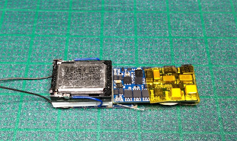

このようにぴったりはまりました。モーターへの配線がからまないように注意して引き出します。

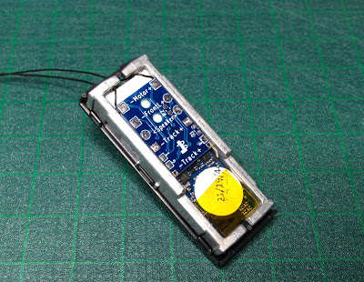

テンダー上面パーツで蓋をします。このときに、床下などが中に押されて盛り上がっていないことを確認してください。

スピーカーの配線を通してテンダーを組み立てます。

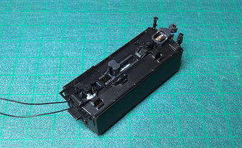

エンジン側の分解や改造はC57と同じです。モーター配線はダイキャストにはめ込んである金属板を外し、テンダーからの配線につなぎ替えます。ボディ（ダイキャスト）に配線が接触しないようにカプトンテープなどできちんと絶縁してください。

このように外部から配線などは一切見えません。

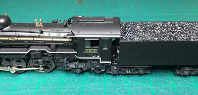

この後、開発中のオープンサウンドデータに書き換えて２両目が完成です。

### 5.12.3. KATO E233 DCCフレンドリー

ESU 58731 LokSound5 micro DCC Direct Kato Japanは、ドイツESU社が開発したDCCサウンドデコーダの最新版で、2021年2月に情報公開され、5月末に欧州で販売・アメリカで開始になりました。最大の特徴は、KATOのDCCフレンドリーに対応していることです。KATOのDCCフレンドリーは、Nゲージ車両にデコーダを簡単に挿入できるシステムのことです。対応している日本型Nゲージの車両はたくさんありますが、KATOのホームページでも抜け漏れがあります。詳細はDesktopStation wikiにまとめているので参照してみてください。

> DesktopStation wiki 
> https://desktopstation.net/wiki/doku.php/dcc_ready_locos#kato1

ESU 58731 LokSound5 micro DCC Direct Kato Japanには、致命的な問題点があります。それは、ダイキャストや銅バーとデコーダの電子部品が接触し、ショートを引き起こすリスクが大きいことです。この対策として、DesktopStationでは下記のような注意喚起を行っています。必ず守って作業を行いましょう。wiki(https://desktopstation.net/wiki/doku.php/loksound5microkato)にも詳細をまとめています。ご参照ください。

それでは、KATO NゲージE233中央線にESU 58731 LokSound5 micro DCC Direct Kato Japanを入れてみることにしました。
DCCフレンドリーに対応した日本型車両は、このサウンドデコーダを使う事で、DCCサウンド化が簡単にできてしまうということなのです！

中身は、説明書とエンクロージャ、スピーカーはんだ付け済みデコーダです。

E233とESU 58731 LokSound5 micro DCC Direct Kato Japanデコーダを並べてみました。

デコーダの拡大図です。

 

最初に、デコーダを搭載する隙間の下部となるダイキャスト部分を絶縁性のあるテープで絶縁処理します。何らかの原因で、デコーダの一部の部品がダイキャストに接触してショートするリスクを減らすためです。１万円もするデコーダなので、接触の可能性のある部分には絶縁対策するのが望ましいです。必須ともいえるかと思います。当たらないこともありますが、当たって壊れた事例もあるらしいので、やっておいて損は全くありません。デコーダの周囲がダイキャストなのはどうなのかという議論はあるかもしれませんが、安全を考えればプラ部品でカバーされていたら良かったですね。

デコーダは以下のように挿入します。デコーダには表裏があるので気をつけてください。モータの部分を接触させるカブトムシのようなツノの先っぽがパッド(金色の部分）が短い方が表です。モータのピンにちょうど当たるので、そこの接触も合わせて確認しましょう。デコーダを何度も取り外ししていると、モータの板バネとなっている端子が曲がって、接触不良になるケースがよくあります。ASSY部品で交換もできますが、入手がホビセンを探し回ることになり面倒なので、丁寧にデコーダを挿入するようにしましょう。

デコーダを挿入した後の様子。

車輪台車を付け直します。

次にスピーカーのエンクロージャを組み立てます。E233の場合は、以下のように切り取りました。

エンクロージャの接着方法はいろいろあると思いますが、私はタミヤセメント速乾を使いました。隙間があると音がしっかり出なくなりますので、しっかりと接着剤をエンクロージャの下駄の隙間に流し込んで密閉するようにしましょう。

エンクロージャの組み立てと接着が終わったら、スピーカー配線を、客室内に引き回す作業です。ちょうど、床下のデコーダを隠すカバーのプラ部品を固定する隙間を利用すると良いでしょう。車両によってはタイトになる場合もあると思いますので、状況に応じて引き回す個所は調整してみてください。

スピーカー配線は、以下のように、スキマをうまく活用して客室内に入るようにしましょう。

客室内は、以下のようにスピーカーを置いています。位置は各自で調整ください。

カバーをした様子です。

搭載完了した様子。

# 6. よく使う設定

## 6.1. よく使うCVの設定

オープンサウンドデータで、LokSound5における、よく使うCVを以下に示します。LokProgrammerを使うと、CVを意識せずに設定変更ができます。
LokSoundV4では異なる場合がありますので、詳細はESUのマニュアルを参照してください。

| CV番号 | CV名称 | 設定方法 | 備考 |
|:-------|:-------|:-------|:-------|
| CV1 | ショートアドレス | ヨーロッパ式1-100 アメリカ式1-127| CV29のbit5が0のときに有効 |
| CV17 | ロングアドレス#1 | 192-230. CV18と組み合わせて使用。 | CV29のbit5が1のときに有効 |
| CV18 | ロングアドレス#2 | 128-255. CV17と組み合わせて使用。 | CV29のbit5が1のときに有効 |
| CV2 |開始電圧 | 走行開始時の電圧。デフォルトは1です。|255=100%の相対指定なので注意。 |
| CV5 | 最大電圧 | 1-255。255で最高速度時に電圧100%を出します。 127で半分50%となります。|255=100%の相対指定なので注意。 |
| CV63 | 音量 | 0-129。192で最大。128で通常音量。| |
| CV29 | 基本設定| デフォルトは30です。 |28/128Step, アナログ有効, ショートアドレス,スピードテーブル有効 |
| CV155-CV170 | SoundCV | データ毎に独自の設定が設けられている場合があります。 |  |
| CV258-CV448 | Function Outputs | ヘッドライト・テールライトやAUXの出力設定を行えます。詳細はESUのマニュアルを参照してください。|

特にCV29は、デコーダの設定の根幹となっています。

>bitとは、２進数表現(0と1だけで数値を表現する)のことで、たとえば10進数の3(皆さんが生活で用いる0～10の表現)は、2進数でいうと11と表現します。10進数の11と紛らわしいので、11BとかB11とか等、表現する場合があります。B11とは、bit 0が1で、bit 1も1ということです。bit 1は2を表し、bit 0 は1を表します。なので、1+2=3となります。
bit 2は4、bit 3は8・・・bit7は128となります。CV29は、このbit表現を理解しないと、数値を計算できないので注意してください。

CV29の値は以下のように、様々な設定を１つのCV値で行えるようにするため、bit表現で設定を指定します。組み込みプログラミングの世界では非常によく使われる、ビットフラグと呼ばれる手法です。少ないデータ容量で、多くの設定を行うようにするために使用されています。CVも、無限に設定できるわけではありませんので、このような方法を一部で採用しています。

なおbit列は2進数表現、decは10進数表現という意味となります。

| bit | dec | 機能 | 設定の意味 | 備考 | 
|:-------|:-------|:-------|:-------|:-------|
| 0 | 1 |進行方向 |0:進行方向は正(FWD), 1:進行方向を逆(REV) | モータ配線を間違えた時に使います。 |
| 1 | 2 |速度ステップ | 0: 14ステップ, 1: 28/128ステップ | 理由がない限り1をセットすべき。 |
| 2 | 4 |アナログ機能 | 0: OFF,  1: アナログ運転許可 | アナログDCパワーパックで運転したい場合。 |
| 3 | 8 |RailCom | 0: OFF, 1: ON | RailComを使われる方は1にしてください。 |
| 4 | 16 |スピードテーブル | 0:スピードテーブルOFF, 1:スピードテーブルON | オープンサウンドデータでは1にしてください |
| 5 | 32 |ロングアドレス |0: ショートアドレス(2桁)を使用, 1:ロングアドレス(4桁)を使用 | 使用のアドレスに応じて切り替えてください。 |
| 6 | 64 | 未使用 | 0にします | - |
| 7 | 128| 未使用 | 0にします | - |

それでは具体例を元に、設定の方法を説明していきます。

たとえば、以下のようにCV29の機能を選択したとすると、B00011110 (2進数表現)となります。

| bit | dec | 機能 | 選んだ設定 |
|:-------|:-------|:-------|:-------|
| 0 | 1 |進行方向 |0:進行方向は正(FWD)| 
| 1 | 2 |速度ステップ | 1: 28/128ステップ | 
| 2 | 4 |アナログ機能 | 1: アナログ運転許可 |
| 3 | 8 |RailCom | 1: ON | 
| 4 | 16 |スピードテーブル | 1:ON | 
| 5 | 32 |ロングアドレス |0: ショートアドレス(2桁)を使用 | 
| 6 | 64 | 未使用 | 0 |
| 7 | 128| 未使用 | 0 |

CV29に設定する値は、以下の式で表現できます。

> 127ｘ0 + 64ｘ0 + 32ｘ0 + 16ｘ1 + 8ｘ1 + 4ｘ1 + 2ｘ1 + 1ｘ0 
> = 16+8+4+2 
> = 30 (10進数) 

CV29には30をCV書き込みで書き込んでください。

しかし面倒ですよね。DSair2を使うと、CV29で欲しい機能を選択するだけで、自動で計算して書き込んでくれる機能が、CV Programmerで用意されています。

> DSair2 CV Programmer 
> https://desktopstation.net/wiki/doku.php/dsair2_cvprogrammer

## 6.2. RailComの設定

前述のCV29 bit3を必ず有効(ON)にしてください。
オープンサウンドデータを搭載した車両でRailComを使用するには、DetectorやDisplay(Lenz LRC120, DesktopStation RailComDisplay)が必要となります。

複数のDetectorやDisplayを使用する場合には、並列に配線をしていきます。

# 7. コラム

## 7.1. オープンサウンドデータを始めるきっかけ

Yaasan (DesktopStation)

1990年代前半の規格戦争を経て、レンツ社が提唱したDCC規格に収束を果たしたデジタル鉄道模型。鉄道模型のデジタル化のメリットはたくさんあります。自動運転、コンピュータ制御との親和性、省配線、複数台同時制御、複数人制御、などなど・・・。その中で、もっとも分かりやすいのがサウンドだと思います。アナログ鉄道模型の時代から、サウンドの探求が試されており、DCCサウンドで世界共通のプラットフォームができあがったと理解しています。

日本では、2000年頃からデジトラックス、サウンドトラックス、ESUなどが主に使われてきていました。少数派でZIMO、Hornby等がありました。その中でも、KATOが国内代理店をしている関係やコマンドステーションの普及状況からか、デジトラックスが大きなシェアを占めていたと思われます。データを書き換えできるので、一部の模型店からは日本型データが公開され、ユーザーにも多く使われてきたようです。

一方、日本のDCC界隈でそれなりに普及していたデジトラックスのサウンドデコーダは、2020年前後においては、同時発音数の少なさや音質の悪さなどが目立ちはじめ陳腐化していました。また、2017年頃から普及が始まったNext18やMTC21といったDCCコネクタの対応という面で考えると、課題が大きいと感じていました。また、若干、安定性や品質面でも気になる点がありました。

一方で、日本型DCCサウンドは、大きなキーとなるソリューションと言うことも強く感じていました。どうすれば良いかと悩んでいたときに、たまたま同じ方向性を考える方々と接する機会に恵まれ、様々なディスカッションの結果、価格はデジトラックスの物よりも上がりますが、ESUのLokSoundを軸にすることで、懸念事項や課題もクリアする事も見いだすことができました。ここで現在のオープンサウンドデータの原型となる物ができあがったと感じています。

また、同時並行でDCC電子工作連合内でも、DCCコネクタ対応の議論があり、これらの動きをセットで進めていく事としました。

そして2019年に、オープンサウンドデータを立ち上げ、多くの協力者のボランティアによる活動で、サウンドデータの公開と、ExpBoardシリーズによる容易な日本型車両のDCC化環境作りを整えていくこととしました。

この活動により、情報共有や、支援グッズが充実したことによって、日本型車両へのDCCサウンド搭載の課題は徐々に解消の方向となっており、ハードルは年々低くなりつつあります。同時に、AUXによるファンクションの高機能化を実現しつつ、改造失敗のリスクの低下も実現しつつあります。

2000～2010年頃の第一次DCCブームの数々の失敗を経て、2020年代は日本型DCC元年となるか、試されているのかもしれません。

## 7.2. オープンサウンドデータのこれから

Yaasan (DesktopStation)

サウンドデータを、より多く公開していくと同時に、ユーザーがクリエイターとしてどんどんデータを作成できるような環境作りを進めていきます。

たとえば、本書のような文書の公開であったり、開発セミナーであったり、オープンサウンドデータミーティングといったオフライン・オンラインを駆使したイベントの実施です。

その次、2030年頃でサウンドデコーダ、書込み装置の内製化と仕様のオープン化です。「オープンサウンドデコーダ」という、完全に仕様をオープンにして、誰もがサウンドデコーダを開発できるプラットフォームを作り上げていきます。海外の競合DCC企業は、完全に囲い込んだサウンドデコーダシステムとなっており、ユーザーはメーカーを変更したら１からデータを作り直したりしなければなりません。

アイデアや技術は徐々に蓄えており、超高密度部品実装、ARMかRISC Vベースの高性能マイコンに、DCDCコンバータ、フラッシュメモリ、Raicomベースのデコーダ～書込み装置間のサウンドデータ・ファームウェア書込み技術、ブートローダ、サウンドデータ作成ツールといったアイテムが構築できれば実現できることは分かっています。これらのうち、一部は既にDCC電子工作連合で技術を得ており、徐々に開発を広げていこうとしています。

オープンサウンドデコーダが実現できれば、たとえメーカーが変わっても同じサウンドデータが使えます。今よりも遙かに多くの選択肢が増えたり、乗り換えたりすることが容易となります。

オールジャパンで、デジタル鉄道模型・DCCを楽しめる環境を作り上げ、今後は日本が海外の鉄道模型の将来を引っ張って作り上げていく、そんな環境を構築していきたいと考えている次第です。

日本はDCCが遅れているなら、それをリセットする技術とアイデアで、既存のDCCメーカーのしがらみを壊してしまい、世界をリードしてしまえば良いのです。

このためには、オープンサウンドデータのユーザーの皆様も大きな協力が不可欠です。ぜひとも、ご協力を頂ければ幸いです。

## 7.3. LokSound V3.5との出会い

寄稿 MB3110A様

2007年当時、HornbyのHSTをディーゼルサウンドを模型化したく調べているうちに、英国のSouth West Digital社がHSTのサウンドをプログラムしたLokSound V3.5を取り扱っていることを知り、メールオーダーで取り寄せたのが始まりでした。

今でもSouth West Digital社はメールオーダーのみの取り扱いですが、当時、下手な英文を駆使して注文メールを送り「在庫あり」の返事が来たらクレジットカードの番号を送り（セキュリティーの為、先方のアドバイスによりカード番号は半分ずつ2回に分けて）到着を指折り数えて待っていた思い出があります。 

 

　LokSoundデコーダが自分の手でサウンドが書き換えられることができてオリジナルサウンドデコーダが容易に作れるのを知ったのはその後でした。2008年に自作サウンド制作の為にLokProgrammerも取り寄せてキハ40自作サウンド（初代）の制作に取り掛かりました。パソコンが上手くない自分に制作出来る自信はなかったのですがとりあえずやってみようと･･･。

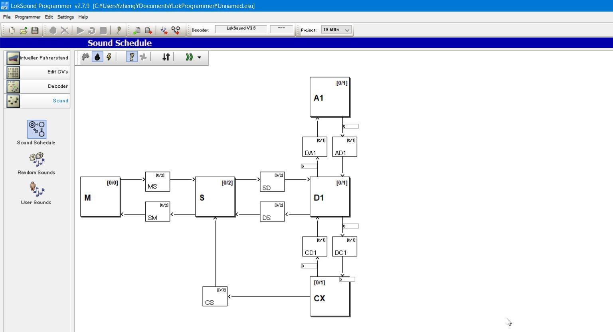

Mはエンジン停止、Sはアイドル音、Dは惰行音、Aは加速音、CXには減速音、その他にそれぞれ移行音が組めるひな形になっており、移行する条件としてスロットルの開度数値を入力する単純なもので分かりやすく、私はLokSound 5となった現在も全ての基幹サウンドスケジュールの基本にしております。

v3.5のスペックは8Mbit（約69秒のサウンド）しか記憶されないので如何に同じ音を繰り返す「LOOP再生」を多用させて容量以下に押し込むのには苦労させられました。それでもv2だった頃の1M Bit（約11秒）と比べれば充分満足でした。

その後2008年頃のマイナーチェンジで16M Bit（約138秒のサウンド）まで記憶できるようになり、サウンドデータ編集の幅に余裕が出来ました。

　キハ40サウンド（初代）のサウンドスケジュール例です。

A段は未使用、D段を加速音、CXをアイドル音（惰行）としております。当時、ディーゼル車には申し分無いスペックだったのですが、今思えばImmediate（再生途中の音をその場で切り上げて次のサウンドに強制移行させる）機能が全く無いのでレスポンスが悪く、克服する為には短くキレイなLOOPサウンドを作るしか方法しかありませんでしたし走行サウンドにシンクロさせて断流器等の音も出す機能も無かったのでサウンドプログラムとしては少々物足りないかもしれません。

2011年にフルモデルチェンジを果たしてLokSound V4となり、サウンド容量も32M Bit（約267秒）まで増大しました。プログラムが全くの別モノに変わり複雑な動きにもサウンドが対応し飛躍的に進化します。中身も一新されて一気に複雑になり私も最初はプログラムの仕方が全く分からず、LokProgrammerの変換機能を使ってLokSound V3.5のデータをV4にコンバートして解析しました。

このLokSound V3.5から LokSound V4への進化は衝撃的で、今のLokSound 5の基本が確立されたサウンドデコーダと言えます。
 
 

特にサウンドスケジュールの移行にはImmediate（再生途中の音をその場で切り上げて次のサウンドに強制移行させる）機能が付いて移行レスポンスが格段に上がり、電気車の駆動音サウンド向けとしても申し分無いデコーダとなり、以後サウンドデータを多数手がけることとなります。

# 8. サポート

オープンサウンドデータやLokSoundデコーダ等に関わる質問、相談等は、デジタル鉄道模型フォーラムをご利用ください。オープンサウンドデータは収益を得る事業ではありませんので、サポートは原則として実施しません。

オープンサウンドデータを使用することで、車両や機器の故障や損壊等を招いても、オープンサウンドデータ運営元ならびにDesktopStation、DCC電子工作連合、クリエイターは一切の補償をいたしません。オープンサウンドデータは、自己責任の下でご利用ください。

オープンサウンドデータは、基本的に要望や修正依頼、変更依頼を受け付けていません。しかし、自分で収録した音源を、クリエイティブコモンズCC0を宣言した上で提供した場合で、クリエイターの方向性と合致していた場合、サウンドデータを作成する場合があります。収録しても必ず作成される保証はありませんが、一方で、音源を自分で収録をして提供しなければ確実にサウンドデータの提供は無いと考えても差し支えありません。

デジタル鉄道模型フォーラムはDesktopStationが管理運営しており、登録・年会費無料でご利用頂けます。

なお、デジタル鉄道模型フォーラムで質問・相談されましても、解消を保証するものではありません。ボランティアによる善意での回答となり、ESU社からの正式な回答ではありません。あくまでもユーザー同士の情報交換という位置づけとなります。

> デジタル鉄道模型フォーラム
> https://desktopstation.net/bb/

開発元からの正式なサポート受けたい場合には、ESU社が運営しているサポートフォーラムがあります。ESU社のサポートの範囲に関しての正式な質問を行うには、各自でユーザー登録の上、ご利用ください。なお、日本語はサポートされておらず、ドイツ語または英語で質問・相談されることとなります。

オープンサウンドデータとESU社は一切の関係を持ちません。オープンサウンドデータの運営元に対して、ESU社の製品のサポートを求める事は固くお断り申し上げます。

>http://www.esu.eu/forum/forenuebersicht/

# 9. FAQ

ここでは、LokSoundサウンドデコーダで、よくあるトラブルや質問事項に対する回答を、有志の立場で記載させていただきます。なお、この回答で解決することを保証するものでもなく、基本的には自身で解決を行う必要はあります。また、DesktopStationやオープンサウンドデータは、ESU社とは一切関係が無く、日本における代理店契約・サポート契約も行っておりません。当方にLokSoundデコーダのサポートを要求されても、一切の対応をお断りさせていただきます。

ESU社からの正式なサポート受けるためには、ESU社のホームページをご覧ください。

## 9.1. どのメーカーのコマンドステーションで動かせますか？

NMRA DCC規格に準拠・対応したコマンドステーションであれば、全世界・どのメーカーのDCCコマンドステーション・DCCコントローラでも使用できます。

なお、メルクリン社の古いコマンドステーションや、CS2やCS3等でメルクリンデジタルモード、mfxモードでは動作しません。なおCS2,CS3共に、DCCモードもサポートしていますので、DCCモードでご利用ください。

## 9.2. 欧米のサウンドデータは公開しないのですか？

欧米のサウンドデータは、ESUが公式に無償公開しています。

> projects.esu.eu
> http://projects.esu.eu/

オープンサウンドデータのスコープ外となります。当方が一切の権利を有さない、欧米型サウンドデータについてのお問い合わせ、サポート依頼は一切お断りさせていただきます。

## 9.3. オープンサウンドデータはESU以外のデコーダに書き込めますか？
<a id="markdown-%E3%82%AA%E3%83%BC%E3%83%97%E3%83%B3%E3%82%B5%E3%82%A6%E3%83%B3%E3%83%89%E3%83%87%E3%83%BC%E3%82%BF%E3%81%AFesu%E4%BB%A5%E5%A4%96%E3%81%AE%E3%83%87%E3%82%B3%E3%83%BC%E3%83%80%E3%81%AB%E6%9B%B8%E3%81%8D%E8%BE%BC%E3%82%81%E3%81%BE%E3%81%99%E3%81%8B%EF%BC%9F" name="%E3%82%AA%E3%83%BC%E3%83%97%E3%83%B3%E3%82%B5%E3%82%A6%E3%83%B3%E3%83%89%E3%83%87%E3%83%BC%E3%82%BF%E3%81%AFesu%E4%BB%A5%E5%A4%96%E3%81%AE%E3%83%87%E3%82%B3%E3%83%BC%E3%83%80%E3%81%AB%E6%9B%B8%E3%81%8D%E8%BE%BC%E3%82%81%E3%81%BE%E3%81%99%E3%81%8B%EF%BC%9F"></a>

オープンサウンドデータは、ESU社のLokSound V4または5シリーズ向けに専用に作成されたものです。その他のメーカーのサウンドデコーダには書き込みができません。また、対応する方針も一切ありません。

ZIMO、Digitrax, SOUNDTRAXX, Uhlenbrock等、他社のサウンドデコーダに書き込むことはできません。サウンドデコーダを開発する各社では、独自にサウンドライブラリを公開している場合があります。各サウンドデコーダのユーザーは、各メーカーのホームページを参照してください。

|メーカー | URL | サウンド地域 |
|:-|:-|
|ESU | http://projects.esu.eu/ | 欧米型 |
|ZIMO | http://www.zimo.at/web2010/sound/tableindex.htm | 欧米型 |
|Uhlenbrock | http://www.d-i-e-t-z.de/7_6.htm | 欧米型 |
|Digitrax | https://www.digitrax.com/sound-depot/list/ | 欧米型 |

## 9.4. LokProgrammerでカンタムなどを書き換えできますか

LokProgrammerはESU社の商品です。カンタムは、天賞堂がBroadway Limited社からのOEMで使用しているサウンドデコーダシステムです。メーカーが異なるため、サウンドや機能を変更することはできません。

また同様に、オープンサウンドデータは、ESU社のLokSoundデコーダのみに書き込みができます。そのほかのメーカーのサウンドデコーダには書き込みできません。

## 9.5. デコーダを壊さないようにするにはどうすればよいですか

買ってきたデコーダは、車両への搭載前に、必ずデコーダテスター(ESU 53900 Decoder TesterやLaisDCC 860033 Decoder Tester Pro)で動作確認をしなければなりません。買ってきて、デコーダテスターで動作確認をした時点で壊れた（壊れていた）場合には、初期不良の可能性が非常に高いといえます。特に製造工程が複雑となっているLokSound5 microでは、メーカー出荷後における市場不良率が100個中に1～2個程度というデータがあります。この時点で、メーカーや販売店に初期不良交換を連絡してください。

また、高額なLokSoundデコーダをすぐには装着せず、MTC21やNext18のDCCコネクタを用いて車両に搭載作業を行い、LaisDccの安価なデコーダで動作確認することも必須事項です。過去多くのデコーダの故障原因は、ユーザーの搭載作業のミスです。複雑な搭載作業は、じっくりと時間をかけて、確認に確認を重ねて行わなければなりません。

## 9.6. オープンサウンドデータを書き込んだら、ギクシャクした動きになった
<a id="markdown-%E3%82%AA%E3%83%BC%E3%83%97%E3%83%B3%E3%82%B5%E3%82%A6%E3%83%B3%E3%83%89%E3%83%87%E3%83%BC%E3%82%BF%E3%82%92%E6%9B%B8%E3%81%8D%E8%BE%BC%E3%82%93%E3%81%A0%E3%82%89%E3%80%81%E3%82%AE%E3%82%AF%E3%82%B7%E3%83%A3%E3%82%AF%E3%81%97%E3%81%9F%E5%8B%95%E3%81%8D%E3%81%AB%E3%81%AA%E3%81%A3%E3%81%9F" name="%E3%82%AA%E3%83%BC%E3%83%97%E3%83%B3%E3%82%B5%E3%82%A6%E3%83%B3%E3%83%89%E3%83%87%E3%83%BC%E3%82%BF%E3%82%92%E6%9B%B8%E3%81%8D%E8%BE%BC%E3%82%93%E3%81%A0%E3%82%89%E3%80%81%E3%82%AE%E3%82%AF%E3%82%B7%E3%83%A3%E3%82%AF%E3%81%97%E3%81%9F%E5%8B%95%E3%81%8D%E3%81%AB%E3%81%AA%E3%81%A3%E3%81%9F"></a>

オープンサウンドデータを正しく、LokSoundデコーダに書き込んでも、特に低速走行でギクシャクした動きになる場合があります。原因は、Motor Settingsタブの中にあるLoad Control中のBasic settings, Slow Speed settingsや、BEMF（モータの速度検出機能のこと）の設定がモータと合っていないことが理由として挙げられます。

Basic settingsは、通常はそのままでも問題ないはずですが、どうしてもうまく行かない場合には、自動調整機能を使用して、調整しましょう。自動調整機能の使用方法は、ESU LokSoundデコーダの取扱説明書(英語)に記載されています。

Slow Speed settingsは、低速走行の調整向けに用意されていますが、ほとんどのケースでうまく動かないため、基本的に使用しないことをおススメします。よって、Regulation parameter "K slow" と、Largest internal speed step that uses "K slow"は0に設定しましょう。

BEMFについては、オープンサウンドデータの多くでは調整後の値となっているはずですが、もし値が変わってしまっている場合には、調整後の値に変更すると、うまくいく場合が多いです。なお、これらの項目は、BEMFによる速度検出を、どれくらいの頻度や精度で行うか、という設定になります。長すぎても短くても速度が正しく得られないので、なかなか難しいところであります。

|BEMFの設定項目 | 変更前(例) | 調整後(例) |
|:-|:-|:-|
|slow speed Back EMF sampling period | 2.5ms | 5ms |
|full speed Back EMF sampling period| 2.5ms | 15ms |
|slow speed length of measurement gap | 0.3ms | 1.5ms |
|full speed length of measurement gap | 0.3ms | 2ms |  

## 9.7. デコーダが動かない、反応しない、故障してしまった。

前質問で、デコーダを壊さないようにする注意事項を遵守していることは必須要件です。これを怠った場合には、故障原因はユーザーとなってしまいます。

デコーダを搭載した車両に搭載して動かなくなってしまった場合には、デコーダ搭載作業における配線ミス、絶縁不良、固定の甘さや接触・ショートによる故障の可能性が非常に高いと言えます。

以下の点を確認してください。

- アドレスを読みだせない(CV1)、設定したアドレスで動かない
- デコーダの表面のICが焦げているかどうか、熱収縮チューブが熱で破けているかどうか

アドレスが読み出せる場合には、デコーダの機能としては動いていますが、一部の機能は故障により動かなくなっている可能性もあります。ICが焦げているなどの場合は、ほぼ間違いなく故障となり、使用することはできません。見た目では特に問題がなくとも、故障しているケースもあります。また非常に稀ですが、部品の半田付け不良や接触不良により、後から初期不良が見つかるケースもあります。

DCCコネクタ搭載車両の場合には、デコーダを交換して動作チェックしてください。もし、交換後のデコーダが正常に動く場合には、デコーダが故障している可能性が高いといえます。

貴重なデコーダを壊さないように使用することが、もっとも重要な対策です。壊れた場合には、大きな損失となります。壊さないためにすることを、必ず遵守し、安全に模型車両のDCC化を進めていきましょう。

LokSoundデコーダは非常に精密にできております。また、LokSoundに限らず、デコーダの搭載や利用は適切に行わないと、故障を招きます。自身のミスで故障させた場合には、交換することはできません。特に、初心者の方は搭載作業に不慣れで、なおかつ、動作確認などを怠り、最初から高価なLokSoundデコーダを搭載し、気づかないうちに故障させている可能性が多くあります。

- デコーダの対応スケール（ゲージ）と、組み込む車両のスケール・ゲージは一致させましょう。特に機関車などのダイキャストやブラスモデルでは必ず守りましょう。
- Next18やMTC21等のDCCコネクタを活用しましょう。LokSoundデコーダを装着する前に安価なデコーダで動作テストを行いましょう。
- DCCreadyではない車両では、ExpBoard等の搭載補助基板を活用しましょう。
- スピーカーは磁力が強いため、ドライバーなどに引っ付いて、デコーダ配線においてショートや断線を招く場合があります。

故障要因としては、一般的なノウハウとして、以下が挙げられます。

- スピーカー配線が線路やファンクションやモータ等の関連の信号線と接触するとショートが発生し、内部の回路が破壊されます。
- LokSound5 microなどの小型のスケール向けデコーダを、ダイキャストの非常に重たいHOやOゲージ等に使用し、高速走行や急停車を繰り返すと、モータからの誘起電圧（モータが発電機となる現象）によって、デコーダが過電圧となり破壊される現象が発生します。
- Tomixの製品でよく使われる、ばね式の台車は、脱線やポイント等での衝撃でショートしやすく、過熱現象によって車両が損傷することがあります。DCCのような連続した交流電流の流れる利用を全く想定していない車両もあるので注意しましょう。
- LokSound5 microにおいては2019年～2020年の時期で1～2%程度の確率で初期不良の発生が散見されます。購入時には、デコーダテスタを用いて動作確認を必ず行いましょう。

## 9.8. PWMパワーパックで動かせますか？

LokSoundデコーダは、PWMパワーパックで動作しません。DCCコマンドステーションを使用するか、カンタムのパワーパック、ピュアアナログのパワーパックを使用してください。

なおPWMパワーパックで動かしても、デコーダは故障することはありませんが、正常に動きません。正常に動かないので故障と勘違いする可能性はあります。

## 9.9. 線路電圧はどうすればよいですか？

LokSoundデコーダは、DCCの標準的な仕様に沿って作られていますが、スケールやゲージで判断するとよいです。
なお、DCCコマンドステーションによっては、電圧が固定になっている場合があります。多少違う場合でも問題なく動作するはずですが、NMRAの規格に合っていないデコーダや、コストダウンを優先した一部のメーカーのDCCデコーダの場合には、故障を誘引するケースもあります。

|スケール・ゲージ | 電圧範囲 |
|:-|:-|	
|z, N| 12V|
|HO | 15-16V|

## 9.10. LokProgrammerでサウンドを書き込んでもうまく書き込めない

LokProgrammerで書き込んでもうまくサウンドが入らない場合、うまく動かないサウンドになってしまうことがあります。以下の事を確認して、再度書込みをして見て下さい。特に、通信データが壊れて、うまくサウンドが書き込めないケースがよくあります。

- レールが汚れている、車輪が汚れている、レールと車輪の接触不良による通信データの破壊
- 車両に搭載している場合、配線接続不良や断線
- ファームウェアが古い、書込みするLokProgrammerと相性が悪い(LokProgrammerでファームウェアをアップデートする)
- LokProgrammerが新しすぎてうまく書けない（下位互換性の喪失, LokSoundV4をLokProgrammerの5以降で書くなど）
- LokProgrammerが古すぎてうまく書けない（上位互換性の喪失）
- LokProgrammerのバグで、書き込みがおかしくなる、意図せずに設定が変わってしまう（バージョンを古くして試す）
- CVがうまくリセットされていない
- デコーダが故障している（故障している場合は通常操作もできません）

正常に書き込めていても、DCCコマンドステーションの使い方を間違えると動かないと勘違いする場合もあります。

- F1を押し忘れている
- 線路電源を入れていない
- ACアダプタが入っていない

サウンドデータを正常に書き込めても、車両自体に問題があることもあります。

- 車両の中にデコーダが入っていない
- 違うデコーダが入っている
- スピーカーが入っていない
- 内部が断線している
- 線路が繋がっていない

特にLokProgrammerを使い慣れていない方は、正常に動くことを確認した車両（DCCが最初から搭載された車両）や、デコーダテスターを使用してください。

## 9.11. LokProgrammerで書き込んだサウンドがおかしい

オープンサウンドデータは、完璧な状態で公開されていないケースもあります。発生条件が特殊な場合には、クリエイターの意図しない・気づかないケースもあります。基本的にはユーザー自身で解決していただくことになりますが、以下の点を確認してください。

- サウンドデータの書き込みに失敗している
- LokProgrammerのバグで設定がおかしくなった(LokProgrammer 5.1.0 2020年11月末版で多発)
- サウンドデータが壊れている

トラブルシューティングの方法としては以下が挙げられます。

- 特定のサウンドデータで発生する場合には、異なるサウンドを書き込んで、それで正常に動くかどうかを確認する。
- いったん、車両からデコーダを外して、デコーダテスタで動作チェックする（車両への取り付けミスかどうかの確認）
- 他のデコーダに変更してみる（デコーダ固有の現象かどうかの確認）

## 9.12. ECoS2で、勝手にアドレスが書き変わる

ESUのECoS2には、RailComPlusというLokSoundデコーダと相互通信する機能が搭載されています。この機能により、編成物(同アドレス複数デコーダが乗った複数車両。)を認識させるとアドレスが書き換えられてしまう問題です。

対策としては、RailComPlusを動かないようにするという方法があります。

- RailCom機能を1両以外オフにする(CV29 bit3をOFFにする)
- LokProgrammerの設定で、”Enable RailComPlus automatic announcement” のチェックを入れないようにする

ECoS2固有の現象ですので、その他のコマンドステーションを使用されている方への影響はありません。

## 9.13. アドレスが分からなくなった

DSair2等のコマンドステーション製品を使用すると、アドレスを自動で読みだせます。手動で読みだすタイプのコマンドステーションの場合には、CV1,CV17,CV18,CV29を全て読みだして数値をメモし、Web上のCalculator等を用いて計算することで、現在の設定アドレスをチェックすることができます。

なお、LokProgrammerを使うと、容易に現在のアドレスを確認できます。

## 9.14. コマンドステーションによって動かないアドレスがある

アメリカ式と、ヨーロッパ式で、100-127の取り扱いが異なります。 アメリカ式では1-127がショートアドレス(CV1で設定するモノ）とし、ヨーロッパ系では1-99がショートアドレスとしています。100以降はヨーロッパ式ではロングアドレスとなります。

日本では、DCS50Kの普及の関係でアメリカ式が主流ですが、一部ヨーロッパ式のコントローラをお持ちの場合で、このアドレス範囲の車両(103や113,115など、アドレスにしたくなる車両が日本には多いです)を動かそうとすると、動かない場合があり、頭を抱えることになります。

どうすれば良いかというと、100-127は使わないに限ります。

## 9.15. LokSoundV4に、LokSound5向けのサウンドデータを書き込みできますか？

LokSoundV4に、LokSound5向けのサウンドデータは書き込みできません。下位互換はありません。
LokSoundV4向けに作成するには、サウンドデータは１から作り直す必要があります。

## 9.16. LokSound5に、LokSoundV4向けのサウンドデータを書き込みできますか？

LokSound5に、LokSoundV4向けのサウンドデータを書き込みすることができます。自動的にLokSound5向けにデータ変換されます。なお、音質はLokSoundV4相当となります。

## 9.17. 音量が小さいので調整したい

CV63をCV書込み機能（プログラミング機能）で書き換えてください。デフォルトはサウンドデータによって異なります。1～192で設定でき、100%音量は128です。192は150%音量(最大)となります。試しながら、好みの値に設定してください。

なお、運転中に音量を調整する場合には、F7をON/OFFを繰り返す(ダブルクリック)と一時的に音量を小さく調整できます。

## 9.18. ○○のサウンドデータを提供して欲しい・リクエストしたい

ユーザーからの要望や意見は、一切受け付けておりません。こちらの品質基準に満足する、代表的なサウンドをクリエイター様と協議しながら掲載しております。

## 9.19. アナログで動かせますか？

PWMパワーパックでは安定して動作しないケースがあります。ピュアなDCのアナログパワーパック(ピュアアナログアダプタを含)で動かす場合、LokProgrammerでデータ調整が必要です。つきましては、オープンサウンドデータの搭載された車両をアナログ環境で動かすことは可能ですが、全てのアナログパワーパックで動くことの保証は行っておりません。自己責任にて使用下さい。お問い合わせを頂いても、対応はお断りさせていただきます。

なお、登録模型店の独自のサポートがある場合もありますが、オープンサウンドデータ公式の動作保証をしているものではありません。なお、一部のパワーパック（特殊なPWMパルスを出すタイプ）ではアダプタを使用しても正常に動作しないことが報告されています。

正確にはアナログではありませんが、設定を変更することでLokSound5はカンタム互換モードとして動かすこともできます。

## 9.20. LokSoundデコーダからサウンドデータが取り出しできません

LokSoundデコーダの仕様上、デコーダからPCにサウンドを取り出すことはできません。取り出せるデータは、設定データ(CV)のみです。

※オープンサウンドデータに限らず全てのLokSoundデコーダで共通の仕様です。

## 9.21. LokSoundデコーダは種類が色々ありますが、どれが良いですか？

LokSoundには、無印・micro・XL・M4・DCCフレンドリー・Nanoがありますが、日本型Nゲージに組み込む場合には、microかNano、DCCフレンドリーの３つが選択肢となります。しかし、KATOのDCCフレンドリーを除く多くの日本型車両はデコーダ搭載を考慮した設計にされていません。よって、ディテールを保つためには小型のものが必要です。日本型HO(16番)のプラスチック製車両でしたら、microでも電流消費が少ないため、問題はありません。機能の差異も日本型では影響ありません。ブラス(真鍮)製車両で3両以上の場合やHO,16番機関車のダイキャストボディの場合は、MTC21タイプ(LokSound5無印)を推奨します。

## 9.22. オープンサウンドデータで商業利用する場合、ESUとのライセンスは必要か？
<a id="markdown-%E3%82%AA%E3%83%BC%E3%83%97%E3%83%B3%E3%82%B5%E3%82%A6%E3%83%B3%E3%83%89%E3%83%87%E3%83%BC%E3%82%BF%E3%81%A7%E5%95%86%E6%A5%AD%E5%88%A9%E7%94%A8%E3%81%99%E3%82%8B%E5%A0%B4%E5%90%88%E3%80%81esu%E3%81%A8%E3%81%AE%E3%83%A9%E3%82%A4%E3%82%BB%E3%83%B3%E3%82%B9%E3%81%AF%E5%BF%85%E8%A6%81%E3%81%8B%EF%BC%9F" name="%E3%82%AA%E3%83%BC%E3%83%97%E3%83%B3%E3%82%B5%E3%82%A6%E3%83%B3%E3%83%89%E3%83%87%E3%83%BC%E3%82%BF%E3%81%A7%E5%95%86%E6%A5%AD%E5%88%A9%E7%94%A8%E3%81%99%E3%82%8B%E5%A0%B4%E5%90%88%E3%80%81esu%E3%81%A8%E3%81%AE%E3%83%A9%E3%82%A4%E3%82%BB%E3%83%B3%E3%82%B9%E3%81%AF%E5%BF%85%E8%A6%81%E3%81%8B%EF%BC%9F"></a>

オープンサウンドデータは、独自に収録したサウンドサンプルを使用して開発・頒布を行っております。

また、サウンドデータは、ESUのライセンスに影響が無いようにライセンス文書に書かれた制限事項を避けて、音源収録・サウンドデータを開発しております。つきましては、オープンサウンドデータを使用する限りにおいてはESUとのライセンス契約は不要です。
LokProgrammerで作成されたサウンドデータは、自分で収録して全て作成した場合には、作成者が知的所有権を持つとLokProgrammerのライセンス文書にも明記されています。

※商業利用においてはESUとのライセンス契約は必要ありませんが、オープンサウンドデータの管理運営元とのライセンスの締結が必要となります。

一方、オープンサウンドデータではなく、ESUが公式に公開している海外型サウンドデータ自体や、ESUが配布するサウンドライブラリ（様々なサウンドサンプルの入った収録音データベースもの、別名テンプレートパック）を使用してビジネスを行うには、ESUとの契約が必要となります。オープンサウンドデータは、ESUが知的所有権を持つサウンド・音源は使用しておりません。この制約事項は、ESUのホームページにあるライセンス文書(サウンドデータ向けとLokProgrammer向けの2種類があります)に細かく書かれていますので、各自で参照して下さい。

## 9.23. XX年以上前に書き込んだLokSoundV4が動かない・音が出ない

長期間置いたLokSoundV4において、データが消失するなどの現象が起こることが報告されています。何度か書き直すことで、機能を復活できるとのことですが、原因・対策は分かっておりません。長期間置かずに、たまに動かすことが現象の対策になろうかと思います。

なお、LokSound5においては確認されておりません。

## 9.24. 鉄道会社の許諾は必要ですか？

鉄道会社が知的所有権を有する部分を何らかの製品、商品、データに有償無償問わず、組み込む場合には、鉄道会社との許諾が必要です。知的所有権とは、著作権、著作隣接権、商標、特許などが挙げられます。鉄道模型車両やロゴマーク等は、通常、鉄道会社がデザインの権利や商標権を持つので、模型メーカーが許諾を取るのはこのためです。

一方で、企業が権利を有するものでデザインが公開(*)されてから著作権法で守られる年数を経過したもの、商標の権利が維持されていないものは、権利の保護対象から外れるため、許諾を得ずに模型車両を販売している模型メーカーもあります。たとえば、昭和中期頃までの国鉄の鉄道車両は、2020年現在、既に保護対象から外れています。

オープンサウンドデータでは、鉄道会社が保有する固有の知的所有権（ロゴ、車両デザイン、発車メロディなど）、また著作権管理団体に信託されている音楽は一切を含まないようにしてデータを開発しております。たとえば車両名称は商標登録されているものは、一般的に使われる名称に置換えて掲載しております。また、各社の商標であることを明記します。

ただし、既にパブリックドメインとなっているもの、著作権法上などの定義で、鉄道会社や車両メーカー、その他企業等に著作権の権利が発生しないもの（機械の音、一般的な定義で騒音として扱われるもの、音楽ではない音声、放送、チャイム、ブザー、警告音など）は有識者の見解や法令、過去の判例を確認し、問題が無い範囲内で利用しております。

*注 個人が著作権を持つ場合、個人が亡くなってから著作権の保護期間(50年または70年、法律改定による)が規定されています。企業・団体が著作権を有する場合は、公開してから保護期間が定められています。

## 9.25. サウンドデータの著作権はどうなっていますか

音についての著作権・著作隣接権についてまとめましたので、ご一読願います。

> http://powerele.sblo.jp/article/185428579.html

著作権は全てのものに自動的に発生するものではなく、法律に記載の通り、一定の条件を満たさなければ、著作権法でカバーされません。たとえば、機械の音や、一般的な定義で騒音として扱われるもの、音楽ではない音声、ブザー、警告音などは著作権が認められません。詳細は、知財関連の有識者の見解が掲載されたホームページなどを紹介している、上記のブログのまとめページを記載下さい。

一方で、著作権の無い音を収録した場合、収録者には著作隣接権というものが発生します。このため、オープンサウンドデータでは音源提供者、クリエイターが自分で収録したものを提供（原則としてクリエイティブコモンズ CC0を宣言して頂いたもの）してもらい、クリエイターによる加工編集の上で使用しております。加工編集作業によって著作権が発生するため、オープンサウンドデータのデータは、クリエイターが著作権を有します。音単体に加えて加工編集したサウンドデータというものにも著作権があるということをご理解下さい。

## 9.26. 模型店・模型メーカーです。オープンサウンドデータを使ってビジネスを行うにはどうすればよいか？
<a id="markdown-%E6%A8%A1%E5%9E%8B%E5%BA%97%E3%83%BB%E6%A8%A1%E5%9E%8B%E3%83%A1%E3%83%BC%E3%82%AB%E3%83%BC%E3%81%A7%E3%81%99%E3%80%82%E3%82%AA%E3%83%BC%E3%83%97%E3%83%B3%E3%82%B5%E3%82%A6%E3%83%B3%E3%83%89%E3%83%87%E3%83%BC%E3%82%BF%E3%82%92%E4%BD%BF%E3%81%A3%E3%81%A6%E3%83%93%E3%82%B8%E3%83%8D%E3%82%B9%E3%82%92%E8%A1%8C%E3%81%86%E3%81%AB%E3%81%AF%E3%81%A9%E3%81%86%E3%81%99%E3%82%8C%E3%81%B0%E3%82%88%E3%81%84%E3%81%8B%EF%BC%9F" name="%E6%A8%A1%E5%9E%8B%E5%BA%97%E3%83%BB%E6%A8%A1%E5%9E%8B%E3%83%A1%E3%83%BC%E3%82%AB%E3%83%BC%E3%81%A7%E3%81%99%E3%80%82%E3%82%AA%E3%83%BC%E3%83%97%E3%83%B3%E3%82%B5%E3%82%A6%E3%83%B3%E3%83%89%E3%83%87%E3%83%BC%E3%82%BF%E3%82%92%E4%BD%BF%E3%81%A3%E3%81%A6%E3%83%93%E3%82%B8%E3%83%8D%E3%82%B9%E3%82%92%E8%A1%8C%E3%81%86%E3%81%AB%E3%81%AF%E3%81%A9%E3%81%86%E3%81%99%E3%82%8C%E3%81%B0%E3%82%88%E3%81%84%E3%81%8B%EF%BC%9F"></a>

許諾について、費用は一切頂きません。書き込みサービスを行う旨のご連絡をいただき、DesktopStationまたはDCC電子工作連合のメンバーによるFace to Faceによる面談後に許諾をいたします。DCCの普及に協力していただけない方や、不払い・粗悪な作業、オークションでの高額転売といった業者様が希にいらっしゃいますので、確認作業をさせていただいております。

また、許諾の際には、オープンサウンドデータの活動に協力いただくことも合わせて、お願いいたします。

なお、オープンサウンドデータはデータの提供を行うのみとなっております。模型店・模型メーカー様で発生する各種トラブル、故障、不具合のサポートなどは、ESU社が行うべき内容も多分に含まれておりますので、オープンサウンドデータ運営元は一切のサポートは行っておりません。

提供しているオープンサウンドデータのバグなどについては報告頂ければ、時期をみて修正作業を行いますが、修正を確約をする物ではございません。

## 9.27. LokProgrammerは商用利用できないと聞いたのですが？

ESU社のライセンス文書で、作成したサウンドデータに関する項目を書いた部分を訳したものが以下となります。

> お客様は、第三者から提供されたサウンドサンプルを使用、修正、および組み合わせて、お客様自身のサウンドコンポジションを作成するためのライセンスを付与されていますが、お客様が本契約の条件を遵守することを条件に、以下の条件を満たす場合には、お客様が望むように自由に配布することができます。 
>  
> (i) サウンドサンプルがオリジナル作品を作成するために混合されていること、 
> (ii) 個々のサウンドサンプルが単独で使用されていないこと、 
> (iii) サウンドサンプルまたはその派生物が第三者に配布するための サウンドライブラリを作成するために使用されていないこと、 
>  
> を条件に、お客様が希望するように自由に頒布することができます。

特に(iii)が関係すると思われますが、これはESU社が権利を持つ音源データと、その加工したもの等が、全く別のサウンドサンプルの集合体（サウンドライブラリ）を作ることを禁止すると解釈できます。サウンドライブラリを拡大解釈すれば、オープンサウンドデータも対象になるという考えもあるかもしれませんが、ESU社の定義としては、サウンドサンプルを固めたもののようです（http://www.esu.eu/en/downloads/sounds/generation-3/loksound-sound-library/）。
オープンサウンドデータでは、ESU社が保有するサウンドサンプル（音）を一切使用せず、全てをクリエイター及び協力者が独自に収録したものとしております。よって、ESU社の権利は、オープンサウンドデータには及ばないこととなります。

## 9.28. 「LokProgrammer Not Found」と表示される

日本語に訳すと、「LokProgrammerが見つかりません」となります。

ご利用のパソコンに、LokProgrammerが接続されていないか、もしくはLokProgrammerにACアダプタが繋がっていない状態です。
LokProgrammerのLEDが点灯していることを確認してみてください。

## 9.29. 「No Supported Decoder could be detected」「The detected decoder is not supported」と表示される

日本語に訳すと、「サポートされているデコーダが検出できません。」となります。このエラーの場合、単純にデコーダがサポートされていないという意味以外にも、配線接続ミスや接触不良でもよく表示されます。以下の点を確認してください。

- LokSoundデコーダが入った車両をLokProgrammerにつなげているか（線路を経由してもOK）
- LokSoundデコーダの入った車両の車輪と線路の間に接触不良がないか
- フィーダ線が断線していたり、接触不良になっていないか
- 線路にギャップが入っていないか
- LEDや室内灯等、電流を消費する機器やアイテムが接続されていないか（エラーの原因になります）
- 複数のデコーダを線路上に置いたり繋げていないか（同時に１つしかLokProgrammerと接続できません）
- フィーダ線や線路が長すぎないか、大きなレイアウトで書き込みしていないか（LokProgrammerで操作するときは、設定専用の直線の簡単なレールで試すことを推奨します）

## 9.30. サウンド編集中にバツ印がブロックに出ます

右上のValidateボタンを押すと、サウンドのプログラミングに問題が無いかをチェックしてくれます。その際に、ブロックにバツ印が出る場合は論理的に矛盾が生じています。どういう意味かというと、ブロックの配線にミスがあるか、または、ブロックを移動するときの条件設定に矛盾があり、直さないと正常にサウンドの動きを表現できないという事です。条件を紙に洗い出してみると、ミスを見つけられやすいと思います。

- 優先順位にミスがある（Trueが優先順位1位だと他の条件が無効になり論路矛盾）
- 条件の抜け・漏れ、あり得ない条件が設定されている
- ブロックから抜け出せない・永久ループがある
  

## 9.31. 書込みボタンを押すと「Sound Schedule container error」が出ます

サウンドプログラミングに問題があります。「サウンド編集中にバツ印がブロックに出ます」の項で紹介した問題点を直さないと、書き込みができません。サウンドプログラムの修正をしてください。
書込みボタンを押さなくても、サウンドプログラミング中に右上のValidateボタンを押すと、サウンドのプログラミングに問題が無いかをチェックしてくれます。

## 9.32. 集電不良対策用のコンデンサをデコーダに接続すると、LokProgrammerからサウンドが書き込めません
<a id="markdown-%E9%9B%86%E9%9B%BB%E4%B8%8D%E8%89%AF%E5%AF%BE%E7%AD%96%E7%94%A8%E3%81%AE%E3%82%B3%E3%83%B3%E3%83%87%E3%83%B3%E3%82%B5%E3%82%92%E3%83%87%E3%82%B3%E3%83%BC%E3%83%80%E3%81%AB%E6%8E%A5%E7%B6%9A%E3%81%99%E3%82%8B%E3%81%A8%E3%80%81lokprogrammer%E3%81%8B%E3%82%89%E3%82%B5%E3%82%A6%E3%83%B3%E3%83%89%E3%81%8C%E6%9B%B8%E3%81%8D%E8%BE%BC%E3%82%81%E3%81%BE%E3%81%9B%E3%82%93" name="%E9%9B%86%E9%9B%BB%E4%B8%8D%E8%89%AF%E5%AF%BE%E7%AD%96%E7%94%A8%E3%81%AE%E3%82%B3%E3%83%B3%E3%83%87%E3%83%B3%E3%82%B5%E3%82%92%E3%83%87%E3%82%B3%E3%83%BC%E3%83%80%E3%81%AB%E6%8E%A5%E7%B6%9A%E3%81%99%E3%82%8B%E3%81%A8%E3%80%81lokprogrammer%E3%81%8B%E3%82%89%E3%82%B5%E3%82%A6%E3%83%B3%E3%83%89%E3%81%8C%E6%9B%B8%E3%81%8D%E8%BE%BC%E3%82%81%E3%81%BE%E3%81%9B%E3%82%93"></a>

LokSoundデコーダは、集電不良対策用のコンデンサ（キャパシタ）をデコーダに付けた状態では、LokProgrammerを用いてサウンドが書き込めません。これはESU社の製品仕様によるものです。

なお、Power Pack Mini(ESU 54671)を使用する場合には、この限りではありません。

# 10. 最後に

オープンサウンドデータを運営するにあたり、以下の方々の協力を頂いております。感謝を申し上げます。

<!-- TOC ignore:true -->

## 10.1. クリエイター・音源提供

MB3110A様, かわけい様, JR浜松様, 栃木総合車両所様, へのへのもへじ様, 安達太良のマイケル様, うえだねじろう様, パシフィック231様, Salam様, ともん一刻様, YOMIX様, yusa様, 勝田工房様, HK1000様, HISAO KOBAYASHI様, KC 田之上様, Nagoden様, フジガヤ2様, MECY様, Nucky様 

## 10.2. 団体・組織

大阪亀屋様, 石田商店様

## 10.3. 著作/Copyright

Yaasan (DesktopStation), Henohenomoheji(TRAINO) 
Tokyo JAPAN

本書の著作権は、DesktopStationが有します。MIT Licenseに基づき使用することが可能です。

-------------------------------------------

Copyright(C)2020- DesktopStation Co.,Ltd, DCC電子工作連合

## 10.4. MIT License

MIT License

Copyright (c) 2020 DesktopStation / Yaasan

Permission is hereby granted, free of charge, to any person obtaining a copy
of this software and associated documentation files (the "Software"), to deal
in the Software without restriction, including without limitation the rights
to use, copy, modify, merge, publish, distribute, sublicense, and/or sell
copies of the Software, and to permit persons to whom the Software is
furnished to do so, subject to the following conditions:

The above copyright notice and this permission notice shall be included in all
copies or substantial portions of the Software.

THE SOFTWARE IS PROVIDED "AS IS", WITHOUT WARRANTY OF ANY KIND, EXPRESS OR
IMPLIED, INCLUDING BUT NOT LIMITED TO THE WARRANTIES OF MERCHANTABILITY,
FITNESS FOR A PARTICULAR PURPOSE AND NONINFRINGEMENT. IN NO EVENT SHALL THE
AUTHORS OR COPYRIGHT HOLDERS BE LIABLE FOR ANY CLAIM, DAMAGES OR OTHER
LIABILITY, WHETHER IN AN ACTION OF CONTRACT, TORT OR OTHERWISE, ARISING FROM,
OUT OF OR IN CONNECTION WITH THE SOFTWARE OR THE USE OR OTHER DEALINGS IN THE
SOFTWARE.