

 
 
 
 
 
 
 
 
 
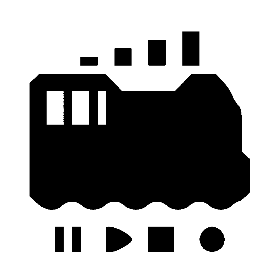
 
 
 
 
 
 
 
 
 

OPEN SOUND DATA MANUAL 
So verwenden Sie OPEN SOUND DATA 
rev.5 (Mar 1, 2020)
 
 
 
 

 

Inhaltsübersicht.

<!-- TOC -->

- [1. Was ist OPEN SOUND DATA?](#1-was-ist-open-sound-data)
  - [1.1. Einführung](#11-einführung)
  - [1.2. Nutzungsbedingungen](#12-nutzungsbedingungen)
  - [1.3. Warnung](#13-warnung)
  - [1.4. Liste der Sounddaten](#14-liste-der-sounddaten)
    - [1.4.1. Diesel- und diesel-elektrische Fahrzeuge](#141-diesel--und-diesel-elektrische-fahrzeuge)
    - [1.4.2. Lokomotive](#142-lokomotive)
    - [1.4.3. JNR/JR Limited Express Typ](#143-jnrjr-limited-express-typ)
    - [1.4.4. Japanische Staatsbahn, JR Commuter Modell, etc.](#144-japanische-staatsbahn-jr-commuter-modell-etc)
    - [1.4.5. Privatbahn](#145-privatbahn)
  - [1.5. Bereitschaft](#15-bereitschaft)
  - [1.6. Was Sie vorbereiten sollten](#16-was-sie-vorbereiten-sollten)
- [2. LokSound Decoder](#2-loksound-decoder)
  - [2.1. Wer ist ESU, der Entwickler?](#21-wer-ist-esu-der-entwickler)
  - [2.2. Geschichte von LokSound](#22-geschichte-von-loksound)
  - [2.3. LokSound 5-Serie](#23-loksound-5-serie)
  - [2.4. Warum LokSound verwenden?](#24-warum-loksound-verwenden)
- [3. Wie man den LokProgrammer benutzt](#3-wie-man-den-lokprogrammer-benutzt)
  - [3.1. Herunterladen und Installieren der LokProgrammer Software](#31-herunterladen-und-installieren-der-lokprogrammer-software)
  - [3.2. LokProgrammer starten](#32-lokprogrammer-starten)
  - [3.3. Anschließen des Schreibgeräts](#33-anschließen-des-schreibgeräts)
  - [3.4. Schreiben von offenen Sounddaten](#34-schreiben-von-offenen-sounddaten)
  - [3.5. Beschreibung der Klangbearbeitungsmaske](#35-beschreibung-der-klangbearbeitungsmaske)
  - [3.6. Was ist ein Sound-Slot?](#36-was-ist-ein-sound-slot)
  - [3.7. Ändern Sie die Funktionsnummer.](#37-ändern-sie-die-funktionsnummer)
- [4. Wie man einen Ton erzeugt](#4-wie-man-einen-ton-erzeugt)
  - [4.1. Einführung](#41-einführung)
  - [4.2. Vorbereitungen für die Aufnahme](#42-vorbereitungen-für-die-aufnahme)
  - [4.3. Tipps zur Aufnahme](#43-tipps-zur-aufnahme)
  - [4.4. Geräusche, die aufgenommen werden müssen](#44-geräusche-die-aufgenommen-werden-müssen)
  - [4.5. Tonbearbeitung und Rauschunterdrückung](#45-tonbearbeitung-und-rauschunterdrückung)
  - [4.6. Bearbeiten und Editieren von Laufgeräuschen](#46-bearbeiten-und-editieren-von-laufgeräuschen)
  - [4.7. Ausschnitt Abfahrtsglocke](#47-ausschnitt-abfahrtsglocke)
  - [4.8. Wie man VVVF zum Klingen bringt](#48-wie-man-vvvf-zum-klingen-bringt)
  - [4.9. Wie man einen Dieselsound macht](#49-wie-man-einen-dieselsound-macht)
  - [4.10. Wie man SpectraLayers verwendet](#410-wie-man-spectralayers-verwendet)
- [5. Montagemethode](#5-montagemethode)
  - [5.1. Hinweise zur Montage](#51-hinweise-zur-montage)
  - [5.2. Verwenden Sie die installierte Hilfsplatine](#52-verwenden-sie-die-installierte-hilfsplatine)
  - [5.3. DCC-Anschluss](#53-dcc-anschluss)
  - [5.4. AUX, HEAD, TAIL Verkabelung](#54-aux-head-tail-verkabelung)
    - [5.4.1. HEAD und TAIL im bipolaren Modus](#541-head-und-tail-im-bipolaren-modus)
    - [5.4.2. AUX, HEAD, TAIL (offener Kollektor) der DCC-Standard-Verdrahtungsmethode](#542-aux-head-tail-offener-kollektor-der-dcc-standard-verdrahtungsmethode)
  - [5.5. KATO HO (einzelne Zugwagen KUMOHA40, KIHA110, etc.)](#55-kato-ho-einzelne-zugwagen-kumoha40-kiha110-etc)
  - [5.6. KATO HO (Triebköpfe, Kiha80, etc.)](#56-kato-ho-triebköpfe-kiha80-etc)
  - [5.7. Tomix HO](#57-tomix-ho)
  - [5.8. Straßenbahn HO](#58-straßenbahn-ho)
  - [5.9. ENDO HO](#59-endo-ho)
  - [5.10. Dentetsu Kobo Kunststoff HO](#510-dentetsu-kobo-kunststoff-ho)
  - [5.11. N-Spur](#511-n-spur)
    - [5.11.1. KATO Baureihe 113](#5111-kato-baureihe-113)
    - [5.11.2. KATO C59 DCC Soundverarbeitung](#5112-kato-c59-dcc-soundverarbeitung)
- [6. Häufig verwendete Einstellungen](#6-häufig-verwendete-einstellungen)
  - [6.1. Häufig genutzte Lebensläufe konfigurieren](#61-häufig-genutzte-lebensläufe-konfigurieren)
  - [6.2. RailCom konfigurieren](#62-railcom-konfigurieren)
- [7. Spalte](#7-spalte)
  - [7.1. Wie man mit OPEN SOUND DATA anfängt](#71-wie-man-mit-open-sound-data-anfängt)
  - [7.2. Die Zukunft von OPEN SOUND DATA](#72-die-zukunft-von-open-sound-data)
  - [7.3. Begegnungen mit LokSound V3.5](#73-begegnungen-mit-loksound-v35)
- [8. Support](#8-support)
- [9. FAQ](#9-faq)
  - [9.1. Welche Hersteller-Zentrale kann ich betreiben?](#91-welche-hersteller-zentrale-kann-ich-betreiben)
  - [9.2. Werden Sie Sounddaten für Europa und die USA veröffentlichen?](#92-werden-sie-sounddaten-für-europa-und-die-usa-veröffentlichen)
  - [9.3. Können OPEN SOUND DATA in einen anderen Decoder als ESU geschrieben werden?](#93-können-open-sound-data-in-einen-anderen-decoder-als-esu-geschrieben-werden)
  - [9.4. Kann ich mit dem LokProgrammer Cantum usw. umschreiben?](#94-kann-ich-mit-dem-lokprogrammer-cantum-usw-umschreiben)
  - [9.5. Wie kann ich sicherstellen, dass ich den Decoder nicht kaputt mache?](#95-wie-kann-ich-sicherstellen-dass-ich-den-decoder-nicht-kaputt-mache)
  - [9.6. Ruckelndes Verhalten nach dem Schreiben von offenen Sounddaten.](#96-ruckelndes-verhalten-nach-dem-schreiben-von-offenen-sounddaten)
  - [9.7. Der Decoder funktioniert nicht, reagiert nicht oder ist ausgefallen.](#97-der-decoder-funktioniert-nicht-reagiert-nicht-oder-ist-ausgefallen)
  - [9.8. Kann man ihn mit einem PWM-Netzteil betreiben?](#98-kann-man-ihn-mit-einem-pwm-netzteil-betreiben)
  - [9.9. Was muss ich bei der Netzspannung tun?](#99-was-muss-ich-bei-der-netzspannung-tun)
  - [9.10. LokProgrammer schreibt Sounds nicht richtig.](#910-lokprogrammer-schreibt-sounds-nicht-richtig)
  - [9.11. Vom LokProgrammer geschriebene Sounds sind seltsam.](#911-vom-lokprogrammer-geschriebene-sounds-sind-seltsam)
  - [9.12. In ECoS2 wird die Adresse unerlaubt umgeschrieben.](#912-in-ecos2-wird-die-adresse-unerlaubt-umgeschrieben)
  - [9.13. Ich habe die Adresse verloren.](#913-ich-habe-die-adresse-verloren)
  - [9.14. Manche Adressen funktionieren bei manchen Zentralen nicht.](#914-manche-adressen-funktionieren-bei-manchen-zentralen-nicht)
  - [9.15. Ist es möglich, Sounddaten für LokSound5 in LokSoundV4 zu schreiben?](#915-ist-es-möglich-sounddaten-für-loksound5-in-loksoundv4-zu-schreiben)
  - [9.16. Ist es möglich, Sounddaten für LokSoundV4 in LokSound5 zu schreiben?](#916-ist-es-möglich-sounddaten-für-loksoundv4-in-loksound5-zu-schreiben)
  - [9.17. Die Lautstärke ist zu niedrig und ich möchte sie anpassen.](#917-die-lautstärke-ist-zu-niedrig-und-ich-möchte-sie-anpassen)
  - [9.18. Bitte stellen Sie Klangdaten für ________ bereit.](#918-bitte-stellen-sie-klangdaten-für-________-bereit)
  - [9.19. Kannst du es analog laufen lassen?](#919-kannst-du-es-analog-laufen-lassen)
  - [9.20. Sounddaten können nicht aus dem LokSound Decoder extrahiert werden](#920-sounddaten-können-nicht-aus-dem-loksound-decoder-extrahiert-werden)
  - [9.21. Es gibt viele verschiedene LokSound Produkte, welches ist das beste?](#921-es-gibt-viele-verschiedene-loksound-produkte-welches-ist-das-beste)
  - [9.22. Braucht man für die kommerzielle Nutzung mit offenen Sounddaten eine Lizenz bei ESU?](#922-braucht-man-für-die-kommerzielle-nutzung-mit-offenen-sounddaten-eine-lizenz-bei-esu)
  - [9.23. LokSoundV4, geschrieben vor über einem Jahr, funktioniert nicht und erzeugt keinen Sound.](#923-loksoundv4-geschrieben-vor-über-einem-jahr-funktioniert-nicht-und-erzeugt-keinen-sound)
  - [9.24. Brauche ich eine Genehmigung von der Bahn?](#924-brauche-ich-eine-genehmigung-von-der-bahn)
  - [9.25. Was sind die Urheberrechte für Tondaten?](#925-was-sind-die-urheberrechte-für-tondaten)
  - [9.26. Modellgeschäft und Modellhersteller.Wie können wir mit OPEN SOUND DATA Geschäfte machen?](#926-modellgeschäft-und-modellherstellerwie-können-wir-mit-open-sound-data-geschäfte-machen)
  - [9.27. Ich habe gehört, dass der LokProgrammer nicht für die kommerzielle Nutzung verfügbar ist?](#927-ich-habe-gehört-dass-der-lokprogrammer-nicht-für-die-kommerzielle-nutzung-verfügbar-ist)
- [10. Schließlich](#10-schließlich)
  - [10.1. Ersteller und Sound-Provider](#101-ersteller-und-sound-provider)
  - [10.2. Gruppen und Organisationen](#102-gruppen-und-organisationen)
  - [10.3. Urheberrecht/Copyright](#103-urheberrechtcopyright)
  - [10.4. MIT-Lizenz](#104-mit-lizenz)

<!-- /TOC -->

# 1. Was ist OPEN SOUND DATA?

## 1.1. Einführung

OPEN SOUND DATA ist ein Projekt zur kostenlosen Freigabe von DCC-Sounddaten im japanischen Stil für die in Japan relativ weit verbreiteten LokSound-Decoder von ESU, damit alle Anwender gemeinsam an der Förderung von DCC arbeiten können.

Es ist nicht völlig kostenlos, aber die Nutzungsbedingungen sind relativ locker, so dass Einzelpersonen, die das Konzept der offenen Sounddaten teilen, ohne Probleme davon profitieren können.

Wir haben auch Bedingungen, die es kleinen Modellbahngeschäften erlauben, mitzumachen, so dass sie offene Sounddaten nutzen können, um ihr Geschäft auf lange Sicht zu entwickeln.

Weitere Informationen finden Sie auf der OPEN SOUND DATA-Webseite.

OPEN SOUND DATA wird von Mitgliedern der DCC Electronic Arts Coalition und DesktopStation unabhängig betrieben und finanziert, in Zusammenarbeit und Kooperation mit DCC-Anwendern und -Clubs in Japan. Es besteht keine Kapital- oder Geschäftsbeziehung zu ESU Deutschland oder einem der in diesem Buch genannten Modellbahnhersteller.

OPEN SOUND DATA. 
https://desktopstation.net/sounds/.

## 1.2. Nutzungsbedingungen

Die Person, die die Tondaten herunterlädt oder die Datendatei erhält, oder die Person, die die Daten in den Decoder schreibt und verwendet, wird als "Nutzer" bezeichnet.

Durch das Herunterladen oder den Bezug der auf dieser Seite veröffentlichten Tondaten erklären Sie sich mit diesen Nutzungsbedingungen einverstanden.

Wenn Sie nicht zustimmen, dürfen Sie OPEN SOUND DATA nicht nutzen, wenn Sie die Nutzungsbedingungen bei der Nutzung von OPEN SOUND DATA-Daten nicht einhalten.Löschen Sie den Decoder und alle gespeicherten Daten sofort von Ihrem Computer oder Speichermedium.

- Sie mit dem Konzept und dem Zweck von OPEN SOUND DATA einverstanden sind oder damit sympathisieren.
- Keine Handlungen zu begehen, die dem Administrator dieses Dienstes, den Urhebern, anderen Nutzern oder sonstigen Dritten Nachteile, Schäden oder Unannehmlichkeiten verursachen können.
- Benutzer, die sich an die Nutzungsbedingungen halten, dürfen die Sounddaten auf dieser Seite kostenlos in ihre eigenen DCC-Decoder schreiben und verwenden.
- Wenn Sie diese Sounddaten selbst entgeltlich erhalten haben, oder einen geschriebenen Decoder oder ein damit ausgestattetes Fahrzeug für mehr als den Originalpreis, müssen Sie eine Rückerstattung vom Verkäufer verlangen.Sie sind außerdem verpflichtet, DesktopStation die Daten der Person mitzuteilen, die Ihre Sounddaten unrechtmäßig zu Verkaufszwecken verwendet hat.
- Sie dürfen die Sounddaten auf dieser Seite modifizieren, müssen sich aber mit DesktopStation in Verbindung setzen, wenn Sie die modifizierten Daten an nicht näher bezeichnete Personen weitergeben oder über das Web oder andere Medien weiterverbreiten wollen, mit Ausnahme der unten beschriebenen Leistungen von Modellbahngeschäften und Modellherstellern.Sie müssen auch die Nutzungsbedingungen unverändert anwenden.
- Es ist zulässig, den Decoder mit einem Schreibservice zu versehen und die geschriebenen Modelle zu verkaufen. Außerdem muss beim Verkauf oder bei der Erbringung von Dienstleistungen dem Kunden gegenüber deutlich gemacht werden, dass das Produkt auf der Basis von offenen Sounddaten erstellt wurde.
- Anwender (Firmen, Einzelunternehmer oder Privatpersonen), die Decoder mit freigegebenen Sounddaten beschreiben oder selbst Decoder oder mit Decodern ausgerüstete Fahrzeuge als Teil ihres Lebensunterhalts (Geschäft) verkaufen, müssen uns vor Beginn des Schreibdienstes benachrichtigen.Sie müssen sich mit DesktopStation in Verbindung setzen, um die (kostenlose) Erlaubnis einzuholen, den Arbeitsaufwand im Shop oder auf der Website deutlich angeben, wenn das Schreiben als bezahlte Dienstleistung erfolgen soll, und eine Gebühr in Höhe des Wertes der Sounddaten oder der Sounddaten selbst zahlen. Bitte beachten Sie, dass die Erlaubnis zur Nutzung von Sounddaten verweigert oder widerrufen werden kann, wenn die Vorgeschichte, der Ruf, die Kreditauskunft oder andere Informationen darauf hindeuten, dass die Nutzung der Sounddaten die Aktivitäten von DCC beeinträchtigen würde oder im Hinblick auf die öffentliche Ordnung und Moral unangemessen wäre.
- Direkte Links zu den Tondatendateien auf dieser Seite sind untersagt, es muss auf diese Seite verlinkt werden.
- Es ist untersagt, die Tondateien dieser Seite auf anderen Seiten zu vervielfältigen oder auf DVDs oder anderen Medien an eine unbestimmte Anzahl von Personen zu verteilen.
- Es ist verboten, in der Öffentlichkeit ohne Beweise auf die Illegalität von OPEN SOUND DATA selbst, verwandten Daten, Entwicklern, Mitarbeitern usw. hinzuweisen oder deren Aktivitäten zu behindern.
- Für den Fall, dass ein Anbieter oder Einzelunternehmer, der Sounddaten missbräuchlich verwendet, sich nicht bereit erklärt, eine Entschädigung für den Missbrauch zu leisten, erklären Sie sich beim Herunterladen oder Bezug der Daten damit einverstanden, dass Name, Adresse und Vertreter des Anbieters an einer nicht näher bezeichneten Stelle veröffentlicht werden.
- Auf das Urheberrecht an den Tondaten wird nicht verzichtet.
- Akzeptanz der Tatsache, dass für Fehlfunktionen, Unfälle oder Schäden, die durch die Sounddaten verursacht werden, keine Garantie übernommen wird.
- Es wird darauf hingewiesen, dass ein individueller Support nicht geleistet wird.
- Diese Nutzungsbedingungen können ohne vorherige Ankündigung oder Benachrichtigung geändert werden.

## 1.3. Warnung

Die hier veröffentlichten Geräuschdaten stehen in keinem Zusammenhang mit den genannten Eisenbahngesellschaften, Wagen oder anderen Abkürzungen oder Namen.Wenn ein markenrechtlich geschützter Name aufgeführt ist, gehört dieser Name der Firma, die die Markenrechte besitzt, und OpenSound Data steht in keiner Beziehung zu ihm.
Wir haben Klänge nach den Motiven der beschriebenen Fahrzeuge, Epochen und Atmosphären erstellt und viele Klänge von nicht realen Fahrzeugen und synthetische Klänge verwendet.

Um sicherzustellen, dass die OPEN SOUND DATA frei von Urheber- und Leistungsschutzrechten sind, wurden die Geräuschquellen von Mitarbeitern aufgenommen und unabhängig bearbeitet. Wir haben bei der Erstellung der Daten auch darauf geachtet, dass sie nicht mit der Verwendung der Zugmelodie, die ein gültiges Rechtsgut ist, oder einem Teil, der ein Markenzeichen der Eisenbahngesellschaft ist, in Konflikt geraten.

Der Fahrsound ist nicht strikt auf Beschleunigung und Abbremsung entsprechend der Echtzeit ausgelegt, sondern soll am Modell gut aussehen.Außerdem gibt es verschiedene Formate mit unterschiedlichen Details, vor und nach Updates usw., und der Sound wurde nicht mit Rücksicht auf alle erstellt.

>Das Urheberrechtsgesetz legt den Umfang und die Definition des Gegenstands des Urheberrechts klar fest.Nicht alle Klänge sind abgedeckt, und es gibt viele, die nicht beansprucht werden können.Zum Beispiel können Sie keine Rechte an Summern, Maschinengeräuschen, Warntönen oder allem, was nicht kreativ ist, rechtlich beanspruchen.Allerdings können andere Rechte als das Urheberrecht, wie z. B. benachbarte Rechte, die dem Aufnahmekünstler zustehen, relevant sein.Selbst in Fällen, in denen Rechte nach dem Gesetz anerkannt werden, sind der Zeitraum und die Frist für die Geltendmachung der Rechte festgelegt.Nach dieser Frist gehen die Rechte verloren und Dritte können sie frei verwenden.
>Diese Auslegungen werden im Internet von Patentanwaltskanzleien und Urheberrechtsverwaltungsorganisationen erläutert.Bitte informieren Sie sich selbst darüber.

- LokSound und LokProgrammer sind Marken der ESU electronic solutions ulm GmbH & Co KG, Deutschland.
- RailCom ist ein Warenzeichen der Lenz AG, Deutschland.
- Windows ist ein Warenzeichen der Microsoft Corporation.
- Andere Produkt- und Firmennamen sind Warenzeichen oder sonstige Rechte der jeweiligen Firmen.

## 1.4. Liste der Sounddaten

Die folgenden Sounddaten sind ab Dezember 2020 verfügbar.

### 1.4.1. Diesel- und diesel-elektrische Fahrzeuge

- Baureihe Kiha40 Diesel-Pkw
- Baureihe DML30HSE Kiha183
- DMH17 Baureihe Kiha82
- DML30HSE Baureihe Kiha181
- DMH17C Vertikalmotor (Allzweck) Kiha10/20/55 usw., Kominato Kiha200
- DMH17H Horizontalmotor (Allzweckmotor) Kiha81/82/58/52/45/35/23/28 usw., Meitetsu Kiha8000
- DMF15HSA (Allzweckmotor) Kiha40, 47, 48, etc., Kiha183/184
- DMF15HSA späte Einmann-Spezifikation (general-purpose)
- DMF13HZA Kiha261
- DMF13HZA Kiha110
- NTA-855-R-1 Kiha110
- SA6D125H HOT7000-Serie
- SA6D125H Baureihe Kiha120
- SA6D125H Baureihe Shikoku 2000, N2000
- SA6D140HE Serie Kiha E130, Serie Kiha E120
- NTA-855-R-1 Baureihe Kiha75
- NTA-855-R-1 Kiha85 Serie * Auch geeignet für Meitetsu Kiha8500 Serie und Aizu Kiha8500 Serie.

### 1.4.2. Lokomotive

- Dampflokomotive JNR 8620
- JNR 9600 Dampflokomotive
- JNR C56,C12 Dampflokomotive
- JNR C58 Dampflokomotive
- JNR C57,C59 Dampflokomotive
- JNR D51 Dampflokomotive
- JNR C61 Dampflokomotive
- JNR C62 Dampflokomotive
- JNR DE10 Diesellokomotive
- JNR Elektrolokomotive Klasse EF81 für Wechsel- und Gleichstrom
- Gleichstrom-Elektrolokomotive der Klasse JRF EH200
- Die Eisenbahn in Oigawa, Japan Diesellokomotive DD20

### 1.4.3. JNR/JR Limited Express Typ

- MT54, Japanese National Railways Express, Limited Express Type 165, 183 Series, etc.
- JNR Serie 781 AC Limited Express Zug
- JNR Serie 381 DC Limited Express-Zug
- JRE Serie E257-0 VVVF DC begrenzter Schnellzug
- JRE Serie E259/E657 VVVF DC-Expresszug/AC-Expresszug
- JRE Baureihe E353 VVVF DC Limited Schnellzug
- JRW Limited Expresszug der Baureihen 683 und 289
- JRW Serie 285 Begrenzter Schnellzug "Sunrise Express" (Toshiba-IGBT/Mitsubishi-IGBT)
- JRC Baureihe 373, 383 (Toshiba GTO VVVF)
- JRE Baureihe E5 Shinkansen
- JRW Baureihe 500 Shinkansen
- JRW/JRC Baureihe N700A Shinkansen
- JRW/JRC Serie 700 Shinkansen

### 1.4.4. Japanische Staatsbahn, JR Commuter Modell, etc.

- Alte Kokuden-Typen (hängend) KUMOHA12,40 usw.
- 4 Typen von alten Landaufhängungen (TDK-528, TDK-544, HS-266-A, DK-91B)
- MT54, JNR Vororttyp 113, 115er Serie, 185er Serie, etc.
- Japan National Railways(JNR) Serie 211/213 Gleichstromzug
- Japanische Staatsbahn (JNR) Baureihe 205-5000 (Toyo IGBT VVVF)
- Japanische Staatsbahn (JNR) Baureihe 209
- Baureihe E231
- Baureihe E233 - Nahverkehrstyp
- Baureihe E233 - Vororttyp
- Baureihe E235 Commuter-Typ
- JRW Baureihe 207-1000 Toshiba GTO VVVF
- JRW-Baureihe 221 Feldchopper
- JRW-Baureihe 223 Hitachi IGBT VVVF
- JRW-Baureihe 223 Mitsubishi IGBT VVVF
- JRW-Baureihe 223 Toshiba IGBT VVVF
- JRW Baureihe 225 Toyo IGBT VVVF
- JRW Baureihe 321 Toyo IGBT VVVF

### 1.4.5. Privatbahn

- Tokyu Baureihe 1000
- Tokyu Baureihe 8500
- Tokyu Baureihe 7200 & Toyotetsu Baureihe 1800 Toyo-Wagen
- Tokyu Serie 5050, Serie 5000 *In der Entwicklung
- Tokyu Serie 2020, Serie 6020, Serie 3020 *Unter Entwicklung
- Tokyu und Izu Express Baureihe 8000
- IZUKYU Baureihe 100 KUMOHA100
- Keio 1000er Serie Hitachi 2 Level IGBT VVVF
- Keio 1000er Reihe TOYO IGBT VVVF
- Keio 1000er Serie(2. Generation) Toyo GTO VVVF
- Keio Baureihe 5100 TDK-544
- Keio Serie 3000 Feld-Chopper Auto
- Keikyu Typ 600 Toyo GTO VVVF
- Keikyu New 1000 Series 1033F Siemens GTO VVVF (Doremifa Inverter) *Auch für 2100 Series erhältlich.
- Keikyu New 1000 Series Stil Toyo IGBT VVVF *In Entwicklung
- Keisei Typ 3700 Toyo GTO VVVF
- Tobu Baureihe 8000
- Tobu Baureihe 6050
- Tobu Serie 500 VVVF Limitierter Schnellzug
- Tobu Baureihe 7800 Typ TDK-544
- Tobu Baureihe 3000 DK-91B
- Tobu Baureihe 3050 HS-266-A
- Tobu Baureihe 3070 TDK-528
- Tobu Baureihe 5050 TDK-544
- Tobu Baureihe 5700 TDK-528
- Hankyu Baureihe 8300 Toyo GTO VVVF
- Kintetsu Limited Express Train MB3127 Early Type General Purpose Sound  (Für Serie 12000,12200,12400,12410,12600,30000)
- Kintetsu Limited Express Train MB3127 Late Type General Purpose Sound  (Für die Serien 12200,12400,12410,12600,30000)
- Kintetsu Serie 22000 Mitsubishi GTO VVVF Limited Express Train
- Kintetsu Serie 22600 und 21020 Mitsubishi IGBT VVVF limitierte Schnellzüge, *in Entwicklung
- Kintetsu widerstandsgesteuerte Nahverkehrswagen  (Serie 1800,1810,2400,2410,2430,2444,2600,2610,2800)
- Kintetsu Serie 1000 Typ TDK-544
- Shizuoka A3000 *Unter Entwicklung
- Shizuoka 1000 *Unter Entwicklung
- Nagano Elektrische Eisenbahn Serie 2000

## 1.5. Bereitschaft

OPEN SOUND DATA ist keine einfache oder leichte Aufgabe, es erfordert ein gewisses Maß an Wissen und Studium, um es zu benutzen, da es sich um ein System handelt, das von digitalen Modellbahnen mit DCC genutzt werden kann.Sie werden auch viele Ausfälle erleben.

Aus diesem Grund ist OPEN SOUND DATA nicht für jedermann geeignet und auch nicht so einfach, dass es jedem Spaß macht.Es ist für Leute, die ihre Modellbahn mit noch nie dagewesenen Gimmicks aufpeppen wollen, oder die Geräusche machen wollen, oder die einen automatischen Betrieb oder eine Computersteuerung wünschen.

Um die Ausrüstung mit einem schmalen Budget zu beschaffen, musste ich sie aus Modellbahngeschäften in Europa und den Vereinigten Staaten importieren, wobei ich meine Englischkenntnisse einsetzen musste.Wenn etwas schief geht, müssen Sie mit dem ausländischen Geschäft per E-Mail kommunizieren.Auch dafür müssen Sie genügend Zeit haben.

Wenn Sie denken, dass Sie so etwas nie machen können, dass es zu schwierig ist, oder dass Sie nicht versagen wollen, dann werden Sie nie in der Lage sein, offene Sounddaten zu benutzen.Wenn Sie sich Sorgen machen, dass Sie Fehler bedauern könnten, würde ich Ihnen empfehlen, ein analog-orientiertes System oder ein anderes Soundsystem statt DCC oder offene Sounddaten zu benutzen.

Auf der anderen Seite, wenn Sie eine positive Einstellung haben, dass Scheitern dazu dient, Ihre Fähigkeiten zu verbessern, dass Sie keine Hürde beim Lernen empfinden und dass Sie Gimmicks und Klänge intensiver genießen wollen, kann OPEN SOUND DATA eine große Hilfe sein.

Sind Sie bereit, mit OPEN SOUND DATA in Berührung zu kommen?Wenn Sie bereit sind, fahren Sie mit dem nächsten Kapitel fort.

## 1.6. Was Sie vorbereiten sollten

OPEN SOUND DATA geht davon aus, dass Personen, die bereits eine DCC-Zentrale etc. besitzen, diese nutzen werden.

* Windows 10 PC (auch ein preiswerter ist in Ordnung)
* LokProgrammer Software (nur Windows)
* LokProgrammer Hardware-Einheit (ESU 53451 oder 53452)
* Decoderprüfgerät (z. B. ESU oder LaisDcc) oder Fahrzeug mit LokSound5
* LokSound5 Decoder (siehe unten)
* Netzadapter (z.B. 12V/2A)

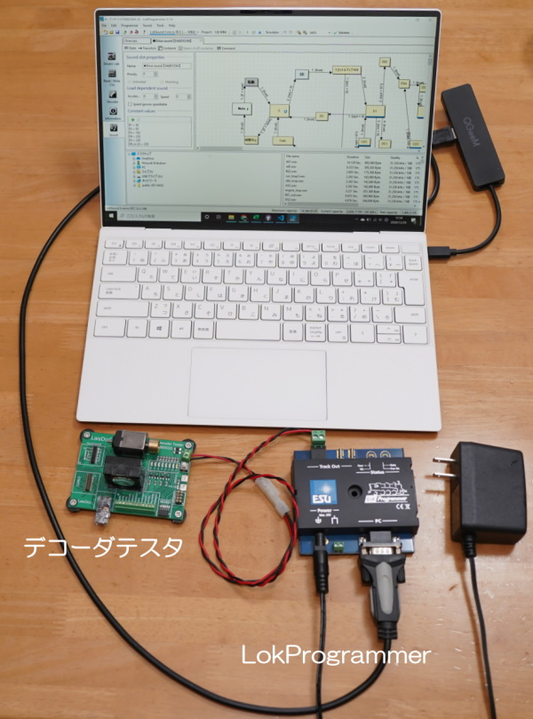

# 2. LokSound Decoder

## 2.1. Wer ist ESU, der Entwickler?

ESU wurde 1998 gegründet und hat seinen Hauptsitz in Ulm, Deutschland. Der offizielle Name des Unternehmens ist Electronic Solutions Ulm, und sein Akronym ist ESU Inc.

Sie war früher ein OEM-Hersteller von Merklins Steuergeräten und Decodern, und zu Zeiten der Central Station 1 (CS1) war sie manchmal mit ESU ECoS1 gemeinsam.

Ab 2020 scheinen sie nicht mehr als OEM-Hersteller für Merkurin aktiv zu sein, aber sie bieten OEM-Dienstleistungen für kleine und mittlere Modellhersteller an und vertreiben mit ihren technischen und finanziellen Ressourcen originale Modellbahnwagen deutscher Bauart unter der Marke ESU.

Die Produkte von ESU sind für ihre für deutsche Firmen typische Stabilität bekannt und gehören zu den DCC-Herstellern, die man bedenkenlos einsetzen kann, da sie nicht die Kompatibilitätsprobleme haben, die früher in Japan, wo man von Inkompatibilitäten zwischen Herstellern nicht so viel hörte, ein Problem waren.

In Japan gibt es mehrere Distributoren, die Produkte wie Zentralen, Decoder und Modellfahrzeuge (HO) anbieten. Gerade die Fahrzeuge sind bekannt für ihre von Anfang an eingebauten, auffälligen Gimmicks wie Sound, Abkuppeln/Auf- und Abfahren, Dampf und Beleuchtung.

## 2.2. Geschichte von LokSound

Das erste Produkt, das 1999 auf den Markt kam, war der LokSound 1 (classic), der mit 43mm x 16mm als klein beschrieben wird, gefolgt vom LokSound2 mit 1Mbit bis 3Mbit ROMs, anfangs 44mm x 19,5mm groß, dann immer kleiner mit höherer Kapazität bis 36mm x 15,5mm.

>http://www.esu.eu/produkte/fruehere-produkte/fruehere-loksound-decoder/

Ich glaube, es war der LokSound2 (2001), der in Japan eingeführt wurde. Zu dieser Zeit schien er wegen seiner kleineren Größe als der SOUNDTRAXX geschätzt zu werden. 2005 kommt dann der LokSound 3 heraus.

LokSound V3.5 wurde in Zeitschriften und Büchern in Japan vorgestellt, und einige Leute haben es von Modellgeschäften, die es importieren und verkaufen, oder durch persönlichen Import erhalten, und es wurde unter DCC-Sound-Benutzern wegen seiner Fähigkeit, Sounddaten in Blockdiagrammen zu erstellen, beliebt.

Mit der Einführung von LokSound V4 im Jahr 2011 wurden die Beschränkungen bei der Speicher- und Soundprogrammierung deutlich gelockert, was die Erstellung von Sounddaten auf einem Niveau ermöglichte, das näher an die heutige Form heranreicht.Ich musste umlernen und umlernen, aber dafür konnten wir verschiedene Szenen mit hoher Soundqualität wiedergeben.

Im Jahr 2021 wird eine aktualisierte Version des LokSound 5 erscheinen, darunter die Nano-Serie mit erweiterten Funktionen und einer kleineren Größe sowie eine KATO DCC-kompatible Serie.

|Name |Zeitraum |Funktionen|
|:----|:---|:-----|
|LokSound 1 | 1999 | LokSound classic genannt.  |
|LokSound 2 | 2002 |ROM mit hoher Kapazität (1Mbit -> 3Mbit), es gibt auch OEM-Produkte für Roco.  |
|LokSound 3 | 2005 | 16Mbit großes ROM, mfx(M4)-Unterstützung.Anzahl der gleichzeitigen Sounds: 4 Kanäle.|
|LokSound 3.5 | 2006 | 16Mbit großes ROM, 4 Kanäle gleichzeitiger Sound.|
|LokSound 4| 2011 | Große Fortschritte in der Soundprogrammierung, 32MBit großvolumiges ROM, 8 simultane Soundkanäle.|
|LokSound 5 | 2019 | schnellere Schreibgeschwindigkeit, Micro-Serie vereinheitlicht in Next18, ROM mit großer Kapazität 128MBit, 10 gleichzeitige Soundkanäle.|
|LokSound 5 (Update) | 2021 | Nano-Serie jetzt verfügbar, DCC-freundlich, 12 simultane Kanäle.|

## 2.3. LokSound 5-Serie

Die LokSound-5-Serie wurde im Januar 2019 angekündigt und besteht aus drei verschiedenen Plattformen, die in ihrer Klassifizierung gleich geblieben sind, aber Verbesserungen wie Downsizing erfahren haben.

Die interne Leistung ist im Wesentlichen gleich, die Hauptunterschiede sind der Ausgangsstrom des Motors und die Anzahl der Hilfssignale.Die offenen Sounddaten sind so ausgelegt, dass sie mit allen LokSound 5 Serien kompatibel sind, so dass selbst wenn die Daten z.B. auf Micro eingestellt sind, sie problemlos auf die unmarkierte Version geschrieben werden können.

Auch die interne Architektur hat sich stark verändert, von den alten ATMEL AVR-Mikrocontrollern zu den leistungsfähigeren ARM-Mikrocontrollern der SAMD-Serie von Microchip, im Detail ATSAMC21G17A (ARM Cortex-M0+ 48MHz, FLASH 128KB, RAM 16KB) mit externem winbond W25Q128JV 16MB (128MBit) externem SPI FLASH) und DC/DC-Wandler.

In Bezug auf die Leistung wurde die Anzahl der gleichzeitigen Tonkanäle auf 10 verbessert und die Tonqualität von 16000 Hz auf 32500 Hz stark verbessert.Interne Benutzervariablen und Shift-Variablen wurden ebenfalls hinzugefügt, um den Ausdrucksbereich der Tondaten zu erweitern.Darüber hinaus wurde die Schreibgeschwindigkeit der Tondaten um den Faktor 2 verbessert, so dass die Schreibzeit für den Ton je nach Daten von mehr als 30 Minuten auf etwa 10 Minuten reduziert werden kann, was die Entwicklungseffizienz verbessert.

Merklin Motorola mfx (der Name der Zwei-Wege-Modell-Kommunikationstechnologie von Merklin, auch bekannt als M4) für Amerika und Ozeanien.Eine reine DCC-Version ist zu einem niedrigeren Preis erhältlich, bei der die Funktionen vonDies ist vermutlich eine Preisstrategie, um mit anderen führenden Sound-DCC-Herstellern in den USA, wie Soundtraxx und Digitrax, zu konkurrieren.Außerdem unterscheidet sich die Einheit der Beschleunigungs-/Verzögerungszeit von der europäischen und globalen Version und kann sehr lang eingestellt werden.

|Art.Nr.|Name|Skala|Kapazität|Erläuterung|
|:---|:--------|:----|:----|:--------------|
|58410,58412,58416,58419 |LokSound 5 | HO, O |1.5A| sog. unmarked.|
|58420,58429 |LokSound 5 DCC | HO, O |1.5A| sog. unmarked.Produkte für Amerika und Ozeanien, keine Unterstützung für mfx, MM2, etc.Dafür ist es ca. 10% günstiger.Der Lautsprecher ist nicht enthalten.|
|58810,58813,58816,58818 |LokSound 5 micro | N | 0.75A| Ultra-kompakt, Next18 Stecker Standard.|
|58820, 58823, 58828 |LokSound 5 micro DCC | N | 0.75A| Ultra-kompakt mit Next18 Stecker Standard.ca. 10% höher als unmarkiert.Produkte für Amerika und Ozeanien, keine Unterstützung für mfx, MM2, etc.dafür ist es ca. 10% günstiger.der Lautsprecher ist nicht enthalten.|
|58315 |LokSound 5 L| O, G| 3.0A| Hohe Motorleistung, für O, G Spurweiten. |
|58325 |LokSound 5 L DCC| O, G| 3,0A| Leistungsstarker Motorausgang, Produkte für Amerika und Ozeanien. Der Lautsprecher ist nicht im Lieferumfang enthalten.
|58513,58515 |LokSound 5 XL| O, G| 4,0A| Motorleistung mit sehr hoher Kapazität. |
|58731| LokSound 5 micro DCC Direct Kato Japan| N | 0,9A| DCC-freundlich, für KATO.|
|58741| LokSound 5 micro DCC Direct Kato USA| N | 0,9A | für Lokeinbau|
|58721| LokSound 5 micro DCC Direct unmarkiert| N |0,9A | für Lokeinbau
|58923| LokSound 5 Nano DCC| z,N,TT|0.9A|Ultra Small LokSound5|
|58210| LokSound 5 Fx DCC/MM/SX/M4|HO| - |8-polig NEM652, günstigere Version ohne Motorfunktionen|
|58219| LokSound 5 Fx DCC/MM/SX/M4|HO| - |21MTC, günstigere Version ohne Motorfunktionen|

Der Größenunterschied zwischen micro(N) und unmarked(HO) im LokSound5 Decoder ist unten dargestellt.

|micro|unmarked|
|:--- |:----|
||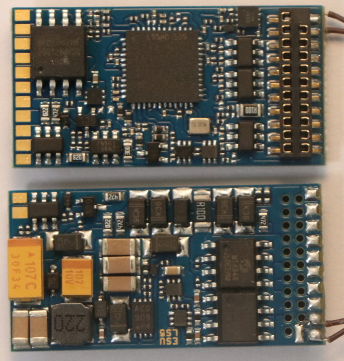|

## 2.4. Warum LokSound verwenden?

Der Grund, warum OPEN SOUND DATA den LokSound-Decoder von ESU verwendet, ist, dass er die einzige ideale, gut vorbereitete Plattform für die Entwicklung von Sounddaten ist.

Die folgenden drei Punkte sind die Hauptgründe.

- Eine Umgebung, in der Sounddaten einfach auf einem PC entwickelt werden können (Sounddaten-Entwicklungstools werden bereitgestellt)
- Die Leistung des Sounddecoders, die Klangqualität und die Stabilität des Betriebs sind gewährleistet.
- Es gibt mehr als eine bestimmte Anzahl von Anwendern, die es in Japan benutzen.

Digitrax und ZIMO bieten ebenfalls Soundentwicklungsumgebungen an, aber sie erfüllen diese drei Anforderungen nicht vollständig.Auch in Bezug auf die Verfügbarkeit hat Digitrax eine gute Verfügbarkeit, da KATO der Distributor ist, aber nicht alle ihre Produkte sind verfügbar.Die Verfügbarkeit von ZIMO-Sounddecodern ist sehr schlecht und der Import ist die erste Wahl.

Das Konzept der offenen Sounddaten funktioniert nicht, wenn die Daten nur von Profis bearbeitet und angepasst werden können; ZIMO und Digitrax liegen in Form von Skripten vor, die eingegeben und implementiert werden können, was eine große Hürde bei der Erstellung von Sounddaten darstellt.

Die Produkte von ESU sind in der Regel teurer, aber in Anbetracht des unnötigen Ärgers und der Instabilität ist die Gesamtzufriedenheit meiner Meinung nach definitiv besser.
Da auch der Preisunterschied bei Einzelimporten nicht so groß ist, gehen wir davon aus, dass die LokSound5-Serie von ESU für OPEN SOUND DATA verwendet wird.

Und seit etwa 2001 hat der LokSound in Japan Anwender, und zur Zeit des LokSound V3.5 war er so weit verbreitet, dass er in Zeitschriften und Büchern vorgestellt wurde.Die LokProgrammer-Software hat sich seither weiterentwickelt, aber die LokProgrammer-Hardware, also das Schreibgerät, hat sich nicht verändert und kann so verwendet werden.

# 3. Wie man den LokProgrammer benutzt

In diesem Abschnitt möchte ich die am häufigsten genutzten Funktionen des LokProgrammers zusammenfassen und zeigen, wo sie zu finden sind.LokProgrammer heißt genau so, aber es gibt zwei Arten von Schreibgeräten (Hardware, ESU) und Editier-/Schreibsoftware (Software).Beide werden in Sets verwendet, also verwechseln Sie die beiden nicht.

## 3.1. Herunterladen und Installieren der LokProgrammer Software

Laden Sie die LokProgrammer Software (kostenlose Software) von der ESU-Seite herunter und installieren Sie sie.

> LokProgrammer
> http://www.esu.eu/en/downloads/software/lokprogrammer/

Bitte beachten Sie, dass die Hardware LokProgrammer (ESU 53451 oder 53452) nicht notwendig ist, wenn Sie das Programm nicht schreiben oder testen wollen, sondern nur einen Computer benötigen.

## 3.2. LokProgrammer starten

Unmittelbar nach dem Start sieht der Bildschirm wie folgt aus.Wenn Sie eine OPEN SOUND DATA Datei öffnen, können Sie auf verschiedene Funktionen zugreifen.Sie können eine neue Datei erstellen, aber das ist schwieriger, daher ist es besser, eine bestehende Datei zu verwenden.

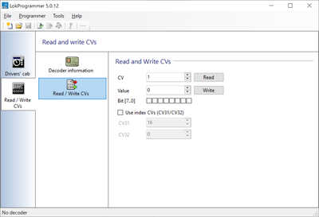

Wenn Sie z. B. den Sound von Kiha110 öffnen, sieht es wie folgt aus

>Sounddaten Kiha110 öffnen  
>https://desktopstation.net/sounds/osd25.html

In den Registerkarten auf der linken Seite wurden verschiedene Dinge hinzugefügt, die wie folgt erklärt werden.

## 3.3. Anschließen des Schreibgeräts

Das Schreibgerät des LokProgrammers dient dazu, Geräusche und Einstellungen in den LokSound Decoder zu schreiben, der zwischen PC und Decoder angeschlossen wird.

Auf dem per USB-Kabel anzuschließenden Schreibgerät LokProgrammer muss der USB-Seriell-Treiber von FTDI installiert sein.Normalerweise wird die Software beim Einstecken des USB-Kabels automatisch installiert und es ist keine besondere Bedienung erforderlich, aber in manchen Umgebungen wird die Software möglicherweise nicht automatisch installiert.

In diesem Fall müssen Sie den USB-Seriell-Treiber von FTDI vorher selbst herunterladen und installieren.Sie können herausfinden, wie man ihn installiert und überprüft, indem Sie danach suchen.

> FTDI's USB-Treiber Seite 
> https://www.ftdichip.com/Drivers/VCP.htm

Bitte beachten Sie, dass das Gerät nicht allein durch das Anschließen des USB-Kabels funktioniert; es wird nicht richtig erkannt oder geschrieben, wenn das Netzteil nicht angeschlossen ist.

Wenn Sie vergessen haben, das Netzteil anzuschließen, das USB-Kabel anzustecken oder beides, erscheint folgende Meldung, wenn Sie versuchen, Sounddaten im LokProgrammer zu schreiben.

AC-Adapter sind in Ordnung, solange sie mit der Φ2,5mm DC-Buchse kompatibel sind und 12V-16V betragen. Im Folgenden finden Sie eine Liste von Adaptern, die von Akizuki Electronics verkauft werden und die ebenfalls bestätigt wurden, dass sie mit dem LokProgrammer funktionieren. Bitte beachten Sie, dass ESU dieses Produkt nicht unterstützt, daher verwenden Sie es auf eigene Gefahr.

|Hersteller| Modell| Spezifikationen| Verkaufsort| Bemerkungen
|:------------------|:--------|:-----|:------|:------|
|GO FORWARD ENTERPRISE|GF48-US1240 |DC12V/4A |Akizuki Denshi M-00244 |Für Z,N,HO
|GO FORWARD ENTERPRISE|GF65I-US1640|DC16V/4A |Akizuki Denshi M-00407 |Für HO
|Adaptertechnik|STD-12020U|DC12V/2A|Akizuki Denshi M-06239| für Z,N,HO
|XIAMEN UME ELECTRONICS|AD-D120P200|DC12V/2A|Akizuki Denshi M-10659 Z|Für N,HO

Ich habe einen alten LokProgrammer und er funktioniert nicht unter Windows 10!Der USB-Seriell-Adapter von Akizuki Denshi kann so verwendet werden, wie er ist.Dies ist derselbe, der mit dem neuesten LokProgrammer geliefert wird.Es wird empfohlen, den AC-Adapter bei Akizuki Electronics mitzukaufen.

>USB-Serienadapter von Akizuki Electronics. 
>http://akizukidenshi.com/catalog/g/gM-08343/

## 3.4. Schreiben von offenen Sounddaten

Laden Sie im LokProgrammer die offenen Sounddaten vor, entpacken Sie die zip-Datei und öffnen Sie die esux-Datei.
Wenn das Schreibgerät LokProgrammer mit dem USB-Kabel verbunden ist und das Netzteil an die Stromversorgung angeschlossen ist, drücken Sie das Symbol der folgenden Hinweise, um die Sounddaten und CV-Einstellungsdaten zu schreiben.

Beachten Sie, dass bei einer alten Firmware des LokSound Decoders die Firmware vor dem Schreiben der Sounddaten geschrieben wird.In diesem Fall verlängert sich die Schreibzeit um einige Minuten, aber nach dem Update der Firmware wird der Schreibvorgang bei gleicher LokProgrammer Version nicht mehr durchgeführt.In einigen Fällen wird die Firmware aktualisiert.

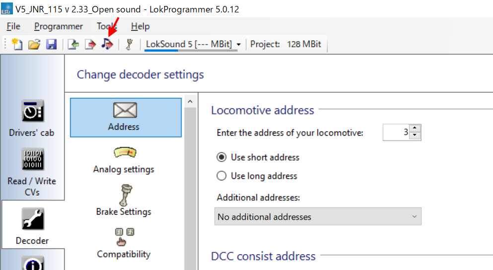

Mit der Schaltfläche Schreiben auf dem Dokumentensymbol können Sie den Datensatz im Register Decoder schreiben.

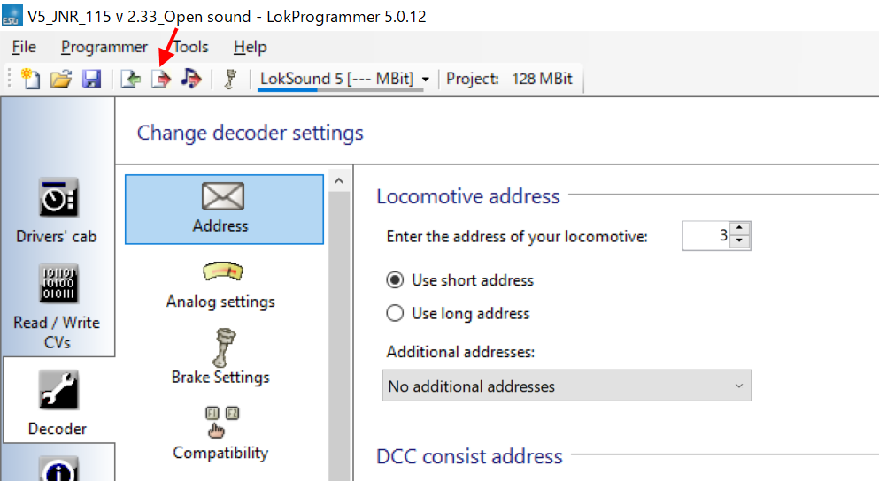

Wenn die Verbindung mit dem Decoder nicht funktioniert, wird eine Fehlermeldung angezeigt.Überprüfen Sie, ob die Zuleitungsdrähte angeschlossen sind, ob es keine gebrochenen Drähte gibt und ob es keinen Verdrahtungsfehler oder schlechten Kontakt zwischen den Rädern und den Schienen gibt, wenn sie an einem Fahrzeug montiert sind.

Bitte beachten Sie, dass die meisten der offenen Sounddaten für die LokSound 5 Serie sind, und obwohl es eine Mischung aus Daten gibt, die mit LokSound 5 und LokSound 5 micro erstellt wurden, werden diese automatisch für die LokSound 5 Serie konvertiert.Ich kann sie ohne Probleme beschreiben.

Allerdings können Sounddaten für den LokSound 5 nicht auf Decoder der LokSound V4-Serie geschrieben werden.Auch ist es nicht möglich, Sounddaten aus dem Decoder zu lesen. Es kann nur der eingestellte Wert abgerufen werden.

## 3.5. Beschreibung der Klangbearbeitungsmaske

Klicken Sie auf die Registerkarte "Sound", und Sie sehen einen Bildschirm wie den unten abgebildeten, den Sie am häufigsten für die Soundbearbeitung verwenden werden.

## 3.6. Was ist ein Sound-Slot?

LokSound5 kann Klänge gleichzeitig über bis zu 10 Sound-Slots abspielen.
Verschiedene Geräusche können dem Klang des MG, des Gebläses und dem Laufgeräusch überlagert werden, um den Klang und die Situation besser wiederzugeben.

Verschiedene Geräusche können individuell in den Sound-Slots registriert werden und je nach Bedingungen ertönen, um die Bewegung des Fahrzeugs auszudrücken. Im Folgenden finden Sie ein Beispiel für einen VVVF-Sound-Slot.

Beachten Sie, dass *nur ein Sound gleichzeitig* in einem einzelnen Sound-Slot abgespielt werden kann.Wenn der Sound-Slot mit dem Abspielen fertig ist, können Sie zum nächsten Block übergehen, um einen anderen Sound abzuspielen.Wenn Sie also mehr als einen Sound gleichzeitig abspielen wollen, können Sie die Funktion so einstellen, dass sie jedem Block andere Sound-Slots zuordnet, und sie verwenden, um andere Sound-Slots aufzurufen, um sie abzuspielen.

## 3.7. Ändern Sie die Funktionsnummer.

Wenn Sie die vordefinierten Funktionsnummern (F0, F1, F2, etc.) in den geöffneten Klangdaten ändern möchten, zeigt Ihnen der LokProgrammer, wie Sie das tun können.

Öffnen Sie zunächst die Klangdaten der geöffneten Klangdaten, die Sie ändern möchten, im LokProgrammer.

Klicken Sie auf der Registerkarte "Decoder" auf "Funktionszuordnung", um eine Liste der Funktionen aufzurufen. Dieser Bildschirm ist ein wichtiger Einstellungsbereich, in dem Sie Klangfunktionen, Hilfsausgänge und interne Sonderfunktionen frei mit Funktionsnummern belegen können.

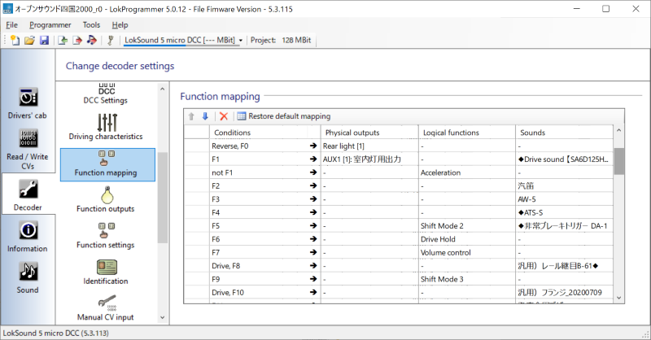

Drücken Sie das Pull-Down auf die Funktionsnummer, die Sie ändern möchten, und Sie sehen "Fahren", "Richtung" und viele andere.Die folgende Tabelle zeigt die Erklärung.

|Elementname| Erklärung |
|:---|:---|
|Fahren| Fahren oder angehalten?
|Direction| Ob die Fahrtrichtung Fwd oder Rev ist.
|F0| Funktion 0 (F0) Einstellung oder
|F1| Funktion 1 (F1)-Einstellung oder
|F2-F28| Funktion 2 (F2) bis F28 oder

Der aktuelle Bildschirm ist unten abgebildet.

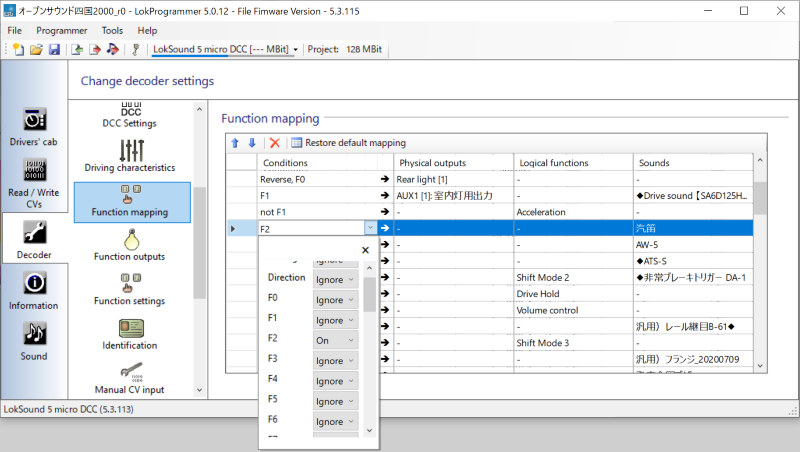

Jede Funktionsnummer kann aktiviert oder deaktiviert werden.Es ist auch möglich, mehrere Funktionen miteinander zu verbinden und Bedingungen zu trennen.Sie können die Bedingungen auch danach unterteilen, ob das Fahrzeug fährt oder nicht und in welche Richtung es fährt.

Bei den Einstellungen können folgende Punkte ausgewählt werden, deren Bedeutung wie folgt ist

|Ausgewählter Punktname| Erklärung |
|:---|:---|
|Ignore | Ignorieren (deaktivieren)
|Ein | Wirksam, wenn diese Funktionsnummer eingeschaltet ist.
|Aus | gültig, wenn diese Funktionsnummer ausgeschaltet ist
|Ja | Gültig nur für Fahrartikel | Wirksam, wenn diese Funktionsnummer eingeschaltet ist.
|Gültig nur für Nein | Fahrende Elemente.Gültig, wenn das System gestoppt ist.|
|Gültig nur für die Elemente Vorwärts | Richtung.Wirksam, wenn die Fahrtrichtung vorwärts ist.
|Rückwärts | Gültig nur für das Element Richtung.Wirksam, wenn die Fahrtrichtung rückwärts ist.

Normalerweise müssen Sie nur Ein einstellen, aber wenn Sie z. B. die Umschaltblinklichter einer elektrischen Lokomotive nachbilden wollen, müssen Sie die Bedingungen einstellen, um die Fahrtrichtung und andere Funktionszustände beim Betrieb mehrerer Hilfssignale zu berücksichtigen.
Sie können verschiedene Bedingungen einstellen, um die Bewegung der Funktion, die Sie erstellen möchten, zu berücksichtigen.

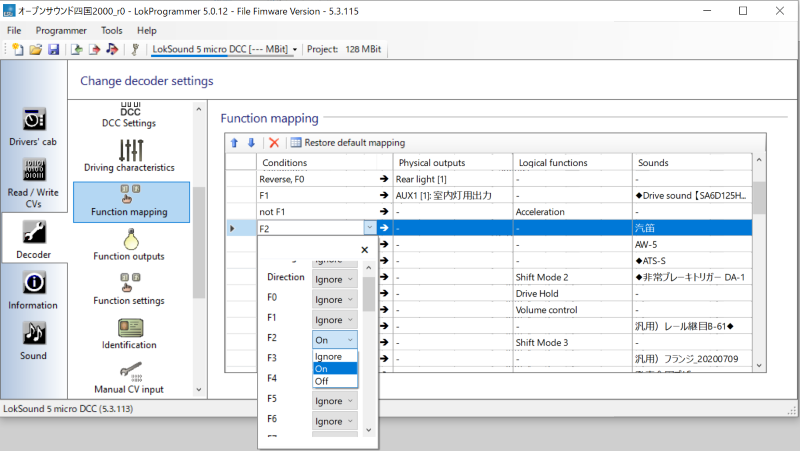

Nachdem Sie die Einstellungen für die Funktionszuordnung abgeschlossen haben, verwenden Sie die Schaltfläche Nur Einstellungsdaten schreiben unten, um die Daten in den Decoder zu schreiben.Die Sounddaten werden nicht geschrieben (oder verändert), und der Schreibvorgang wird sofort beendet.Wenn Sie mit Sounddaten schreiben möchten, wählen Sie das Notensymbol rechts, um sowohl die geänderten Funktionszuordnungsdaten als auch die Sounddaten zu schreiben. Dies kann 10 Minuten oder mehr dauern, haben Sie also bitte etwas Geduld.

# 4. Wie man einen Ton erzeugt

## 4.1. Einführung

In diesem Abschnitt führe ich auf, was Sie zum Erstellen von Sounds benötigen, wie Sie Ihre Ausrüstung zusammenstellen (oder importieren) und welche Mittel und Tipps Sie für die Aufnahme benötigen.Sie benötigen folgende Dinge

<strong>Was Sie für die Bearbeitung benötigen:</strong>
* Windows-PC (für Mac-Benutzer verwenden Sie bitte Bootcamp, Parallels oder eine andere virtuelle PC-Software)
* <a href="http://www.esu.eu/en/downloads/software/lokprogrammer/" target="_blank">LokProgrammer</a> (Software, kostenlos)
* <a href="http://www.esu.eu/en/products/lokprogrammer/" target="_blank">LokProgrammer</a> (fest, importiert, ca. 15.000 Yen)
* <a href="http://www.esu.eu/en/products/loksound/" target="_blank">LokSound5 Decoder</a> (Mikro ist OK)
* Decoder-Tester (ESU, LaisDcc, oder was auch immer)
<a href="https://www.audacityteam.org/" target="_blank">Audacity</a> (Tonbearbeitungssoftware, kostenlos, oder andere, wenn Sie es wünschen)
* SpectraLayers Soundbearbeitungssoftware, mit der Sie einen bestimmten Ton stumm schalten können.

Sie benötigen einen LokProgrammer, LokSound und einen Decoder-Tester, um loslegen zu können. Wahrscheinlich haben die Leute, die <a href="https://desktopstation.net/sounds/" target="_blank">offene Sounddaten</a> verwenden, in vielen Fällen schon alles, aber wenn Sie das nicht haben, empfehle ich, sie zu importieren.

Die folgenden beiden Shops werden häufig von DCC-Enthusiasten in Japan verwendet.

* <a href="https://www.modellbahnshop-lippe.com/Digital/Digital+boxes/ESU-53451/gb/modell_4042.html" target="_blank">Modellbahn-Shop lippe</a> https://www.modellbahnshop-lippe.com/Digital/Digital+boxes/ESU-53451/gb/modell_4042.html
* <a href="https://www.tee-usa.com/store/product3714.html" target="_blank">EURO LOK SHOP</a> https://www.tee-usa.com/store/product3714.html

## 4.2. Vorbereitungen für die Aufnahme

Versuchen Sie, sich nicht in ein Formular einzutragen.Das Wichtigste ist Technik und Know-how.Das ist wichtiger als die Ausrüstung.
Haben Sie ein Handy?<strong>Gegenwärtig kann ein einzelnes Smartphone für die Aufnahme verwendet werden</strong>.Allerdings ist es schwierig aufzunehmen, und Rauschen und Windgeräusche können leicht eindringen, daher ist es besser, ein externes Mikrofon für Ihr Telefon mit guter Leistung zu haben.Ich habe gehört, dass der Sound von <a href="https://desktopstation.net/sounds/osd23.html" target="_blank">Kiha261</a> auch mit einem iPhone und einem externen Mikrofon aufgenommen wurde.

Achten Sie darauf, die Aufnahme auf die höchste Qualität einzustellen.Wenn Sie in niedriger Qualität aufnehmen, ist sie fast unbrauchbar.

Wie auch immer, wenn Sie einen guten Recorder haben, ist das der beste Weg.Wenn ich mich umschaue, habe ich den Eindruck, dass viele Leute TASCAM benutzen.Ich halte ein Mikrofon mit einem Windjammer für das Wichtigste, und nicht einen Recorder.

Fangen Sie nicht bei Null an, sondern versuchen Sie zunächst, mit Ihrer eigenen Ausrüstung oder mit einem windfesten Mikrofon aufzunehmen, das Sie für etwas mehr Geld kaufen können.Wenn Sie es sich leisten können, können Sie einen Recorder kaufen.

## 4.3. Tipps zur Aufnahme

* Achten Sie auf Windgeräusche.
* Verwenden Sie niemals ein winddichtes Mikrofon.

Mit oder ohne Windschutz (so etwas wie flauschige Katzenhaare) auf dem Mikrofon gibt es einen gewaltigen Unterschied: Es gibt viele Fälle, in denen man sich eine Aufnahme ohne Windschutz anhört und sie voller Windgeräusche ist, was sie unbrauchbar macht.
Wenn Sie keinen haben, kann das Abdecken des Mikrofons mit einem Handtuch oder Taschentuch einen Unterschied machen.

In diesem Fall ist es notwendig, die Berührung des Mikrofons so weit wie möglich zu vermeiden oder Schwämme oder schalldichte Laken anzubringen, um das Geräusch der Berührung zu reduzieren.Wenn es sich um ein Mikrofon handelt, das mit dem Recorder geliefert wird, ist das kein Problem, aber wenn es ein externes Mikrofon ist, das sehr teuer ist, sollten Sie vorsichtig sein.

> <b>So nah wie möglich an die Grenze des Klangs herankommen (von YOMIXs Aufnahmetechnik)</b> http://blog.livedoor.jp/yomi_tetu/archives/5467087.html 
>Da Schall mit dem Quadrat der Entfernung schwächer wird, waren wir uns dieser Faktoren bewusst.
Ein klarer Motorensound ist schwer zu erreichen, wenn die Fenster nicht geöffnet sind.
Außerdem bedeutet das Quadrat der Entfernung, dass am Ende des Wagens, weg vom Motor, das
Das Motorgeräusch wird fast unhörbar.
Direkt über dem Motor wird der Schall jedoch durch den Boden blockiert, wodurch Töne oberhalb der kHz-Grenze fast unhörbar werden.
>In diesem Fall habe ich nach reiflicher Überlegung versucht, direkt über dem Motor aufzunehmen, da die Fenster nicht geöffnet waren.
Das Ergebnis war, dass derjenige mit dem geringsten Abstand gewann, und wir konnten das Turbinengeräusch aufnehmen.
>Diese Aufnahme habe ich auf dem Boden des Sitzes direkt über dem Triebwerk gemacht, obwohl ich gesagt habe, dass es direkt über dem Triebwerk war.
>Auch das Mikrofon wurde direkt auf dem Boden in dem Raum unter dem Sitz platziert und der Raum mit einer Tüte abgedichtet.
>Das reduzierte die Geräusche der Klimaanlage, des Raschelns und des Rundfunks im Auto.
>Ich konnte das Geräusch des Motors und der Turbine mit dem maximalen Signal-Rausch-Verhältnis aufnehmen, das ein Mensch erreichen kann.

Mit zunehmendem Abstand nimmt die Lautstärke enorm ab.Suchen Sie sich einen möglichst nahen Aufnahmeort, wobei die Sicherheit oberste Priorität hat.

Für Unterflurgeräusche sollten Sie, nachdem Sie bei VVVF in der Nähe des Motors oder bei Diesel in der Nähe des Motors Platz genommen haben, das Mikrofon mit einer Tüte abdecken und nach unten halten, damit keine Nebengeräusche aufgenommen werden.

Für SIV- und Kompressorgeräusche ist es besser, sie von der Straße aus aufzunehmen, wenn sich eine Straße in der Nähe befindet, als vom Bahnsteig aus, um näher heranzukommen und eine bessere Qualität zu erhalten.

* Ich werde es wieder und wieder und wieder ertragen

Es ist nicht alltäglich, dass ein Kunde in Ihrer Nähe hustet.Es ist auch normal, dass das Geräusch von einem Zug überdeckt wird, der auf den gegenüberliegenden Bahnsteig fährt.Rechnen Sie damit, dass Sie es Dutzende Male neu aufnehmen müssen; Sie werden es nie mit einer Aufnahme schaffen.

## 4.4. Geräusche, die aufgenommen werden müssen

Im Folgenden finden Sie eine Liste, was aufgenommen werden muss und was Sie benötigen.Nehmen Sie denselben Sound so oft wie möglich auf.

<strong>Was man im Auto aufnehmen sollte</strong>.
* Zuginterne Durchsagen
* Fahrgeräusche im Zug (Stopp - Beschleunigung - Ausrollen - Verzögerung - Stopp)
* Geräusche beim Öffnen und Schließen von Türen
* Geräusche von Signalsystemen wie ATS und ATC (Fahrersitz)

<strong>Aufnahme am Bahnhof</strong> (Wenn möglich, nehmen Sie an einem offenen Bahnhof auf, nicht in einem Tunnel oder an einem durch Ausgrabungen entstandenen Bahnhof.
* Boogiegeräusche des Unterbodens, Lockerungsgeräusche
* Bremsengeräusch
* Kompressorgeräusch
* SIV-Geräusch
* Bahnhofsdurchsagen

Nehmen Sie vorsichtig von der Straße aus auf und suchen Sie den kürzesten Lautsprecher am Bahnhof.Manche Leute benutzen Selfie-Sticks zum Aufnehmen, aber das ist absolut nicht erlaubt.Sie werden von einer Oberleitung getroffen und bekommen einen Stromschlag.Belästigen Sie nicht die Bahngesellschaft.Leute, die Sie ärgern, haben es nicht verdient, offene Sounddaten zu verwenden.

<strong>Aufgenommen an Garagen und Bahnhöfen, die über Nacht bleiben</strong>.
* Schwanken auf und ab
* Einschaltgeräusch, Ausschaltgeräusch

Der nächste Schritt in diesem Prozess ist das Editieren des Sounds.Dies ist der Prozess des Entfernens von Rauschen oder des Lauter-Machens eines kleinen Sounds.Die Haupt-Software, die ich benutze, ist Audacity.Es gibt auch andere Software, wie z.B. SoundEngine, aber bitte benutzen Sie die Software Ihrer Wahl; es ist eine Tatsache, dass die meisten DCC-Sound-Benutzer Audacity benutzen.

>Audacity 
>https://www.audacityteam.org/

## 4.5. Tonbearbeitung und Rauschunterdrückung

Ich werde die Verarbeitung der aufgenommenen Töne erwähnen.Die Aufgaben, die bei der Verarbeitung durchgeführt werden müssen, sind folgende

* Extrahieren des benötigten Klangs
* Unerwünschte Geräusche eliminieren (Rauschunterdrückung, Hochpassfilter, Tiefpassfilter, etc.)
* Richtiges Anpassen der Lautstärke des Tons (Verstärkung, Normalisierung)
* Erstellen von Sound-Loops (Pfeifen, SIV, Glocke, Diesel-Leerlaufgeräusch, Blasgeräusch usw.)

Diese Arbeiten können mit Audacity, der bereits erwähnten kostenlosen Soundbearbeitungssoftware, durchgeführt werden.

Für die grundsätzliche Bedienung lesen Sie bitte die Einführungsseite oder recherchieren Sie selbst.Die folgenden Filter sind die, die ich am häufigsten verwende.

Ich verwende insbesondere die Funktion "Rauschunterdrückung". Nehmen Sie zum Beispiel an, Sie haben ein Geräusch einer sich öffnenden und schließenden Tür, wie unten gezeigt.

Wenn Sie weißes Rauschen oder Hintergrundgeräusche eliminieren möchten, wählen Sie den Bereich aus, in den das Hintergrundgeräusch eintritt, wie unten gezeigt.

Wählen Sie Rauschunterdrückung, um den ausgewählten Bereich als Rauschen zu registrieren.

<a href="./audacity/Audacity_door3.png" target="_blank">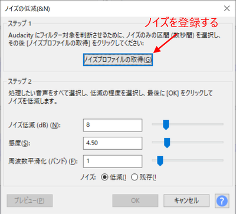</a>

Als Nächstes wählen Sie den Bereich aus, in dem Sie das Rauschen reduzieren wollen.Das ist alles hier.Das Hintergrundgeräusch geht in das gesamte Geräusch der sich öffnenden Tür ein.Indem wir dieses Geräusch eliminieren, können wir nur das Geräusch der sich öffnenden Tür extrahieren.

Rufen Sie die Rauschunterdrückung erneut auf, um sie einzustellen. Der Grad der Entfernung wird in der Vorschau überprüft. Wenn Sie es übertreiben, entsteht ein seltsamer, blecherner Klang, also passen Sie immer wieder rechtzeitig nach.

Drücken Sie auf OK, um das Rauschen zu reduzieren, wie unten gezeigt.Sie können sehen, dass der Hintergrundton reduziert und bereinigt wurde.

Schneiden Sie die Vorder- und Rückseite ab und passen Sie die Länge so an, dass der Ton nur beim Öffnen der Tür zu hören ist.

Wenn Sie die Datei im WAV-Format speichern, können Sie sie im LokProgrammer registrieren und den DCC-Decoder zum Abspielen des Sounds verwenden.

## 4.6. Bearbeiten und Editieren von Laufgeräuschen

Zunächst zum Laufgeräusch: Hier ein Beispiel für den Dieselsound von YOMIX (Kiha261).
<a href="./audacity/Audacity_DIESEL_K261_1.png" target="_blank">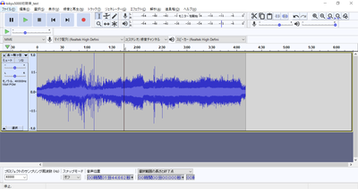</a>

Als Nächstes ein Beispiel für einen Tokyu 50x0-Zug, der mir von Kawaii-san zur Verfügung gestellt wurde.

Die Herangehensweise bei der Erstellung eines Diesels und eines Zuges ist völlig unterschiedlich.

Beim Diesel ändert sich das Geräusch des Motors, das Geräusch des Gangwechsels und das Geräusch des Turbos bei jedem Gangwechsel, so dass der Sound so bearbeitet wird, dass die Kombination dieser Geräusche nacheinander geschaltet wird.Der Schlüssel ist, mit dem Sound auf natürliche Weise nach dem Schalten zu spielen. Das Ausrollen ist nur das Rattern des Leerlaufgeräuschs, also eine Form der Anpassung des Klangs, um natürlich zu klingen, indem man das Geräusch des Fahrtwinds und der Schienenstöße hinzufügt.Die Verlangsamung ist hauptsächlich das quietschende Geräusch der Bremsen und das Geräusch der Motorbremse, also sollten Sie in der Lage sein, das immer wieder zu produzieren.

Bei Zügen wird das Geräusch sowohl der Beschleunigung als auch der Verlangsamung durch Zerhacken des Geräuschs in sechs oder sieben Stufen erzeugt; VVVF hat auch bei der Verlangsamung einen eigenen Klang, daher muss das Verlangsamungsgeräusch richtig erzeugt werden, damit es entsprechend der Geschwindigkeit klingt.

Die Herangehensweise beim Erstellen und Bearbeiten ist unterschiedlich, seien Sie also vorsichtig.Schauen wir uns an, wie man das Diesel-Fahrgeräusch zerhackt.

## 4.7. Ausschnitt Abfahrtsglocke

Mit dem Geräusch des laufenden Diesels wurde es auf einmal kompliziert, deshalb mache ich eine kurze Pause.

In diesem Abschnitt möchte ich das Know-How zum Ausschneiden der Abfahrtsglocke erläutern. So klingt auch die Abfahrtsglocke des Tokyu-Zuges von Mr. Kawaii.

>5050_Departure_Bell_20200423.wav
>http://buin2gou.sakura.ne.jp/sblo_files/powerele/image/5050_E799BAE8BB8AE38399E383AB_20200423.wav

Zunächst werden wir den Inhalt der Abfahrtsglocke mit drei Labels, Start, Schleife und Ende, entsprechend trennen.

<a href="./lok/LokProgrammer_loop_1.png" target="_blank">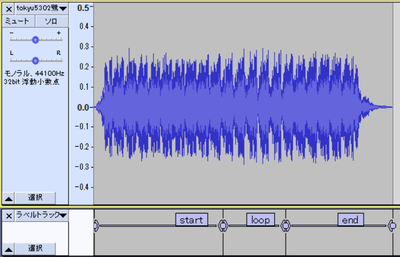</a>

Von hier aus werden wir nach geloopten Sounds (eine Reihe von Sounds, die wiederholt abgespielt werden) suchen und diese herausschneiden.

Wenn Sie sich die Wellenform genau ansehen, werden Sie feststellen, dass sich eine ähnliche Form immer und immer wieder wiederholt, d.h. wenn Sie den Bereich ähnlicher Stellen gut bestimmen können, können Sie den gleichen Klang immer wieder erzeugen.

Zuerst untersuchen wir den Raum zwischen Start und Schleife.Finden Sie heraus, wo die Amplitude des Tons am kleinsten ist, und vergrößern Sie ihn dort.Dann habe ich den folgenden Teil gefunden.Passen Sie den Nulldurchgang hier an, indem Sie seine Position so verschieben, dass er an der Grenze zwischen der Start- und Schleifenbeschriftung liegt.D&D auf dem ○-Teil, um ihn zu verschieben.

Achten Sie darauf, ob Sie sich oberhalb oder unterhalb der Welle befinden, so dass sie schön mit der soeben ermittelten Grenze zwischen Start und Schleife verbunden ist.Hier schneiden wir an der Stelle, an der die obere Amplitude Null wird.

<a href="./lok/LokProgrammer_loop_4.png" target="_blank">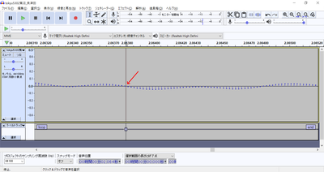</a>

Wählen Sie den Loop-Bereich aus und drücken Sie Umschalt+Leertaste, um den Loop abzuspielen.

Wenn Sie mit dem Ergebnis zufrieden sind, speichern Sie die Datei als Multi-Label-Export.Ich konnte die folgende Datei exportieren.

> bell.zip 
> http://buin2gou.sakura.ne.jp/sblo_files/powerele/image/bell.zip

## 4.8. Wie man VVVF zum Klingen bringt

Als erstes möchte ich die VVVF-Sound-Bearbeitung erklären.

Der Fahrsound in den offenen Sounddaten setzt sich aus drei Hauptkomponenten zusammen: Beschleunigung, Verzögerung und Fahrgeräusch (Windgeräusch).

Das Fahrgeräusch (Windgeräusch) kann je nach Geschwindigkeit leise oder laut sein, was in den Sound-Slot-Einstellungen so eingestellt ist, dass es mit der Geschwindigkeit variiert, aber die Details werde ich später noch erklären.

Die Daten für das VVVF-System in OPEN SOUND DATA basieren auf den Daten von MB und Kawaii, die Vorlage ist also fast identisch.Die in der folgenden Abbildung mit roten Pfeilen markierten Slots (Soundkanäle) entsprechen diesen.

Was wir hier zeigen werden, ist, wie wir den Ton von LokSound bearbeiten, um den einzigartigen Klang der Beschleunigung und Verzögerung zu erzeugen, anstatt den Klang des Fahrtwindes.Bei der Aufnahme werden Sie wahrscheinlich einen Rekorder (oder ein Smartphone) verwenden, um im Auto aufzunehmen, aber es sollte ein Fluss von Anhalten - Beschleunigen - Ausrollen - Abbremsen - Anhalten sein.Daraus werden wir nur die Teile der Beschleunigung und Verzögerung herausschneiden.

Wir werden zwei Typen herausschneiden, Beschleunigung und Verzögerung, und wir werden jeden von ihnen in sechs Teile unterteilen. Sieben oder acht sind in Ordnung, aber für offene Klangdaten werden wir sie in sechs Teile unterteilen. Es gibt 127 Geschwindigkeitsstufen in Speed Step, aber um sie mit dem Sound zu verknüpfen, habe ich sie absichtlich in 6 Stufen unterteilt. 127 Schritte wären in Ordnung gewesen, aber es wäre sehr kompliziert geworden, also habe ich mich für eine Aufteilung in 6 Schritte entschieden, basierend auf dem, was ich bis jetzt gelernt habe.

Wie Sie sehen können, geht es nur darum, sechs gelbe Blöcke mit sechs separaten Sounds für die Beschleunigung und sechs separaten Sounds für die Verzögerung zu versehen und den Sound entsprechend der Geschwindigkeit zu erzeugen.

Beschleunigung 

Verzögerung 

Nun wollen wir aus den Beschleunigungs-, Ausroll- und Verzögerungsgeräuschen der Tokyu 50X0-Serie das Laufgeräusch herausschneiden. Bevor ich das Geräusch herausschneide, muss ich es auf verschiedene Weise modifizieren, aber ich werde davon ausgehen, dass die Modifikationen bereits vorgenommen wurden und das Geräusch für die Beschleunigung und Verzögerung ideal ist.

Kennen Sie den Bereich von der Abfahrt bis zum Ausrollen, indem Sie vorher zuhören.Wir werden diesen Bereich in sechs Teile aufteilen.Es gibt verschiedene Möglichkeiten, ihn aufzuteilen, aber der Trick ist, die langsame Geschwindigkeit so kurz wie möglich zu halten.Zuerst werden wir den Teil direkt nach der Abfahrt beschriften.

Beschriften Sie die Auswahl. Sie können die Position der Beschriftung anpassen, nachdem sie angebracht wurde.

Mit Audacity ist es sehr einfach möglich, WAV-Dateien zu beschriften und mit den Beschriftungen zu exportieren, was meiner Meinung nach ein Muss für die DCC-Sound-Erstellung ist.Dies kann nicht nur für VVVF, sondern auch für andere verwendet werden.Gleiches gilt für den Ausschnitt des Diesellaufgeräusches, der in Zukunft eingeführt werden soll.

<a href="./audacity/Audacity_VVVF3.png" target="_blank">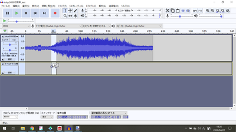</a>

Wiederholen Sie diesen Vorgang, um sechs Blöcke zu erstellen, bis die Beschleunigung vollständig ist.

<a href="./audacity/Audacity_VVVF4.png" target="_blank">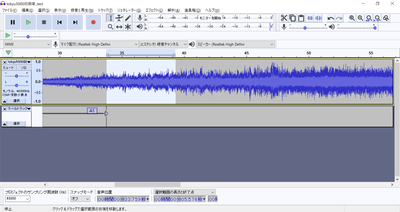</a>

Wir haben die Bausteine für die Beschleunigungsstrecke fertiggestellt.

<a href="./audacity/Audacity_VVVF5.png" target="_blank">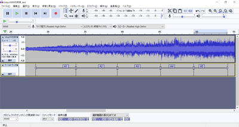</a>

Der Trick besteht darin, darauf zu achten, dass der Abstand zwischen den Blöcken dort ist, wo der Nulldurchgang stattfindet (wo der Wert Null ist), denn wenn Sie ihn bei einem Wert ungleich Null abschneiden, können Sie ein Grummeln hören.Mit dieser kleinen Bearbeitung können Sie das Grummeln auf jeden Fall beseitigen.Auch wenn Sie es weiter einstellen können, ist es am besten, ihn beim Nulldurchgang des VVVF-Tonteilers zu schneiden.

Diese Technik wird auch verwendet, um einen geloopten Sound zu erzeugen (derselbe Sound wird immer wieder abgespielt).Dies ist eine wichtige Technik, besonders für Diesel, also sollten Sie sie unbedingt lernen.Bei Loops gibt es die zusätzliche und zeitaufwendige Aufgabe, ähnliche Wellenformen und Nulldurchgänge vor und nach der Schleife zu finden.

<a href="./audacity/Audacity_VVVF6.png" target="_blank">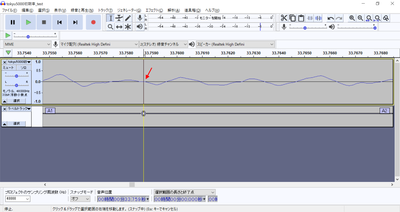</a>

Als Nächstes erstellen wir die Verzögerungsblöcke, indem wir den Anfang der Verzögerung auswählen und beschriften.

<a href="./audacity/Audacity_VVVF7.png" target="_blank">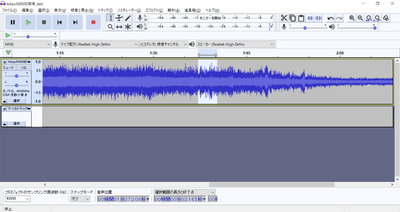</a>

Ich habe die Stelle markiert, an der die Verlangsamung beginnt, wir werden diesen Vorgang wiederholen.

<a href="./audacity/Audacity_VVVF8.png" target="_blank">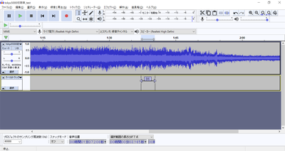</a>

Der Abschnitt bis zur Haltestelle wurde moderat angepasst und die Beschriftung wurde abgeschlossen.

Wählen Sie im Menü Datei die Option Mehrere Dateien exportieren, um tatsächlich eine WAV-Datei zu exportieren.

Geben Sie den Zielordner für die Ausgabe an.Es ist eine gute Idee, einen Ordner nur für die laufenden Sounds anzulegen.

<a href="./audacity/Audacity_VVVF11.png" target="_blank">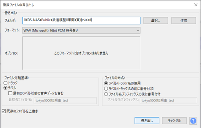</a>

Die beschrifteten Bereiche werden einzeln in eine WAV-Datei exportiert, wie unten gezeigt.

Die exportierte WAV-Datei kann durch Überschreiben der Sounddatei-Liste im LokProgrammer (Drag and Drop aus dem Explorer etc.) in die Daten übernommen werden.Diese Datei ist die Sounddatei, die mit den oben beschriebenen Beschleunigungs- und Verzögerungsprogrammen verbunden ist.Wenn Sie sie ersetzen, wird der Sound automatisch auf die ersetzte Datei umgeschaltet.

In diesem Artikel werde ich das Blockschaltbild des VVVF-Auslaufs, der Beschleunigung und der Verzögerung erklären.

Für den VVVF-Laufsound werden drei Sound-Slots wie folgt verwendet.Darüber hinaus gibt es verschiedene andere Sounds wie Tür-Öffnungs-/Schließ-Sound, Bremsen-Öffnungs-/Lockerungs-Sound, usw. Diese Geräusche werden durch das Mapping entsprechend dem Timing eingestellt, und sie werden getrennt vom Fahrgeräusch erzeugt, da sie nur gleichzeitig ertönen sollen.

Zunächst zu den Trägheitsgeräuschen, die grob in drei Blöcke eingeteilt sind: die Funktion "Aus", "Stopp" und "Fahren".Der Fahrteil ist der größte Teil, aber alles, was Sie tun, ist, den Fahrtwind und das Drehgestell je nach Geschwindigkeit höher oder tiefer, lauter oder leiser brummen zu lassen.

Das Wichtigste ist, dass der Beschleunigungs- und der Verzögerungsabschnitt getrennt sind, d.h. beim Beschleunigen (Hochfahren) werden die oberen Blöcke und beim Abbremsen (Runterfahren) die unteren Blöcke verwendet.

Weisen Sie dem Mapping den Beschleunigungs-Sound-Slot wie unten gezeigt für die Objekte im roten Rahmen der Beschleunigung zu.
Auf diese Weise hören Sie immer dann, wenn Sie beschleunigen, den Sound der Beschleunigung.

<a href="./lok/LokProgrammer_VVVF_5.png" target="_blank">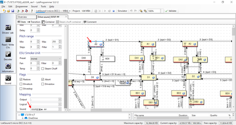</a>

Die Sound-Slots für die Beschleunigung sind die folgenden BlöckeIn jedem Slot wird der Sound der geteilten Beschleunigung angewendet.Der Sound-Slot für die Verzögerung ist separat.Nur wenn Sie sich im Beschleunigungsbereich befinden, wird der Beschleunigungssound gleichzeitig mit dem Auslaufsound abgespielt, abhängig von Ihrer Geschwindigkeit.

<a href="./lok/LokProgrammer_VVVF_2.png" target="_blank">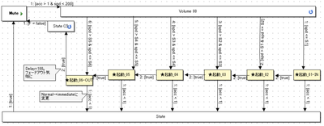</a>

Für die Abbremsung weisen Sie im Mapping des Blocks im roten Rahmen der Abbremsung einen Sound-Slot für die Abbremsung zu, wie unten gezeigt.

Der Inhalt des Sound-Slots für die zuzuordnende Verzögerung ist wie folgt

Die quietschenden und schnaufenden Geräusche, wenn das Auto anhält, werden mit D-S-Blöcken wie unten gezeigt implementiert.In diesem Block spielen wir den Sound ab, der in den anderen Sound-Slots erstellt wurde, und das Timing des Sounds ist wie im Pfeil req=0 & spd <= 5 gezeigt, so dass der Sound abgespielt wird, wenn die Geschwindigkeit kleiner als 5/255 wird.Diese Zahl wird von Fall zu Fall entschieden, da sie von der Länge des Sounds und den Gewohnheiten des Fahrzeugs abhängen kann.

und Sie können den Sound von VVVF.Ich denke, dass die Züge, in der Regel, wird die Art und Weise oben beschrieben werden.

## 4.9. Wie man einen Dieselsound macht

Im Folgenden wird der Dieselsound erklärt.1 Schauen wir uns zunächst die Bewegung des Diesellaufgeräuschs an, das in Kiha 110 und Kiha 261 verwendet wird.

>kiha110 
>https://desktopstation.net/sounds/osd25.html
> 
>kiha261 
>https://desktopstation.net/sounds/osd23.html

Im Fall von VVVF ist es so einfach, dass es nicht erklärt werden muss, aber im Fall von Diesel, wenn man beschleunigt, sind die Geschwindigkeit des Motors und die tatsächliche Geschwindigkeit unterschiedlich. Das liegt daran, dass es ein Getriebe gibt, und das Geräusch ändert sich abhängig von der Anzahl der Gänge. Es ist ein bisschen kompliziert, also werde ich es der Reihe nach erklären.

Das gesamte Blockdiagramm sieht wie folgt aus. Der Ablauf basiert auf der Geschwindigkeit und bewegt sich von einem Block zu einem anderen Block. Er ist in vier große Abschnitte unterteilt: Funktion aus, im Stillstand, im Leerlauf und beim Beschleunigen.

Das Fahrgeräusch wird erreicht, indem man sich in diesem Blockdiagramm wie folgt bewegt: Funktion aus, Stopp, Beschleunigen, Leerlauf, Beschleunigen, ・・・・, Leerlauf, Stopp, Funktion aus.

Die orangefarbenen Pfeile zeigen den Fluss des Verschiebens von immer mehr Blöcken mit zunehmender Geschwindigkeit.Die Geschwindigkeit liegt im Wertebereich 255 für maximale Geschwindigkeit und 0 für Anhalten.Wenn Sie Programmierer sind, werden Sie dies wahrscheinlich leicht verstehen, aber wenn Sie damit nicht vertraut sind, beachten Sie bitte, dass der Maximalwert nicht 100 ist.

Wenn sich die Geschwindigkeit z.B. von 10 auf 30 ändert, wird dieser Block bis zu diesem Punkt einen Sound abspielen.Die Geschwindigkeit ist so eingestellt, dass sie allmählich ansteigt, so dass der Block nicht sofort an die äußerste rechte Position fährt. Es dauert etwa eine Minute, die durch die Beschleunigungs-/Verzögerungszeit der Fahreigenschaften bestimmt wird (die in der Registerkarte "Decoder" eingestellt werden kann).Diese Zeit wird von Ihnen im Zusammenhang mit der Sound-Wiedergabezeit bestimmt. Es ist in Ordnung, wenn Sie mit Eeyore beginnen, solange es ungefähr richtig ist.

An diesem Punkt durchläuft der Sound einen Block namens DCx, und da es unnatürlich wäre, den Sound sofort nach dem Ende der Beschleunigung in den Leerlauf zu schalten, wird der Sound im richtigen Moment überblendet oder abgeschnitten, so dass der Sound zum richtigen Zeitpunkt in den Leerlauf geht, um zu explodieren.

Da ich denke, dass es schwer zu verstehen ist, habe ich versucht, die laufenden Sounddaten des Kiha261 auf das Blockdiagramm abzubilden.
Das ist eine Form, bei der die Schallwellenform des eingeschlossenen Bereiches zerhackt wird und der Klang dem Block zugeordnet wird. Es ist nicht möglich, alle Klangdaten für diese Blöcke vollständig aus den Rohwellenformen zu erstellen, aber dies ist das Bild.

<a href="./lok/LokProgrammer_kiha261_5.png" target="_blank">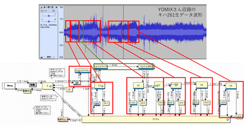</a>

Schauen wir uns nun an, wie die einzelnen Blöcke aufgebaut sind.

In diesem Abschnitt werden die Eigenschaften innerhalb des Blocks beschrieben.

<a href="./lok/LokProgrammer_kiha261_3.png" target="_blank">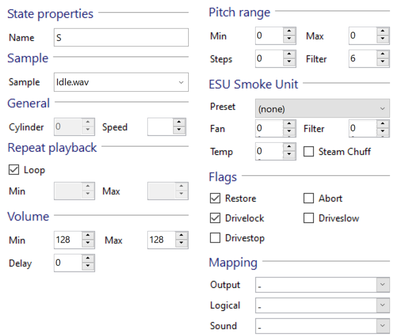</a>

> und Wiederherstellen. 
>Kreuzen Sie dieses Kästchen an, um den unterbrochenen Sound wieder aufzunehmen, wenn Sie die Wiedergabe beenden, nachdem ein Sound mit höherer Priorität unterbrochen wurde.Eine ähnliche Funktion, das Kontrollkästchen Unbegrenzt, ist im Sound-Slot verfügbar.Dieses funktioniert auf einer Pro-Slot-Basis, nicht auf diesem Block.

>Beispiel 
>Wählen Sie aus der Liste der Sounddateien einen Sound aus, der abgespielt werden soll, wenn Sie diesen Block betreten.

>Wiederholte Wiedergabe. 
>Wenn "Schleife" aktiviert ist, wird der unter "Sample" eingestellte Sound weiter abgespielt. Wenn die Bedingung für den Übergang zum nächsten Block erfüllt ist (die Bedingung wird durch den Pfeil beschrieben), wird die Schleife automatisch gestoppt und zum nächsten Block übergegangen.
>Wenn Sie "Schleife" nicht ankreuzen, geben Sie Zahlen in Min und Max ein, um die Anzahl der abzuspielenden Schleifen zu bestimmen.

> und Flags. 
>Wenn "Drivestop" angekreuzt ist, wird das Fahrzeug nicht bewegt, solange es sich in diesem Block befindet.

>Mapping 
>Sie können den Sound-Slot und andere Einstellungen konfigurieren, die mit diesem Block verbunden sind.Der Sound-Slot, den Sie gebunden haben, arbeitet gleichzeitig mit diesem Slot.Wenn Sie zu viele Slots zuweisen, wird die Anzahl der gleichzeitigen Abspielslots überschritten und es kommt zu einem seltsamen Verhalten.

Ich werde Ihnen genau erklären, wie Sie den Sound ändern können.

Zunächst befinden Sie sich an einer Stelle namens S (=F1 ist eingeschaltet und das Auto steht.(Das Geräusch ist ein Rattern und ein Leerlaufgeräusch, aber nicht während der Fahrt.Nehmen wir an, dassBeachten Sie den roten Pfeil.
Der Pfeil, der aus dem ersten S herausgeht, sollte "2 :[share1 != 200 & S1 = false & req > 0]" geschrieben werden.

Die erste Zahl ist die Prioritätszahl; je kleiner die Zahl, desto höher die Priorität.Wenn Sie mehrere Pfeile haben, die aus einem einzigen Block kommen, hilft Ihnen diese Zahl zu entscheiden, welcher Pfeil Priorität hat.Dann share1 != 200 & S1 = false & req > 0. Es gibt eine geheimnisvolle Zeichenkette, aber sie ist kompliziert, also schauen Sie einfach auf das letzte req>0.

req" bedeutet "Geschwindigkeitsanforderung".Mit anderen Worten, verstehen Sie bitte, dass req>0 bedeutet "Geschwindigkeitsanforderung ist größer als 0".Wenn diese Bedingung erfüllt ist, wird der Block entlang des Pfeils bewegt.
Was ich mit einer Geschwindigkeitsanforderung meine, ist, wenn Sie Ihren Gashebel benutzen, um die Geschwindigkeit des Fahrzeugs größer als Null zu ändern und eine Geschwindigkeit anzugeben.

Beachten Sie, dass das Wort spd (speed) später erscheinen wird, aber dies ist die tatsächliche Geschwindigkeit des Fahrzeugs (Motor).Die Geschwindigkeitsanforderung ist die Geschwindigkeit, die von der spielenden Person angegeben wird.Da es Beschleunigung und Verzögerung gibt, stimmen sie nicht immer überein.Während der Beschleunigung und Verzögerung sollten Sie immer anders annehmen.Beachten Sie, dass es leicht ist, die beiden zu verwechseln.

Zurück zur Geschichte, danach betreten wir den Block, der SD genannt wird.Eigentlich ist dieser Block ein "Container"-Block, mit Blöcken im Inneren.Stellen Sie ihn sich als eine Box vor, die die Blöcke zusammenhält. Im Inneren befindet sich nur ein Block, der ein Geräusch beim Lösen der Bremse erzeugt. Er macht nur drückende oder zischende Geräusche.

Inhalt des SD-Blocks (Behälter)

Danach führt der Pfeil 1:[true] zu einem Block mit dem Namen Throttle Up A_02.Das bedeutet "unter allen Bedingungen".Mit anderen Worten, bitte verstehen Sie, dass es keine spezifischen Bedingungen gibt, aber Sie können sich bewegen.

Im SD-Block wird, wenn das Abspielen des Geräuschs zum Lösen der Bremse beendet ist, bedingungslos zu Throttle Up A_02 gewechselt.

Konzentrieren wir uns auf Throttle Up A_02.Es sollte zwei Pfeile geben.Der rote Pfeil zeigt auf den Block von D1, der blaue Pfeil zeigt nach unten, und der Pfeil in Richtung D1 ist 2:[true].Auf der anderen Seite ist der Pfeil nach unten 1:[acc<0].

Was ich meine ist, dass <strong>acc<0 bedeutet "wenn die Beschleunigung negativ ist"</strong>. Das heißt, wenn man abbremst. Ich vermute, es gab einen Fahrgast, der versucht hat, auf den Zug aufzuspringen, gleich nachdem er losgefahren ist, also hat der Zug plötzlich angehalten. Es wäre unnatürlich, wenn die Abbremsung beginnt und dann zum D1-Block geht, der den Ton beschleunigt, also mache ich einen blauen Pfeil, der zum Leerlauf geht.

Die Pfeilbedingungen sind auf der linken Seite unten beschrieben.

Mit einem Doppelklick auf die Bedingung können Sie den Inhalt bearbeiten.

Vorerst konnte ich bis zum D1-Block erklären.

Zu Ihrer Information habe ich die Sounddaten, die S zugeordnet sind, unten in D1 eingefügt.

>Daten-Kooperation: YOMIX und yusa. 
>[kiha261_A.zip](http://buin2gou.sakura.ne.jp/sblo_files/powerele/image/kiha261_A.zip)

Die Blockzuordnungen sind wie folgt

| Blockname | Zuordnungsdatei|
|:------------------|:--------|
|S | Leerlauf.wav|
|Drossel A01| A01.wav|
|Drossel A02| A02.wav|
|D1|Aloop.wav|
|DC1| AX.wav|
|Idde |Leerlauf.wav|

## 4.10. Wie man SpectraLayers verwendet

Mit SpectraLayersPro, einer Software, die Frequenzen analysieren und Geräusche bearbeiten kann, konnte ich die aufgenommenen Geräusche für den DCC-Sound knackig aufbereiten, und ich möchte Ihnen zeigen, wie Sie die Funktion nutzen können.

Es handelt sich um eine kostenpflichtige Software, die aber alle paar Monate im Online-Handel für etwa 5.000 Yen erworben werden kann.

>SpectraLayers
>https://www.sourcenext.com/product/vegas/spectralayers/

Zunächst wird direkt nach dem Start der folgende Bildschirm angezeigt.

Hier können Sie eine aufgenommene MP3- oder WAV-Datei (echte, mit einem Rekorder aufgenommene Tondaten) aus D&D oder dem Menü öffnen und diejenige vorbereiten, die den Ton des Kupplungsteils aus dem Laufgeräusch der E5-Serie enthält.

>Aufnahmeton der Serie E5 
>http://buin2gou.sakura.ne.jp/sblo_files/powerele/image/E5_test1.wav

So sieht es aus, wenn es in Audacity geöffnet wird.

<a href="./slayer/SpectraLayers_inst_2.png" target="_blank">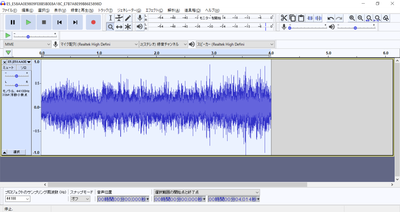</a>

Wenn ich es öffne, denke ich, dass ich etwas Unscharfes finden werde.Dies sind die Daten, die die Schalldaten nach Frequenzen anzeigen.Wenn Sie sich an Ihren Naturwissenschaftsunterricht in der Grundschule, Junior High School oder High School erinnern, werden Sie wissen, warum Schall in verschiedenen Frequenzen erzeugt wird.

Spielen Sie hier den Ton ab, Sie sehen, dass es ein paar Geräusche gibt.

Wenn Sie sich das Bild ansehen, werden Sie einige verdächtige vertikale Streifen sehen. Mit dieser Software können Sie nur einen bestimmten Bereich abspielen. Verwenden Sie das Werkzeug "Bereich auswählen", um die vertikalen Streifen einzuschließen, und drücken Sie die Schaltfläche "Abspielen".Sie sollten einen vertikalen Streifen in der Nähe des Tons hören.

Ich fange an zu sehen, dass diese vertikalen Streifen Rauschen sind und dass ich sie ausschalten sollte. Ich habe Schwierigkeiten herauszufinden, wie man sie ausschaltet. Es gibt mehrere Möglichkeiten, dies zu tun, aber ich denke, die beste ist Stempeln, also lassen Sie uns das Stempelwerkzeug verwenden, um sie zu löschen.
Drücken Sie zunächst die Taste PickSource und wählen Sie dann die zu stempelnde Quellstelle aus.Die Größe und das Seitenverhältnis des Stempels können Sie oben im Menü Werkzeuge (Größe, Seitenverhältnis) auswählen.

<a href="./slayer/SpectraLayers_inst_8.png" target="_blank">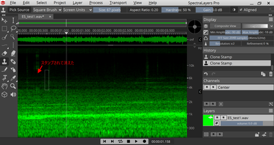</a>

Zunächst konnte ich es mit einem Stempel sauber löschen.
Neben Stempeln können Sie auch das vertikale Auswahlwerkzeug und das magische Auswahlwerkzeug verwenden.Nach der Auswahl drücken Sie die Entf-Taste, um den Bereich zu entfernen.

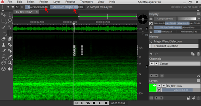

Das magische Auswahlwerkzeug ist genau das Richtige, um das Rauschen, das sich einmischt, loszuwerden.

Das endgültige bereinigte Objekt sehen Sie unten, wobei alle vertikalen Streifen entfernt wurden.

>Komplette Klangdaten. 
>http://buin2gou.sakura.ne.jp/sblo_files/powerele/image/E5_testAfter.wav

Wenn Sie die Datei im WAV-Format speichern wollen, wählen Sie bitte Int 16bit, Sie können aber auch Float 32bit wählen, aber der LokProgrammer kann es nicht registrieren.Wenn Sie den Fehler machen, eine Wav-Datei im Float-Format zu exportieren, machen Sie sich keine Sorgen, Audacity öffnet die Float 32-bit Datei ohne Probleme, und Sie können sie im Int-Format in Audacity speichern.

Es wird empfohlen, Spectra Layers Pro in Kombination mit Audacity zu verwenden.

# 5. Montagemethode

## 5.1. Hinweise zur Montage

Beim Einbau eines DCC-Decoders in ein Fahrzeug gibt es einige wichtige Dinge zu beachten.

- Isolieren Sie die Verkabelung und den Decoder gründlich.
- Beschränken Sie die interne Verdrahtung auf das erforderliche Minimum und halten Sie die Leitungen kurz.
- Verwenden Sie immer einen Tester, um auf Kurzschlüsse zu prüfen, und stellen Sie sicher, dass es keinen Kontakt zwischen der Verdrahtung, die von der Leitung kommt, und der Funktion oder dem Lautsprecher gibt.
- Achten Sie darauf, dass Sie vor dem Einbau eines LokSound Decoders einen preiswerten Decoder einbauen und probeweise fahren.
- Prüfen Sie mit einem Decoder-Tester, ob die Fahr- und Soundfunktionen des LokSound Decoders einwandfrei funktionieren.

Wir haben eine Checkliste für Sie, die Sie beim Laden unbedingt abhaken sollten.

|Check |Prüfen von Elementen |
|:-|:-|
| |Haben Sie mit der Zentrale den Strom begrenzt oder die Strombelastbarkeit des Netzteils auf einen kleineren Wert eingestellt?|
| |Ist der leitende Teil des Lautsprechers isoliert worden?|
| |Ist der leitende Teil des Lautsprechers isoliert? |
| |Ist der leitende Teil des Lautsprechers mit dem leitenden Teil des Netzes verbunden?|
| |Haben Sie alle Teile mit einem Prüfgerät kontrolliert?|
| |Haben Sie die Funktion eines preiswerten Decoders beistehendem Fahrzeug geprüft?|
| |Haben Sie mit einem preiswerten  Decoder an einer Ampel eingefahren?|

Elektrizität hat die Tendenz, in die Richtung des geringeren Widerstands zu fließen, ähnlich wie bei einem Deich, einem Damm usw., und Wasser fließt in eine niedrigere Richtung.
Da Wasser viskos ist, wird der Wasserfluss nicht so groß sein, aber da es keine Viskosität in der Elektrizität gibt, wird es bis zur Grenze der Stromversorgung fließen, wenn es keinen Widerstand gibt.Daher erzeugt der Fluss des elektrischen Stroms Wärme (genau wie in einem Ofen), die zur Zerstörung führt.

Daher sind Isolationsmaßnahmen das Wichtigste, um Kurzschlüsse zu verhindern (ein Fehler, wenn man von einem Null-Widerstand ausgeht).Dies ist ein Teil des Prozesses, an dem Sie niemals sparen sollten.

## 5.2. Verwenden Sie die installierte Hilfsplatine

Wenn Ihr System über einen austauschbaren Decoder verfügt, wie z.B. Next18 oder MTC21, sollten Sie zuerst die Funktionsprüfung durchführen. Ein preiswerter DCC-Decoder im Bereich von 1000 Yen kann zur Funktionsprüfung verwendet werden, so dass selbst im schlimmsten Fall der Schaden minimal ist.

Viele Leute haben in der Vergangenheit teure LokSound Decoder kaputt gemacht, aber jetzt gibt es Möglichkeiten, sie zu testen, ohne sie kaputt zu machen, wie z.B. Next18 und MTC21. Es gibt keine Möglichkeit, diese Vorteile nicht zu nutzen.

Wir vertreiben eine Zusatzplatine namens ExpBoard, die die Umrüstung japanischer Fahrzeuge auf DCC erleichtert. Bitte machen Sie davon Gebrauch.

|Hersteller |Produktname |Stecker |Maßstab |ArtNo |URL |
|:-|:-|:-|:-|:-|:-|
|TRAINO |ExpBoard EC-Slim Easy | Next18 | N | ECS-E1 |[URL](https://desktopstation.net/wiki/lib/exe/fetch.php/ecslim-ver2amanual.pdf) |
|TRAINO |ExpBoard EC-Slim Standard | Next18 | N | ECS-S2 |[URL](https://desktopstation.net/wiki/lib/exe/fetch.php/ecslim-ver2amanual.pdf) |
|TRAINO |ExpBoard EC-Slim Economy | Next18 | N | ECS-C6 | [URL](https://desktopstation.net/wiki/lib/exe/fetch.php/ecslim-ver2amanual.pdf) |
|TRAINO |ExpBoard EC-Slim Typ T | Next18 | N |ECT-S2 | [URL](https://desktopstation.net/wiki/lib/exe/fetch.php/ectmanual.pdf) |
|TRAINO |ExpBoard EC-Slim Typ F | Next18 | N |ECF-S2,ECF-E4 |[URL](https://desktopstation.net/wiki/lib/exe/fetch.php/ecfmanual.pdf)
|TRAINO |ExpBoard EC-Slim Typ H | Next18 | N |ELH-S1,ELH-E1 |[URL](https://desktopstation.net/wiki/lib/exe/fetch.php/ELH-Manual.pdf) |TRAINO |ExpBoard EC-Slim Typ H | Next18 | N |ELH-S1,ELH-E1 |[URL](https://desktopstation.net/wiki/lib/exe/fetch.php/ELH-Manual.pdf)
|TRAINO |ExpBoard EC-Slim SL Typ A | Next18 | N |SL-C57/D51 |[URL](https://desktopstation.net/wiki/lib/exe/fetch.php/expforsl-manual.pdf) |
|TRAINO |ExpBoard EC-Slim SL Typ B | Next18 | N |SL-C59/C62 |[URL](https://desktopstation.net/wiki/lib/exe/fetch.php/expforsl-manual.pdf) |
|TRAINO |ExpBoard EC-Slim SL Typ C | Next18 | N |SL-C58 |[URL](https://desktopstation.net/wiki/lib/exe/fetch.php/expforsl-manual.pdf) |
|DesktopStation|ExpBoard für KATO HO| Next18 | HO |10024 |[URL](https://desktopstation.net/wiki/doku.php/expboardnext18)|
|DesktopStation|ExpBoard für Allgemeines HO| Next18 | HO |10023 |[URL](https://desktopstation.net/wiki/doku.php/expboardgeneral)|
|DesktopStation|ExpBoard für YP| MTC21 | HO | 10026 |[URL](https://desktopstation.net/wiki/doku.php/expboardendo)|
|DesktopStation|ExpBoard für YP SHORT| MTC21 | HO | 10035 |[URL](https://desktopstation.net/wiki/doku.php/expboardendo)|
|DesktopStation|EF81 Light Board| - | HO |10031 |[URL](https://desktopstation.net/wiki/doku.php/ef81lightpcb)|
|DesktopStation|ExpBoard EH200| MTC21 | HO | 10030 |[URL](https://desktopstation.net/shop/products/detail/55)|
|Fujigaya2|ExpBoard für KATO HO DE10| Next18 | HO | 10033 |[URL](https://desktopstation.net/shop/products/detail/65)|

## 5.3. DCC-Anschluss

Wenn ein DCC-Decoder in ein Fahrzeug eingebaut wird, kann ein Steckverbinder verwendet werden, um den Austausch des Decoders zu erleichtern. Darüber hinaus setzen sich hochfunktionale Steckverbinder mit einer Pinanzahl von etwa 20 Pins vor allem in Europa und den Vereinigten Staaten durch.

In der Vergangenheit war die direkte Verdrahtung mit dem Decoder die vorherrschende Methode, die im Störungsfall ein Umverdrahten erforderte und sehr gewöhnungsbedürftig war.

In Japan wird der NEM652 oft standardmäßig in den HO-Motoren von KATO eingebaut, aber in einigen Fällen wird DCC bei den Drehgestelltypen (E5-Serie, EF81, EF510) nicht so sehr berücksichtigt, wie z.B. bei TOMIX, Endo, Katsumi, Dentetsu Kobo, U-TRAINS, usw. Er ist rein analog und hat keine DCC-Unterstützung als Standard.

OpenSound Data empfiehlt MTC21 und Next18 als Standard für DCC-Anschlüsse. Im Folgenden finden Sie eine Liste typischer DCC-Anschlüsse.

|Stecker |Anzahl der Pins |Skalierung |Hinweise
|:-|:-|:-|:-|
|NEM651 | 6 | N | Nachfolger ist Next18 |
|NEM652 | 8 | HO | Nachfolger ist PluX oder MTC21 |
|NEM662 Next18 | 18 | N | Zunehmend beliebt in Spur N
|NEM660 MTC21 | 21 | HO | Entwickelt von Mercklin, derzeit im Normenkampf mit PluX|
|NEM658 PluX22 | 21 | HO | PluX8, 16 scheint auszusteigen

> Es gibt zwei Arten von AUX3- und AUX4-Ausgängen: einen für Merklin, bei dem AUX3 und AUX4 Stromausgänge sind, und einen für DCC, bei dem AUX3 und AUX4 Logikausgänge sind.Bitte prüfen Sie vor dem Kauf eines Decoders genau, welche Ausgangsart für AUX3 und AUX4 vorgesehen ist. Es gibt einige Decoder, die durch Änderung der Einstellungen umgeschaltet werden können, aber in einigen Fällen sind sie aufgrund von Hardwarebeschränkungen festgelegt.

KATO HO-Standard-Triebfahrzeuge und viele HO-Wagen, die vor mehr als 10 Jahren entwickelt wurden, verwenden NEM652 (NMRA 8-polig).Die Anschlussbelegung ist wie folgt

Die Pinbelegung des Next18-Steckers ist unten abgebildet. Der Next18-Stecker wird von einem ausländischen Hersteller gefertigt und ist in Japan nur schwer zu bekommen.

| |Pin | Pin | |
|:-|:-|:-|:-|
|SCHIENE_A| 9 | 10 |SCHIENE_A|
|Kopf |8 |11 |Motor-|
|Lautsprecher+ |7 |12 |AUX2|
|COM+ |6 |13 |AUX4|
|GND |5 |14 |GND|
|AUX3 |4 |15 |COM+|
|AUX1 |3 |16 |Lautsprecher-|
|Motor+ |2 |17 |Schiene|
|SCHIENE_B |1 |18 |SCHIENE_B

Die Spezifikationen des MTC21-Steckers sind wie folgt: Da er eine Stiftleiste im Raster 1,27 mm und einen Pin-Rahmen verwendet, ist die Verfügbarkeit von Steckerteilen in Japan sehr gut.

|Belegung| Pin| Pin | Belegung|
|:-|:-|:-|:-|
|Sensor1| 1 |22 |Linie links|
|Sensor2| 2 |21 |Spur Rechts|
|AUX6(L) |3 |20 |GND|
|AUX4(L) |4 |19 |Motor+|
|SUSI CLK| 5 |18 |Motor-|
|SUSI DAT| 6 |17 |AUX5(L)|
|Schlusslicht |7 |16 |COM+|
|Scheinwerfer |8 |15 |AUX1|
|Lautsprecher2| 9 |14 |AUX2|
|Lautsprecher1| 10 |13 |AUX3(L)|
|keine Pins |×| 12 |VCC +5V|

## 5.4. AUX, HEAD, TAIL Verkabelung

Bei der Verdrahtung der Lichter mit DCC gibt es zwei Arten von Modi: den bipolaren Modus und den Modus mit offenem Kollektor.Sie sind vielleicht mit dem bipolaren Modus vertraut, da er häufig in der Analogtechnik verwendet wird.Der Modus mit offenem Kollektor hingegen ist wahrscheinlich Elektrikern vertraut, aber nicht so sehr den Modellbauern.Mit anderen Worten, denken Sie an einen Modus, bei dem der interne Schalter auch eingeschaltet wird, wenn er eingeschaltet wird, so dass Strom fließen kann.

### 5.4.1. HEAD und TAIL im bipolaren Modus

Sie müssen die Drähte wie unten gezeigt anschließen.Dies ist genau die gleiche Verdrahtungskonfiguration wie eine normale analoge Lichteinheit. In der Lichteinheit sind die Rücklicht-LED und die Scheinwerfer-LED genau entgegengesetzt angeschlossen (genannt umgekehrte Parallelität).

Wenn die Lichteinheit die DCC-Methode (COM+ und die drei Drähte von HEAD/TAIL) nicht unterstützt und es schwierig ist, sie zu modifizieren, können Sie sie ohne Modifizierung der Lichteinheit verwenden, indem Sie sie mit einem ExpBoard oder einer bipolaren Umwandlungsplatine verdrahten, die den bipolaren Modus unterstützt.

### 5.4.2. AUX, HEAD, TAIL (offener Kollektor) der DCC-Standard-Verdrahtungsmethode

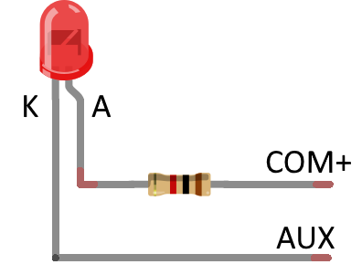

An der Leitung mit der Bezeichnung COM+ liegt eine positive Spannung an.

Auf der anderen Seite, wenn AUX1, AUX2, HEAD, TAIL durch eine Funktion eingeschaltet werden, verbindet der interne Schalter sie mit der negativen Seite.(Das ist dasselbe wie der Abfluss, der in eine Küchenspüle fließt.Wenn das Licht aus ist, ist der interne Schalter aus, also ist er nicht mit der negativen Seite verbunden, also fließt kein Strom und das Licht schaltet nicht ein.

Der Widerstand kann entweder vor oder nach der LED positioniert werden, aber die Polarität der LED sollte so gewählt werden, dass der längere LED-Draht (A, Anode) auf der COM+-Seite liegt.

## 5.5. KATO HO (einzelne Zugwagen KUMOHA40, KIHA110, etc.)

Die HO Kiha110 200-Serie (1-615) von KATO hat NMRA-Anschlüsse, ist aber nicht vollständig DCC-fähig.

Ich weiß jedoch, dass ich die Platine vollständig DCC-fähig machen kann, indem ich einige der Muster ausschneide und sie modifiziere, also habe ich die Platine auf DCC-Sound modifiziert, obwohl kein einziges Wort in der Anleitung sagt, dass sie DCC-fähig ist.

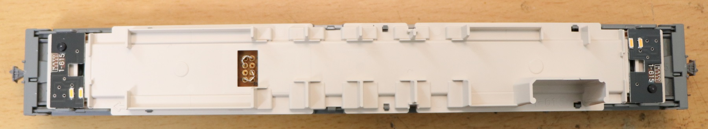

Unter der Bodenplatte ist die beschwerte Stahlplatte durch das ExpBoard Next18 für KATO HO ersetzt.

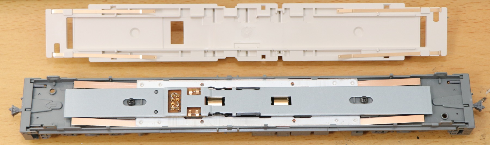

Die Platte vor dem Umbau ist unten abgebildet.

Es gibt Schablonen, die einem sagen, dass man die Schablonen ausschneiden und überbrücken soll, also habe ich es so gemacht, wie es die Platine vorschreibt, nämlich ausschneiden und überbrücken.

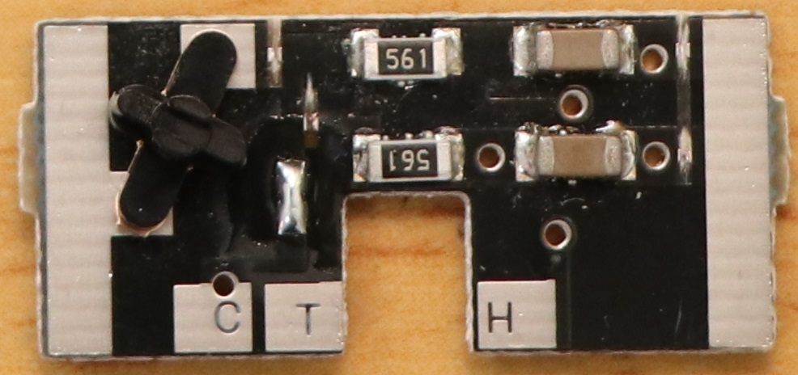

Nachfolgend eine Auflistung der Teile in Kurzform.

> Wichtig!
> C, T, H stehen auf der LED-Beleuchtungsplatine, aber wenn man sie so verdrahtet, wie sie sind, erhält man ein merkwürdiges Ergebnis.Da wir genau die gleiche Platine verwenden, müssen wir die Verdrahtung entsprechend der Fahrtrichtung vertauschen, da das Fahrgestell, bzw. die Positionierung der Leuchten am Fahrzeug, entgegengesetzt ist.
>
> FWD-Seite (am Ende der →)
> C: Gleiche Verdrahtung ist OK
> T: Verbinden Sie H(Rear,NMRA Pin2)
> H: T(Kopf,NMRA Pin6) anschließen
>
> REV-Seite (Gesäßseite von →)
> C: Gleiche Verdrahtung ist OK
> T: T(Kopf,NMRA Pin6) anschließen
> H: H(Rear,NMRA Pin2) anschließen

Die Öffnung in der Bodenplatte ist nur für die Größe des Next18-Steckers offen, daher können wir den Decoder so nicht einbauen.

Daher werden wir die Öffnung aushöhlen, damit der Decoder montiert werden kann.

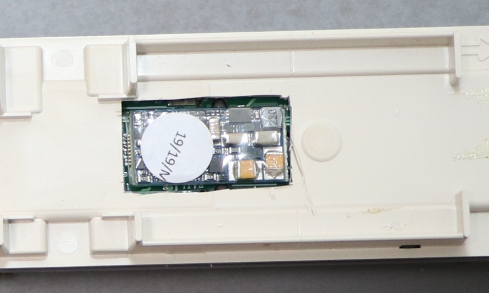

## 5.6. KATO HO (Triebköpfe, Kiha80, etc.)

Wir werden den LokSound5 micro auf KATOs HO Kiha80 M Autos installieren.

* Lötkolben und andere Lötwerkzeuge
* Schraubstock, Pinzette
* Lautsprecher
* LokSound5 micro
* ExpBoard Next18 für KATO HO https://desktopstation.net/wiki/doku.php/expboardnext18
* KATO HO Kiha80(M) 1-611 https://www.katomodels.com/product/ho/kiha82

<a href="./img/KATO_kiha80M_Next18_15.jpg" target="_blank">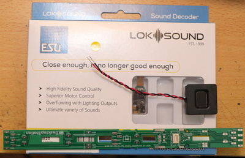</a>

Wir werden den Ladevorgang bearbeiten.

<a href="./img/KATO_kiha80M_Next18_2.jpg" target="_blank">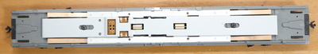</a>

Löten Sie die Phosphorbronze-Kupferplatte. Wenn Sie sie zu stark biegen, trifft sie nicht fest auf das darunter liegende Metallgewicht, was zu einem schlechten Kontakt führt, also löten Sie sie so wie auf dem Bild.

Achten Sie darauf, dass er mit dem darunter liegenden Metallgewicht, wie einer Tellerfeder, in Kontakt ist.

Löten und montieren.

<a href="./img/KATO_kiha80M_Next18_8.jpg" target="_blank">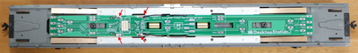</a>

Schneiden Sie die rote Linie aus.Schneiden Sie das Sitzteil mit einem Cutter aus.Wenn wir hier nicht schneiden, können wir den Next18-Decoder nicht montieren.

Vergewissern Sie sich, dass der Decoder an seinem Platz ist.

<a href="./img/KATO_kiha80M_Next18_11.jpg" target="_blank">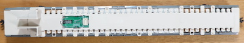</a>

Kein Problem!

Verwenden Sie einen Schraubstock, um ein Loch für den Lautsprecher zu machen, damit der Ton nach unten gezogen wird.

Der Lautsprecher kann in der Toilette oder in einem anderen Teil des Gebäudes versteckt werden, also können Sie einen Schraubstock verwenden, um hier ein Loch zu bohren, den Lautsprecher zu verdrahten und zu verlöten.Die Art und Weise, ihn zu verstecken, hängt von der Größe des Lautsprechers ab, also bin ich sicher, dass jeder seine eigenen Ideen haben wird.

Jetzt müssen Sie nur noch das Fahrzeug abdecken, prüfen, ob es funktioniert, und schon sind Sie fertig!

## 5.7. Tomix HO

Wie bei Tomix HO-Fahrzeugen üblich, ist bei der Konstruktion eine DCC-Umrüstung überhaupt nicht berücksichtigt, so dass es notwendig ist, das Fahrzeug zu zerlegen und die Drähte umzuziehen.Ich hoffe, Sie sind darauf vorbereitet, dass die Hürden ganz anders sind als bei den HO-Fahrzeugen von KATO, und dass Sie in der Lage sein werden, sie mit DCC zu betreiben.

In diesem Abschnitt werden wir den Kiha261 (HO-9047, HO-9097) als Gegenstand unserer DCC-Sondierungsarbeiten verwenden.Der erste Schritt war, den Motor neu zu verkabeln.Zuerst entfernen Sie die Oberseite und nehmen die Bodenplatte und den Motor heraus, etc.

Entfernen Sie den Sitz und Sie werden den Motor sehen.

Entfernen Sie das Metallgewicht.

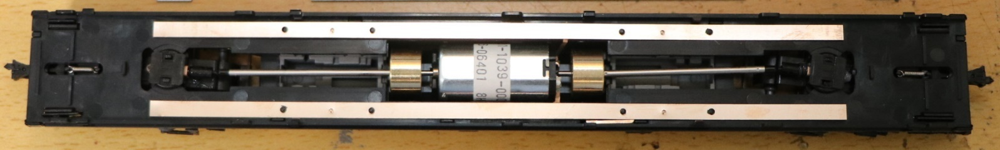

Entfernen Sie auch die Kupferstange.

Entfernen Sie mit einem Lötkolben die am Motor befestigte Kupferplatte.

Löten Sie einen dünnen Draht (empfohlen wird AWG30 oder AWG32), den Sie separat vorbereitet haben, an und befestigen Sie ihn.

Nachdem die Drähte herausgezogen wurden, bauen wir ihn nun wieder zusammen.

Schieben Sie den Motor wieder in seine ursprüngliche Position.

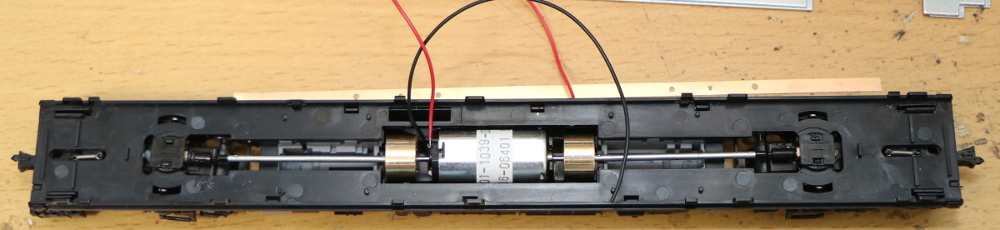

Setzen Sie die Kupferleiste wieder ein.

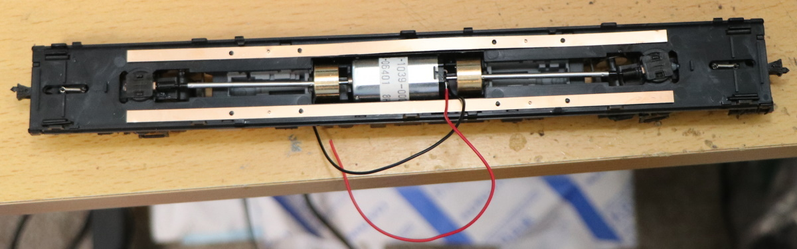

Legen Sie das Metallgewicht zurück.

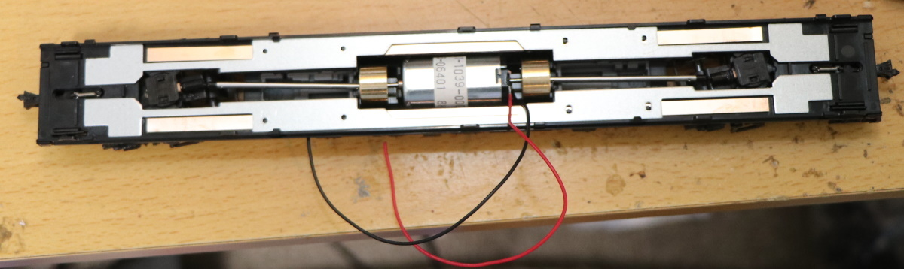

Prüfen Sie beim Herausziehen der elektrischen Leitungen die Position, an der sie herausgezogen werden müssen, da sie im Sitzbereich stören.
Nach der Überprüfung ein Loch mit einem Schraubstock oder ähnlichem Werkzeug herstellen und das Kabel herausziehen.

Ich habe die Drähte zum Sitzbereich herausgezogen. Außerdem gibt es eine Möglichkeit, den Boden herumzuziehen, ohne ihn herauszuziehen.
Verdrahten Sie ihn nach eigenem Gusto.

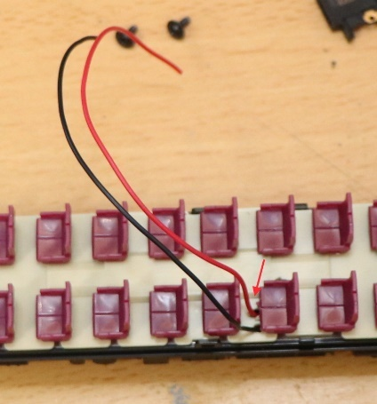

Hier haben wir das ExpBoard Next18 für General HO (https://desktopstation.net/wiki/doku.php/expboardgeneral) und die Lautsprecher ASE02506MS-LW90-DSM-R von PUI Audio. Da wir ein Dieselfahrzeug haben, besteht der Trick darin, Lautsprecher zu wählen, die einen klaren Dieselmotorensound erzeugen. Der ASE02506MS ist dünn und klingt ziemlich gut.
 

LokSound5 micro installiert.

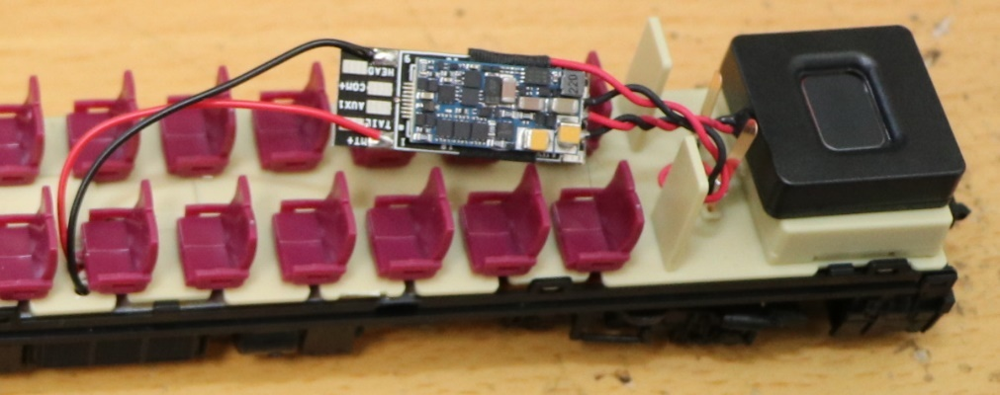

Der Decoder und das ExpBoard sollten gut versteckt sein.
 
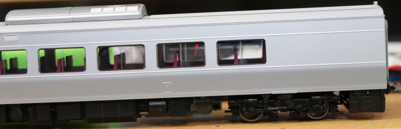

Der DCC-Umbau ist abgeschlossen!

## 5.8. Straßenbahn HO

Ich versuche mich an der DCC-Beschallung des Kiha 40-500 von Tramway und schaue mir an, wie man ihn aus der Schachtel nimmt.

Forschung, um DCC zu sein und auseinandergenommen zu werden. Leider waren die 8-poligen und anderen Anschlüsse des NEM652 nicht angebracht.

Zum ersten Mal habe ich einen Tramway-Wagen gekauft, der eine beschwerte Stahlplatte auf dem äußeren Chassis hat, so dass der Unterboden nur aus Kunststoffteilen besteht, was den Aufbau im Inneren des Wagens erleichtert, dafür aber die Steifigkeit geopfert wurde....

Die Verbindung zur oberen Beleuchtungsplatine ist ein Pogo-Pin, man könnte sagen, dass diese Art der Nutzung auch möglich ist, aber...

Lichtplatine (unten).Die Verkabelung vom Draht, dem Motor und der anderen Seite der Platine sind vorhanden.
Am Ende müssen nur noch die Signale für Common, F0-Ausgang und Innenlichtsteuerung verdrahtet werden.

<a href="./img/Tramway_HO_Kiha40_500_11.jpg" target="_blank">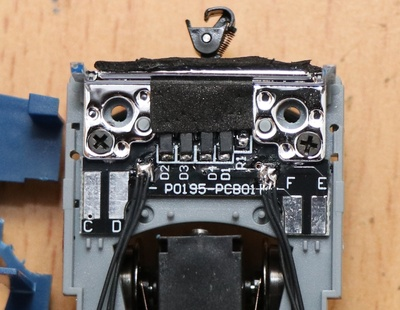</a>

<a href="https://www.mmjp.or.jp/tramway/goods/pg350.html" target="_blank">Ich habe den Schaltplan für die Beleuchtungsplatine auf Tramway gefunden</a>, also werde ich ihn wohl in BSCh umschreiben und DCC zuweisen.Ich habe folgendes geschrieben.Ich habe das noch nicht getestet, also könnte ich falsch liegen!Vorsicht!

>Hinweis: Der Betrieb wurde durch Modifikation der Schaltung gemäß diesem Schaltplan bestätigt, aber der Betrieb ist nicht garantiert.

Dies ist auf der Platine abgebildet.Die rote Linie ist ein Schnittmuster.Verwenden Sie einen Cutter oder ein ähnliches Werkzeug, um das Kupfermuster auf der Platine abzukratzen, um es zu entfernen.Die Arbeit besteht darin, es mit dem NMRA 8-Pin mit offenem Kollektorausgang vom bipolaren Typ kompatibel zu machen.

>Beachten Sie, dass die Farbe und die Pin-Nummer der NMRA-Pins im Diagramm gezeigt werden, aber das bedeutet nicht, dass Sie sie so verdrahten sollten, denn die Bedeutung ändert sich mit FWD/REV im Lichtsystem!

Anstatt zwei Lichtdecoder, wie z.B. den üblichen FL12 oder den Ein-Münzen-Decoder FL, einzubauen, haben wir dies durch Ausschneiden von Schablonen und Hinzufügen von Verdrahtungen auf der Platine gelöst, so dass die ESU LokSound-Pins so verwendet werden können, wie sie sind. Es erfordert komplizierte Verdrahtungsarbeiten im Inneren des Fahrzeugs und ist für fortgeschrittene Benutzer, so dass, wenn Sie denken, dass es schwierig sein wird, ist es besser, einen FL-Decoder zu verwenden.

Nun machen wir uns an die Arbeit.Zuerst entfernen Sie mit einem Lötkolben die Drähte, die direkt mit der Leitung verbunden sind.Rücklichtverkabelung, Hinzufügen von Drähten zu den LEDs.

Ich habe die Drähte auf der Platine angebracht, diese sind für Scheinwerfer, Rückleuchten und Innenbeleuchtung, die Platine auf der Chassisseite ist so ausgelegt, dass sie gar nicht verändert werden muss.

Sobald die Drähte verlötet sind, fixieren Sie die Drähte, wobei wir das originale Klebeband verwendet haben.

Die Abdeckung ist nun montiert.Für die Verdrahtungsschublade wurden einige Löcher gebohrt, um die Drähte herauszunehmen.Die Verdrahtung wurde mit dem ExpBoard Next18 für General HO Pads verbunden.

Da ich nicht möchte, dass er sich durch Vibrationen bewegt, habe ich Acetat-Klebeband verwendet (isolierend und einfach zu installieren!)Außerdem habe ich die Lautsprecher schwarz lackiert.

Durch die Verwendung von Next18 sticht der Kabelstapel bei der Abdeckung der Karosserie nicht so stark hervor.

Als nächstes haben wir uns überlegt, Innenleuchten zu installieren. An der Deckenseite des Kiha 40 gibt es Klemmen für die Innenleuchten.Als ich sie mit einem Prüfgerät gemessen habe, sagte der Schaltplan 4,7kΩ, aber der tatsächliche Wert war 2,2kΩ.Ich sollte wohl den Konstanten in diesem Schaltplan nicht trauen...Die Verdrahtung scheint korrekt zu sein.
Die andere Sache, die mich gestört hat, war, dass es nichts darüber sagte, welche Seite die positive Seite war.Benutzt ihr Jungs Tester, um herauszufinden, was los ist?Es wäre schön gewesen, wenn sie es auf der Rückseite der Platine mit Seide geschrieben hätten.Falls Sie sich wundern, habe ich sie mit Kreppband markiert, wie Sie auf dem Bild sehen können.Bitte beziehen Sie sich auf.

Da es schwierig war, teure Leuchten zu kaufen, und es auch mühsam war, Vorkehrungen zu treffen, haben wir Band-LEDs verwendet, die in der Firma heruntergefallen waren. 3 Serien-LEDs mit einem Strombegrenzungswiderstand von 150Ω.Ich habe den Draht und die Laschenklemmen angebracht.

<a href="./img/Tramway_HO_Kiha40_500_22.jpg" target="_blank">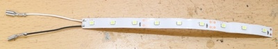</a>

In der Zwischenzeit werde ich ein paar Berechnungen anstellen und sehen, ob es ein wenig leuchtet.

Da 3 LEDs in Reihe geschaltet sind, ist Vf=2,5*3=7,5V (unter der Annahme, dass Vf der weißen LEDs etwa 2,5V beträgt)
Der Widerstandswert ist 2,2kΩ+150Ω=2,35kΩ
Wenn die Spannung 12V beträgt, ist V=IR→V-Vf=IR, also 12-7,5=I*2,35k, I=(12-7,5)/2,35 = 1,9[mA].

Ich konnte anhand meiner Berechnungen feststellen, dass es vage war und kaum leuchtete.

Nach dem Einbau des LED-Bandes sieht es wie folgt aus.

Ich habe es zum Leuchten gebracht.Wie Sie sehen können, ist das Licht sehr subtil wie berechnet, aber ich denke, es ist ganz gut für eine Modell-Innenbeleuchtung.Es sieht so aus, als ob wir die dumme Operation vermeiden können, wo es weiter leuchtet, obwohl es in die Garage geschickt wird.

## 5.9. ENDO HO

Wir werden ExpBoard YP verwenden, um den DCC-Sound für den vorlackierten Bausatz der Serie Kintetsu 22000 zu erzeugen.

> ExpBoard YP
> https://desktopstation.net/wiki/doku.php/expboardendo

Als erstes lötete ich das ExpBoard YP.Der Schwierigkeitsgrad ist wegen der vielen kleinen Teile hoch.Der MTC21-Stecker ist eine 1,27mm Stiftleiste, aber die schwarzen Indexstifte sollten vorher entfernt werden. Es scheint, um ein versehentliches Einstecken zu verhindern.

IC1 ist mit <strong>A1</strong> und IC2 mit <strong>G3</strong> gekennzeichnet.Die Schottky-Diode und die Konstantstromdiode sind an D1 und D2 angeschlossen, aber auch wenn sie versehentlich vertauscht werden, funktionieren sie normal.Achten Sie aber bitte darauf, dass die Position von Anode und Kathode richtig ist.

Nach dem Löten habe ich auch die Lautsprecher angebracht.

<a href="./img/EypBoardYP_4.jpg" target="_blank">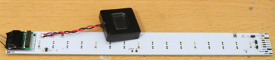</a>

Vorbereitungsarbeiten für die eigentliche Integration.

<a href="./img/EypBoardYP_7.jpg" target="_blank">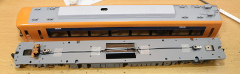</a>

Die gelötete Platine an der Decke montiert und ihre Position überprüft.

Dank des ExpBoard YP sind Scheinwerfer, Rückleuchten, Innenbeleuchtung, Sound usw. sehr einfach zu installieren, aber der Unterbodenbereich ist überhaupt nicht berücksichtigt, so dass ich überraschend viel Zeit mit der Installation der Stecker verbracht habe.

<a href="./img/EypBoardYP_12.jpg" target="_blank">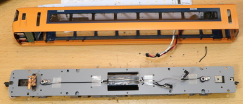</a>

Das ExpBoard YP hat die Funktion einer bipolaren Karte, so dass Sie den bipolaren Ausgang anstelle des in DCC üblichen Open-Collector-Ausgangs verwenden können. Das bedeutet, dass die Scheinwerfer- und Rücklichteinheiten von analogen Fahrzeugen in der Regel für beide Polaritäten vorgesehen sind, was den Einbau in japanische Fahrzeuge erleichtert.

So funktionierte es vorerst.

## 5.10. Dentetsu Kobo Kunststoff HO

Dentetsu Kobo ist ein Hersteller von Messingmodellen in 1/80 HO mit Sitz in Kanda Jimbocho, Tokio, der für seine Präzision und hohe Reproduzierbarkeit bekannt und bei Modellbaufreunden sehr beliebt ist.

> Dentetsu Kobo 
> Raum 1F1, Kanda Yoh Building, 1-52-12 Kanda Jimbocho, Chiyoda-ku, Tokio 
> https://dentetsukobo.jimdofree.com/

Hier werde ich eine DCC-Vertonung der 115er-Serie machen, die ich vor einiger Zeit veröffentlicht habe.

Es gibt keine genauen Informationen über den Lagerbestand im Internet (Dente Kobo stellt keine Informationen über den Lagerbestand ins Netz, also ist die einzige Möglichkeit, den Lagerbestand zu prüfen, persönlich dorthin zu gehen oder anzurufen...), aber sie sagen, dass sie es haben, also wenn Sie interessiert sind, warum kontaktieren Sie sie nicht oder besuchen sie an einem Freitag oder Samstag, einem Werktag?

Zu Ihrer Information sind die Preise für das 4-Wagen-Basisset unten aufgeführt.

- Farbe Shonan: 46.800 JPY (ohne Steuern)
- Yokosuka (Suka)-Farbe: 47.250 JPY (ohne Steuer)

Ich konnte keine lange Formation bilden (kein Platz, zu viele würden mich ärgern, etc.), also habe ich die Ska-Farbe gewählt, weil sie in einer 3-Wagen-Formation besser aussieht als die Shonan-Farbe.

Im Fall der Shonan-Farbe wird der M-Wagen der mittlere Wagen sein.Die Ska-Farbe erfordert mehr Arbeitsstunden, weil der M-Wagen der Führungswagen ist.Die hier gezeigte Bearbeitungsmethode kann sowohl für den Führungswagen als auch für den M-Wagen verwendet werden, daher denke ich, dass sie hilfreicher sein wird.

Davon abgesehen, werde ich die 115er Serie von Dentsu Kobo mit DCC bearbeiten!Natürlich verwendet sie offene Sounddaten.

Vorbereitung der Komponenten

Wie Sie vielleicht schon bemerkt haben, wenn Sie mit OPEN SOUND DATA herumgespielt haben, unterscheidet sich die Lautsprecherauswahl tatsächlich je nach Sound.Einige Sounds passen in eine Art Zuckerwürfel, während andere so basslastig sind, dass man ein großes Gehäuse braucht, um das Beste aus ihnen herauszuholen.
Am besten passt das ASE02808MR-LW150-R zum MT54, obwohl es auch groß ist.

Wir haben uns für den DCC-Umbau für das ExpBoard General HO entschieden, weil es ein Kunststoff HO ist und es Next18 ist.
Außerdem wollte ich nicht mit der Lichtplatine herumspielen, also habe ich eine bipolare Platine (AYA014-2) von DCC-Kan verwendet. Ich möchte keine DCC im japanischen Stil mehr ohne diese machen (lacht).

| Teile | Anzahl
|:-----|:-----|
|Denteki Kobo Serie 115-800 Suka Color Basic 4 Wagen (1/80) |1|
| ESU LokSound5 micro DCC (Next18 Version) | 1|
| ExpBoard Next18 für General HO | 3|
| PUI Audio ASE02808MR-LW150-R | 1 |
| DCC-Kan AYA014-2 Zweipolige Platine | 2|
| LaisDcc Next18 Decoder | 3 |

Umrüstung von Fahrzeugen auf DCC (M-Wagen)

Es ist einfacher als die Tomix 113 Serie, die ich vorher gekauft habe, und die Verdrahtungsschublade ist sehr einfach.

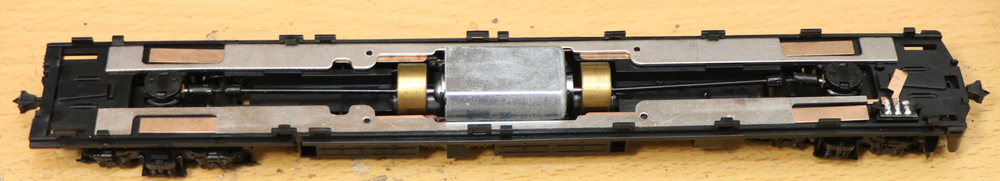

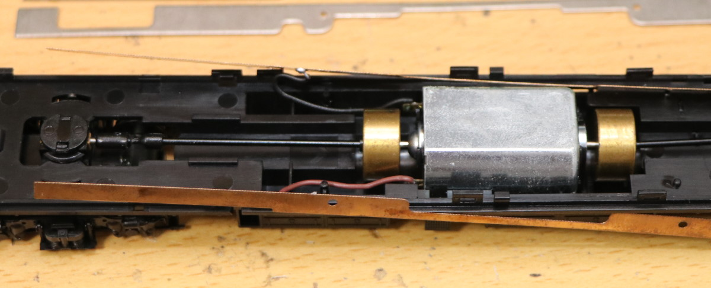

Ziehen Sie die Drähte aus der Kupferplatte heraus und verwenden Sie die vorinstallierte Verdrahtung für den Motor so wie sie ist.

Bauen Sie es wieder zusammen.

Bohren Sie die Löcher für die Bodenblechabdeckungen vor und isolieren Sie die Klemmen des Innenlichtausgangs mit Klebeband, um später die AUX1-Verkabelung durchzuführen.

Seien Sie kreativ bei der Wahl, wo Sie Löcher bohren, damit die Kabel herausgezogen werden können.

Wählen Sie die Position des Lautsprechers.Ich habe die mittlere Fahrzeugseite gewählt.Die Rückenlehne sollte ausgeschnitten werden.Es ist auch eine gute Idee, Löcher in die Bodenabdeckung zu bohren, damit der Schall entweichen kann.

Verdrahten Sie mit dem ExpBoard General HO. Es wird bald vorbei sein.Prüfen Sie immer mit einem Tester auf Kurzschlüsse, wenn Sie fertig sind!

Da die Klemmen, die mit den Pogo-Pins der Innenbeleuchtung korrespondieren, bereits isoliert sind, löten Sie sie wie unten gezeigt und verdrahten COM+ und AUX1.

Bei der Verdrahtung des Scheinwerfers und des Rücklichts verwenden Sie eine zweipolige Platine, um die Montage zu erleichtern.Wir werden sie diesmal auch auf eine weniger aufdringliche Weise installieren.Entfernen Sie zunächst die Kupferplatte, die mit dem Schalter verdrahtet ist.Unfallverhütung.

Die andere Seite ist mit Isolierband verdrahtet und mit einem Kupferplättchen überklebt, so können Sie die Kontakte der Scheinwerfer-/Rücklichtfedern abgreifen und in DCC verwenden.

Befestigen Sie die bipolare Platine und Sie sind fertig.

Die obere Abdeckung, bzw. das Gehäuse, wurde ohne Probleme installiert.

Töne schreiben

Ich muss das Vorstadtmodell MT54 JNR verwenden, dem die beste Klangqualität der Welt nachgesagt wird!
Ich habe die Sounddaten der 113er Serie (V5_JNR_113・415v2.33_Open Sound) gewählt, weil ich gehört habe, dass der Sound der 113er Serie näher am 115er liegt.
Beachten Sie, dass der Ausgang des F0-Scheinwerfers/Rücklichts und der AUX1-Innenleuchte standardmäßig auf 0 gesetzt ist, daher ist es besser, den Ausgangswert vor dem Schreiben auf 25 zu ändern.

Ich habe versucht, es zu verschieben.

Ich habe versucht, ihn zu verschieben, und... eine ziemliche Untertreibung, es ist schlimm!Es sieht nur echt aus (und hört sich auch so an).Ich kann mir nicht einmal vorstellen, den Sound nicht mehr zu haben, so schlimm ist er.Vielleicht werden diejenigen, die den DCC-Sound zum ersten Mal erleben, nicht aufhören zu lachen.

> Videos auf Youtube 
> https://www.youtube.com/watch?v=hJqH0iEmcyQ&feature=emb_title

Weiter geht es mit der Bearbeitung des T-Wagens der Dentetsu Studio 115 Serie Suka Color.Dies ist eine DCC-Bearbeitung für einen Führungswagen ohne Motor.

Öffnen Sie ihn zuerst.

Weiterhin entfernen Sie die Bodenplatte.Ein Präzisions-Flachkopfschraubendreher ist hilfreich.

Die erste LED wird durch diesen Schalter geteilt.Da sie von einem Decoder angesteuert wird, würde ich die Kupferplatte mit einem Lötkolben entfernen, um eine Verkabelung zum Schalter zu vermeiden.

Das ist die Isolierung der Kupferplatte für die Innenlicht-Schublade des Bodenplatten-Kunststoffs und das Loch für die Verdrahtungs-Schublade, das sich leicht mit einem Schraubstock öffnen lässt.

Zwangsweise mit dem Metallgewicht verlötet, da kein Teil der Kupferplatte sauber war...

Der Bodenplatten-Kunststoff wird wieder eingebaut, und das ExpBoard General HO zur Aufnahme des Next18-Decoders wird installiert.

Nun müssen wir noch die Innenbeleuchtung verdrahten (COM+ und AUX1 sind angelötet.(Die Polarität spielt bei der Innenbeleuchtung der Dentsu Studio 115 keine Rolle.Die Scheinwerfer und Rücklichter wurden mit der bipolaren Platine des DCC-Gebäudes verdrahtet.Sehr einfach.
Ich habe sie mit Acetatklebeband isoliert und eine Kupferplatte angebracht, damit ich eine Feder daran befestigen und sie für die Verdrahtung vom DCC-Decoder verwenden kann.

Betrieb prüfen und abschließen.

Decoder-Einstellungen

Als Decoder habe ich den 860015 Next18 DCC-Decoder (PanGu-Serie) von laisdcc verwendet.
Standardmäßig ist AUX1 (Innenbeleuchtung) auf F1 gelegt, also ändern Sie dies einfach auf F3.
Im Abschnitt "h) Function Remapping" des LaisDcc-Decoder-Handbuchs ist CV35 AUX1, das standardmäßig auf 4 (F1) eingestellt ist, also können Sie dies auf 16 ändern.

## 5.11. N-Spur

### 5.11.1. KATO Baureihe 113

Endlich wurden die Farben der Tokaido-Linie der KATO Serie 113 erneuert!Natürlich wollte ich den nostalgischen MT54-Sound nachbilden, deshalb habe ich mich für den üblichen LokSound-Decoder entschieden.

Der erste Schritt ist die Umrüstung des M-Wagens, Moha 113, auf DCC.

Das ExpBoard EC-Slim entspricht einem Standard-Set, mit zusätzlicher Innenbeleuchtung.

>ExpBoard EC-Slim  
>https://desktopstation.net/wiki/doku.php/expboardecn

Entfernen Sie den Korpus und die Unterbodenabdeckung des Moha 113 und überlegen Sie, wie Sie den Sounddecoder auf der linken Seite des Bildschirms platzieren, wo die Innenbeleuchtung installiert werden soll.
 

Wir haben uns auch für den Einbau der Lautsprecher auf der rechten Seite entschieden. ich werde ein Takachi-Gehäuse (SW-15B) und einen bei ali gekauften Lautsprecher verwenden.
 

Das Gehäuse des Takachi wird in der Hälfte dünn rasiert, so sieht es vor dem Zusammenbau aus.

Das Gerät und das Gehäuse werden mit transparentem Gummikleber fixiert, außerdem werden die Metallklemmen auf beiden Seiten des Zuges nach oben gedreht und gegen das Gehäuse gelegt, so dass sie gegen den Boden gedrückt werden können.

Wie üblich wird der EC-Slim in die EM13-Montagefläche eingesteckt.Diesmal verwenden wir ein blaues Kabel, weil der Raum blau ist.Wenn die Kabel die gleiche Farbe haben, besteht die Möglichkeit, den Anschlusspunkt zu verwechseln, daher ist es eine gute Idee, einen Aufkleber mit dem Signalnamen anzubringen.

Ziehen Sie das Kabel aus dem Spalt zwischen den Unterbodenteilen heraus und prüfen Sie, ob die Unterbodenteile fest sitzen. (Eigentlich habe ich mit dem üblichen grauen Kabel angefangen, es aber nach der Hälfte der Produktion gegen ein blaues Kabel ausgetauscht.

Es empfiehlt sich, einmal eine Fahrprobe in dieser Form zu machen.

Legen Sie die EC-Slim und die Lautsprecher auf das Netzteil und positionieren Sie sie, um die Länge der Verkabelung zu bestimmen.

Schneiden Sie die Drähte ab, ziehen Sie die Spitzenbeschichtung ab und verlöten Sie sie.

Stecken Sie die Platine auf und verdrahten Sie TLK1,2 MT1,2.Überprüfen Sie, ob die Verdrahtung auf der Schienenseite und der Motorseite korrekt ist.Verdrahten Sie außerdem die Lautsprecher.

Nach einem Probelauf, um sicherzugehen, dass alles in Ordnung ist, stülpen wir die Karosserie darüber, um den Klang zu testen.Diesmal war sie etwas größer als das übliche Plastikgehäuse, so dass sie vielleicht etwas lauter war.

### 5.11.2. KATO C59 DCC Soundverarbeitung

Einführung der DCC-Soundverarbeitung für C59 (KATO-Produkt).

Das ExpBoard ist ähnlich wie das für die C57, aber die Klemmenplätze sind unterschiedlich.
 
Das für den C57 wurde auf der Unterseite des Decoders installiert, aber dieses ist für die Installation auf der Oberseite des Decoders und des Lautsprechers vorgesehen und hat Verdrahtungspads auf beiden Seiten.

Der Tender des C59 ist zwar lang, aber er hat an dieser Stelle einen Radius, den ich mit dem Geigenbauer ein wenig nachgeschnitzt habe.

Die Lautsprecherboxen sind die gleichen wie immer, vertrieben von Nagoden.

> Nagoden http://www007.upp.so-net.ne.jp/nagoden/

Die Klemmen sollten kurz geschnitten werden, damit sie nicht das Gewicht berühren, wo der Strom von der Schiene fließt, und für eine einfache Verdrahtung verlötet werden.

Das Gehäuse ist die bereits vorgestellte Kunststoffplatten/Kunststoffstangen-Kombination, bei der die Ecken abgeschnitten und die Nuten für die Lautsprecherkabel ausgefeilt werden.

Setzen Sie nun den Lautsprecher und das Gehäuse provisorisch in die Druckgussteile ein.Wenn sich der Druckguss ausdehnt, formen Sie den Bereich, an dem er anschlägt, neu.

Stellen Sie sicher, dass jedes Teil in das Gewicht passt, insbesondere wenn die Leiterplatte über das Gewicht springt, rasieren Sie den Bereich, an dem der Lautsprecher auftrifft, leicht ab.

Entfernen Sie die Motor- und Lautsprecherkabel vom ExpBoard.Diesmal habe ich alle Kabel von der Unterseite herausgenommen.Die Stromversorgung erfolgt über die Schiene, indem Sie einen weißen 0,2mm Draht gegen das linke und rechte Gewicht drücken.

Beachten Sie, dass die Scheinwerferverdrahtung nicht verwendet wird, ich habe sie durch diesen Decoder für Scheinwerfer (PetitDecoder-SL) ersetzt, der sich in der Entwicklung befindet (Details werden separat erläutert).

Bauen Sie die angefertigten Teile zusammen.Die Platine und der Lautsprecher werden mit etwas Gummikleber zusammengehalten.Die LokSound-Platine sollte ebenfalls mit Druckguss versehen und mit Klebeband isoliert werden, um Kurzschlüsse zu vermeiden.

So passte es perfekt.Ziehen Sie es heraus und achten Sie darauf, dass Sie die Drähte zum Motor nicht verwechseln.

Achten Sie dabei darauf, dass der Unterboden und andere Bereiche nicht nach innen gedrückt und angehoben werden.

Montieren Sie den Tender, indem Sie die Lautsprecherkabel durch ihn hindurchführen.

Die Demontage und Modifikation der Motorseite ist die gleiche wie bei der C57.Für die Motorverkabelung entfernen Sie die Metallplatte, die in den Druckguss eingesetzt ist, und ersetzen Sie sie durch die Verkabelung vom Tender.Verwenden Sie Kaptonband oder ähnliches Material, um die Drähte ordnungsgemäß zu isolieren, damit sie nicht mit dem Körper (Druckguss) in Kontakt kommen.

Wie Sie sehen können, ist von außen keine Verkabelung sichtbar.

Danach wird der zweite Wagen fertiggestellt, indem er auf die zu entwickelnden offenen Sounddaten umgeschrieben wird.

# 6. Häufig verwendete Einstellungen

## 6.1. Häufig genutzte Lebensläufe konfigurieren

Im Folgenden finden Sie einige der am häufigsten verwendeten CVs im LokSound 5 mit offenen Klangdaten, deren Einstellungen Sie mit dem LokProgrammer verändern können, ohne die CVs zu kennen.
Dies kann bei LokSoundV4 anders sein, daher lesen Sie bitte das ESU-Handbuch für Details.

| CV-Nummer | CV-Name | Einstellmethode | Bemerkungen
|:-------|:-------|:-------|:-------|:-------|
| CV1 | Kurze Adresse | European style 1-100 American style 1-127| Gültig, wenn Bit5 von CV29 0 ist | CV1
| CV17 | Lange Adresse #1 | 192-230. Wird in Kombination mit CV18 verwendet. | Gültig, wenn Bit5 von CV29 auf 1 gesetzt ist.
| CV18 | Lange Adresse #2 | 128-255. Wird in Kombination mit CV17 verwendet. | Gültig, wenn Bit5 von CV29 auf 1 gesetzt ist.
| CV2 | Startspannung | Spannung zu Beginn des Betriebs. Die Voreinstellung ist 1. | Beachten Sie, dass 255=100% eine relative Angabe ist. |
| CV5 | Maximale Spannung | 1-255, wobei 255 100% Spannung bei maximaler Geschwindigkeit bedeutet. Bei 127 ist es die Hälfte von 50%.|Beachten Sie, dass 255=100% eine relative Angabe ist. |
| CV63 | Lautstärke | 0-129, Maximum bei 192, normale Lautstärke bei 128.| - -
| CV29 | Grundeinstellung| Voreinstellung ist 30. |28/128Step, analog aktiviert, kurze Adresse, Geschwindigkeitstabelle aktiviert
| CV155-CV170 | SoundCV | Jedes Datum kann seine eigenen Einstellungen haben. | - -
| Sie können die Ausgangseinstellungen für Scheinwerfer, Rücklicht und AUX einstellen.| Siehe ESU-Handbuch für Details.

Insbesondere CV29 ist die Basis für die Decodereinstellungen.

>Zum Beispiel wird die Dezimalzahl 3 (die Darstellung von 0-10, die Sie im täglichen Leben verwenden) als 11 im Binärformat dargestellt, und weil sie mit der Dezimalzahl 11 verwirrt, wird sie manchmal als 11B oder B11 usw. dargestellt. B11 bedeutet, dass Bit 0 1 ist, was bedeutet, dass Bit 1 auch 1 ist. Bit 1 steht für 2, und Bit 0 steht für 1. 1+2=3 also.
Beachten Sie, dass CV29 diese Bit-Darstellung verstehen muss, um Zahlen berechnen zu können.

Der Wert von CV29 spezifiziert die Einstellung in Bit-Darstellung, um verschiedene Einstellungen mit einem einzigen CV-Wert zu ermöglichen, wie unten gezeigt.Dies ist eine Technik, die Bit-Flagging genannt wird, die in der Welt der Embedded-Programmierung sehr verbreitet ist. CV verwendet diese Methode auch in einigen Fällen, da es nicht unendlich konfigurierbar ist.

Beachten Sie, dass bitstring für die binäre Darstellung und dec für die dezimale Darstellung steht.

| bit | dec | function | Bedeutung der Einstellung | note |
|:-------|:-------|:-------|:-------|:-------|:-------
| 0 | 1 | Fahrtrichtung |0: Fahrtrichtung ist positiv (FWD), 1: Fahrtrichtung ist rückwärts (REV) | Dies wird verwendet, wenn die Motorverkabelung falsch ist. |
| 1 | 2 | Geschwindigkeitsstufe | 0: 14 Schritte, 1: 28/128 Schritte | sollte auf 1 gesetzt werden, es sei denn, es gibt einen Grund, der dagegen spricht. |
| 2 | 4 | Analogfunktion | 0: AUS,  1: Analogbetrieb erlaubt | Zum Betrieb mit analogem DC-Netzteil. |
| 3 | 8 |RailCom | 0: AUS, 1: EIN | Auf 1 setzen, wenn Sie RailCom verwenden. |
| 4 | 16 | Geschwindigkeitstabelle | 0:Geschwindigkeitstabelle AUS, 1:Geschwindigkeitstabelle EIN | Auf 1 setzen für offene Sounddaten.
| 5 | 32 | Lange Adresse |0: kurze Adresse (2 Stellen) verwenden, 1: lange Adresse (4 Stellen) verwenden | entsprechend der verwendeten Adresse umschalten. |
| 6 | 64 | nicht verwendet | auf 0 setzen | - |
| 7 | 128| nicht verwendet | auf 0 setzen | - |

Schauen wir uns ein paar konkrete Beispiele an, um Ihnen zu zeigen, wie Sie es einrichten können.

Wenn Sie z. B. die Funktion CV29 wie unten gezeigt ausgewählt haben, wäre sie B00011110 (binäre Darstellung).

| Bit | Dez | Funktion | gewählte Einstellung |
|:-------|:-------|:-------|:-------|:-------|
| 0 | 1 | Fahrtrichtung |0: Fahrtrichtung ist positiv (FWD)|
| 1 | 2 | Geschwindigkeitsschritt | 1: 28/128 Schritt |
| 2 | 4 | Analogfunktion | 1: Analogbetrieb erlaubt |
| 3 | 8 |RailCom | 1: EIN |
| 4 | 16 | Geschwindigkeitstabelle | 1:EIN |
| 5 | 32 | lange Adresse |0: kurze Adresse (2 Ziffern) verwenden
| 6 | 64 | unbenutzt | 0 | 0
| 7 | 128| unbenutzt | 0 |

Der einzustellende Wert für CV29 kann durch folgende Formel ausgedrückt werden

> 127x0 + 64x0 + 32x0 + 16x1 + 8x1 + 4x1 + 2x1 + 1x0 
> = 16+8+4+2 
> = 30 (dezimal) 

Für CV29 schreiben Sie 30 in die CV-Schreibweise.

Aber das ist mühsam, oder? Mit DSair2 müssen Sie nur die gewünschte Funktion in CV29 auswählen, und der CV Programmer berechnet und schreibt sie automatisch für Sie.

> DSair2 CV Programmer 
> https://desktopstation.net/wiki/doku.php/dsair2_cvprogrammer

## 6.2. RailCom konfigurieren

Stellen Sie sicher, dass Sie CV29 Bit3 wie oben beschrieben aktivieren (einschalten).
Um RailCom mit Fahrzeugen zu verwenden, die mit OPEN SOUND DATA ausgestattet sind, benötigen Sie einen Detektor oder ein Display (Lenz LRC120, DesktopStation RailComDisplay).

Wenn mehrere Detektoren oder Displays verwendet werden, verdrahten Sie diese parallel.

# 7. Spalte

## 7.1. Wie man mit OPEN SOUND DATA anfängt

Yaasan (DesktopStation)

Nach den Normenkriegen der frühen 1990er Jahre haben sich die digitalen Modellbahnen auf den von Lenz vorgeschlagenen DCC-Standard geeinigt. Es gibt viele Vorteile der Digitalisierung Ihrer Modelleisenbahn.Automatischer Betrieb, Affinität zur Computersteuerung, Einsparung von Kabeln, gleichzeitige Steuerung mehrerer Einheiten, Steuerung durch mehrere Personen, usw....von diesen, denke ich, ist der offensichtlichste der Sound.Ich verstehe, dass die Suche nach Sound seit den Tagen der analogen Modelleisenbahn erprobt wurde, und dass mit DCC-Sound eine universelle Plattform geschaffen wurde.

In Japan wurden seit etwa 2000 hauptsächlich Digitracs, Soundtracs und ESU verwendet.ZIMO, Hornby usw. waren in der Minderheit.Unter ihnen hatte Digitrax wahrscheinlich einen großen Anteil, was wahrscheinlich auf die inländische Vertretung von KATO und die weit verbreitete Verwendung von Zentralen zurückzuführen ist.Da die Daten umgeschrieben werden können, haben einige Modellgeschäfte die japanischen Typendaten freigegeben, und sie wurden von vielen Benutzern verwendet.

Auf der anderen Seite wurden die Digitracs-Sounddecoder, die in der japanischen DCC-Gemeinde recht beliebt waren, um das Jahr 2020 herum obsolet, da sich ihre geringe Anzahl gleichzeitiger Sounds und ihre schlechte Soundqualität bemerkbar machten.Außerdem hatten wir das Gefühl, dass wir eine Menge Arbeit in Bezug auf die Unterstützung von DCC-Anschlüssen wie Next18 und MTC21 zu tun hatten, die um 2017 herum populär wurden. Es gab auch einige leichte Stabilitäts- und Qualitätsbedenken.

Als wir uns fragten, was wir tun sollten, hatten wir zufällig die Gelegenheit, Leute zu treffen, die in die gleiche Richtung dachten, und als Ergebnis verschiedener Diskussionen konnten wir feststellen, dass der Preis zwar höher sein würde als der von Digitrax, wir aber unsere Bedenken und Probleme ausräumen konnten, indem wir uns auf den LokSound von ESU konzentrierten.Ich glaube, dass hier der Prototyp für die heutigen offenen Sounddaten entstanden ist.

Gleichzeitig gab es innerhalb der DCC Electronic Craft Coalition eine Diskussion über die Unterstützung von DCC-Steckern, und wir haben beschlossen, mit diesen Bewegungen gemeinsam fortzufahren.

Im Jahr 2019 werden wir OPEN SOUND DATA starten, und mit dem freiwilligen Einsatz vieler Mitarbeiter werden wir die Sounddaten der Öffentlichkeit zur Verfügung stellen und eine einfache DCC-Umgebung für japanische Fahrzeuge mit der ExpBoard-Serie schaffen.

Als Ergebnis dieser Aktivität wurden der Informationsaustausch und die Unterstützungsgüter verbessert, und das Problem der Installation von DCC-Sound in japanischen Fahrzeugen wird allmählich gelöst, und die Hürde wird jedes Jahr niedriger.Gleichzeitig realisieren wir eine höhere Funktionalität der Funktionen mit AUX, während wir das Risiko von Modifikationsfehlern senken.

Nach den vielen Misserfolgen des ersten DCC-Booms um 2000-2010 könnte 2020 ein Test sein, ob es das erste Jahr des DCC nach japanischem Vorbild sein wird.

## 7.2. Die Zukunft von OPEN SOUND DATA

Yaasan (DesktopStation)

Wir werden mehr Klangdaten für die Öffentlichkeit freigeben und gleichzeitig eine Umgebung schaffen, in der Benutzer als Schöpfer immer mehr Daten erstellen können.

Zum Beispiel durch die Veröffentlichung von Dokumenten wie diesem Buch, Entwicklungsseminare und Offline- und Online-Veranstaltungen wie OPEN SOUND DATA Meetings.

Der nächste Schritt wird um das Jahr 2030 herum die Eigenproduktion von Sounddecodern und Schreibgeräten und die Öffnung der Spezifikationen sein: Wir werden einen "offenen Sounddecoder" schaffen, eine Plattform, auf der jeder Sounddecoder mit völlig offenen Spezifikationen entwickeln kann.Konkurrierende DCC-Firmen in Übersee haben ein völlig geschlossenes Sounddecodersystem, und Anwender müssen Daten von Grund auf neu erstellen, wenn sie den Hersteller wechseln.

Wir sammeln allmählich Ideen und Technologien, wie z. B. die Montage von Komponenten mit ultrahoher Dichte, ARM- oder RISC V-basierte Hochleistungs-Mikrocontroller, DCDC-Wandler, Flash-Speicher, Raicom-basierte Decoder-zu-Writer-Technologie zum Schreiben von Sounddaten und Firmware, Bootloader und Tools zur Erstellung von Sounddaten.Wir wissen, dass dies erreicht werden kann, wenn Elemente wie die folgenden konstruiert werden könnenEinige dieser Technologien wurden bereits von der DCC Electronic Arts Coalition erworben, und wir versuchen, ihre Entwicklung allmählich zu erweitern.

Wenn ein offener Sounddecoder realisiert werden kann, können die gleichen Sounddaten verwendet werden, auch wenn der Hersteller wechselt. Es wird einfach sein, viel mehr Auswahl zu treffen und von einem zum anderen zu wechseln.

Wir möchten eine Umgebung schaffen, in der alle Japaner die digitale Modelleisenbahn und DCC genießen können, und in der Zukunft wird Japan die Zukunft der Modelleisenbahn in Übersee anführen.

Wenn Japan bei DCC hinterherhinkt, sollten wir die Fesseln der bestehenden DCC-Hersteller mit der Technologie und den Ideen brechen, um sie zurückzusetzen und die Welt anzuführen.

Zu diesem Zweck müssen auch die Nutzer von offenen Sounddaten stark kooperieren, wofür wir Ihnen sehr dankbar wären.

## 7.3. Begegnungen mit LokSound V3.5

Beigetragen von Mr. MB3110A

Damals im Jahr 2007, als ich recherchierte, um den Dieselsound des HST von Hornby nachzubilden, fand ich heraus, dass South West Digital in Großbritannien LokSound V3.5 hatte, der so programmiert war, dass er wie der HST klang, und ich bestellte ihn per Post.

Auch jetzt noch nimmt South West Digital nur E-Mail-Bestellungen an. Ich erinnere mich an das Warten und das Zählen der Tage. 

 

　Im Jahr 2008 bestellte ich auch einen LokProgrammer und begann, meinen eigenen Kiha40-Sound zu erstellen (die erste Generation).Ich war nicht sicher, was ich tun sollte.Ich war nicht zuversichtlich, dass ich es schaffen würde, da ich nicht gut mit Computern umgehen kann, aber ich beschloss, es zu versuchen...

M steht für Motorstopp, S für Leerlauf, D für Ausrollen, A für Beschleunigung, CX für Verlangsamung, u.a. Das ist die Basis für unseren Fahrplan.

Die v3.5 Specs speichern nur 8Mbit (ca. 69 Sekunden Ton), so dass ich es schwer hatte, es unter die Kapazität zu drücken, indem ich es viel "LOOP-Wiedergabe" verwenden ließ, die den gleichen Ton wiederholt.Trotzdem war es zufriedenstellend genug im Vergleich zu den 1M Bit (ca. 11 Sekunden), als es v2 war.

Später, mit einer kleinen Änderung um 2008, wurde es fähig, bis zu 16M Bit (ca. 138 Sekunden Sound) zu speichern, was Ihnen mehr Raum zum Bearbeiten von Sounddaten gab.

　Dies ist ein Beispiel für einen Soundplan für Kiha40 Sound (erste Generation).

Stufe A wird nicht verwendet, Stufe D wird für den Beschleunigungssound verwendet, und CX wird für den Leerlaufsound (Ausrollen) verwendet.Damals hatte es die perfekten Spezifikationen für ein Dieselauto, aber jetzt, wenn ich darüber nachdenke, hatte es keine Sofortfunktion (um den Sound in der Mitte der Wiedergabe abzuschneiden und den Übergang zum nächsten Sound zu erzwingen), so dass die Reaktion schlecht war, und der einzige Weg, dies zu überwinden, war, einen kurzen, schönen LOOP-Sound zu erstellen. Es gab keine Funktion, um den Sound des aktuellen Trenners mit dem laufenden Sound zu synchronisieren, so dass es als Soundprogramm vielleicht ein bisschen mangelhaft ist.

Im Jahr 2011 wurde ein kompletter Modellwechsel auf LokSound V4 vorgenommen und die Soundkapazität auf 32M Bit (ca. 267 Sekunden) erhöht.Das Programm ist völlig anders und der Sound kann auf komplexe Bewegungen reagieren und sich stark weiterentwickeln. Am Anfang wusste ich überhaupt nicht, wie man programmiert, also habe ich die Konvertierungsfunktion des LokProgrammers benutzt, um die Daten von LokSound V3.5 nach V4 zu konvertieren.

Diese Entwicklung von LokSound V3.5 zu LokSound V4 war schockierend, und man kann sagen, dass dieser Sounddecoder die Basis für den heutigen LokSound 5 bildete.
 
 

Insbesondere wurde die Funktion "Immediate" (die den Ton mitten in der Wiedergabe abschneidet und zwangsweise zum nächsten Ton übergeht) zum Übergang des Tonplans hinzugefügt, und das Ansprechverhalten beim Übergang wurde stark verbessert. Es ist ein perfekter Decoder für das Fahrgeräusch von Elektrofahrzeugen geworden, und wir haben seitdem an vielen Sounddaten gearbeitet.Dies ist das erste Mal, dass ich dies getan habe.

# 8. Support

Wenn Sie Fragen oder Bedenken zu OPEN SOUND DATA, LokSound Decodern etc. haben, nutzen Sie bitte das Digital Model Railroad Forum.OPEN SOUND DATA ist kein umsatzbringendes Unternehmen, daher wird grundsätzlich kein Support angeboten.

OPEN SOUND DATA, DesktopStation, DCC Electronic Arts Coalition und die Ersteller übernehmen keine Verantwortung für Schäden oder Zerstörung von Fahrzeugen oder Geräten, die durch die Verwendung von OPEN SOUND DATA entstehen.Bitte verwenden Sie OPEN SOUND DATA auf eigene Gefahr.

Grundsätzlich nimmt OPEN SOUND DATA keine Anfragen, Modifikationswünsche oder Änderungswünsche entgegen.wenn Sie jedoch eine selbst aufgenommene und als Creative Commons CC0 deklarierte Soundquelle zur Verfügung stellen und diese mit den Vorgaben des Erstellers übereinstimmt, können wir Sounddaten für Sie erstellen.wenn Sie hingegen die Sounddaten nicht selbst aufnehmen und zur Verfügung stellen, können Sie sicher sein, dass die Sounddaten nicht bereitgestellt werden.

Das Digital Model Railroad Forum wird von DesktopStation verwaltet und betrieben, und es fallen keine Registrierungs- oder Jahresgebühren an.

Bitte beachten Sie, dass wir, auch wenn Sie eine Frage oder einen Ratschlag im Digital Model Railroad Forum stellen, nicht garantieren können, dass diese gelöst wird. Es handelt sich um eine freiwillige Antwort in gutem Glauben und nicht um eine offizielle Antwort von ESU.

> Digital Model Railroad Forum
> https://desktopstation.net/bb/

Wenn Sie offiziellen Support vom Entwickler wünschen, gibt es ein Support-Forum, das von ESU betrieben wird, und Sie können sich als Benutzer registrieren, um offizielle Fragen zum Umfang des ESU-Supports zu stellen.Bitte beachten Sie, dass Japanisch nicht unterstützt wird und Fragen und Beratungen in Deutsch oder Englisch durchgeführt werden.

OPEN SOUND DATA ist in keiner Weise mit ESU verbunden. Es ist strengstens untersagt, den Betreiber von OPEN SOUND DATA um Unterstützung für die Produkte von ESU zu bitten.

>http://www.esu.eu/forum/forenuebersicht/

# 9. FAQ

In diesem Abschnitt finden Sie Antworten auf häufig auftretende Probleme und Fragen zum LokSound Sounddecoder.Diese Antwort garantiert nicht, dass das Problem gelöst wird, und Sie müssen es im Grunde selbst lösen.DesktopStation und OPEN SOUND DATA sind weder mit ESU verbunden, noch haben wir eine Vertriebs- oder Support-Vereinbarung in Japan.Wenn Sie bei uns Support für LokSound Decoder anfordern, können wir Ihnen in keiner Weise helfen.

Um offiziellen Support von ESU zu erhalten, besuchen Sie bitte die ESU-Website.

## 9.1. Welche Hersteller-Zentrale kann ich betreiben?

Solange die Zentrale dem NMRA DCC-Standard entspricht, kann sie mit jeder DCC-Zentrale oder jedem DCC-Controller eines beliebigen Herstellers auf der Welt verwendet werden.

Beachten Sie, dass die alten Merklin Zentralen, CS2, CS3, etc. nicht im Merklin Digital- oder mfx-Modus funktionieren. Sowohl CS2 als auch CS3 unterstützen den DCC-Modus, verwenden Sie also bitte den DCC-Modus.

## 9.2. Werden Sie Sounddaten für Europa und die USA veröffentlichen?

Die Klangdaten für Europa und die USA werden von der ESU offiziell und kostenlos freigegeben.

> projects.esu.eu
> http://projects.esu.eu/

Dies liegt außerhalb des Geltungsbereichs von OPEN SOUND DATA. Wir akzeptieren keine Anfragen oder Bitten um Unterstützung bezüglich westlicher Tondaten, für die wir keine Rechte haben.

## 9.3. Können OPEN SOUND DATA in einen anderen Decoder als ESU geschrieben werden?

OpenSound-Daten wurden speziell für die LokSound V4- bzw. 5-Serie von ESU erstellt. Sounddecoder anderer Hersteller können nicht beschrieben werden, es gibt auch keine Richtlinien, die sich damit befassen.

Es ist nicht möglich, Sounddecoder anderer Hersteller wie z.B. ZIMO, Digitrax, SOUNDTRAXX, Uhlenbrock usw. zu beschreiben.Jede Firma, die Sounddecoder entwickelt, kann eigene Soundbibliotheken zur Verfügung stellen.Benutzer der einzelnen Sounddecoder finden diese auf der Website des jeweiligen Herstellers.

| Hersteller | URL | Soundregion|
|:-|:-|:-|
|ESU | http://projects.esu.eu/ | Europäische und amerikanische Modelle |
|ZIMO | http://www.zimo.at/web2010/sound/tableindex.htm | Europäische und amerikanische Modelle |
|Uhlenbrock | http://www.d-i-e-t-z.de/7_6.htm | Europäische und amerikanische Modelle |
|Digitrax | https://www.digitrax.com/sound-depot/list/ | Westliche Bauart |

## 9.4. Kann ich mit dem LokProgrammer Cantum usw. umschreiben?

Der LokProgrammer ist ein Produkt von ESU.Qantum ist ein Sound-Decoder-System, das von Tenshodo auf OEM-Basis von Broadway Limited verwendet wird.Da die Hersteller unterschiedlich sind, ist es nicht möglich, den Sound oder die Funktion zu ändern.

Ebenso können offene Sounddaten nur in den LokSound Decoder von ESU geschrieben werden, in Sounddecoder anderer Hersteller ist das nicht möglich.

## 9.5. Wie kann ich sicherstellen, dass ich den Decoder nicht kaputt mache?

Die Decoder, die Sie kaufen, müssen vor dem Einbau in das Fahrzeug mit einem Decodertester (ESU 53900 Decoder Tester oder Leica DCC 860033 Decoder Tester Pro) auf ihre Funktion geprüft werden. Wenn der Decoder beim Kauf kaputt geht (oder kaputt ist) und Sie seine Funktion mit einem Decodertester prüfen, ist die Wahrscheinlichkeit sehr hoch, dass es sich um einen anfänglichen Defekt handelt. Beim LokSound5 micro, der einen besonders aufwändigen Herstellungsprozess hat, liegt die Defektrate im Markt bei ca. 1 bis 2 von 100 ausgelieferten Exemplaren, so dass Sie sich an dieser Stelle mit dem Hersteller oder Distributor in Verbindung setzen sollten, um einen Erstaustausch vorzunehmen.

Auch sollten Sie unbedingt die teuren LokSound Decoder nicht sofort einbauen, sondern erst mit den DCC-Anschlüssen MTC21 und Next18 im Fahrzeug installieren und dann die Funktion mit den preiswerteren LaisDcc-Decodern überprüfen.Die Ursache vieler Decoderausfälle in der Vergangenheit waren Anwenderfehler beim Einbau.Der komplexe Ladevorgang muss langsam und mit viel Zeit und Bestätigung durchgeführt werden.

## 9.6. Ruckelndes Verhalten nach dem Schreiben von offenen Sounddaten.

Auch wenn die offenen Sounddaten korrekt in den LokSound Decoder geschrieben werden, kann es vor allem bei niedrigen Geschwindigkeiten zu ruckartigen Bewegungen kommen, weil die Grundeinstellungen, die Langsamfahrteinstellungen und die BEMF-Einstellungen (Motordrehzahlerfassungsfunktion) im Abschnitt Laststeuerung auf der Registerkarte Motoreinstellungen nicht zum Motor passen.

Die Grundeinstellungen sollten normalerweise in Ordnung sein, aber wenn es einfach nicht funktioniert, verwenden Sie die Auto-Tuning-Funktion, um sie anzupassen.

Für die Einstellung der langsamen Geschwindigkeit sind zwar Einstellungen vorgesehen, aber wir empfehlen, diese nicht generell zu verwenden, da sie in den meisten Fällen nicht gut funktionieren.Daher sollten der Regelparameter "K slow" und der Größte interne Geschwindigkeitsschritt, der "K slow" verwendet, auf 0 gesetzt werden.

Was die BEMF betrifft, so sollte sie in den meisten Fällen eingestellt werden, aber wenn sich der Wert geändert hat, funktioniert es oft, ihn auf den eingestellten Wert zu ändern.Diese Einstellungen bestimmen, wie oft und wie genau die BEMF die Geschwindigkeit erkennt. Es ist ziemlich schwierig, die Geschwindigkeit richtig einzustellen, wenn sie zu lang oder zu kurz ist.

|BEMF-Einstellungselemente | Vor der Änderung (Beispiel) | Nach der Einstellung (Beispiel)
|:-|:-|:-|
|langsame Geschwindigkeit Rück-EMK-Abtastperiode | 2,5ms | 5ms |
|Vollgeschwindigkeit Rück-EMK-Abtastzeit | 2,5ms | 15ms |
|langsame Geschwindigkeit Länge der Messlücke | 0,3ms | 1,5ms |
|full speed Länge der Messlücke | 0,3ms | 2ms |

## 9.7. Der Decoder funktioniert nicht, reagiert nicht oder ist ausgefallen.

Es ist unbedingt erforderlich, dass Sie die Vorkehrungen zur Vermeidung des Decoderbruchs in der vorherigen Frage befolgen, andernfalls liegt die Ursache des Ausfalls beim Benutzer.

Wenn der Decoder nach dem Einbau in ein Fahrzeug, das mit einem Decoder ausgestattet ist, nicht mehr funktioniert, ist die Wahrscheinlichkeit sehr hoch, dass der Fehler auf einen Verdrahtungsfehler, einen Isolationsfehler, eine schlechte Befestigung oder einen Kontakt/Kurzschluss beim Einbau des Decoders zurückzuführen ist.

Überprüfen Sie die folgenden Punkte.

- Die Adresse (CV1) kann nicht gelesen werden, funktioniert nicht mit der eingestellten Adresse
- Ob der IC auf der Oberfläche des Decoders verbrannt ist oder nicht, ob der Schrumpfschlauch durch Hitze gerissen ist oder nicht

Wenn die Adresse ausgelesen werden kann, funktioniert der Decoder ordnungsgemäß, aber einige Funktionen können aufgrund einer Fehlfunktion nicht mehr funktionieren. In einigen Fällen kann auch ohne offensichtliches Problem eine Fehlfunktion vorliegen.Auch gibt es, obwohl es sehr selten ist, Fälle, in denen anfängliche Defekte später aufgrund von schlechten Lötungen oder schlechtem Kontakt von Teilen gefunden werden.

Wenn das Fahrzeug mit einem DCC-Anschluss ausgestattet ist, tauschen Sie den Decoder aus und überprüfen Sie den Betrieb.Wenn der Decoder nach dem Austausch einwandfrei funktioniert, ist es sehr wahrscheinlich, dass der Decoder defekt ist.

Die wichtigste Maßnahme ist es, den wertvollen Decoder nicht zu zerstören. Im Falle eines Bruchs wird es ein großer Verlust sein. Achten Sie auf die Einhaltung der Dinge, die Sie tun, um sie nicht zu beschädigen, und fahren Sie mit der DCC Ihrer Modellfahrzeuge sicher.

Der LokSound Decoder ist sehr präzise.Darüber hinaus muss nicht nur LokSound, sondern auch Decoder richtig installiert und verwendet werden, oder sie werden ausfallen.Wenn Sie eine Fehlfunktion durch eigenes Verschulden verursachen, werden Sie nicht in der Lage sein, es zu ersetzen.Dies gilt vor allem für Anfänger, die nicht mit dem Installationsprozess vertraut sind und vernachlässigen, um den Betrieb des Decoders zu überprüfen, was zu der Installation von teuren LokSound Decoder von Anfang an, die einen Ausfall verursachen können, ohne bemerkt zu werden.

- Der entsprechende Maßstab (Spurweite) des Decoders und der Maßstab/Spurweite des einzubauenden Fahrzeugs sollten übereinstimmen, insbesondere bei Druckguss- und Messingmodellen wie z.B. Lokomotiven ist dies zu beachten.
- Nutzen Sie die Vorteile von DCC-Steckern wie Next18 und MTC21, etc. Testen Sie die Funktion des LokSound Decoders mit einem preiswerten Decoder, bevor Sie ihn einbauen.
- Verwenden Sie bei Fahrzeugen, die nicht DCC-fähig sind, eine Einbau-Hilfskarte wie z. B. ExpBoard.
- Lautsprecher haben eine starke magnetische Kraft, die dazu führen kann, dass sie an Lautsprechern und anderen Geräten haften bleiben, was zu Kurzschlüssen und Drahtbrüchen in der Decoderverdrahtung führen kann.

Was die Fehlerfaktoren betrifft, so gilt im Allgemeinen Folgendes.

- Wenn die Lautsprecherverdrahtung mit einem Draht oder einer zugehörigen Signalleitung wie einer Funktion oder einem Motor in Berührung kommt, kommt es zu einem Kurzschluss und die interne Schaltung wird zerstört.
- Wird ein Kleinbahndecoder wie der LokSound5 micro in einem sehr schweren Druckgusszug der Spurweite HO oder O eingesetzt und der Zug wiederholt mit hoher Geschwindigkeit gefahren oder plötzlich gestoppt, kann die vom Motor induzierte Spannung (der Motor wird zum Generator) zu einer Überspannung des Decoders führen und ihn zerstören.
- Die in Tomix-Produkten oft verwendeten gefederten Drehgestelle sind anfällig für Kurzschlüsse durch Entgleisungen oder Erschütterungen an Weichen etc. und Überhitzungserscheinungen können das Fahrzeug beschädigen; beachten Sie, dass manche Fahrzeuge überhaupt nicht für den Dauerwechselstrombetrieb ausgelegt sind, wie z.B. DCC.
- Für den LokSound5 micro gibt es ein vereinzeltes Auftreten von Erstausfällen mit einer Wahrscheinlichkeit von 1-2% in den Jahren 2019-2020.Überprüfen Sie beim Kauf unbedingt die Funktion mit einem Decodertester.

## 9.8. Kann man ihn mit einem PWM-Netzteil betreiben?

LokSound Decoder funktionieren nicht mit PWM-Netzteilen, verwenden Sie die DCC-Zentrale oder verwenden Sie ein Qantum-Netzteil oder ein reines Analog-Netzteil.

Beachten Sie, dass der Decoder nicht ausfällt, wenn Sie ihn mit einem PWM-Netzteil betreiben, aber er läuft nicht richtig, was fälschlicherweise für eine Fehlfunktion gehalten werden kann.

## 9.9. Was muss ich bei der Netzspannung tun?

LokSound Decoder sind nach den Standard-DCC-Spezifikationen gebaut, aber Sie können sie nach Maßstab und Spurweite beurteilen.
Beachten Sie, dass einige DCC-Zentralen eine feste Spannung haben, auch wenn diese leicht abweicht, sollte es funktionieren. In einigen Fällen können jedoch Decoder, die nicht den NMRA-Standards entsprechen, oder DCC-Decoder einiger Hersteller, die die Kostenreduzierung in den Vordergrund stellen, zu Ausfällen führen.

|Maßstab und Spurweite | Spannungsbereich |
|:-|:-|
|z, N| 12V|
|HO | 15-16V|

## 9.10. LokProgrammer schreibt Sounds nicht richtig.

Wenn Sie den Sound nach dem Schreiben mit dem LokProgrammer nicht zum Laufen bekommen, kann es sein, dass der Sound nicht richtig funktioniert.Bitte überprüfen Sie die folgenden Punkte und versuchen Sie das Schreiben erneut.Insbesondere gibt es oft Fälle, in denen die Kommunikationsdaten beschädigt sind und Sounds nicht richtig geschrieben werden können.

- Zerstörung der Kommunikationsdaten aufgrund von verschmutzten Schienen, verschmutzten Rädern oder schlechtem Kontakt zwischen Schienen und Rädern
- Beim Einbau in ein Fahrzeug, schlechte Verkabelung oder Abtrennung
- Firmware ist alt, nicht kompatibel mit LokProgrammer zum Schreiben (Firmware mit LokProgrammer aktualisieren)
- LokProgrammer ist zu neu, um gut zu schreiben (Verlust der Abwärtskompatibilität, Schreiben von LokSoundV4 mit LokProgrammer 5 oder später, etc.)
- Der LokProgrammer ist zu alt, um gut zu schreiben (Verlust der Aufwärtskompatibilität).
- Ein Fehler im LokProgrammer, der seltsames Schreiben und ungewollte Änderungen der Einstellungen verursacht (versuchen Sie eine ältere Version).
- Die CV wird nicht richtig zurückgesetzt.
- Der Decoder hat eine Fehlfunktion (bei einer Fehlfunktion des Decoders ist auch kein normaler Betrieb möglich)

Auch wenn er richtig geschrieben ist, kann er als nicht funktionierend angesehen werden, wenn Sie die DCC-Zentrale falsch bedienen.

- Sie haben vergessen, F1 zu drücken.
- Die Netzspannung ist nicht eingeschaltet.
- Der Netzadapter ist nicht im Lieferumfang enthalten.

Auch wenn die Sounddaten erfolgreich geschrieben werden können, kann es Probleme mit dem Fahrzeug selbst geben.

- Es befindet sich kein Decoder im Fahrzeug.
- Es hat einen anderen Decoder.
- Es befinden sich keine Lautsprecher im Raum.
- Interne Unterbrechung.
- Die Gleise sind nicht angeschlossen.

Wenn Sie mit dem LokProgrammer nicht vertraut sind, verwenden Sie ein funktionsgeprüftes Fahrzeug (Fahrzeug mit von Anfang an eingebautem DCC) und einen Decoder-Tester.

## 9.11. Vom LokProgrammer geschriebene Sounds sind seltsam.

In einigen Fällen werden offene Tondaten nicht in einem perfekten Zustand veröffentlicht. In einigen Fällen sind die Ersteller unbeabsichtigt oder sich der besonderen Bedingungen, unter denen sie auftreten, nicht bewusst.Grundsätzlich wird von den Benutzern erwartet, dass sie das Problem selbst lösen, aber bitte überprüfen Sie die folgenden Punkte.

- Das Schreiben von Sounddaten ist fehlgeschlagen.
- Ein Fehler im LokProgrammer hat dazu geführt, dass die Einstellungen fehlerhaft waren (dies ist mit der LokProgrammer Version 5.1.0 Ende November 2020 passiert).
- Die Sounddaten sind beschädigt.

Es gibt folgende Möglichkeiten der Fehlerbehebung

- Wenn es mit einer bestimmten Sounddatei passiert, schreiben Sie einen anderen Sound und schauen Sie, ob es damit funktioniert.
- Wenn der Decoder aus dem Fahrzeug entfernt wurde, überprüfen Sie seine Funktion mit einem Decoder-Tester (um zu sehen, ob er falsch in das Fahrzeug eingebaut wurde).
- Versuchen Sie, auf einen anderen Decoder zu wechseln (um zu sehen, ob es sich um ein decoderspezifisches Phänomen handelt)

## 9.12. In ECoS2 wird die Adresse unerlaubt umgeschrieben.

Die ECoS2 von ESU hat eine Funktion namens RailComPlus, die mit LokSound Decodern kommuniziert. Diese Funktion ermöglicht es Ihnen, eine Organisation einzurichten (mehrere Fahrzeuge mit mehreren Decodern an der gleichen Adresse.)Das Problem ist, dass die Adresse umgeschrieben wird, wenn das System erkennt

Eine Möglichkeit, dies zu beheben, ist, RailComPlus auszuschalten.

- Schalten Sie die RailCom-Funktion bis auf ein Fahrzeug aus (CV29 Bit3 wird ausgeschaltet).
- Setzen Sie in den Einstellungen des LokProgrammers keinen Haken bei "RailComPlus automatische Ansage aktivieren".

Dies ist ein ECoS2-spezifisches Phänomen, es betrifft also nicht diejenigen, die die Zentrale verwenden.

## 9.13. Ich habe die Adresse verloren.

Wenn Sie ein Command Station-Produkt wie DSair2 verwenden, kann die Adresse automatisch ausgelesen werden.Bei Command Stations des Typs "Manuelles Auslesen" können Sie die aktuelle Einstelladresse überprüfen, indem Sie alle CV1, CV17, CV18 und CV29 auslesen, die Werte notieren und sie mit dem Rechner oder einer anderen Software im Web berechnen.

Darüber hinaus können Sie die aktuelle Adresse einfach mit dem LokProgrammer überprüfen.

## 9.14. Manche Adressen funktionieren bei manchen Zentralen nicht.

Das amerikanische System und das europäische System behandeln 100-127 unterschiedlich. Im amerikanischen System ist 1-127 die kurze Adresse (diejenige, die durch CV1 eingestellt wird), und im europäischen System ist 1-99 die kurze Adresse. 100 aufwärts ist die lange Adresse im europäischen System.

In Japan ist aufgrund der Verbreitung des DCS50K der Controller im US-Stil der Mainstream, aber wenn Sie einen Controller im europäischen Stil haben und versuchen, ein Fahrzeug in diesem Adressbereich zu bewegen (es gibt viele Fahrzeuge in Japan, die Sie als Adresse verwenden wollen, wie z. B. die 103, 113, 115 usw.), kann es sein, dass es nicht funktioniert, und Sie werden Kopfschmerzen haben.

Die einzige Möglichkeit, dies zu tun, besteht darin, nicht 100-127 zu verwenden.

## 9.15. Ist es möglich, Sounddaten für LokSound5 in LokSoundV4 zu schreiben?

Sounddaten für LokSound5 können nicht in LokSoundV4 geschrieben werden, es besteht keine Abwärtskompatibilität.
Um für LokSound V4 zu erzeugen, müssen die Sounddaten von Grund auf neu erstellt werden.

## 9.16. Ist es möglich, Sounddaten für LokSoundV4 in LokSound5 zu schreiben?

Es ist möglich, Sounddaten für LokSoundV4 in LokSound5 zu schreiben. Die Daten werden automatisch in LokSound 5 konvertiert. Die Soundqualität entspricht der von LokSound V4.

## 9.17. Die Lautstärke ist zu niedrig und ich möchte sie anpassen.

Schreiben Sie die CV63 mit der CV-Schreibfunktion (Programmierfunktion) neu.Die Standardwerte variieren je nach den Klangdaten und können von 1 bis 192 eingestellt werden, wobei 100% Lautstärke 128 und 192 150% Lautstärke (Maximum) bedeuten.Stellen Sie den Wert nach Ihrem Geschmack ein, während Sie experimentieren.

Wenn Sie die Lautstärke während der Fahrt einstellen möchten, können Sie die Lautstärke vorübergehend reduzieren, indem Sie F7 wiederholt ein- und ausschalten (Doppelklick).

## 9.18. Bitte stellen Sie Klangdaten für ________ bereit.

Im Folgenden finden Sie eine Liste repräsentativer Sounds, die in Absprache mit ihren Schöpfern unsere Qualitätsstandards erfüllen.

## 9.19. Kannst du es analog laufen lassen?

In einigen Fällen arbeitet das PWM-Netzteil nicht stabil.Wenn Sie es mit einem reinen DC-Analog-Netzteil (auch mit einem reinen Analog-Adapter) betreiben wollen, müssen Sie die Daten im LokProgrammer anpassen.Daher ist es möglich, ein mit OPEN SOUND DATA ausgestattetes Fahrzeug in einer analogen Umgebung zu betreiben, aber wir garantieren nicht, dass es mit allen Analog-Netzteilen funktioniert.Benutzung auf eigene Gefahr.Wir sind nicht in der Lage, auf Ihre Anfragen zu reagieren.

Bitte beachten Sie, dass einige registrierte Modellbaugeschäfte einen eigenen Support haben, was aber keine Garantie für den offiziellen Betrieb von OPEN SOUND DATA ist.Beachten Sie, dass berichtet wurde, dass einige Netzteile (der Typ, der spezielle PWM-Impulse aussendet) auch bei Verwendung des Adapters nicht richtig funktionieren.

Obwohl nicht exakt analog, kann der LokSound 5 auch als Qantum-kompatibler Modus betrieben werden, indem die Einstellungen geändert werden.

## 9.20. Sounddaten können nicht aus dem LokSound Decoder extrahiert werden

Aufgrund der Spezifikation des LokSound-Decoders ist es nicht möglich, Ton aus dem Decoder auf den PC zu extrahieren, sondern nur die Einstelldaten (CV).

Dies ist eine gemeinsame Spezifikation für alle LokSound Decoder, nicht nur für offene Sounddaten.

## 9.21. Es gibt viele verschiedene LokSound Produkte, welches ist das beste?

LokSound gibt es in den Ausführungen unmarkiert, micro, XL und M4, wobei für japanische N-Spur-Modelle nur micro in Frage kommt, um die Detailtreue zu erhalten.Handelt es sich um ein japanisches HO-Fahrzeug (Nr.16) aus Kunststoff, ist das kein Problem, da der Stromverbrauch auch bei micro gering ist.Unterschiede in der Funktion wirken sich auch beim japanischen Modell nicht aus.Für Messingwagen mit mehr als 3 Wagen oder Druckgussaufbauten von HO- und #16-Loks wird der Typ MTC21 (LokSound5 unmarkiert) empfohlen.

## 9.22. Braucht man für die kommerzielle Nutzung mit offenen Sounddaten eine Lizenz bei ESU?

OPEN SOUND DATA wird mit Klangbeispielen entwickelt und vertrieben, die wir unabhängig voneinander aufgenommen haben.

Außerdem wurden die Klangdaten unter Umgehung der im Lizenzdokument geschriebenen Einschränkungen entwickelt, um die ESU-Lizenz nicht zu beeinträchtigen. Daher benötigen Sie keine Lizenzvereinbarung mit ESU, solange Sie OPEN SOUND DATA verwenden.
Im LokProgrammer Lizenzdokument ist auch eindeutig festgelegt, dass der Ersteller der mit dem LokProgrammer erstellten Sounddaten die geistigen Eigentumsrechte an den Sounddaten behält, wenn diese vollständig von Ihnen aufgenommen und erstellt wurden.

Für die kommerzielle Nutzung müssen Sie keinen Lizenzvertrag mit ESU abschließen, wohl aber einen Lizenzvertrag mit dem Verwalter der offenen Klangdaten.

Wenn Sie hingegen die offiziellen ESU-Sounddaten aus Übersee oder die ESU-Soundbibliothek (eine Datenbank mit Tonaufnahmen, die verschiedene Sound-Samples enthält, auch bekannt als Template Packs) geschäftlich nutzen wollen, müssen Sie einen Vertrag mit ESU abschließen.Ich werde.OPEN SOUND DATA verwendet keine Sounds oder Soundquellen, für die ESU die geistigen Eigentumsrechte hält.Diese Einschränkungen sind im Lizenzdokument (verfügbar in zwei Versionen, eine für Sounddaten und eine für LokProgrammer) auf der ESU-Website detailliert beschrieben, so dass Sie es bitte selbst nachlesen.

## 9.23. LokSoundV4, geschrieben vor über einem Jahr, funktioniert nicht und erzeugt keinen Sound.

Es wurde berichtet, dass LokSound V4, der über einen längeren Zeitraum platziert wurde, zu Datenverlusten und anderen Problemen führen kann.Uns wurde gesagt, dass durch mehrmaliges Neuschreiben der Datei die Funktion wiederhergestellt werden kann, aber die Ursache und Gegenmaßnahme sind nicht bekannt.Ich denke, der beste Weg, mit dem Phänomen umzugehen, ist, es nicht lange liegen zu lassen, sondern es hin und wieder zu verschieben.

Dies wurde für den LokSound5 nicht bestätigt.

## 9.24. Brauche ich eine Genehmigung von der Bahn?

Wenn Sie einen Teil der geistigen Eigentumsrechte einer Eisenbahngesellschaft in ein Produkt, ein Erzeugnis oder in Daten einbeziehen wollen, egal ob entgeltlich oder unentgeltlich, müssen Sie die Erlaubnis der Eisenbahngesellschaft einholen.Zu den geistigen Eigentumsrechten gehören Urheberrechte, Nachbarrechte, Marken und Patente.Modelleisenbahnfahrzeuge, Logos usw. werden in der Regel von den Eisenbahngesellschaften entworfen und geschützt, weshalb die Modellhersteller eine Erlaubnis einholen.

Andererseits gibt es einige Modellhersteller, die Modellfahrzeuge verkaufen, ohne eine Erlaubnis einzuholen, da diejenigen, für die das Unternehmen Rechte hat und für die die Anzahl der Jahre seit der Veröffentlichung des Entwurfs durch das Urheberrechtsgesetz abgelaufen ist (*), oder für die die Markenrechte nicht aufrechterhalten werden, nicht dem Rechtsschutz unterliegen.Beispielsweise sind Eisenbahnwagen der japanischen Staatsbahn bis zur mittleren Showa-Periode bereits ab 2020 aus dem Schutzbereich herausgenommen worden.

OPEN SOUND DATA enthält keine Rechte an geistigem Eigentum (Logos, Wagendesigns, Abfahrtsmelodien usw.), die von Eisenbahngesellschaften gehalten werden, und auch keine Musik, die von Organisationen zur Verwaltung von Urheberrechten treuhänderisch verwaltet wird.Wenn z. B. ein Fahrzeugname als Marke eingetragen ist, wird er durch den allgemein gebräuchlichen Namen ersetzt. Es ist zu beachten, dass es sich um Marken der jeweiligen Unternehmen handelt.

Bei Gegenständen, die bereits gemeinfrei sind, oder bei Gegenständen, für die das Urheberrecht nicht den Eisenbahngesellschaften, Fahrzeugherstellern oder anderen Unternehmen im Sinne des Urheberrechtsgesetzes zusteht (z. B. Maschinengeräusche, Gegenstände, die nach allgemeiner Definition als Geräusche behandelt werden, nicht-musikalische Geräusche, Rundfunksendungen, Glockenspiele, Summer, Warngeräusche usw.), werden jedoch die Meinungen von Experten und Wir prüfen Gesetze, Vorschriften und Präzedenzfälle aus der Vergangenheit und verwenden sie, soweit es keine Probleme gibt.

*Hinweis: Wenn eine Einzelperson das Urheberrecht innehat, ist die Dauer des Urheberrechtsschutzes (50 oder 70 Jahre, je nach Gesetzesrevision) nach dem Tod der Person festgelegt.Wenn eine Firma oder Organisation das Urheberrecht innehat, gibt es eine festgelegte Schutzdauer nach der Veröffentlichung.

## 9.25. Was sind die Urheberrechte für Tondaten?

Im Folgenden finden Sie eine Zusammenfassung der Urheber- und Leistungsschutzrechte für Ton.

> http://powerele.sblo.jp/article/185428579.html

Das Urheberrecht gilt nicht automatisch für alles, und wie im Gesetz festgelegt, müssen bestimmte Bedingungen erfüllt sein, damit es unter das Urheberrecht fällt. z.B. das Geräusch von Maschinen, alles, was nach allgemeiner Definition als Lärm behandelt wird, nicht-musikalische Stimmen, Summer, Warngeräusche usw. sind nicht urheberrechtsfähig.Weitere Details finden Sie auf der Übersichtsseite des oben genannten Blogs, auf der Websites mit den Ansichten von IP-bezogenen Experten vorgestellt werden.

Aus diesem Grund bitten wir in OPEN SOUND DATA Sound-Anbieter und -Ersteller, uns ihre eigenen Aufnahmen zur Verfügung zu stellen (im Prinzip solche, die als Creative Commons CC0 deklariert sind), die dann von den Erstellern vor der Verwendung bearbeitet und editiert werden.Da durch die Bearbeitungs- und Editierarbeiten ein Urheberrecht entsteht, hat der Ersteller das Urheberrecht an den Daten in OPEN SOUND DATA.Bitte haben Sie Verständnis dafür, dass neben dem Sound selbst auch ein Urheberrecht an den bearbeiteten und editierten Sound-Daten besteht.

## 9.26. Modellgeschäft und Modellhersteller.Wie können wir mit OPEN SOUND DATA Geschäfte machen?

Für die Erlaubnis werden keine Gebühren erhoben.Wir erteilen die Erlaubnis nur nach einem persönlichen Gespräch mit DesktopStation oder einem Mitglied der DCC Electronic Arts Coalition.Wir arbeiten an der Bestätigung.

Bei der Erteilung der Erlaubnis bitten wir auch um Ihre Mitarbeit an den OPEN SOUND DATA Aktivitäten.

Bitte beachten Sie, dass OPEN SOUND DATA nur Daten zur Verfügung stellt. Der Betreiber von OPEN SOUND DATA bietet keinen Support für verschiedene Probleme, Fehlfunktionen oder Ausfälle, die bei Modellgeschäften oder Modellherstellern auftreten können, da diese Probleme von ESU behandelt werden sollten.

Wenn Sie Fehler in den von uns zur Verfügung gestellten OPEN SOUND DATA melden, werden wir versuchen, diese so schnell wie möglich zu beheben, können dies aber nicht garantieren.

## 9.27. Ich habe gehört, dass der LokProgrammer nicht für die kommerzielle Nutzung verfügbar ist?

Im Folgenden finden Sie eine Übersetzung des Teils des ESU-Lizenzdokuments, der die Punkte beschreibt, die sich auf die erstellten Sounddaten beziehen.

> Sie erhalten die Lizenz, von Dritten zur Verfügung gestellte Klangbeispiele zu verwenden, zu modifizieren und zu kombinieren, um Ihre eigenen Klangkompositionen zu erstellen, aber Sie sind frei, dies zu tun, sofern Sie die Bedingungen dieser Vereinbarung einhalten, und vorausgesetzt, dass Sie es weitergeben können.
  
(i) die Tonbeispiele gemischt werden, um das Originalwerk zu erstellen,  (ii) die Tonbeispiele gemischt werden, um das Originalwerk zu erstellen,  und (iii) die Tonbeispiele gemischt werden, um das Originalwerk zu erstellen.
> (ii) die einzelnen Klangmuster nicht isoliert verwendet werden;   (iii) jedes Klangmuster für sich verwendet wird.
> (iii) die Klangmuster oder ihre Derivate werden nicht verwendet, um eine Klangbibliothek zur Weitergabe an Dritte zu erstellen;   und
>  
> Es steht Ihnen frei, es nach Belieben zu verbreiten, vorbehaltlich der folgenden Bedingungen

Dies könnte so interpretiert werden, dass es verboten ist, aus den Klangdaten, an denen ESU die Rechte besitzt, und der bearbeiteten Version dieser Daten eine völlig andere Sammlung von Klangmustern (Sound-Library) zu erstellen.Man könnte meinen, dass eine expansive Interpretation einer Sound-Library offene Klangdaten einschließen würde, aber ESUs Definition scheint zu sein, dass es sich um eine Sammlung von gehärteten Klangmustern handelt (http://www.esu.eu/en/downloads/sounds/).(generation-3/loksound-sound-library/).

# 10. Schließlich

Wir bedanken uns für die Mitarbeit der folgenden Personen bei der Durchführung von OPEN SOUND DATA.Ich möchte mich bei Ihnen bedanken.

<!-- TOC ignore:true -->

## 10.1. Ersteller und Sound-Provider

Herr MB3110A, Herr Kawakei, JR Hamamatsu, Tochigi General Rolling Stock Office, Herr Henohenomoheji, Michael von Adatara, Herr Uedanejiro, Pacific231, Herr. Salam, Tomon Ikkoku, Herr YOMIX, Herr yusa, Herr Katsuta Kobo, HK1000, Herr HISAO KOBAYASHI, KC Herr Tanoue, Herr Nagoden, Herr Fujigaya2, Herr MECY, Herr Nucky  

## 10.2. Gruppen und Organisationen

Mr. Osaka Kameya, Mr. Ishida Shoten

## 10.3. Urheberrecht/Copyright

Yaasan (DesktopStation), Henohenomoheji (TRAINO) 
Tokio JAPAN

Dieses Dokument unterliegt dem Copyright von DesktopStation und darf unter der MIT-Lizenz verwendet werden.

-------------------------------------------

Copyright(C)2020- DesktopStation Co.,Ltd, DCC Electronic Arts Coalition

## 10.4. MIT-Lizenz

MIT-Lizenz

Copyright (c) 2021 DesktopStation / Yaasan

Hiermit wird jeder Person, die eine Kopie erhält, die Erlaubnis erteilt, dies kostenlos zu tun.
dieser Software und der zugehörigen Dokumentationsdateien (die "Software"), die Software
der Software ohne Einschränkung zu handeln, einschließlich und ohne Einschränkung der Rechte
Kopien der Software zu verwenden, zu kopieren, zu modifizieren, zusammenzuführen, zu veröffentlichen, zu vertreiben, unterzulizenzieren und/oder zu verkaufen
Kopien der Software zu verwenden, zu modifizieren, zusammenzuführen, zu veröffentlichen, zu vertreiben, zu unterlizenzieren und/oder zu verkaufen, und Personen, denen die Software
Es gelten die folgenden Bedingungen:

Der obige Copyright-Hinweis und dieser Genehmigungshinweis müssen in allen
Sie dürfen die Software nicht für andere Zwecke verwenden.

DIE SOFTWARE WIRD OHNE MÄNGELGEWÄHR UND OHNE JEGLICHE AUSDRÜCKLICHE ODER
STILLSCHWEIGEND, EINSCHLIESSLICH, ABER NICHT BESCHRÄNKT AUF DIE GARANTIE DER MARKTGÄNGIGKEIT,
EIGNUNG FÜR EINEN BESTIMMTEN ZWECK UND NICHTVERLETZUNG. in keinem fall sind die
DIE AUTOREN ODER URHEBERRECHTSINHABER FÜR JEGLICHE ANSPRÜCHE, SCHÄDEN ODER ANDERE
SCHÄDEN ODER SONSTIGE HAFTUNG, OB AUS VERTRAG, UNERLAUBTER HANDLUNG ODER ANDERWEITIG, DIE AUS,
AUS ODER IN VERBINDUNG MIT DER SOFTWARE ODER DER NUTZUNG ODER DEM SONSTIGEN UMGANG MIT DER
SOFTWARE.