

 
 
 
 
 
 
 
 
 

 
 
 
 
 
 
 
 
 

OPEN SOUND DATA MANUAL .
~How to Use Open Sound Data~ 
rev.5 (Mar 1, 2020)
 
 
 
 

 

INDEX.

<!-- TOC -->

- [1. What is Open Sound Data?](#1-what-is-open-sound-data)
  - [1.1. Introduction](#11-introduction)
  - [1.2. Terms of Use](#12-terms-of-use)
  - [1.3. Caution](#13-caution)
  - [1.4. List of sound data](#14-list-of-sound-data)
    - [1.4.1. diesel and diesel-electric vehicles](#141-diesel-and-diesel-electric-vehicles)
    - [1.4.2. Locomotive](#142-locomotive)
    - [1.4.3. JNR/JR Limited Express Type](#143-jnrjr-limited-express-type)
    - [1.4.4. Japanese National Railways, JR Commuter Model, etc.](#144-japanese-national-railways-jr-commuter-model-etc)
    - [1.4.5. private railway](#145-private-railway)
  - [1.5. preparedness](#15-preparedness)
  - [1.6. What to prepare](#16-what-to-prepare)
- [2. LokSound decoder](#2-loksound-decoder)
  - [2.1. Who is ESU, the developer?](#21-who-is-esu-the-developer)
  - [2.2. History of LokSound](#22-history-of-loksound)
  - [2.3. LokSound 5 series](#23-loksound-5-series)
  - [2.4. Why use LokSound?](#24-why-use-loksound)
- [3. How to use LokProgrammer](#3-how-to-use-lokprogrammer)
  - [3.1. Download and install the LokProgrammer software](#31-download-and-install-the-lokprogrammer-software)
  - [3.2. Start LokProgrammer](#32-start-lokprogrammer)
  - [3.3. Connecting the writing device](#33-connecting-the-writing-device)
  - [3.4. Writing open sound data](#34-writing-open-sound-data)
  - [3.5. Description of the sound editing screen](#35-description-of-the-sound-editing-screen)
  - [3.6. What is a sound slot?](#36-what-is-a-sound-slot)
  - [3.7. Change the function number. 3.7.](#37-change-the-function-number-37)
- [4. How to create a sound](#4-how-to-create-a-sound)
  - [4.1. Introduction](#41-introduction)
  - [4.2. Preparing for the recording](#42-preparing-for-the-recording)
  - [4.3. Recording tips](#43-recording-tips)
  - [4.4. Sounds that must be recorded](#44-sounds-that-must-be-recorded)
  - [4.5. Sound processing and noise reduction](#45-sound-processing-and-noise-reduction)
  - [4.6. Processing and editing of running sounds](#46-processing-and-editing-of-running-sounds)
  - [4.7. Departure bell cutout](#47-departure-bell-cutout)
  - [4.8. How to make VVVF sound](#48-how-to-make-vvvf-sound)
  - [4.9. How to make a diesel sound](#49-how-to-make-a-diesel-sound)
  - [4.10. How to use SpectraLayers](#410-how-to-use-spectralayers)
- [5. mounting method](#5-mounting-method)
  - [5.1. Notes on installation](#51-notes-on-installation)
  - [5.2. use the auxiliary board installed](#52-use-the-auxiliary-board-installed)
  - [5.3. DCC connector](#53-dcc-connector)
  - [5.4. AUX, HEAD, TAIL wiring](#54-aux-head-tail-wiring)
    - [5.4.1. HEAD and TAIL in bipolar mode](#541-head-and-tail-in-bipolar-mode)
    - [5.4.2. AUX, HEAD, TAIL (open collector) of DCC standard wiring method](#542-aux-head-tail-open-collector-of-dcc-standard-wiring-method)
  - [5.5. KATO HO (single train cars KUMOHA40, KIHA110, etc.)](#55-kato-ho-single-train-cars-kumoha40-kiha110-etc)
  - [5.6. KATO HO (power cars, Kiha80, etc.)](#56-kato-ho-power-cars-kiha80-etc)
  - [5.7. Tomix HO](#57-tomix-ho)
  - [5.8. Tramway HO](#58-tramway-ho)
  - [5.9. ENDO HO](#59-endo-ho)
  - [5.10. Dentetsu Kobo Plastic HO](#510-dentetsu-kobo-plastic-ho)
  - [5.11. N-Gauge](#511-n-gauge)
    - [5.11.1. KATO Series 113](#5111-kato-series-113)
    - [5.11.2. KATO C59 DCC sound processing](#5112-kato-c59-dcc-sound-processing)
- [6. frequently used settings](#6-frequently-used-settings)
  - [6.1. Configure frequently used CVs](#61-configure-frequently-used-cvs)
  - [6.2. Configure RailCom](#62-configure-railcom)
- [7. column](#7-column)
  - [7.1. How to get started with Open Sound Data](#71-how-to-get-started-with-open-sound-data)
  - [7.2. The Future of Open Sound Data](#72-the-future-of-open-sound-data)
  - [7.3. Encounter with LokSound V3.5](#73-encounter-with-loksound-v35)
- [8. support](#8-support)
- [9. FAQ](#9-faq)
  - [9.1. What manufacturer's command station can I run?](#91-what-manufacturers-command-station-can-i-run)
  - [9.2. Will you release sound data for Europe and the US?](#92-will-you-release-sound-data-for-europe-and-the-us)
  - [9.3. Can open sound data be written to a decoder other than ESU?](#93-can-open-sound-data-be-written-to-a-decoder-other-than-esu)
  - [9.4. Can I use LokProgrammer to rewrite Cantum, etc.?](#94-can-i-use-lokprogrammer-to-rewrite-cantum-etc)
  - [9.5. How do I make sure I don't break the decoder?](#95-how-do-i-make-sure-i-dont-break-the-decoder)
  - [9.6. jerky behavior after writing open sound data.](#96-jerky-behavior-after-writing-open-sound-data)
  - [9.7. The decoder does not work, does not respond, or has broken down.](#97-the-decoder-does-not-work-does-not-respond-or-has-broken-down)
  - [9.8. Can you run it with a PWM power pack?](#98-can-you-run-it-with-a-pwm-power-pack)
  - [9.9. What should I do about line voltage?](#99-what-should-i-do-about-line-voltage)
  - [9.10. LokProgrammer does not write sounds properly.](#910-lokprogrammer-does-not-write-sounds-properly)
  - [9.11. Sounds written by LokProgrammer are strange.](#911-sounds-written-by-lokprogrammer-are-strange)
  - [9.12. In ECoS2, the address is rewritten without permission.](#912-in-ecos2-the-address-is-rewritten-without-permission)
  - [9.13. I've lost the address.](#913-ive-lost-the-address)
  - [9.14. Some addresses don't work on some command stations.](#914-some-addresses-dont-work-on-some-command-stations)
  - [9.15. Is it possible to write sound data for LokSound5 to LokSoundV4?](#915-is-it-possible-to-write-sound-data-for-loksound5-to-loksoundv4)
  - [9.16. Is it possible to write sound data for LokSoundV4 to LokSound5?](#916-is-it-possible-to-write-sound-data-for-loksoundv4-to-loksound5)
  - [9.17. The volume is too low and I want to adjust it.](#917-the-volume-is-too-low-and-i-want-to-adjust-it)
  - [9.18. Please provide sound data for ________.](#918-please-provide-sound-data-for-________)
  - [9.19. Can you run it in analog?](#919-can-you-run-it-in-analog)
  - [9.20. Unable to extract sound data from LokSound decoder](#920-unable-to-extract-sound-data-from-loksound-decoder)
  - [9.21. There are many different LokSound products, which one is best?](#921-there-are-many-different-loksound-products-which-one-is-best)
  - [9.22. Do we need a license with ESU for commercial use with open sound data?](#922-do-we-need-a-license-with-esu-for-commercial-use-with-open-sound-data)
  - [9.23. LokSoundV4, written over a year ago, does not work or produce any sound.](#923-loksoundv4-written-over-a-year-ago-does-not-work-or-produce-any-sound)
  - [9.24. Do I need permission from the railroad company?](#924-do-i-need-permission-from-the-railroad-company)
  - [9.25. What are the copyrights for sound data?](#925-what-are-the-copyrights-for-sound-data)
  - [9.26. Model store and model manufacturer.How can we use open sound data to do business?](#926-model-store-and-model-manufacturerhow-can-we-use-open-sound-data-to-do-business)
  - [9.27. I heard that LokProgrammer is not available for commercial use?](#927-i-heard-that-lokprogrammer-is-not-available-for-commercial-use)
- [10. Finally](#10-finally)
  - [10.1. Creator and sound provider](#101-creator-and-sound-provider)
  - [10.2. Groups and organizations](#102-groups-and-organizations)
  - [10.3. copyright/copyright](#103-copyrightcopyright)
  - [10.4. MIT License](#104-mit-license)

<!-- /TOC -->

# 1. What is Open Sound Data?

## 1.1. Introduction

Open Sound Data is a project to release Japanese-style DCC sound data free of charge for ESU's LokSound decoders, which were relatively widespread in Japan, so that all users can work together to boost DCC.

It is not completely free, but the terms of use are relatively relaxed, so that individuals who share the concept of open sound data can enjoy it without problems.

We also have terms and conditions that allow small model railroad stores to do business as well, so that they can use open sound data to develop their business in the long tail.

For more information, please refer to the Open Sound Data web page.

Open Sound Data is independently operated and sponsored by DCC Electronic Arts Coalition members and DesktopStation, with funding provided by DCC Electronic Arts Coalition members and DesktopStation, in collaboration and cooperation with DCC users and clubs in Japan.There is no capital or business relationship with ESU Germany or any of the model manufacturers mentioned in this book.

Open Sound Data .
https://desktopstation.net/sounds/

## 1.2. Terms of Use

The person who downloads the sound data or receives the data file, or the person who writes the data to the decoder and uses it, is described as the "user.

By downloading or obtaining the sound data published on this page, you agree to these terms of use.

If you do not agree, you may not use Open Sound Data if you fail to comply with the Terms of Use while using Open Sound Data data.Immediately delete the decoder and all stored data from your computer or storage media.

- You agree or sympathize with the concept and purpose of Open Sound Data.
- To not commit any act that may cause disadvantage, damage, or discomfort to the administrator of this service, creators, other users, or other third parties.
- Users who comply with the terms of use may write and use the sound data on this page into their own DCC decoders free of charge.
- If you have received this sound data itself for a fee, or a written decoder or vehicle equipped with it for more than the original price, you must request a refund from the seller.You are also required to inform DesktopStation of the details of the person who has illegally used your sound data for sales purposes.
- Users are allowed to modify the sound data on this page.However, you must contact DesktopStation to distribute the modified data to unspecified persons or to redistribute it via web or other media, except for the services provided by model railroad stores and model manufacturers as described below.You must also apply the Terms of Use as is.
- You are allowed to modify the sound data on this page, but you must not sell the modified data alone.It is permissible to provide the decoder with a writing service and to sell the written models.In addition, when selling or providing services, it must be made clear to the customer that the product was created based on open sound data.
- Users (companies, sole proprietors, or individuals) who write to decoders using distributed sound data, or who sell decoders themselves or vehicles equipped with decoders as part of their livelihood (business), shall be required to notify us in advance of the start of the writing service.You must contact DesktopStation to obtain permission (free of charge), clearly indicate the amount of work to be done in the store or on the website if the writing is to be done as a paid service, and pay a fee equivalent to the value of the sound data or the sound data itself.Do not charge or add on to the final paying customer.Please note that permission to use sound data may be denied or revoked if past history, reputation, credit information, or other information indicates that the use of the sound data would interfere with the activities of DCC or be inappropriate in terms of public order and morals.
- Direct links to the sound data files on this page are prohibited.Links must be made to this page.
- Reproducing the sound data files on this page on other pages or distributing them on DVDs or other media to an unspecified number of people is prohibited.No permission will be given.
- It is prohibited to point out the illegality of Open Sound Data itself, related data, developers, collaborators, etc. in public without evidence, or to obstruct their activities.
- In the event that a vendor or sole proprietor who misuses sound data does not agree to settle for compensation for the misuse, you agree at the time of downloading or obtaining the data that the vendor's name, address, and representative will be posted in an unspecified location.
- The copyright of the sound data is not waived.
- Acceptance of the fact that no warranty is given for any malfunction, accident, or damage caused by sound data.
- It should be noted that individual support will not be provided.
- These Terms of Use are subject to change without notice or notification.

## 1.3. Caution

The sound data published here is not related to the railroad companies, cars, or other abbreviations or names mentioned.If a trademarked name is listed, that name belongs to the company that owns the trademark rights, and OpenSound Data has no relationship with it.
We have created sounds based on the motifs of the vehicles, eras, and atmospheres described, and we have used many sounds from non-real vehicles and synthesized sounds.

To ensure that the Open Sound Data is free of copyright and neighboring rights, the sound sources are recorded by collaborators, and the processing is done independently.We have also taken great care in creating the data so that it does not conflict with the use of the train melody, which is a valid legal right, or any part that is a trademark of the railroad company.

The running sound is not strictly acceleration and deceleration in accordance with real time, but is designed to look good on the model.Also, there are various formats with different details, before and after updates, etc., and the sound was not created with all of them in mind.If you are concerned about this, please customize and detail it yourself.

>The Copyright Act clearly defines the scope and definition of the subject matter of copyright.Not all sounds are covered, and there are many that cannot be claimed.For example, you cannot legally claim rights to buzzers, machine sounds, warning sounds, or anything that is not creative.However, rights other than copyright, such as neighboring rights that accrue to the recording artist, may be relevant.Even in cases where rights are recognized under the law, the period and time limit for asserting the rights are set.After this period, the rights are lost and third parties are free to use them.
>These interpretations are explained on the web by patent attorney offices and copyright management organizations.Please refer to it by yourself.

- LokSound and LokProgrammer are trademarks of ESU electronic solutions ulm GmbH & Co KG, Germany.
- RailCom is a trademark of Lenz AG, Germany.
- Windows is a trademark of Microsoft Corporation.
- Other product names and company names are trademarks or other rights reserved by their respective companies.

## 1.4. List of sound data

The following sound data is available as of December 2020.

### 1.4.1. diesel and diesel-electric vehicles

- Series Kiha40 Diesel Car
- DML30HSE Kiha183 Series
- DMH17 Series Kiha82
- DML30HSE Kiha181 Series
- DMH17C Vertical engine (general-purpose) Kiha10/20/55 etc., Kominato Kiha200
- DMH17H Horizontal engine (general-purpose) Kiha81/82/58/52/45/35/23/28 etc., Meitetsu Kiha8000
- DMF15HSA (general-purpose) Kiha40, 47, 48, etc., Kiha183/184
- DMF15HSA late-year one-man specification (general-purpose)
- DMF13HZA Kiha261
- DMF13HZA Kiha110
- NTA-855-R-1 Kiha110
- SA6D125H HOT7000 series
- SA6D125H Kiha120 Series
- SA6D125H Shikoku 2000 Series, N2000
- SA6D140HE Kiha E130 Series, Kiha E120 Series
- NTA-855-R-1 Kiha75 Series
- NTA-855-R-1 Kiha85 Series * Also suitable for Meitetsu Kiha8500 Series and Aizu Kiha8500 Series.

### 1.4.2. Locomotive

- JNR 8620 Steam Locomotive
- JNR 9600 Steam Locomotive
- JNR C56,C12 steam locomotive
- JNR C58 Steam Locomotive
- JNR C57,C59 steam locomotive
- JNR D51 Steam Locomotive
- JNR C61 steam locomotive
- JNR C62 steam locomotive
- JNR DE10 Diesel Locomotive
- JNR Class EF81 Electric Locomotive for both AC and DC
- JRF EH200 class DC electric locomotive
- The railroad in Oigawa, Japan DD20 diesel locomotive

### 1.4.3. JNR/JR Limited Express Type

- MT54, Japanese National Railways Express, Limited Express Type 165, 183 Series, etc.
- JNR Series 781 AC Limited Express Train
- JNR Series 381 DC Limited Express Train
- JRE Series E257-0 VVVF DC Limited Express Train
- JRE Series E259/E657 VVVF DC Express Train/AC Express Train
- JRE Series E353 VVVF DC Limited Express Train
- JRW Series 683 and 289 Limited Express Train
- JRW Series 285 Limited Express Train "Sunrise Express" (Toshiba-IGBT/Mitsubishi-IGBT)
- JRC Series 373, 383 (Toshiba GTO VVVF)
- JRE Series E5 Shinkansen
- JRW Series 500 Shinkansen
- JRW/JRC Series N700A Shinkansen
- JRW/JRC Series 700 Shinkansen

### 1.4.4. Japanese National Railways, JR Commuter Model, etc.

- Old Kokuden Type (Hanging) KUMOHA12,40 etc.
- 4 types of old country suspensions (TDK-528, TDK-544, HS-266-A, DK-91B)
- MT54, JNR suburban type 113, 115 series, 185 series, etc.
- Japan National Railways(JNR) Series 211/213 DC Train
- Japan National Railways(JNR) Series 205-5000 (Toyo IGBT VVVF)
- Japan National Railways(JNR) Series 209
- E231 series
- Series E233 Commuter Type
- Series E233 - Suburban Type
- Series E235 Commuter Model
- JRW Series 207-1000 Toshiba GTO VVVF
- JRW Series 221 field chopper
- JRW Series 223 Hitachi IGBT VVVF
- JRW Series 223 Mitsubishi IGBT VVVF
- JRW Series 223 Toshiba IGBT VVVF
- JRW Series 225 Toyo IGBT VVVF
- JRW Series 321 Toyo IGBT VVVF

### 1.4.5. private railway

- Tokyu Series 1000
- Tokyu Series 8500
- Tokyu Series 7200 & Toyotetsu Series 1800 Toyo Cars
- Tokyu Series 5050, Series 5000 *Under development
- Tokyu Series 2020, Series 6020, Series 3020 *Under development
- Tokyu and Izu Express Series 8000
- IZUKYU Series 100 KUMOHA100
- Keio 1000 Series Hitachi 2 Level IGBT VVVF
- Keio 1000 series TOYO IGBT VVVF
- Keio 1000 series(2nd generation) Toyo GTO VVVF
- Keio Type 5100 TDK-544
- Keio Series 3000 Field Chopper Car
- Keikyu Type 600 Toyo GTO VVVF
- Keikyu New 1000 Series 1033F Siemens GTO VVVF (Doremifa Inverter) *Also available for 2100 Series.
- Keikyu New 1000 Series style Toyo IGBT VVVF *Under development
- Keisei Type 3700 Toyo GTO VVVF
- Tobu 8000 series
- Tobu Series 6050
- Tobu Series 500 VVVF Limited Express Train
- Tobu Series 7800 Type TDK-544
- Tobu Series 3000 DK-91B
- Tobu Series 3050 HS-266-A
- Tobu Series 3070 TDK-528
- Tobu Series 5050 TDK-544
- Tobu Series 5700 TDK-528
- Hankyu Series 8300 Toyo GTO VVVF
- Kintetsu Limited Express Train MB3127 Early Type General Purpose Sound  (For Series 12000,12200,12400,12410,12600,30000)
- Kintetsu Limited Express Train MB3127 Late Type General Purpose Sound  (For Series 12200,12400,12410,12600,30000)
- Kintetsu Series 22000 Mitsubishi GTO VVVF Limited Express Train
- Kintetsu Series 22600 and 21020 Mitsubishi IGBT VVVF limited express trains, *under development
- Kintetsu resistance-controlled commuter cars  (Series 1800,1810,2400,2410,2430,2444,2600,2610,2800)
- Kintetsu 1000 Series Type TDK-544
- Shizuoka A3000 *Under development
- Shizuoka 1000 *Under development
- Nagano Electric Railway Series 2000

## 1.5. preparedness

Open Sound Data is not a simple or easy task, it requires a certain amount of knowledge and study just to use it, as it is a system that can be enjoyed by digital model railroads using DCC.You will also experience many failures.

For this reason, Open Sound Data is not for everyone, nor is it simple enough for everyone to enjoy.This is for people who want to make their model trains more fun with gimmicks that have never existed before, or who want to make sounds, or who want automatic operation or computer control.

In order to obtain equipment on a shoestring budget, I had to import it from model railroad stores in Europe and the United States, using my English skills.If something goes wrong, you will be required to communicate with the foreign store by e-mail.You will need to have enough time to enjoy even that.

If you think that you can never do such a thing, that it is too difficult, or that you don't want to fail, then you will never be able to use open sound data.If you are concerned about the regret of making mistakes, I would recommend using an analog-oriented system or another sound system instead of DCC or open sound data.

On the other hand, if you have a positive mindset that failure is for improving your skills, that you don't feel any hurdle in learning, and that you want to enjoy gimmicks and sounds more deeply, Open Sound Data can be a great help.

Are you ready to get in touch with open sound data?When you are ready, move on to the next chapter.

## 1.6. What to prepare

Open Sound Data assumes that people who already own DCC command stations, etc. will use it.

* Windows 10 PC (even an inexpensive one is fine)
* LokProgrammer software (Windows only)
* LokProgrammer hardware unit (ESU 53451 or 53452)
* Decoder tester (e.g. ESU or LaisDcc) or vehicle equipped with LokSound5
* LokSound5 decoder (see below)
* AC adapter (e.g. 12V/2A)

# 2. LokSound decoder

## 2.1. Who is ESU, the developer?

ESU was founded in 1998 and is headquartered in Ulm, Germany.The official name of the company is Electronic Solutions Ulm, and its acronym is ESU Inc.

It used to be an OEM manufacturer of Merklin's controller and decoder parts, and sometimes it was common with ESU ECoS1 in the days of Central Station 1 (CS1).

As of 2020, they do not seem to be active as an OEM manufacturer for Merkurin, but they provide OEM services to small and medium-sized model manufacturers and sell original German-type model railroad cars under the ESU brand with their technical and financial resources.

ESU's products are known for their stability, which is typical of German companies.It is one of the DCC manufacturers that can be used with peace of mind, as it does not have the compatibility problems that were once a problem in Japan, where incompatibilities between manufacturers were not heard of so much.

In Japan, there are several distributors that offer products such as command stations, decoders, and model vehicles (HO).The cars in particular are well known for their flashy gimmicks built in from the start, such as sound, uncoupling/panther raising and lowering, steam, and lights.

## 2.2. History of LokSound

The first product to be released in 1999 was the LokSound 1 (classic).It is described as being small in size, 43mm x 16mm.This was followed by LokSound2 with 1Mbit to 3Mbit ROMs, initially 44mm x 19.5mm in size, then smaller and smaller with higher capacity to 36mm x 15.5mm.

>http://www.esu.eu/produkte/fruehere-produkte/fruehere-loksound-decoder/

I think it was LokSound2 (2001) that started to be introduced in Japan.At that time, it seemed to be appreciated for its smaller size than the SOUNDTRAXX.Then, LokSound 3 will come out in 2005.

LokSound V3.5 has been introduced in magazines and books in Japan, and some people have obtained it from model stores that import and sell it, or through personal import, and it has become popular among DCC sound users because of its ability to create sound data in block diagrams.

LokSound V4 was introduced in 2011, and it significantly relaxed memory and sound programming constraints, allowing for the creation of sound data at a level closer to its current form.I was required to relearn and relearn.However, in return, we were able to reproduce various scenes with high sound quality.

In 2021, an updated version of LokSound 5 will be released, including the Nano series with enhanced features and a smaller size, and a KATO DCC-friendly compatible series.

|name |period |features
|:----|:---|:-----|
|It is called LokSound 1 | 1999 | LokSound classic.  |
|LokSound 2 - 2002 - High capacity ROM (1Mbit -> 3Mbit), OEM products for Roco also exist.  |
|LokSound 3 | 2005 | 16Mbit large ROM, mfx(M4) support.Number of simultaneous sounds: 4 channels.
|LokSound 3.5 | 2006 | 16Mbit large capacity ROM, 4 channels of simultaneous sound.
| 2011 | Major advancements in sound programming, 32MBit large-capacity ROM, 8 simultaneous sound channels.
|LokSound 5 - 2019 - faster writing speed, Micro series unified into Next18, large capacity ROM 128MBit, 10 simultaneous sound channels.
|LokSound 5 (Update) | 2021 | Nano series now available, DCC friendly, 12 simultaneous channels.

## 2.3. LokSound 5 series

The LokSound 5 series was announced in January 2019, and consists of three major, different platforms.This classification remains the same as before, but improvements have been made such as downsizing.

The internal performance is basically the same, with the main differences being the output current of the motor and the number of auxiliary signals.The open sound data is designed to be compatible with all LokSound 5 series, so even if the data is set for micro, for example, it can be written to the unmarked version without any problem.

The internal architecture has also undergone a major change, from the old ATMEL AVR microcontrollers to Microchip's SAMD series ARM microcontrollers, which offer enhanced performance.The details are ATSAMC21G17A (ARM Cortex-M0+ 48MHz, FLASH 128KB, RAM 16KB) with external winbond W25Q128JV 16MB (128MBit) external SPI FLASH) and DC/DC converter.

In terms of performance, the number of simultaneous sound channels has been improved to 10, and the sound quality has been greatly improved from 16000 Hz to 32500 Hz.Internal user variables and shift variables have also been added to enhance the range of sound data expression.In addition, the writing speed of sound data has been improved by a factor of two, so that the writing time for sound can be reduced from more than 30 minutes to about 10 minutes, depending on the data, improving development efficiency.

Merklin Motorola mfx (the name of Merklin's two-way model communication technology, also known as M4) for the Americas and Oceania.A DCC-only version is available at a lower price, which removes the functions ofThis is presumably a pricing strategy to compete with other leading sound DCC manufacturers in the US, such as Soundtraxx and Digitrax.In addition, the unit of acceleration/deceleration time is different from the European and global versions, and can be set very long.

|Art.No|Name|Scale|Capacity|Explanation|
|:---|:--------|:----|:----|:--------------|
|58410,58412,58416,58419 |LokSound 5 | HO, O |1.5A| so-called unmarked.|
|58420,58429 |LokSound 5 DCC | HO, O |1.5A| So-called unmarked.Products for America and Oceania, no support for mfx, MM2, etc.Instead, it is about 10% cheaper.The speaker is not included.|
|58810,58813,58816,58818 |LokSound 5 micro | N | 0.75A| Ultra-compact, Next18 connector standard.|
|58820, 58823, 58828 |LokSound 5 micro DCC | N | 0.75A| Ultra-compact with Next18 connector standard.About 10% higher than unmarked.Products for America and Oceania, no support for mfx, MM2, etc.Instead, it is about 10% cheaper.The speaker is not included.|
|58315 |LokSound 5 L| O, G| 3.0A| High capacity motor output, for O, G gauges. |
|58325 |LokSound 5 L DCC| O, G| 3.0A| High capacity motor output.Products for America and Oceania. The speaker is not included.|
|58513,58515 |LokSound 5 XL| O, G| 4.0A| Ultra high capacity motor output. |
|58731| LokSound 5 micro DCC Direct Kato Japan| N | 0.9A| DCC friendly, for KATO.|
|58741| LokSound 5 micro DCC Direct Kato USA| N | 0.9A | for locomotive mounting|
|58721| LokSound 5 micro DCC Direct unmarked| N |0.9A | for locomotive installation
|58923| LokSound 5 Nano DCC| z,N,TT|0.9A|Ultra Small LokSound5|
|58210| LokSound 5 Fx DCC/MM/SX/M4|HO| - |8 pin NEM652, lower price version with motor functions removed|
|58219| LokSound 5 Fx DCC/MM/SX/M4|HO| - |21MTC, lower price version with motor functions removed|

The size difference between micro(N) and unmarked(HO) in the LokSound5 decoder is shown below.

|micro|unmarked|
|:--- |:----|
|||

## 2.4. Why use LokSound?

The reason why Open Sound Data uses ESU's LokSound decoder is because it is the only ideal, well-prepared platform for developing sound data.

The following three points are the main reasons.

- An environment where sound data can be easily developed on a PC (sound data development tools are provided)
- Sound decoder performance, sound quality, and stability of operation are ensured.
- There are more than a certain number of users using it in Japan.

Digitrax and ZIMO also provide sound development environments as well, but they do not completely meet these three requirements.Even in terms of availability, Digitrax has good availability because KATO is the distributor, but not all of their products are available.The availability of ZIMO sound decoders is very poor and importing is the first choice.

The fact that it can be developed easily means that even those who are new to DCC sound can get started easily and customize it by themselves with some modification work.The concept of open sound data does not work if the data can only be edited and customized by professionals; ZIMO and Digitrax are in the form of scripts that can be input and implemented, which is a major hurdle to creating sound data.

ESU's products are generally more expensive, but considering the unnecessary trouble and instability, I judge that the total satisfaction is definitely better.
Also, since the price difference will not be so great if imported individually, we will assume that ESU's LokSound5 series will be used for Open Sound Data.

And since around 2001, LokSound has had users in Japan, and by the time of LokSound V3.5, it had become so widespread that it was introduced in magazines and books.The LokProgrammer software has evolved since that time, but the LokProgrammer hardware, which is the writing device, has not changed and can be used as is.

# 3. How to use LokProgrammer

In this section, I would like to summarize the most frequently used features of LokProgrammer and where they can be found.LokProgrammer has exactly the same name, but there are two types of writing devices (hardware, ESU) and editing/writing software (software).Both are used in sets, so don't confuse the two.

## 3.1. Download and install the LokProgrammer software

Download the LokProgrammer software (free software, no charge) from the ESU page and install it.

> LokProgrammer
> http://www.esu.eu/en/downloads/software/lokprogrammer/

Note that the hardware LokProgrammer (ESU 53451 or 53452) is not necessary if you are not going to write or test run the program.You only need a computer.There is no need to connect them.

## 3.2. Start LokProgrammer

Immediately after startup, the screen looks like the following.When you open an Open Sound Data file, you will be able to access various functions.You can create a new file, but it is more difficult, so it is better to use an existing file.

For example, if you open the sound of Kiha110, it will look like this

>Open Sound Data Kiha110  
>https://desktopstation.net/sounds/osd25.html

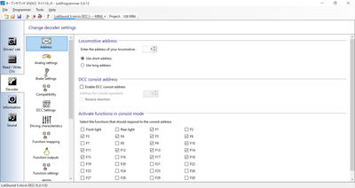

Various things have been added to the tabs on the left side, and the explanation is as follows.The screen will switch to allow you to edit and configure the settings.

## 3.3. Connecting the writing device

The LokProgrammer write device is used to write sounds and settings to the LokSound decoder.The decoder is connected between the PC and the decoder.

The LokProgrammer writing device to be connected via USB cable must have FTDI's USB serial driver installed.Normally, the software is installed automatically when the USB cable is plugged in, and no special operation is required, but in some environments, the software may not be installed automatically.

In this case, you need to download and install FTDI's USB serial driver by yourself beforehand.You can find out how to install and check it by searching for it.

> FTDI's USB driver page .
> https://www.ftdichip.com/Drivers/VCP.htm

Please note that it will not work just by connecting the USB cable; it will not recognize or write properly unless the AC adapter is connected.

If you forgot to attach the AC adapter, plug in the USB cable, or both, the following message will appear when you try to write sound data in LokProgrammer.

AC adapters are fine as long as they are compatible with the Φ2.5mm DC jack and are 12V-16V.The following is a list of adapters sold by Akizuki Electronics that have also been confirmed to work with LokProgrammer.Please note that ESU does not endorse this product, so please use it at your own risk.

|Manufacturer| Model| Specifications| Sales Location| Remarks
|:------------------|:--------|:-----|:------|:------|
|GO FORWARD ENTERPRISE|GF48-US1240 |DC12V/4A |Akizuki Denshi M-00244 |For Z,N,HO
|GO FORWARD ENTERPRISE|GF65I-US1640|DC16V/4A |Akizuki Denshi M-00407 |For HO
|Adapter Technology|STD-12020U|DC12V/2A|Akizuki Denshi M-06239| for Z,N,HO
|XIAMEN UME ELECTRONICS|AD-D120P200|DC12V/2A|Akizuki Denshi M-10659 Z|For N,HO

I have an old LokProgrammer and it doesn't work on Windows 10!The USB serial adapter from Akizuki Denshi can be used as is.This is the same one that comes with the latest LokProgrammer.It is recommended that you purchase the AC adapter along with it at Akizuki Electronics.

>USB serial adapter from Akizuki Electronics .
>http://akizukidenshi.com/catalog/g/gM-08343/

## 3.4. Writing open sound data

In the LokProgrammer screen, pre-download the open sound data, unzip the zip file, and open the esux file.
When the LokProgrammer writing device is connected to the USB cable and the AC adapter is connected to the power supply, press the icon of the following notes to write the sound data and CV setting data.

Note that if the firmware of the LokSound decoder is old, the firmware will be written before the sound data is written.In this case, the write time will increase by a few minutes, but after the firmware is updated, the firmware write operation will not be performed again if the LokProgrammer version is the same.In some cases, the firmware will be updated.

The Write button on the document icon allows you to write the data set in the Decoder tab.

If the connection with the decoder does not work, an error message will be displayed.Check that the feeder wires are connected, that there are no broken wires, and that there is no wiring error or poor contact between the wheels and the rails when mounted on a vehicle.

Please note that most of the open sound data is for the LokSound 5 series, and although there is a mixture of data created with LokSound 5 and LokSound 5 micro, it will be automatically converted for the LokSound 5 series.I can write to it without any problem.

However, sound data for LokSound 5 cannot be written to LokSound V4 series decoders.Also, it is not possible to read sound data from the decoder.Only the set value can be retrieved.

## 3.5. Description of the sound editing screen

Click on the Sound tab, and you will see a screen like the one below.This screen will be the one you use most often for sound editing.

<a href="./lok/LokProgrammer_Sound_1.png" target="_blank">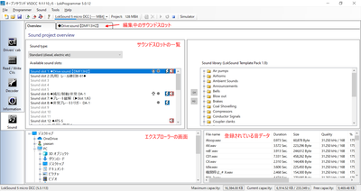</a>

## 3.6. What is a sound slot?

LokSound5 can play sounds simultaneously using up to 10 sound slots.
Various sounds can be superimposed on the sound of the MG, the blower, and the running sound to better reproduce the sound and situation.

Various sounds can be registered individually in the sound slots and sounded according to conditions to express the movement of the vehicle.The following is an example of a VVVF sound slot.

Note that *only one sound can be played at a time* in a single sound slot.When the sound slot is done playing, you can transition to the next block to play a different sound.Therefore, if you want to play more than one sound at the same time, you can set the function to associate other sound slots with each block, and use it to call up other sound slots to play them.

## 3.7. Change the function number. 3.7.

You may want to change the pre-defined function numbers (F0, F1, F2, etc.) in the open sound data, and LokProgrammer will show you how to do it.

First, open the sound data of the open sound data you want to change in LokProgrammer.

From the Decoder tab, click Function Mapping to bring up a list of functions.This screen is an important setting area where you can freely assign sound functions, auxiliary outputs, and internal special functions to function numbers.

Press the pull-down on the function number you want to change, and you will see Driving, Direction, and many others.The table below shows the explanation.

|item name| explanation |
|:---|:---|
|Driving| Driving or stopped?
|Direction| Whether the direction of travel is Fwd or Rev.
|F0| Function 0 (F0) setting or
|F1| Function 1 (F1) setting or
|F2-F28| Function 2 (F2) to F28 or

The actual screen is shown below.

Each function number can be set to enable or disable.It is also possible to tie multiple functions together and separate conditions.You can also divide the conditions into whether the vehicle is running or not, and which direction it is traveling.

As for the settings, the following items can be selected, and their meanings are as follows

|selected item name| explanation |
|:---|:---|
|Ignore | Ignore (disable)
|On | Effective when this function number is turned on.
|Off | valid when this function number is OFF|
|Yes | Valid only for Driving items.Effective when running.
| Valid only for No | Driving items.Valid when the system is stopped.|
|Enabled only for Forward | Direction items.Effective when the direction of travel is forward.
|Reverse | Valid only for the Direction item.Effective when the direction of travel is backward.

Normally, you only need to set On, but if you want to reproduce, for example, the changeover indicator lights on an electric locomotive, you will need to set the conditions to take into account the direction of travel and other function states while operating multiple auxiliary signals.
You can set various conditions to match the movement of the function you want to create.

After completing the function mapping settings, use the Write only setting data button below to write the data to the decoder.The sound data will not be written (or changed), and the writing process will end immediately.If you want to write with sound data, select the note icon on the right to write both the modified function mapping data and the sound data. 10 minutes or more will be required, so please be patient.

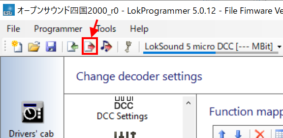

# 4. How to create a sound

## 4.1. Introduction

In this section, I'll list what you need to create sounds, how to assemble (or import) equipment, and means and tips for recording.You will need the following items

<strong>What to use for editing:</strong>
* Windows PC (for Mac users, please use Bootcamp, Parallels, or other virtual PC software)
* <a href="http://www.esu.eu/en/downloads/software/lokprogrammer/" target="_blank">LokProgrammer</a> (software, free)
* <a href="http://www.esu.eu/en/products/lokprogrammer/" target="_blank">LokProgrammer</a> (hard, imported, about 15,000 yen)
* <a href="http://www.esu.eu/en/products/loksound/" target="_blank">LokSound5 decoder</a> (micro is OK)
* Decoder tester (ESU, LaisDcc, or whatever)
* <a href="https://www.audacityteam.org/" target="_blank">Audacity</a> (sound editing software, free, or others if you prefer)
* SpectraLayers Sound editing software.You can pinpoint a specific sound to mute.

You need to get a LokProgrammer, LokSound, and a decoder tester to get started.Probably, in many cases, people who use <a href="https://desktopstation.net/sounds/" target="_blank">open sound data</a> have all of them, but if you don't, I recommend importing them.

The following two stores are often used by DCC enthusiasts in Japan.

* <a href="https://www.modellbahnshop-lippe.com/Digital/Digital+boxes/ESU-53451/gb/modell_4042.html" target="_blank">model burn store lippe</a> https://www.modellbahnshop-lippe.com/Digital/Digital+boxes/ESU-53451/gb/modell_4042.html
* <a href="https://www.tee-usa.com/store/product3714.html" target="_blank">EURO LOK SHOP</a> https://www.tee-usa.com/store/product3714.html

## 4.2. Preparing for the recording

Try not to enter in a form.The most important thing is technique and know-how.That's more important than the equipment.
Do you have a cell phone?<strong>To be frank, a single smartphone can be used for recording</strong>.However, it is difficult to record, and noise and wind noise can easily get in, so it is better to have an external microphone for your phone with good performance.I heard that the sound of <a href="https://desktopstation.net/sounds/osd23.html" target="_blank">Kiha261</a> was also recorded using an iPhone and an external microphone.

Be sure to set the recording to the highest quality.If you record in low quality, it is almost useless.

However, if you have a good recorder, that's the best way to go.Looking around, I have the impression that many people use TASCAM.I consider a microphone with a windjammer to be the most important thing, rather than a recorder.

Don't start from scratch, but try recording first with your own equipment or with a windproof microphone that you can buy for a little more money.If you can afford it, you can buy a recorder.

## 4.3. Recording tips

* Watch out for wind noise.
* Never use a windproof microphone.

With or without a wind shield (something like fluffy cat hair) on the microphone, there is a huge difference.There are many cases where you listen to a recording made without a wind shield and it is full of wind noise, making it unusable.
If you don't have one, covering the microphone with a towel or handkerchief can make a difference.

This is different from wind noise, but in some cases, a microphone with high sensitivity can also pick up the sound of touching the microphone.In this case, it is necessary to avoid touching the microphone as much as possible, or to attach sponges or soundproof sheets to reduce the sound of touching.If it's a microphone that comes with the recorder, it's taken care of, but if it's an external microphone that's super expensive, be careful.

> <b>Getting as close to the limit as you can get to the sound (from YOMIX's recording technique)</b> http://blog.livedoor.jp/yomi_tetu/archives/5467087.html  
>Since sound attenuates with the square of the distance, we were conscious of these factors.
A clear engine sound is tough to achieve unless the windows are open.
Moreover, the square of the distance means that at the end of the car, away from the engine, the
The sound of the engine becomes almost inaudible.
However, directly above the engine, the sound is blocked by the floor, making sounds above the kHz order almost inaudible.
>In this case, I tried to record directly above the engine after much deliberation because the windows were not open.
As a result, the one with the closest distance won, and we were able to record the turbine sound.
>I took this picture on the floor of the seat directly above the engine, although I said it was directly above the engine.
>It also placed the microphone directly on the floor in the space under the seat and sealed the space with a bag.
>This reduced the noise of the air conditioner, rustling and broadcasting inside the car.
>I was able to record the sound of the engine and turbine with the maximum signal-to-noise ratio that an individual can achieve.

As the distance between us increases, the sound volume decreases tremendously.Devise a location for recording that is as close as possible while keeping safety as the top priority.

For example, in-car announcements are recorded with a microphone placed right in front of the speaker.For under-floor noises, after taking a seat near the motor in the case of VVVF or near the engine in the case of diesel, cover the microphone with a bag and hold it down so as not to pick up ambient sounds.

For SIV and compressor sounds, it is better to record them from the street if there is a road nearby, rather than from the station platform, to get closer and get better quality.

<a href="./img/recording.jpg" target="_blank">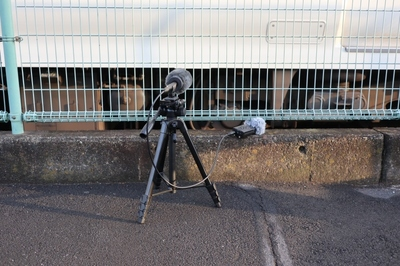</a>

* I will endure again and again and again

It's not everyday that a customer around you coughs.It's also normal for the sound to be covered by a train coming to the opposite platform.Expect to re-record it dozens of times; you'll never get it in one shot.

## 4.4. Sounds that must be recorded

The following is a list of what to record and what you will need.Also, record the same sound as many times as possible.In many cases, there are only a few that can be used properly.

<strong>What to record in the car</strong>.
* In-train announcements
* Running sounds in a train (stop - acceleration - coasting - deceleration - stop)
* Door opening and closing sounds
* Sounds of signal systems such as ATS and ATC (driver's seat)

<strong>Record at the station</strong> (If possible, record at an open station, not in a tunnel or at a station built by excavation.
* Subfloor boogie loosening, loosening sound
* Brake noise
* Compressor sound
* SIV Sound
* Station announcements

Let's make it known carefully by recording from the road and looking for the shortest speaker at the station.Some people use selfie sticks to record, but this is absolutely not allowed.You will be hit by an overhead wire and receive an electric shock.Make sure not to bother the train company.People who annoy you do not deserve to use open sound data.

<strong>Recorded at garages and stations that stay overnight</strong>.
* Panters up and down
* Startup sound, power-off sound

The next step in this process is to edit the sound.This is the process of removing noise or making a small sound louder.The main one I use is Audacity.There is also other software available, such as SoundEngine, but please use the software of your choice; it is a fact that most DCC sound users use Audacity.

>Audacity 
>https://www.audacityteam.org/

## 4.5. Sound processing and noise reduction

I will mention the processing of the recorded sounds.The tasks to be performed in the processing include the following

* Extract the sound you need
* Eliminate unwanted sounds (noise reduction process, high-pass filter, low-pass filter, etc.)
* Properly adjust the volume of sound (amplification, normalization)
* Create sound loops (whistle, SIV, bell, diesel idle sound, blowing sound, etc.)

These can be done with Audacity, the free sound editing software I mentioned earlier.

For basic operations, please refer to the introductory site or do your own research.The following filters are the ones I use most often.

In particular, I use the "noise reduction" function.For example, suppose you have a door opening and closing sound as shown below.

When you want to eliminate white noise or background sound, select the area where the background sound enters as shown below.

Select Noise Reduction to register the selected area as noise.

Next, select the area where you want to reduce the noise.It's all here.The background sound enters the entire sound of the door opening.By eliminating this sound, we can extract only the sound of the door opening.

<a href="./audacity/Audacity_door4.png" target="_blank">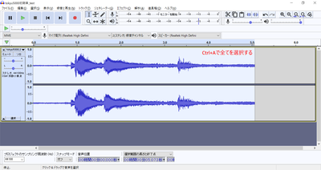</a>

Call up Noise Reduction again to adjust.The level of removal is done by checking the preview.If you overdo it, it will make a weird, tinny sound, so keep readjusting just in time.

Press OK on the noise reduction process to reduce the noise as shown below.You can see that the background sound has been reduced and cleaned up.

<a href="./audacity/Audacity_door6.png" target="_blank">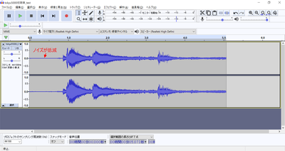</a>

Cut off the front and back, and adjust the length so that the sound is only for door opening.

<a href="./audacity/Audacity_door7.png" target="_blank">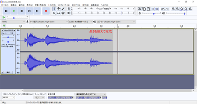</a>

If you save the file in WAV format, you can register it in LokProgrammer and use the DCC decoder to play the sound.

## 4.6. Processing and editing of running sounds

First, the running sound.The following is an example of YOMIX's diesel sound (Kiha261).

Next is an example of a Tokyu 50x0 train, given to me by Kawaii-san.
<a href="./audacity/Audacity_VVVF_TQ_1.png" target="_blank">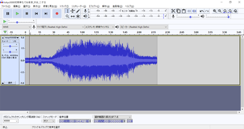</a>

The approach to creating a diesel and a train is completely different.

For the diesel, the sound of the engine blowing, the sound of the gear change, and the turbo sound changes with each gear shift, so the sound is processed so that the combination of these sounds is switched in sequence.The key is to play with the sound in a natural way after the gearshift is switched.Coasting is just the rattle of the idle sound, so it is a form of adjusting the sound to be natural by adding the sound of running wind and rail joints.The deceleration is mainly the squeaky sound of the brakes and the sound of the engine brakes, so you should be able to produce that over and over.

In the case of trains, the sound of both acceleration and deceleration is created by chopping up the sound into six or seven stages; VVVF has a unique sound even in deceleration, so the deceleration sound must be created properly so that it sounds according to the speed.

The approach to creating and editing is different, so be careful about that.Let's take a look at how to chop up the diesel running noise.

## 4.7. Departure bell cutout

All of a sudden, it got complicated by talking about the sound of running diesel, so I'll take a short break.

In this section, I would like to explain the know-how of cutting out the departure bell.This is also the sound of Mr. Kawaii's Tokyu train's departure bell.

>5050_Departure_Bell_20200423.wav
>http://buin2gou.sakura.ne.jp/sblo_files/powerele/image/5050_E799BAE8BB8AE38399E383AB_20200423.wav

First, we will separate the contents of the departure bell with three labels, start, loop, and end, as appropriate.

From here, we will search for looped sounds (a range of sounds that are played repeatedly) and cut them out.

First of all, if you look at the waveform carefully, you will see a similar shape repeating over and over again.In other words, if you can determine the range of similar places well, you can continue to make the same sound.

First, we will examine the space between start and loop.Find out where the amplitude of the sound is the smallest, and magnify it there.Then I found the following part.Adjust the zero-crossing part here by shifting its position so that it is at the border between the start and loop labels.D&D on the ○ part to shift it.

In the same way, look for the border between the loop and end labels.Make sure to determine whether you are above or below the wave, so that it connects nicely with the border between start and loop that you just determined.Here, we cut at the point where the upper amplitude becomes zero.

Select the loop range and press Shift+Space to play the loop.

<a href="./lok/LokProgrammer_loop_5.png" target="_blank">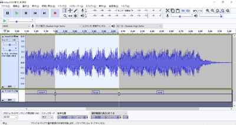</a>

When you are satisfied with the results, save the file as a multi-label export.I was able to export the following file.

> bell.zip 
> http://buin2gou.sakura.ne.jp/sblo_files/powerele/image/bell.zip

## 4.8. How to make VVVF sound

First, I would like to explain the VVVF sound editing next.

The driving sound in the open sound data is made up of three major components: acceleration, deceleration, and driving sound (wind noise).

The sound of the running wind can be low or high depending on the speed.This is set in the sound slot settings to vary with speed, but I will explain the details in the future.

The data for the VVVF system in Open Sound Data is based on the data created by MB and Kawaii, so the template is almost identical.The slots (sound channels) marked with red arrows in the following figure correspond to these.

What we are going to show here is how to edit the sound from LokSound to produce the unique sound of acceleration and deceleration, rather than the sound of driving wind.When recording, you will probably use a recorder (or a smartphone) to record in the car, but it should be a flow of stopping - accelerating - coasting - decelerating - stopping.From this, we will cut out only the acceleration and deceleration parts.

We're going to cut out two types, acceleration and deceleration, and we're going to divide each of them into six parts. Seven or eight is fine, but for open sound data, we're going to divide them into six parts. There are 127 speed steps in Speed Step, but in order to link them to the sound, I deliberately divided them into 6 steps. 127 steps would have been fine, but it would have been very complicated, so I decided to divide them into 6 steps based on what I have learned so far.

The actual sound program for VVVF in LokProgrammer is shown below.As you can see, it's just a matter of fitting six yellow blocks with six separate sounds for acceleration and six separate sounds for deceleration, and making the sound according to the speed.

Acceleration
<a href="./audacity/Audacity_VVVF14.png" target="_blank">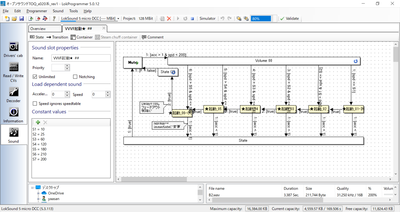</a>

Deceleration
<a href="./audacity/Audacity_VVVF15.png" target="_blank">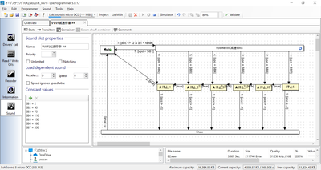</a>

Now, let's cut out the running sound from the acceleration, coasting, and deceleration sounds of the Tokyu 50X0 series.Before cutting out the sound, I need to modify the sound in various ways, but I will assume that the modifications have already been done and that the sound is ideal for acceleration and deceleration.

Know the range from departure to coasting by listening beforehand.We will divide this range into six parts.There are various ways to divide it, but the trick is to keep the slow speed as short as possible.First, we will label the part immediately after the departure.

<a href="./audacity/Audacity_VVVF1.png" target="_blank">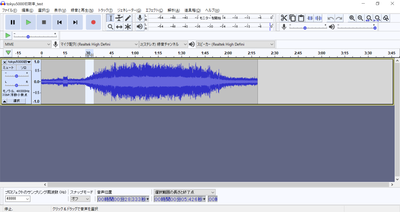</a>

Label the selection.You can adjust the position of the label after it is attached.

<a href="./audacity/Audacity_VVVF2.png" target="_blank">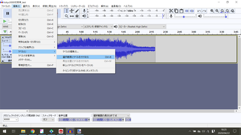</a>

Audacity makes it very easy to label and export WAV files along with the labels at any time, which I think is a must for DCC sound creation.This can be used not only for VVVF but also for others.The same is true for the cutout of the diesel running sound, which will be introduced in the future.

Repeat this process to create six blocks until the acceleration is complete.

We finished building the blocks for the acceleration section.

The trick is to make sure that the space between the blocks is where the zero crossing occurs (where the value is zero).This is because if you cut it at a non-zero value, you may hear a mumbling sound.With this little editing, you can definitely eliminate the mumbling sound.Also, if you can adjust it further, it is best to cut it at the zero crossing of the VVVF sound divider.

This technique is also used to create a looped sound (the same sound played over and over).This is an essential technique, especially for diesel, so be sure to learn it.In the case of loops, there is the additional and time-consuming task of finding similar waveforms and zero-crossings before and after the loop.

Next, we will create the deceleration blocks.In the same way, select the beginning of the deceleration and label it.

I labeled the place where the deceleration begins.We will repeat this process.

The section to the stop was moderately adjusted and labeling was completed.

From the File menu, select Export Multiple Files to actually export a WAV file.

Specify the output destination folder.It is a good idea to create a folder just for running sounds.

The labeled ranges will be individually exported to a WAV file, as shown below.

The exported WAV file can be reflected in the data by overwriting the sound file list in LokProgrammer (drag and drop from Explorer, etc.).This file is the sound file that is associated with the acceleration and deceleration programs described above.If you replace it, the sound will automatically switch to the one you replaced.

In this article, I will explain the block diagram of VVVF coasting, acceleration, and deceleration, which I have not explained enough.However, it is a simpler movement than diesel.

For the VVVF running sound, three sound slots are used as follows.In addition, there are various other sounds such as door opening/closing sound, brake loosening/slackening sound, etc. These sounds are set by mapping according to the timing, and they are made separately from the driving sound since the only action is to sound them at the same time.

First, inertia sounds.It is roughly divided into three blocks: function off, stop, and run.The driving part is the biggest part, but all you are doing is making the driving wind and the bogie buzz higher or lower, louder or smaller, depending on the speed.

<a href="./lok/LokProgrammer_VVVF_1.png" target="_blank">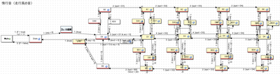</a>

It is shown in blocks as follows.The most important part is that the acceleration and deceleration sections are separated.In other words, when you are accelerating (speeding up), the upper blocks are used, and when you are decelerating (speeding down), the lower blocks are used.

Assign the acceleration sound slot to the Mapping as shown below for the objects in the red frame of acceleration.
This way, whenever you are accelerating, you will hear the sound of acceleration.

The sound slots for acceleration are the following blocksIn each slot, apply the sound of the split acceleration.The sound slot for deceleration is separate.Only when you are in the acceleration range, the acceleration sound will be played simultaneously with the coasting sound, depending on your speed.

For deceleration, assign a sound slot for deceleration in the Mapping of the block in the red frame of deceleration, as shown below.

The contents of the sound slot for the deceleration to be assigned are as follows

The squeaking and puffing sounds when the car stops are implemented with D-S blocks as shown below.In this block, we play the sound that was created in the other sound slots, and the timing of the sound is as shown in the arrow req=0 & spd <= 5, so that the sound is played when the speed becomes less than 5/255.This number will be decided on a case-by-case basis, as it may depend on the length of the sound and the habits of the vehicle.

and you can make the sound of VVVF.I think that trains, in general, will be made the way described above.

## 4.9. How to make a diesel sound

The following is an explanation of diesel sound.First, let's look at the movement of the diesel running sound used in Kiha 110 and Kiha 261.

>kiha110 
>https://desktopstation.net/sounds/osd25.html
> 
>kiha261 
>https://desktopstation.net/sounds/osd23.html

In the case of VVVF, it is so simple that it doesn't need to be explained, but in the case of diesel, when accelerating, the speed of the engine and the actual speed are different.This is because there is a gearbox, and the sound changes depending on the number of gears.It is a bit complicated, so I will explain it in order.

The overall block diagram is as follows.The flow is based on speed, moving from one block to a different block.It is divided into four major chunks: function off, when stopped, when idle, and acceleration.

The driving sound is achieved by moving within this block diagram as follows: function off, stop, accelerate, idle, accelerate, ・・・・, idle, stop, function off.

<a href="./lok/LokProgrammer_kiha261_1.png" target="_blank">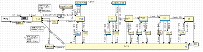</a>

The orange arrows show the flow of moving more and more blocks as the speed increases.The speed is in the range of values 255 for maximum speed and 0 for stopping.If you are a programmer, you will probably understand this easily, but if you are not familiar with it, please note that the maximum value is not 100.

For example, if the speed changes from 10 to 30, this block will play a sound up to this point.The speed is set to increase gradually, so the block will not go to the rightmost position immediately.It takes about a minute, which is determined by the acceleration/deceleration time of the Driving Characteristics (which can be set in the Decoder tab).This time is determined by you in the context of the sound playback time.It's okay if you start out with Eeyore, as long as it's roughly right.

When the acceleration is over, you will move to the "idle" block at the bottom.At this point, the sound passes through a block called DCx, and since it would be unnatural to switch the sound to idle immediately after the acceleration is over, the sound is crossfaded or cut off at the right moment so that the sound idles at the right time to blow up.I put it there to create and place the sound when the sound transitions from the

<a href="./lok/LokProgrammer_kiha261_4.png" target="_blank">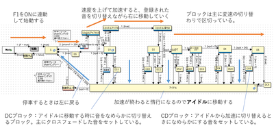</a>

Since I think it is difficult to understand, I tried to map the running sound data of Kiha261 to the block diagram.
This is a form in which the sound wave shape of the enclosed area is chopped up and the sound is assigned to the block.It is not possible to completely create all the sound data for these blocks from the raw waveforms, but this is the image.

Let's take a look at how each block is set up.

This section describes the properties inside the block.

> and Restore .
>Check this box to resume the interrupted sound when you finish playing after a higher priority sound has been interrupted.A similar feature, the Unlimited checkbox, is available in the sound slot.This one works on a per-slot basis, not on this block.

>Sample 
>Select a sound to be played when you enter this block from the sound file list.

>Repeat Playback .
>When "loop" is checked, the sound set in "Sample" will continue to be played.When the condition to move to the next block is satisfied (the condition is described in the arrow), the loop will automatically stop and move to the next block.
>If you don't check "loop", put numbers in Min and Max to specify the number of loops you want to play.

> and Flags .
>If Drivestop is checked, the vehicle will not be moved while it is in this block.

>Mapping 
>You can configure the sound slot and other settings associated with this block.The sound slot you have tied to will work with this slot at the same time.If you assign too many slots, the number of simultaneous playback slots will be exceeded and strange behavior will occur.

I will explain exactly how to change the sound.

First of all, you are at a place called S (=F1 is turned on and the car is stopped.(The sound is a rattle and an idle sound, but not while driving.Let's assume thatNotice the red arrow.
The arrow going out of the first S says "2 :[share1 != 200 & S1 = false & req > 0]" should be written.

The first number is the priority number; the smaller the number, the higher the priority.When you have multiple arrows coming out of a single block, this number will help you decide which arrow has priority.Then share1 != 200 & S1 = false & req > 0. There is a mysterious string, but it is complicated, so just look at the last req>0.

req" means "request for speed".In other words, please understand that req>0 means "speed request is greater than 0".When this condition is met, the block is moved along the arrow.
What I mean by a speed request is when you use your throttle to change the speed of the vehicle higher than zero and specify a speed.

Note that the word spd (speed) will appear later, but this is the actual speed of the vehicle (motor).The speed request is the speed specified by the person playing.Since there is acceleration and deceleration, they do not always match.During acceleration and deceleration, you should always assume differently.Note that it is easy to confuse the two.

Back to the story, after that, we enter the block called SD.Actually, this block is a "container" block, with blocks inside.Think of it as a box that holds the blocks together.Inside, there is just a block that produces a brake loosening/slackening sound.It's just making pushy or whooshing noises.

Contents of the SD block (container)

After that, the arrow 1:[true] leads to a block called Throttle Up A_02.This means "under any conditions".In other words, please understand that there are no specific conditions, but you can move.

In the SD block, when the brake loosening/slackening sound finishes playing, it will unconditionally move to Throttle Up A_02.

Let's focus on Throttle Up A_02.There should be two arrows.The red arrow points to the block of D1, the blue arrow points downward, and the arrow toward D1 is 2:[true].On the other hand, the arrow going down is 1:[acc<0].

What I mean is that <strong>acc<0 means "if the acceleration is negative"</strong>.That is, if you were slowing down.I guess there was a passenger who tried to jump on the train right after it left, so the train stopped suddenly.It would be unnatural if the deceleration started and then moved to the D1 block which accelerates the sound, so I make a blue arrow that goes to the idle.

The arrow conditions are described on the left side below.

<a href="./lok/LokProgrammer_kiha261_9.png" target="_blank">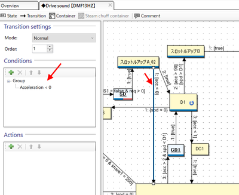</a>

You can edit the contents by double-clicking on the condition.

<a href="./lok/LokProgrammer_kiha261_10.png" target="_blank">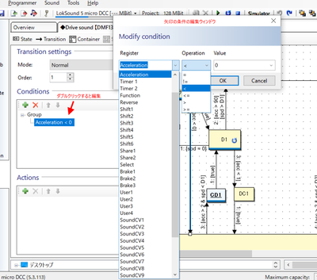</a>

For now, I was able to explain up to D1 block.

For your reference, I have placed the sound data assigned to S to D1 below.

>Data cooperation: YOMIX and yusa .
>[kiha261_A.zip](http://buin2gou.sakura.ne.jp/sblo_files/powerele/image/kiha261_A.zip)

The block assignments are as follows

| block name | allocation file
|:------------------|:--------|
|S| Idle.wav|
|Throttle Up A01| A01.wav|
|Throttle Up A02| A02.wav|
|D1| Aloop.wav|
|DC1| AX.wav|
|Idle| Idle.wav|

## 4.10. How to use SpectraLayers

Using SpectraLayersPro, a software program that can analyze frequencies and edit sounds, I was able to crisply process the recorded sounds for DCC sound, and I would like to show you how to use the function.

It is a paid software, but it can be purchased for around 5,000 yen every few months at online sales.

>SpectraLayers
>https://www.sourcenext.com/product/vegas/spectralayers/

First, the following screen will be displayed immediately after startup.

Here, you can open a recorded MP3 file or WAV file (real sound data recorded with a recorder) from D&D or the menu, and prepare the one that contains the sound of the coupling part from the E5 Series running sound.

>E5 Series Recording Sound 
>http://buin2gou.sakura.ne.jp/sblo_files/powerele/image/E5_test1.wav

This is what it looks like when opened in Audacity.

When I open it, I think I'll find something fuzzy.This is the data that displays the sound data by frequency.If you remember your elementary school, junior high school, or high school science class, you will know why sound is made in different frequencies.

Play the sound here.You can see that there are a few noises.

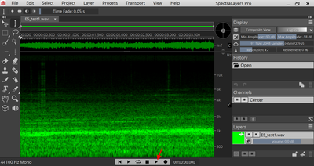

If you look at it, you will see some suspicious vertical streaks.This software allows you to play only a specific range.Use the Select Area tool to enclose the vertical streaks and press the Play button.You should hear a vertical streak near the sound.

I'm starting to see that these vertical streaks are noise and that I should turn them off.I'm having trouble figuring out how to turn it off.There are several ways to do this, but I think the best one is stamping, so let's use the stamping tool to erase them.
First, press the PickSource button and then select the source location to be stamped.The size and aspect ratio of the stamp can be selected in the Tools menu (Size, Aspect Ratio) above.

First, I was able to erase it cleanly with a stamp.
In addition to stamps, you can use the vertical selection tool and the magic selection tool.After selecting, press the Delete key to remove the area.

The magic selection tool is just right for getting rid of the noise that gets mixed in.

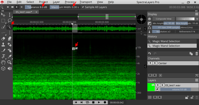

At any rate, if you make full use of this, you can create data.The final cleaned object is shown below.All vertical stripes were removed.

>Completed sound data .
>http://buin2gou.sakura.ne.jp/sblo_files/powerele/image/E5_testAfter.wav

If you want to save the file in WAV format, please choose Int 16bit, but you can also choose Float 32bit, but LokProgrammer cannot register it.If you make the mistake of exporting a Wav file in Float format, don't worry, Audacity will open the Float 32-bit file without any problems, and you can save it in Int format in Audacity.

It is recommended to use Spectra Layers Pro in combination with Audacity.

# 5. mounting method

## 5.1. Notes on installation

There are some important things to consider when installing a DCC decoder in a vehicle.

- Thoroughly insulate the wiring and decoder.
- Keep internal wiring to the minimum required.Keep the wiring short.
- Always use a tester to check for shorts, and make sure there is no contact between the wiring coming from the wire and the function or speaker.
- Be sure to install and test run an inexpensive decoder before installing a LokSound decoder.To use an inexpensive decoder to drive the car.
- Use a decoder tester to verify that the running and sound functions of the LokSound decoder are working properly.

We have a checklist for you.Be sure to check it when loading.

|Check |Check
|:-|:-|
| Did you use the command station to limit the current or set the current capacity of the AC adapter to a smaller value?
|Has the conductive part of the speaker been insulated?
|Is there any contact between the speaker wiring and the wiring from the line, or are they close together?
| Have you checked all the parts with a tester?
|Have you checked the operation of an inexpensive decoder when the car is stopped?
| Did you break in at a stoplight with an inexpensive decoder?

Electricity has a tendency to flow in the direction of less resistance.It is similar to how resistance is like a dike, dam, etc., and water flows in a lower direction.
If there is nothing to stop the flow, it will flow a lot at once.Since water is viscous, the water flow will not be that large, but since there is no viscosity in electricity, it will flow as far as the limit of the power supply if there is no resistance.Therefore, the flow of electric current generates heat (just like in an oven), which leads to destruction.

Therefore, insulation measures are the most important to prevent shorts (a blunder of assuming zero resistance).This is a part of the process that you should never skimp on.

## 5.2. use the auxiliary board installed

If your system has a decoder that can be replaced, such as Next18 or MTC21, be sure to perform the operation check first.An inexpensive DCC decoder in the 1000 yen range can be used to check operation, so even in a worst-case scenario, the damage will be minimal.

Many people have broken expensive LokSound decoders in the past, but now there are ways to test them without breaking them, such as Next18 and MTC21.There is no way not to take advantage of this.

We are distributing an auxiliary board called ExpBoard, which makes it easier to convert Japanese vehicles to DCC.Please make use of it.

|Manufacturer |Product Name |Connector |Scale |ArtNo |URL |
|:-|:-|:-|:-:-:|:-|:-|
|TRAINO |ExpBoard EC-Slim Easy | Next18 | N | ECS-E1 |[URL](https://desktopstation.net/wiki/lib/exe/fetch.php/ecslim-ver2amanual.pdf) |
|TRAINO |ExpBoard EC-Slim Standard | Next18 | N | ECS-S2 |[URL](https://desktopstation.net/wiki/lib/exe/fetch.php/ecslim-ver2amanual.pdf) |
|TRAINO |ExpBoard EC-Slim Economy | Next18 | N | ECS-C6 | [URL](https://desktopstation.net/wiki/lib/exe/fetch.php/ecslim-ver2amanual.pdf) |
|TRAINO |ExpBoard EC-Slim Type T | Next18 | N |ECT-S2 | [URL](https://desktopstation.net/wiki/lib/exe/fetch.php/ectmanual.pdf) |
|TRAINO |ExpBoard EC-Slim Type F | Next18 | N |ECF-S2,ECF-E4 |[URL](https://desktopstation.net/wiki/lib/exe/fetch.php/ecfmanual.pdf)
|TRAINO |ExpBoard EC-Slim Type H | Next18 | N |ELH-S1,ELH-E1 |[URL](https://desktopstation.net/wiki/lib/exe/fetch.php/ELH-Manual.pdf) |
|TRAINO |ExpBoard EC-Slim SL Type A | Next18 | N |SL-C57/D51 |[URL](https://desktopstation.net/wiki/lib/exe/fetch.php/expforsl-manual.pdf) |
|TRAINO |ExpBoard EC-Slim SL Type B | Next18 | N |SL-C59/C62 |[URL](https://desktopstation.net/wiki/lib/exe/fetch.php/expforsl-manual.pdf) |
|TRAINO |ExpBoard EC-Slim SL Type C | Next18 | N |SL-C58 |[URL](https://desktopstation.net/wiki/lib/exe/fetch.php/expforsl-manual.pdf) |
|DesktopStation|ExpBoard for KATO HO| Next18 | HO |10024 |[URL](https://desktopstation.net/wiki/doku.php/expboardnext18)|
|DesktopStation|ExpBoard for General HO| Next18 | HO |10023 |[URL](https://desktopstation.net/wiki/doku.php/expboardgeneral)|
|DesktopStation|ExpBoard for YP| MTC21 | HO | 10026 |[URL](https://desktopstation.net/wiki/doku.php/expboardendo)|
|DesktopStation|ExpBoard for YP SHORT| MTC21 | HO | 10035 |[URL](https://desktopstation.net/wiki/doku.php/expboardendo)|
|DesktopStation|EF81 Light Board| - | HO |10031 |[URL](https://desktopstation.net/wiki/doku.php/ef81lightpcb)|
|DesktopStation|ExpBoard EH200| MTC21 | HO | 10030 |[URL](https://desktopstation.net/shop/products/detail/55)|
|Fujigaya2|ExpBoard for KATO HO DE10| Next18 | HO | 10033 |[URL](https://desktopstation.net/shop/products/detail/65)|

## 5.3. DCC connector

When a DCC decoder is installed in a vehicle, a connector can be used to facilitate decoder replacement.In addition, highly functional connectors with a pin count of around 20 pins are now becoming mainstream, especially in Europe and the United States.

In the past, direct wiring to the decoder was the main method, which required rewiring in case of trouble and was very difficult to get used to.

In Japan, NEM652 is often installed as standard in KATO's HO motive power, but in some cases, DCC is not so much considered for bogie motor types (E5 series, EF81, EF510), such as TOMIX, Endo, Katsumi, Dentetsu Kobo, U-TRAINS, etc.It is analog-only and does not have DCC support as a standard feature.

OpenSound Data recommends MTC21 and Next18 as the standard for DCC connectors.The following is a list of typical DCC connectors.

|connector |number of pins |scale |Notes
|:-|:-|:-|:-|:-|
|NEM651 | 6 | N | Successor is Next18 |
|NEM652 | 8 | HO | Successor is PluX or MTC21
|NEM662 Next18 | 18 | N | Increasingly popular in N gauge
|NEM660 MTC21 | 21 | HO | Developed by Mercklin, currently in a standards battle with PluX
|NEM658 PluX22 | 21 | HO | PluX8, 16 seems to be fading out

> Note that the MTC21 has two different types of function outputs, while using the exact same connector.There are two types of AUX3 and AUX4 outputs: one for Merklin, where AUX3 and AUX4 are power outputs, and one for DCC, where AUX3 and AUX4 are logic outputs.When purchasing a decoder, please check carefully what the output method for AUX3 and AUX4 is before purchasing.There are some decoders that can be switched by changing the settings, but in some cases they are fixed due to hardware limitations.

KATO HO standard motive power and many HO cars designed more than 10 years ago use NEM652 (NMRA 8 pin).The pin assignments are as follows

The pin layout of the Next18 connector is shown below.The Next18 connector is manufactured by an overseas manufacturer, and is difficult to obtain in Japan.

| |Pin | Pin | | |
|:-|:-|:-|:-|
|RAIL_A| 9 | 10 |RAIL_A|
|Head |8 |11 |Motor-|
|Speaker+ |7 |12 |AUX2|
|COM+ |6 |13 |AUX4|
|GND |5 |14 |GND|
|AUX3 |4 |15 |COM+|
|AUX1 |3 |16 |Speaker-|
|Motor+ |2 |17 |Tail|
|RAIL_B |1 |18 |RAIL_B|

The specifications of the MTC21 connector are as follows: Since it uses a 1.27mm pitch pin header and pin frame, the availability of connector parts is very good in Japan.

|Assignment| Pin| Pin | Assignment|
|:-|:-|:-|:-|
|Sensor1| 1 |22 |Line Left|
|Sensor 2| 2 |21 |Track Right|
|AUX6(L) |3 |20 |GND|
|AUX4(L) |4 |19 |Motor+|
|SUSI CLK| 5 |18 |motor-|
|SUSI DAT| 6 |17 |AUX5(L)|
|tail light |7 |16 |COM+|
|headlight |8 |15 |AUX1|
|Speaker2| 9 |14 |AUX2|
|Speaker1| 10 |13 |AUX3(L)|
|no pins |×| 12 |VCC +5V|

## 5.4. AUX, HEAD, TAIL wiring

When wiring the lights with DCC, there are two types of modes: bi-polar mode and open collector mode.You may be familiar with the bipolar mode as it is commonly used in analog.The open collector mode, on the other hand, is probably familiar to electricians, but not so familiar to modelers.In other words, think of it as a mode where the internal switch also turns on when it is turned on, allowing current to flow.

### 5.4.1. HEAD and TAIL in bipolar mode

You will need to connect the wires as shown below.This is the exact same wiring configuration as a normal analog light unit.In the light unit, the tail light LED and the headlight LED are connected in just the opposite way (called reverse parallelism).

If the light unit does not support the DCC method (COM+ and the three wires of HEAD/TAIL) and it is difficult to modify it, you can use it without modifying the light unit by wiring it using an ExpBoard or bi-polar conversion board that supports the bi-polar mode.

### 5.4.2. AUX, HEAD, TAIL (open collector) of DCC standard wiring method

The wire named COM+ has a positive voltage on it.

On the other hand, when AUX1, AUX2, HEAD, TAIL are turned on by a function, the internal switch connects them to the negative side.(This is the same as the drainage flowing into a kitchen sink.When the light is off, the internal switch is off, so it is not connected to the negative side, so no current flows and the light does not turn on.

The resistor can be positioned either before or after the LED, but the polarity of the LED should be chosen so that the longer LED wire (A, anode) is on the COM+ side.

## 5.5. KATO HO (single train cars KUMOHA40, KIHA110, etc.)

KATO's HO Kiha110 200 series (1-615) has NMRA connectors, but is not fully DCC ready.

However, I know that I can make the board fully DCC-ready by cutting some of the patterns and modifying it, so I modified the board to DCC sound, even though not a single word in the manual says that it is DCC-ready.

Under the floorboard is as follows.The weighted steel plate is replaced by ExpBoard Next18 for KATO HO.

The board before modification is shown below.

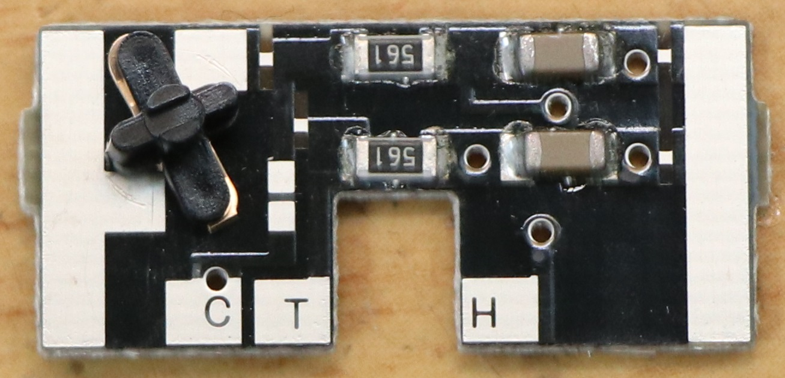

There are patterns that tell you to cut and jumper, so I did as the board told me to cut and jumper the patterns.

In a nutshell, the following is a list of the parts.

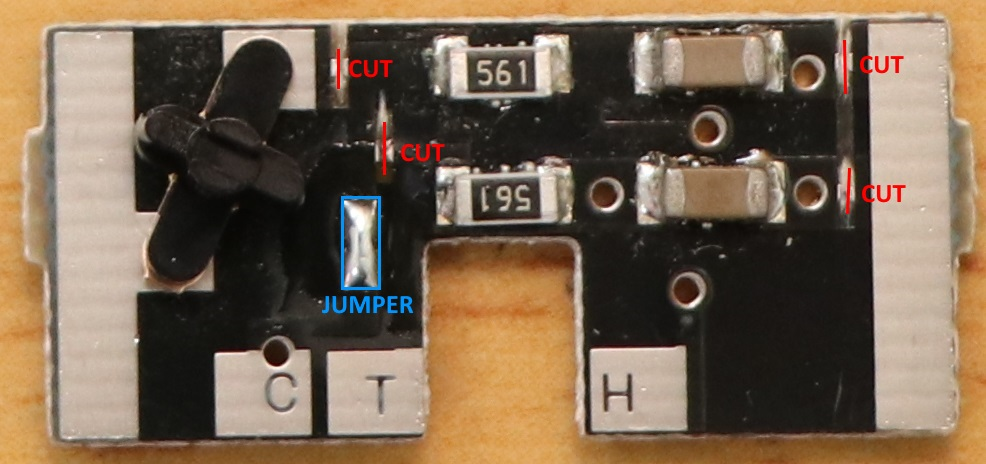

> Important!
> C, T, H are written on the LED lighting board, but if you wire them as they are, you will get a strange result.Since we are using the exact same board, we have to switch the wiring to match the direction of travel because the chassis, or rather the positioning of the lights on the vehicle, is opposite.
>
> FWD side (at the end of →)
> C: Same wiring is OK
> T: Connect H(Rear,NMRA Pin2)
> H: Connect T(Head,NMRA Pin6)
>
> REV side (buttock side of →)
> C: Same wiring is OK
> T: Connect T(Head,NMRA Pin6)
> H: Connect H(Rear,NMRA Pin2)

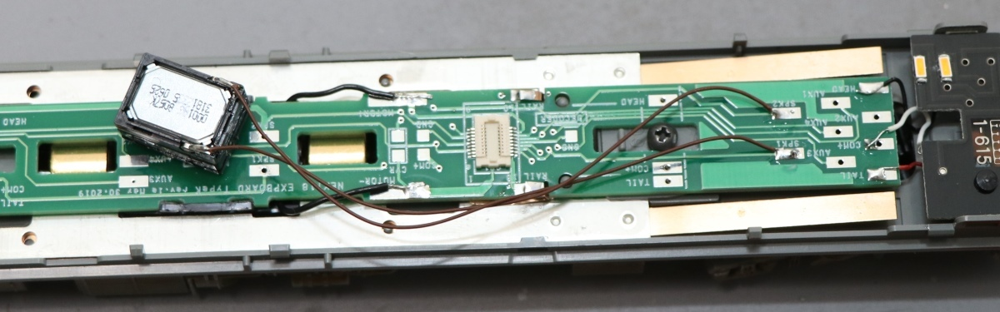

The opening in the floor plate is only open for the size of the Next18 connector.Therefore, we cannot put the decoder in this way.

Therefore, we will hollow out the opening to allow for the decoder to be mounted.

## 5.6. KATO HO (power cars, Kiha80, etc.)

We will be installing the LokSound5 micro on KATO's HO Kiha80 M cars.

* Soldering iron and other soldering tools
* Pin vise, tweezers
* Speakers
* LokSound5 micro
* ExpBoard Next18 for KATO HO https://desktopstation.net/wiki/doku.php/expboardnext18
* KATO HO Kiha80(M) 1-611 https://www.katomodels.com/product/ho/kiha82

We will work on the loading process.

<a href="./img/KATO_kiha80M_Next18_3.jpg" target="_blank">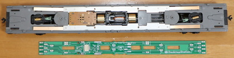</a>

Solder the phosphor bronze copper plate.If you bend it too much, it won't hit the metal weight underneath firmly, causing poor contact, so solder it the same way as in the picture.

Make sure that it is in contact with the metal weight underneath, like a plate spring.

<a href="./img/KATO_kiha80M_Next18_7.jpg" target="_blank">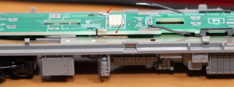</a>

Solder and install.

Cut out the red line.Cut the seat part with a cutter.If we don't cut here, we can't mount the Next18 decoder.

<a href="./img/KATO_kiha80M_Next18_9.jpg" target="_blank">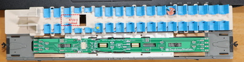</a>

<a href="./img/KATO_kiha80M_Next18_10.jpg" target="_blank">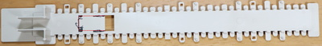</a>

Make sure the decoder is in place.

No problem.

<a href="./img/KATO_kiha80M_Next18_12.jpg" target="_blank">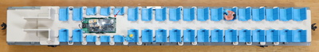</a>

Use a pin vise to make a hole for the speaker to pull the sound down.

The speaker can be hidden in the toilet or other part of the building, so you can use a pin vice to drill a hole here, wire the speaker, and solder it.The way to hide it depends on the size of the speaker, so I'm sure everyone will have their own ideas.

All that's left to do is cover the vehicle, check it works, and you're done!

## 5.7. Tomix HO

As usual with Tomix HO cars, the design does not take DCC conversion into account at all, so it is necessary to disassemble the car and pull the wires around.I hope you will be prepared for the fact that the hurdles are very different from those of KATO's HO vehicles, and that you will be able to DCC them.

In this section, we will use Kiha261 (HO-9047, HO-9097) as the subject of our DCC sounding work.The first step was to rewire the motor.First, remove the top side and take out the floorboard and motor, etc.

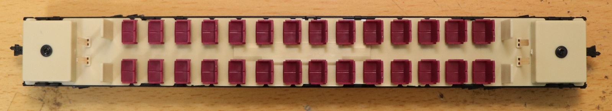

Remove the seat and you will see the motor.

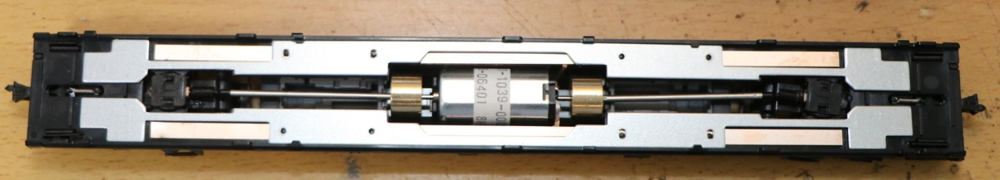

Remove the metal weight.

Remove the copper bar as well.

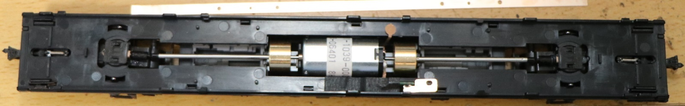

Use a soldering iron to remove the copper plate attached to the motor.

Solder a thin wire (AWG30 or AWG32 is recommended) that you have prepared separately and attach it.

Now that the wires have been pulled out, we will reassemble it.

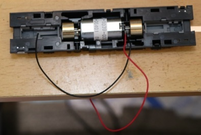

Push the motor back into its original position.

Put the copper bar back.

Put the metal weight back.

When pulling out the electrical wires, check the position to pull them out as they will interfere with the seat area.
After checking, make a hole with a pin vice or similar tool and pull out the wire.

I pulled out the wires to the seat area.In addition, there is a way to pull the floor around without pulling it out.
Wire it according to your own preference.

Here we have ExpBoard Next18 for General HO (https://desktopstation.net/wiki/doku.php/expboardgeneral) and PUI Audio's ASE02506MS-LW90-DSM-R speakers.I did.Since we have a diesel car, the trick is to choose speakers that produce clear diesel engine sound. ASE02506MS is thin and sounds pretty good.
 

LokSound5 micro installed.

The decoder and ExpBoard should be well hidden.
 

The DCC conversion process is complete!

## 5.8. Tramway HO

I'm going to try my hand at DCC sounding Tramway's Kiha 40-500.Let's take a look at the process of removing it from the box.

<a href="./img/Tramway_HO_Kiha40_500_1.jpg" target="_blank">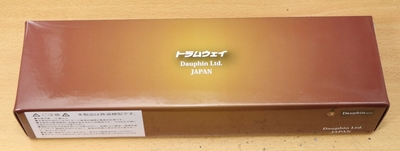</a>

Research to be DCCed and taken apart.Unfortunately, the NEM652's 8-pin and other connectors were not attached.

This is the first time I've bought a Tramway car, and it has a weighted steel plate on the outer chassis.Thanks to this, the under-floor section is only made of plastic parts, making it easy to build inside the car.Instead, rigidity has been sacrificed....

The connection to the upper lighting board is a pogo pin.You could say that this kind of usage is also possible, but...

<a href="./img/Tramway_HO_Kiha40_500_9.jpg" target="_blank">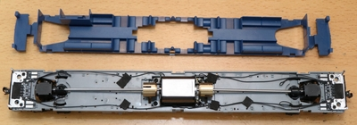</a>

Light board (bottom).The wiring from the wire, the motor, and the other side of the board are in place.
In the end, only the common, F0 output, and interior light control signals need to be wired.

<a href="https://www.mmjp.or.jp/tramway/goods/pg350.html" target="_blank">I found the schematic for the lighting board on Tramway</a>, so I guess I'll rewrite it in BSCh and assign it to DCC.I wrote the following.I haven't tested this yet, so I could be wrong!Be careful.

>Note: Operation has been confirmed by modifying the circuit as per this schematic, but operation is not guaranteed.

This is illustrated on the board.The red line is a pattern cut.Use a cutter or similar tool to scrape off the copper pattern on the board to remove it.The work is to make it compatible with the NMRA 8-pin with open collector output from the bi-polar type.

>Note that the color and pin number of the NMRA pins are shown in the diagram, but it does not mean that you should wire them as they are, because the meaning changes with FWD/REV in the light system!

<a href="./img/Tramway_HO_Kiha40_500_12.jpg" target="_blank">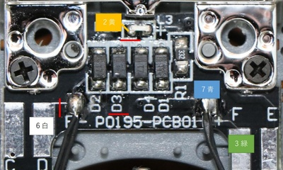</a>

Instead of adding two light decoders, such as the common FL12 or the one-coin decoder FL, we have dealt with this by cutting patterns and adding wiring to the board so that the ESU LokSound pins can be used as they are.It requires complicated wiring work inside the car and is for advanced users, so if you think it will be difficult, it is better to use a FL decoder.

Now let's get to work.First, use a soldering iron to remove the wires that are directly connected to the line.Tail light wiring, adding wires to the LEDs.

I added the wires to the board.These are for headlights, taillights, and interior lights.The board on the chassis side is designed so that it does not need to be modified at all.

Once the wires are soldered, fix the wires in place.We used the original adhesive tape as it was.

The cover is now installed.For the wiring drawer, some holes are drilled to take out the wires.The wiring was connected to the ExpBoard Next18 for General HO pads.

I don't want it to move due to vibration, so I used acetate adhesive tape (insulating and easy to install!)Fixed withI also painted the speakers black.

By using Next18, the pile of wires will not stand out greatly when the car body is covered.

<a href="./img/kiha40_next18_6.jpg" target="_blank">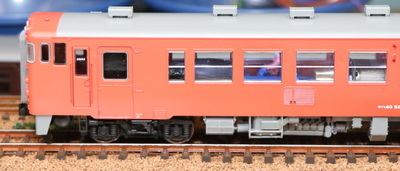</a>

Next, we considered installing interior lights.On the ceiling side of the Kiha 40, there are terminals for the interior lights.When I measured it with a tester, the circuit diagram said 4.7kΩ, but the actual value was 2.2kΩ.I guess I shouldn't trust the constants in that schematic...The wiring seems to be correct.
The other thing that bothered me was that it didn't say anything about which side was the positive side.Do you guys use testers to find out what's going on?It would have been nice if they had written it on the back of the board with silk.In case you are wondering, I marked them with masking tape as you can see in the picture.Please refer to.

It was hard to buy expensive lights, and it was also troublesome to make arrangements, so we used tape LEDs that had fallen down in the company. 3 series LEDs with a current limiting resistor of 150Ω.I attached the wire and tab terminals.

In the meantime, I'll do some calculations and see if it shines a little.

Since there are 3 LEDs in series, Vf=2.5*3=7.5V (assuming Vf of white LEDs is about 2.5V)
Resistance value is 2.2kΩ+150Ω=2.35kΩ
When the voltage is 12V, V=IR→V-Vf=IR, so 12-7.5=I*2.35k, I=(12-7.5)/2.35 = 1.9[mA].

I could tell from my calculations that it was vague and barely glowing.

After installing the LED tape, it looks like the following.

I made it glow.As you can see, the light is very subtle as calculated, but I think it is quite good for a model interior light.It looks like we can avoid the dumb operation where it keeps glowing even though it is being sent to the garage.

## 5.9. ENDO HO

We will use ExpBoard YP to create DCC sound for the Kintetsu 22000 series pre-painted kit.

> ExpBoard YP
> https://desktopstation.net/wiki/doku.php/expboardendo

First, I soldered the ExpBoard YP.The difficulty is high because of all the small parts.The MTC21 connector is a 1.27mm pin header, but the black index pins should be removed beforehand.It seems to be for preventing accidental insertion.

<a href="./img/EypBoardYP_9.jpg" target="_blank">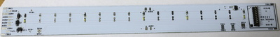</a>

IC1 is marked with <strong>A1</strong>, and IC2 is marked with <strong>G3</strong>.The Schottky diode and the constant current diode are attached to D1 and D2, but even if they are reversed by mistake, they will work normally.However, please make sure that the position of the anode and cathode are correct.

<a href="./img/EypBoardYP_10.jpg" target="_blank">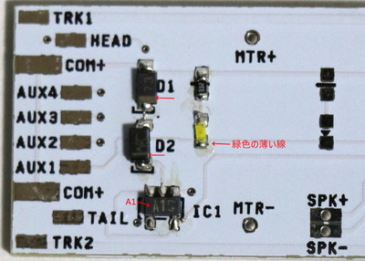</a>

After soldering, I also attached the speakers.

Preparation work for the actual integration.

Mounted the soldered board on the ceiling and checked its position.

<a href="./img/EypBoardYP_8.jpg" target="_blank">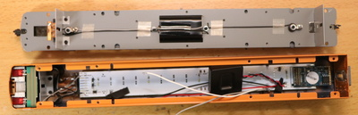</a>

Thanks to the ExpBoard YP, the headlights, taillights, interior lights, sound, etc. are very easy to install, but the underfloor area is not considered at all, so I spent a surprising amount of time installing the connectors.

Checking the operation of the bi-polar function. the ExpBoard YP has the function of bi-polar board, so you can use the bi-polar output instead of the open collector output that is usually used in DCC.This means that the headlight and taillight units of analog vehicles are usually dedicated to both polarities, which makes it easier to install them in Japanese vehicles.

This is how it worked for the time being.

## 5.10. Dentetsu Kobo Plastic HO

Dentetsu Kobo is a manufacturer of 1/80 HO brass models located in Kanda Jimbocho, Tokyo.It has a reputation for precision and high reproduction, and is popular among model enthusiasts.

> Dentetsu Kobo 
> Room 1F1, Kanda Yoh Building, 1-52-12 Kanda Jimbocho, Chiyoda-ku, Tokyo 
> https://dentetsukobo.jimdofree.com/

Here, I will be doing a DCC soundification of the 115 series that I released a while back.

There is no specific stock information on the Internet (Dente Kobo doesn't post stock information on the Web, so the only way to check stock is to go there in person or call them...), but they say they have it, so if you're interested, why don't you contact them or visit them on a Friday or Saturday business day?

For your information, the prices are listed below for the 4-car basic set.

- Shonan color: 46,800 yen (tax not included)
- Yokosuka (Suka) color $47,250 (excluding tax)

I couldn't make a long formation (no place to put them, too many of them would make me angry, etc.), so I chose the Ska color because it looks better in a 3-car formation than the Shonan color.

In the case of Shonan color, the M car will be the middle car.The Ska color requires more man-hours because the M car is the lead car.The processing method shown here can be used for both the lead car and the M car, so I think it will be more helpful.

That being said, I'll be DCC-ing Dentsu Kobo's 115 series!Of course, it uses open sound data.

Preparation of components

As you may have noticed if you've played around with Open Sound Data, the speaker selection actually differs depending on the sound.Some sounds fit a sugar cube kind of thing, while others are so bass-heavy that you need a big enclosure to get the best out of them.
The best fit for the MT54 is the ASE02808MR-LW150-R, although it is also big.

We selected ExpBoard General HO for the DCC conversion because it is a plastic HO and it is Next18.
Also, I didn't want to mess with the light board, so I used a bi-polar board (AYA014-2) from DCC-Kan.I don't want to make a Japanese style DCC without this anymore (laughs).

| Parts | Quantity
|:-----|:-----|
|Denteki Kobo Series 115-800 Suka Color Basic 4 Cars (1/80) - 1
| ESU LokSound5 micro DCC (Next18 version) | 1
| ExpBoard Next18 for General HO | 3
| PUI Audio ASE02808MR-LW150-R | 1 | 1
| DCC-Kan AYA014-2 Bi-polar PCB | 2
| LaisDcc Next18 Decoder | 3 | LaisDcc Next18 Decoder

Conversion of vehicles to DCC (M cars)

It's simpler than the Tomix 113 series I bought before, and the wiring drawer is very easy.

Pull the wires out of the copper plate.Use the pre-installed wiring for the motor as is.

I'll put it back together.

Pre-drill the holes for the floor plate covers.Also, insulate the terminals of the interior light output with tape.This is to do the AUX1 wiring later.

Be creative in choosing where to drill holes so that the cables can be pulled out.

Select the position of the speaker.I chose the middle car side.The backrest should be cut.It is also a good idea to drill holes in the floorboard cover to allow the sound to escape.

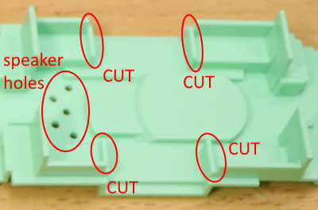

Wire to ExpBoard General HO.It will be over soon.Always check for shorts with a tester when you're done!

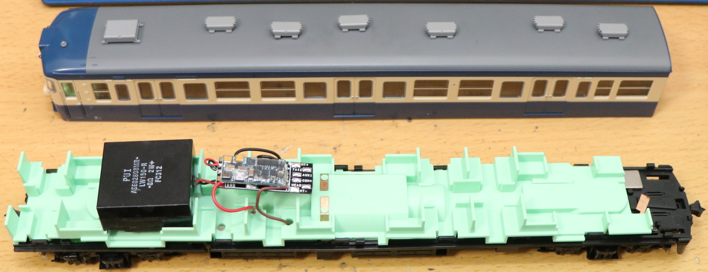

Preparing the interior lights.Since the terminals that correspond to the pogo pins of the interior lights have already been insulated, solder them as shown below, and wire COM+ and AUX1.

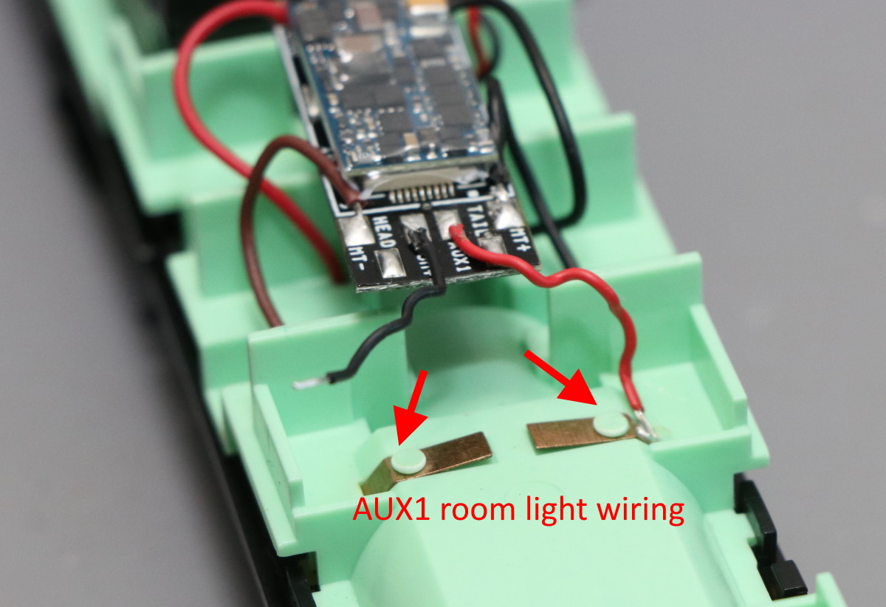

In wiring the headlight and taillight, use a bipolar board for easy mounting.We will also install it in a less intrusive way this time.First, remove the copper plate that is wired to the switch.Accident prevention.

The other side is wired with insulation tape and a copper plate on top of it.By doing this, you can hijack the contacts of the headlight/tail light springs and use them in DCC.

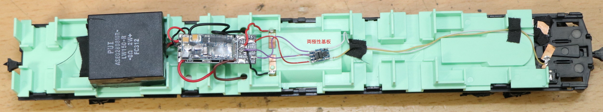

Fix the bipolar board and you are done.

The top cover, or casing, or case, was installed without any problems.

Writing sounds

I'll have to use the MT54 JNR suburban model, which is touted as having the best sound quality in the world!
I chose the 113 series sound data (V5_JNR_113・415v2.33_Open sound) because I heard that the 113 series sound is closer than the 115.
Note that the output of the F0 headlight/tail light and AUX1 interior light are set to 0 by default, so it is better to change the output value to 25 before writing.

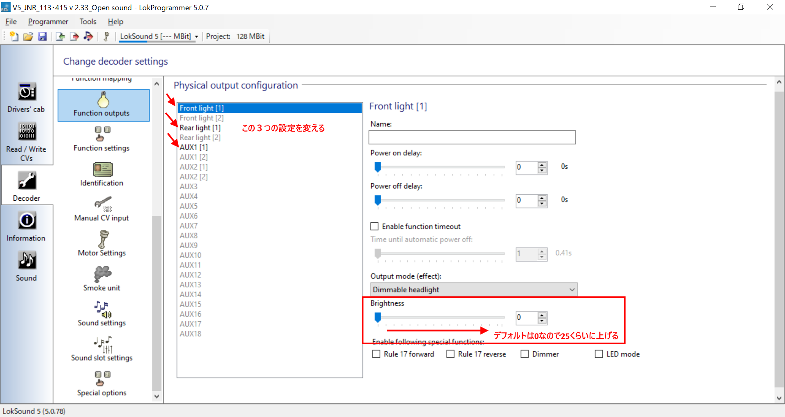

I tried to move it.

I tried to move it, and... quite an understatement, it's bad!It only looks (and sounds) real.I can't even imagine not having the sound anymore, it's so bad.Perhaps those who are experiencing the DCC sound for the first time will not stop laughing.It's so bad, you'll be laughing.

> Videos on Youtube 
> https://www.youtube.com/watch?v=hJqH0iEmcyQ&feature=emb_title

Next, we will move on to the processing of the T-car of the Dentetsu Studio 115 Series Suka Color.This is a DCC process for a lead car without a motor.

Open it first.

Further remove the floorboard.A precision flathead screwdriver is helpful.

The first LED is split by this switch.Since it is controlled by a decoder, I would remove the copper plate with a soldering iron to avoid wiring to the switch.

This is the insulating process for the copper plate for the interior light drawer of the floorboard plastic, and the hole for the wiring drawer.It can be easily opened with a pin vice.

Forcibly soldered to the metal weight, since there was no part of the copper plate that was clean...

The floorboard plastic is reinstalled, and the ExpBoard General HO is installed to mount the Next18 decoder.

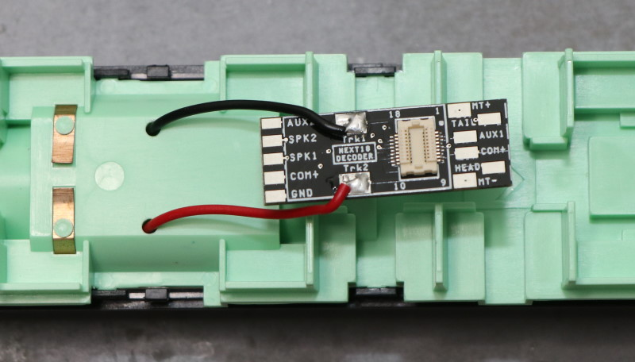

Now we need to wire the interior lights (COM+ and AUX1 are soldered.(Polarity is not an issue for the interior lights of the Dentsu Studio 115.The headlights and taillights were wired to the DCC building's bipolar board.Very easy.
I insulated it with acetate tape and placed a copper plate so that I could apply a spring to it and use it for wiring from the DCC decoder.

Check operation and complete.

Decoder settings

For the decoder, I used laisdcc's 860015 Next18 DCC Decoder (PanGu series).
By default, AUX1 (interior light) is assigned to F1, so just change this to F3.
In the "h) Function Remapping" section of the LaisDcc decoder manual, CV35 is AUX1, which defaults to 4 (F1), so you can change this to 16.

## 5.11. N-Gauge

### 5.11.1. KATO Series 113

At last, KATO 113 Series Tokaido Line colors have been renewed!Of course, I wanted to recreate that nostalgic MT54 sound, so I decided to include the usual LokSound decoder.

The first step is to convert the M car, Moha 113, to DCC.

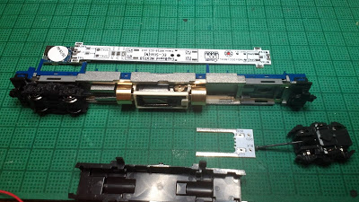

The ExpBoard EC-Slim is equivalent to a standard set, with additional interior lighting.

>ExpBoard EC-Slim  
>https://desktopstation.net/wiki/doku.php/expboardecn

Remove the body and under-floor cover of the Moha 113 and consider how to install it.Place the sound decoder on the left side of the screen where the interior light unit will be installed.
 

We also decided to install the speakers on the right side.I will use a Takachi case (SW-15B) and a speaker purchased from ali.
 
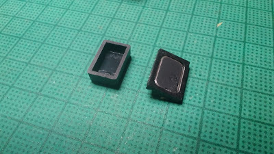

The case of the takachi is shaved thinly in half.This is what it looks like before assembly.

The unit and case are fixed with transparent rubber adhesive.Also, the metal terminals on both sides of the train will be turned upward and placed against the body, so that they can be pressed against the floor.

As usual, the EC-Slim is inserted into the EM13 mounting area.This time we will use a blue cable because the room is blue.If the cables are the same color, there is a possibility of mistaking the connection point, so it is a good idea to put a sticker with the signal name on it.

Pull the cable out of the gap between the under-floor parts and check that the under-floor parts are securely attached.(Actually, I started with the usual gray cable, but changed it to a blue cable halfway through the production.

It is a good idea to do a driving test once in this form.

Place the EC-Slim and speakers on top of the power unit and position them to determine the length of the wiring.

Cut the wires, peel off the tip coating, and solder them.

Put the board on and wire TLK1,2 MT1,2.Double-check that the wiring on the rail side and the motor side is correct.In addition, wire it to the speakers.

After a test run to make sure everything is okay, we put the body over it to test the sound.This time, it was a little bigger than the usual plastic enclosure, so it might have been a little louder.

### 5.11.2. KATO C59 DCC sound processing

Introduction of DCC sound processing for C59 (KATO product).

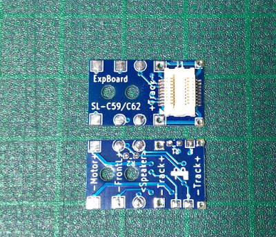

The ExpBoard is similar to the one used for the C57, but the terminal locations are different.
 
The one for the C57 was installed on the bottom side of the decoder, but this one is designed to be installed on the top side of the decoder and speaker, and has wiring pads on both sides.

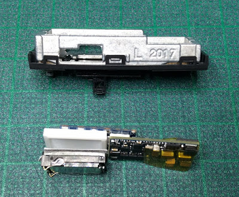

The C59's tender is long, but it has a radius on this part, so I used the luthier to carve it in a little.

The speaker units are the same as always, distributed by Nagoden.

> Nagoden http://www007.upp.so-net.ne.jp/nagoden/

The terminals should be cut short so that they do not touch the weight where the current from the rail flows, and solder-plated for easy wiring.

The enclosure is the plastic board/plastic rod combination that I introduced before.Trim off the corners and file out the grooves for the speaker wires.

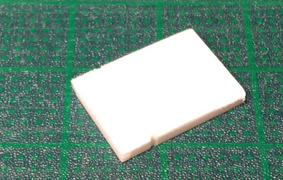

Let's temporarily place the speaker and enclosure inside the die-cast parts.If the die cast expands, re-shape the area where it hits.

Make sure each part will fit inside the weight.In particular, if the PCB jumps above the weight, slightly shave the area where the speaker is hitting.

Remove the motor and speaker wires from the ExpBoard.This time, I took out all the wires from the underside.The power is supplied from the rail by pushing a 0.2mm white wire against the left and right weights.

Note that the headlight wiring is not used.I replaced it with this decoder for headlights (PetitDecoder-SL) which is under development (details will be explained separately).

Assemble the parts you made.The printed circuit board and speaker are held together with a small amount of rubber adhesive.The LokSound board should also be die-cast and insulated with tape to prevent shorting.

This is how it fit perfectly.Pull it out, being careful not to get the wires to the motor mixed up.

Cover it with the tender top part.At this time, make sure that the subfloor and other areas are not pushed inside and raised.

Assemble the tender by running the speaker wires through it.

Disassembly and modification of the engine side is the same as for the C57.For the motor wiring, remove the metal plate that is inserted into the die-cast and replace it with the wiring from the tender.Use Kapton tape or similar material to properly insulate the wires so that they do not come into contact with the body (die-cast).

As you can see, no wiring is visible from the outside.

After this, the second car is completed by rewriting it to the open sound data being developed.

# 6. frequently used settings

## 6.1. Configure frequently used CVs

The following are some of the most commonly used CVs in LokSound 5 with open sound data, and the LokProgrammer can be used to change the settings without being aware of the CVs.
This may be different for LokSoundV4, so please refer to the ESU manual for details.

| CV number | CV name | Setting method | Remarks
|:-------|:-------|:-------|:-------|:-------|
| CV1 | Short address | European style 1-100 American style 1-127| Valid when bit5 of CV29 is 0 | CV1
| CV17 | Long address #1 | 192-230. Used in combination with CV18. | Valid when bit5 of CV29 is set to 1.
| CV18 | Long address #2 | 128-255. Used in combination with CV17. | Valid when bit5 of CV29 is set to 1.
| CV2 | Start voltage | Voltage at the start of running.The default is 1.|Note that 255=100% is a relative specification. |
| CV5 | Maximum voltage | 1-255, where 255 gives 100% voltage at maximum speed. It is half 50% at 127.|Note that 255=100% is a relative specification. |
| CV63 | volume | 0-129, maximum at 192, normal volume at 128.| - -
| CV29 | Basic setting| Default is 30. |28/128Step, analog enabled, short address, speed table enabled
| CV155-CV170 | SoundCV | Each data may have its own settings. | - -
| You can set the output settings for the headlight, taillight, and AUX.See the ESU manual for details.|

CV29, in particular, is the basis of the decoder settings.

>For example, the decimal number 3 (the representation of 0-10 that you use in your daily life) is represented as 11 in binary, and because it is confusing with the decimal number 11, it is sometimes represented as 11B or B11, etc. B11 means that bit 0 is1, which means that bit 1 is also 1. bit 1 represents 2, and bit 0 represents 1.So, 1+2=3.
Note that CV29 needs to understand this bit representation to be able to calculate numbers.

The value of CV29 specifies the setting in bit representation in order to allow various settings to be made with a single CV value, as shown below.This is a technique called bit-flagging, which is very common in the embedded programming world.CV also uses this method in some cases, as it is not infinitely configurable.

Note that bitstring means binary representation and dec means decimal representation.

| bit | dec | function | meaning of setting | note |
|:-------|:-------|:-------|:-------|:-------|:-------
| 0 | 1 | Direction of travel |0: Direction of travel is positive (FWD), 1: Direction of travel is reverse (REV) | This is used when the motor wiring is wrong. |
| 1 | 2 | speed step | 0: 14 steps, 1: 28/128 steps | should be set to 1 unless there is a reason not to. |
| 2 | 4 | Analog Function | 0: OFF,  1: Analog Operation Permitted | To operate with analog DC power pack. |
| 3 | 8 |RailCom | 0: OFF, 1: ON | Set to 1 if you use RailCom. |
| 4 | 16 | Speed table | 0:Speed table OFF, 1:Speed table ON | Set to 1 for open sound data.
| 5 | 32 | long address |0: use short address (2 digits), 1: use long address (4 digits) | switch according to the address in use. |
| 6 | 64 | not used | set to 0 | - |
| 7 | 128| not used | set to 0 | - |

Let's take a look at some specific examples to show you how to set it up.

For example, if you selected the CV29 function as shown below, it would be B00011110 (binary representation).

| bit | dec | function | selected setting |
|:-------|:-------|:-------|:-------|:-------|
| 0 | 1 | direction of travel |0: direction of travel is positive (FWD)|
| 1 | 2 | speed step | 1: 28/128 step |
| 2 | 4 | Analog Function | 1: Analog Operation Permitted |
| 3 | 8 |RailCom | 1: ON |
| 4 | 16 | speed table | 1:ON |
| 5 | 32 | long address |0: use short address (2 digits)
| 6 | 64 | unused | 0 | 0
| 7 | 128| unused | 0 |

The value to be set for CV29 can be expressed by the following formula

> 127x0 + 64x0 + 32x0 + 16x1 + 8x1 + 4x1 + 2x1 + 1x0 
> = 16+8+4+2 
> = 30 (decimal)  

For CV29, write 30 in the CV write.

But it's a hassle, isn't it? With DSair2, all you have to do is select the function you want in CV29, and CV Programmer will automatically calculate and write it for you.

> DSair2 CV Programmer 
> https://desktopstation.net/wiki/doku.php/dsair2_cvprogrammer

## 6.2. Configure RailCom

Be sure to enable (turn on) CV29 bit3 as described above.
To use RailCom with vehicles equipped with Open Sound Data, you will need a Detector or Display (Lenz LRC120, DesktopStation RailComDisplay).

If multiple Detectors or Displays are used, wire them in parallel.

# 7. column

## 7.1. How to get started with Open Sound Data

Yaasan (DesktopStation)

After the standards wars of the early 1990s, digital model railroads have converged on the DCC standard proposed by Lenz.There are many advantages to digitizing your model trains.Automatic operation, affinity with computer control, wiring saving, simultaneous control of multiple units, control by multiple persons, etc....Of these, I think the most obvious is sound.I understand that the quest for sound has been tested since the days of analog model railroading, and that with DCC sound, a universal platform has been created.

In Japan, Digitracs, Soundtracs, and ESU have been mainly used since around 2000.ZIMO, Hornby, etc. were in the minority.Among them, Digitrax probably had a large share, probably due to KATO's domestic agency and the widespread use of command stations.Since the data can be rewritten, some model stores have released the Japanese type data, and it has been used by many users.

On the other hand, Digitracs sound decoders, which were reasonably popular in the Japanese DCC community, were becoming obsolete around the year 2020, as their low number of simultaneous sounds and poor sound quality became noticeable.In addition, we felt that we had a lot of work to do in terms of supporting DCC connectors such as Next18 and MTC21, which started to become popular around 2017.There were also some slight stability and quality concerns.

On the other hand, I also felt strongly that the Japanese DCC sound was a major key solution.As we were wondering what to do, we happened to have an opportunity to meet people who were thinking in the same direction, and as a result of various discussions, we were able to find that although the price would be higher than that of Digitrax, we could clear our concerns and issues by focusing on ESU's LokSound.I feel that this is where the prototype for today's open sound data was created.

At the same time, there was a discussion on DCC connector support within the DCC Electronic Craft Coalition, and we decided to proceed with these movements as a set.

In 2019, we will launch Open Sound Data, and with the volunteer efforts of many collaborators, we will make the sound data available to the public and create an easy DCC environment for Japanese vehicles with the ExpBoard series.

As a result of this activity, information sharing and support goods have been improved, and the issue of installing DCC sound in Japanese vehicles is gradually being resolved, and the hurdle is getting lower every year.At the same time, we are realizing higher functionality of functions with AUX while lowering the risk of modification failure.

After the many failures of the first DCC boom around 2000-2010, 2020 may be a test to see if it will be the first year of Japan-style DCC.

## 7.2. The Future of Open Sound Data

Yaasan (DesktopStation)

We will release more sound data to the public, and at the same time, we will create an environment where users can create more and more data as creators.

For example, the publication of documents such as this book, development seminars, and offline and online events such as Open Sound Data Meetings.

The next step, around 2030, will be the in-house production of sound decoders and writing devices, and the opening of specifications.We will create an "open sound decoder", a platform where anyone can develop sound decoders with completely open specifications.Competing DCC companies overseas have a completely enclosed sound decoder system, and users have to recreate data from scratch if they change manufacturers.

We are gradually accumulating ideas and technologies, such as ultra-high-density component mounting, ARM or RISC V-based high-performance microcontrollers, DCDC converters, flash memory, Raicom-based decoder-to-writer sound data and firmware writing technology, bootloaders, and sound data creation tools.We know that this can be achieved if items such as the following can be constructedSome of these technologies have already been acquired by the DCC Electronic Arts Coalition, and we are trying to gradually expand their development.

If an open sound decoder can be realized, the same sound data can be used even if the manufacturer changes.It will be easy to make far more choices and switch from one to another.

We would like to create an environment where all Japan can enjoy digital model railroading and DCC, and in the future, Japan will lead the future of model railroading overseas.

If Japan is lagging behind in DCC, we should break the bonds of the existing DCC manufacturers with the technology and ideas to reset them and lead the world.

For this purpose, users of open sound data also need to cooperate greatly.We would be very grateful for your cooperation.

## 7.3. Encounter with LokSound V3.5

Contributed by Mr. MB3110A

Back in 2007, while I was researching to model the diesel sound of Hornby's HST, I found out that South West Digital in the UK had LokSound V3.5, which was programmed to sound like the HST, and I ordered it by mail.

Even now, South West Digital only accepts e-mail orders.I have memories of waiting and counting the days. 

 

　In 2008, I also ordered a LokProgrammer and started to create my own Kiha40 sound (the first generation).I'm not sure what to do.I wasn't confident that I could make it as I am not good with computers, but I decided to give it a try...

M is for engine stop, S for idle, D for coasting, A for acceleration, CX for deceleration, and others.This is the basis of our schedule.

The v3.5 specs only store 8Mbit (about 69 seconds of sound), so I had a hard time pushing it under capacity by making it use a lot of "LOOP playback" which repeats the same sound.Still, it was satisfying enough compared to the 1M Bit (about 11 seconds) when it was v2.

Later, with a minor change around 2008, it became capable of storing up to 16M bits (about 138 seconds of sound), giving you more room to edit sound data.

　This is an example of a sound schedule for Kiha40 Sound (first generation).

Stage A is not used, stage D is used for acceleration sound, and CX is used for idle sound (coasting).At the time, it had the perfect specs for a diesel car, but now that I think about it, it had no immediate function (to cut off the sound in the middle of playback and force the transition to the next sound), so the response was poor, and the only way to overcome this was to create a short, beautiful LOOP sound.There was no function to synchronize the sound of the current disconnector with the running sound, so it may be a bit lacking as a sound program.

In 2011, a full model change was made to LokSound V4, and the sound capacity was increased to 32M bits (about 267 seconds).The program will be completely different and the sound will be able to respond to complex movements and evolve dramatically.At first, I didn't know how to program at all, so I used the conversion function of LokProgrammer to convert the LokSound V3.5 data to V4 for analysis.

This evolution from LokSound V3.5 to LokSound V4 was shocking, and it can be said that this sound decoder established the basis for what is now LokSound 5.
 
 

In particular, the Immediate function (which cuts off the sound in the middle of playback and forcibly shifts to the next sound) has been added to the transition of the sound schedule, and the response to the transition has been greatly improved. It has become a perfect decoder for the drive sound of electric vehicles, and we have been working on many sound data since then.This is the first time I've done this.

# 8. support

If you have any questions or concerns about open sound data, LokSound decoders, etc., please use the Digital Model Railroad Forum.Open Sound Data is not a revenue-generating business, so support is not provided in principle.

Open Sound Data, DesktopStation, DCC Electronic Arts Coalition, and the creators will not be held responsible for any damage or destruction of vehicles or equipment caused by the use of Open Sound Data.Please use open sound data at your own risk.

Basically, Open Sound Data does not accept requests, modification requests, or change requests.However, if you provide a sound source that you have recorded yourself and declared Creative Commons CC0, and if it is consistent with the direction of the creator, we may create sound data for you.On the other hand, if you do not record and provide the sound data yourself, you can be sure that the sound data will not be provided.

The Digital Model Railroad Forum is managed and operated by DesktopStation, and there are no registration or annual fees.

Please note that even if you ask a question or ask for advice in the Digital Model Railroad Forum, we cannot guarantee that it will be resolved.This is a volunteer response in good faith and not an official response from ESU.This is just a way for users to exchange information with each other.

> Digital Model Railroad Forum
> https://desktopstation.net/bb/

If you want to get official support from the developer, there is a support forum run by ESU, and you can register as a user to ask official questions about the scope of ESU support.Please note that Japanese is not supported, and questions and consultations will be conducted in German or English.

Open Sound Data is in no way affiliated with ESU.It is strictly prohibited to ask the operator of Open Sound Data to support ESU's products.

>http://www.esu.eu/forum/forenuebersicht/

# 9. FAQ

This section contains answers to common problems and questions about the LokSound sound decoder, as a volunteer.This answer does not guarantee that the problem will be solved, and you will basically have to solve it yourself.DesktopStation and Open Sound Data are not affiliated with ESU, nor do we have any distributorship or support agreement in Japan.If you request support for LokSound decoders from us, we will not be able to help you in any way.

To receive official support from ESU, please visit the ESU website.

## 9.1. What manufacturer's command station can I run?

As long as the command station complies with the NMRA DCC standard, it can be used with any DCC command station or DCC controller from any manufacturer in the world.

Note that the old Merklin command station, CS2, CS3, etc. will not work in Merklin digital mode or mfx mode.Both CS2 and CS3 support DCC mode, so please use DCC mode.

## 9.2. Will you release sound data for Europe and the US?

Sound data for Europe and the United States is officially released free of charge by ESU.

> projects.esu.eu
> http://projects.esu.eu/

This is outside the scope of Open Sound Data.We do not accept any inquiries or requests for support regarding Western sound data, for which we do not have any rights.

## 9.3. Can open sound data be written to a decoder other than ESU?

OpenSound data has been created specifically for ESU's LokSound V4 or 5 series.Sound decoders from other manufacturers cannot be written to.There is also no policy to deal with them at all.

It is not possible to write to sound decoders from other manufacturers such as ZIMO, Digitrax, SOUNDTRAXX, Uhlenbrock, etc.Each company that develops sound decoders may have their own sound libraries available.For users of each sound decoder, please refer to the respective manufacturer's website.

| manufacturer | URL | sound region
|:-|:-|
|ESU | http://projects.esu.eu/ | European and American models |
|ZIMO | http://www.zimo.at/web2010/sound/tableindex.htm | European and American models |
|Uhlenbrock | http://www.d-i-e-t-z.de/7_6.htm | European and American models |
|Digitrax | https://www.digitrax.com/sound-depot/list/ | Western type |

## 9.4. Can I use LokProgrammer to rewrite Cantum, etc.?

LokProgrammer is a product of ESU.Qantum is a sound decoder system used by Tenshodo on an OEM basis from Broadway Limited.Since the manufacturers are different, it is not possible to change the sound or function.

Similarly, open sound data can only be written to ESU's LokSound decoder.It is not possible to write to sound decoders from other manufacturers.

## 9.5. How do I make sure I don't break the decoder?

The decoders you buy must be checked for operation with a decoder tester (ESU 53900 Decoder Tester or Leica DCC 860033 Decoder Tester Pro) before they are installed in the vehicle.If it breaks (or is broken) when you buy it and check its operation with a decoder tester, there is a very high possibility that it is an initial defect.The LokSound5 micro, which has a particularly complex manufacturing process, has a market defect rate of about 1 to 2 out of every 100 units shipped from the manufacturer.At this point, you should contact the manufacturer or distributor for an initial replacement.

It is also essential that you do not install the expensive LokSound decoders right away, but work on installing them in the vehicle using the MTC21 and Next18 DCC connectors, and then check the operation with the less expensive LaisDcc decoders.The cause of many decoder failures in the past has been user error in the installation process.The complex loading process must be done slowly and with a lot of time and confirmation.

## 9.6. jerky behavior after writing open sound data.

Even if the open sound data is correctly written to the LokSound decoder, it may cause jerky movements, especially at low speeds.The reason for this is that the Basic settings, Slow Speed settings, and BEMF (motor speed detection function) settings in the Load Control section of the Motor Settings tab do not match the motor.

The Basic settings should usually be fine as is, but if it just doesn't work, use the auto adjust function to adjust it.Instructions on how to use the auto-tuning feature can be found in the ESU LokSound decoder user manual (in English).

Slow Speed settings are provided for slow speed adjustments, but we recommend that you do not use them as a general rule, as they do not work well in most cases.Therefore, the regulation parameter "K slow" and the Largest internal speed step that uses "K slow" should be set to 0.

As for BEMF, it should be adjusted in most of the open sound data, but if the value has changed, changing it to the adjusted value will often work.These settings determine how often and how accurately the BEMF will detect the velocity.It is quite difficult to get the speed right if it is too long or too short.

|BEMF setting items | Before change (example) | After adjustment (example)
|:-|:-|:-|
|slow speed Back EMF sampling period | 2.5ms | 5ms |
|full speed Back EMF sampling period| 2.5ms | 15ms |
|slow speed length of measurement gap | 0.3ms | 1.5ms |
|full speed length of measurement gap | 0.3ms | 2ms |

## 9.7. The decoder does not work, does not respond, or has broken down.

It is an essential requirement that you follow the precautions to avoid breaking the decoder in the previous question.If you fail to do so, the cause of the failure will be the user.

If the decoder stops working after being installed in a vehicle equipped with a decoder, there is a very high possibility that the failure is due to wiring error, insulation failure, poor fixation or contact/short circuit in the decoder installation process.

Check the following points.

- Cannot read the address (CV1), does not work with the set address
- Whether the IC on the surface of the decoder is burnt or not, whether the heat-shrinkable tubing is torn by heat or not

If the address can be read out, the decoder is functioning properly, but some functions may have stopped working due to malfunction.In some cases, even if there is no apparent problem, there may be a malfunction.Also, although it is very rare, there are cases where initial defects are found later due to poor soldering or poor contact of parts.

If the vehicle is equipped with a DCC connector, replace the decoder and check the operation.If the decoder works fine after replacement, it is most likely that the decoder is faulty.

The most important measure is to use it in a way that does not destroy the valuable decoder.In case of breakage, it will be a big loss.Be sure to comply with the things you do to avoid damaging them, and proceed with the DCC of your model vehicles safely.

The LokSound decoder is very precise.In addition, not only LokSound, but also decoders must be properly installed and used, or they will fail.If you cause a malfunction due to your own fault, you will not be able to replace it.This is especially true for beginners, who are not familiar with the installation process and neglect to check the operation of the decoder, resulting in the installation of expensive LokSound decoders from the beginning, which may cause failure without being noticed.

- The corresponding scale (gauge) of the decoder and the scale/gauge of the vehicle to be incorporated should match.Always follow this rule, especially for die-cast and brass models such as locomotives.
- Take advantage of DCC connectors such as Next18 and MTC21, etc. Test the operation of the LokSound decoder with an inexpensive decoder before installing it.
- For vehicles that are not DCC-ready, use a mounting auxiliary board such as ExpBoard.
- Speakers have a strong magnetic force, which can cause them to stick to drivers and other devices, resulting in short circuits and broken wires in the decoder wiring.

As for failure factors, general know-how includes the following.

- If the speaker wiring comes in contact with a wire or related signal line such as a function or motor, a short circuit will occur and the internal circuit will be destroyed.
- If a small scale decoder such as the LokSound5 micro is used in a very heavy die-cast HO or O gauge train, and the train is repeatedly driven at high speed or stopped suddenly, the induced voltage from the motor (the motor becomes a generator) can cause the decoder to over-voltage and destroy it.
- The spring-loaded bogies often used in Tomix products are prone to short-circuiting due to derailments or shocks at points, etc., and overheating phenomena can damage the vehicle; be aware that some vehicles are not designed for continuous AC current use at all, such as DCC.
- For the LokSound5 micro, there is a scattered occurrence of initial failures with a probability of 1-2% in the 2019-2020 period.When purchasing, be sure to check the operation using a decoder tester.

## 9.8. Can you run it with a PWM power pack?

LokSound decoders will not work with PWM power packs, use the DCC command station or use a Qantum power pack or pure analog power pack.

Note that the decoder will not break down if you run it with a PWM power pack, but it will not run properly.It may be mistaken for a malfunction because it does not work properly.

## 9.9. What should I do about line voltage?

LokSound decoders are built according to standard DCC specifications, but you can judge them by scale and gauge.
Note that some DCC command stations may have a fixed voltage.Even if it is slightly different, it should work fine. However, in some cases, decoders that do not meet the NMRA standards or DCC decoders from some manufacturers that prioritize cost reduction may induce failures.

|Scale and Gauge | Voltage Range | Voltage Range
|:-|:-|
|z, N| 12V|
|HO | 15-16V|

## 9.10. LokProgrammer does not write sounds properly.

If you cannot get the sound to work after writing it with LokProgrammer, you may end up with a sound that does not work properly.Please check the following and try writing again.In particular, there are often cases where the communication data is corrupted and sounds cannot be written properly.

- Destruction of communication data due to dirty rails, dirty wheels, or poor contact between rails and wheels
- When installed in a vehicle, poor wiring connections or disconnection
- Firmware is old, incompatible with LokProgrammer to write (update firmware with LokProgrammer)
- LokProgrammer is too new to write well (loss of backward compatibility, writing LokSoundV4 with LokProgrammer 5 or later, etc.)
- LokProgrammer is too old to write well (loss of upward compatibility).
- A bug in LokProgrammer that causes strange writing and unintentional changes in settings (try an older version).
- CV is not resetting properly.
- The decoder is malfunctioning (normal operation is also not possible if the decoder is malfunctioning)

Even if it is written correctly, it may be mistaken as not working if you use the DCC command station incorrectly.

- You forgot to press F1.
- Line power is not turned on.
- The AC adapter is not included.

Even if the sound data can be written successfully, there may be problems with the vehicle itself.

- There is no decoder in the vehicle.
- It has a different decoder.
- There are no speakers in the room.
- Internal disconnection.
- The tracks aren't connected.

If you are not familiar with the LokProgrammer, use a vehicle that has been tested to work properly (vehicle with DCC installed from the beginning) and a decoder tester.

## 9.11. Sounds written by LokProgrammer are strange.

In some cases, open sound data is not published in a perfect state.In some cases, the creators are unintentional or unaware of the special conditions under which they occur.Basically, users are expected to solve the problem by themselves, but please check the following points.

- Failed to write sound data.
- A bug in LokProgrammer caused the settings to go wrong (this happened with the LokProgrammer 5.1.0 version at the end of November 2020).
- Sound data is corrupted.

Troubleshooting methods include the following

- If it happens with a specific sound data, write a different sound and see if it works properly with it.
- Once the decoder is removed from the vehicle, check its operation with a decoder tester (to see if it was installed incorrectly in the vehicle).
- Try changing to another decoder (to see if it is a decoder-specific phenomenon)

## 9.12. In ECoS2, the address is rewritten without permission.

ESU's ECoS2 has a feature called RailComPlus that communicates with LokSound decoder.This function allows you to set up an organization (multiple vehicles with multiple decoders at the same address.)The problem is that the address is rewritten when the system recognizes

One way to deal with this is to stop RailComPlus from working.

- Turn off the RailCom function except for one car (CV29 bit3 is turned off).
- Do not check "Enable RailComPlus automatic announcement" in the LokProgrammer settings.

This is an ECoS2 specific phenomenon, so it does not affect those who are using ������ command station.

## 9.13. I've lost the address.

If you use a Command Station product such as DSair2, the address can be read automatically.In the case of manual readout type command stations, you can check the current setting address by reading out all CV1, CV17, CV18, and CV29, writing down the values, and calculating them using Calculator or other software on the Web.

In addition, you can easily check the current address using LokProgrammer.

## 9.14. Some addresses don't work on some command stations.

The American system and the European system handle 100-127 differently. In the American system, 1-127 is the short address (the one set by CV1), and in the European system, 1-99 is the short address. 100 onwards is the long address in the European system.

In Japan, due to the popularization of the DCS50K, the U.S.-style controller is the mainstream, but if you have a European-style controller and try to move a vehicle in this address range (there are many vehicles in Japan that you want to use as an address, such as the 103, 113, 115, etc.), it may not work, and you will have a headache.I will be.

The only way to do this is to not use 100-127.

## 9.15. Is it possible to write sound data for LokSound5 to LokSoundV4?

Sound data for LokSound5 cannot be written to LokSoundV4.There is no backward compatibility.
To create for LokSound V4, the sound data must be recreated from scratch.

## 9.16. Is it possible to write sound data for LokSoundV4 to LokSound5?

It is possible to write sound data for LokSoundV4 to LokSound5.The data will automatically be converted to LokSound 5.The sound quality is equivalent to LokSound V4.

## 9.17. The volume is too low and I want to adjust it.

Rewrite CV63 with the CV write function (programming function).Defaults vary depending on the sound data, and can be set from 1 to 192, with 100% volume being 128, and 192 being 150% volume (maximum).Set the value to your liking as you experiment.

If you want to adjust the volume while driving, you can temporarily reduce the volume by repeatedly turning F7 on and off (double click).

## 9.18. Please provide sound data for ________.

We do not accept any requests or opinions from users.The following is a list of representative sounds that meet our quality standards, in consultation with their creators.

## 9.19. Can you run it in analog?

In some cases, the PWM power pack does not work stably.If you want to run it with a pure DC analog power pack (including a pure analog adapter), you need to adjust the data in LokProgrammer.Therefore, it is possible to run a vehicle equipped with Open Sound Data in an analog environment, but we do not guarantee that it will work with all analog power packs.Use at your own risk.We will not be able to respond to your inquiries.

Please note that some registered model stores may have their own support, but this does not guarantee the official operation of Open Sound Data.Note that it has been reported that some power packs (the type that emit special PWM pulses) do not work properly even when using the adapter.

Although not exactly analog, LokSound 5 can also be run as a Qantum compatible mode by changing the settings.

## 9.20. Unable to extract sound data from LokSound decoder

Due to the specifications of the LokSound decoder, it is not possible to extract sound from the decoder to the PC.The only data that can be retrieved is the setting data (CV).

This is a common specification for all LokSound decoders, not just for open sound data.

## 9.21. There are many different LokSound products, which one is best?

LokSound is available in unmarked, micro, XL, and M4 models, but micro is the only option for Japanese N-gauge models.Therefore, a small one is needed to keep the detail.If it is a Japanese HO (No.16) plastic vehicle, there is no problem because the current consumption is low even with micro.Differences in function also have no effect on the Japanese model.For brass cars with more than 3 cars or die-cast bodies of HO and #16 locomotives, MTC21 type (LokSound5 unmarked) is recommended.

## 9.22. Do we need a license with ESU for commercial use with open sound data?

Open Sound Data is developed and distributed using sound samples that we have independently recorded.

In addition, sound data has been recorded and sound data has been developed by avoiding the restrictions written in the license document so as not to affect the ESU license.Therefore, you do not need a license agreement with ESU as long as you use open sound data.
It is also clearly stated in the LokProgrammer license document that the creator of the sound data created by LokProgrammer retains the intellectual property rights to the sound data if it is recorded and created entirely by yourself.

For commercial use, you do not need to sign a license agreement with ESU, but you do need to sign a license agreement with the administrator of the open sound data.

On the other hand, if you want to do business using ESU's official overseas sound data or ESU's sound library (a database of sound recordings containing various sound samples, also known as template packs), you need to sign a contract with ESU.I will be.Open Sound Data does not use any sound or sound source for which ESU holds the intellectual property rights.These restrictions are described in detail in the license document (available in two versions, one for sound data and one for LokProgrammer) on the ESU website, so please refer to it yourself.

## 9.23. LokSoundV4, written over a year ago, does not work or produce any sound.

It has been reported that LokSound V4 that has been placed for a long period of time can cause data loss and other problems.We have been told that by rewriting the file several times, the function can be restored, but the cause and countermeasure are not known.I think the best way to deal with the phenomenon is not to leave it for a long time, but to move it once in a while.

This has not been confirmed for LokSound5.

## 9.24. Do I need permission from the railroad company?

If you wish to incorporate any part of the intellectual property rights of a railroad company into any product, product, or data, whether for a fee or free of charge, you must obtain permission from the railroad company.Intellectual property rights include copyrights, neighboring rights, trademarks, and patents.Model railroad vehicles, logos, etc., are usually designed and trademarked by the railroad companies, so this is why model manufacturers obtain permission.

On the other hand, there are some model manufacturers that sell model vehicles without obtaining permission, since those for which the company has rights and for which the number of years protected by the Copyright Law has passed since the design was made public (*), or for which the trademark rights are not maintained, are not subject to rights protection.For example, railroad cars of the Japanese National Railways up to the mid-Showa period have already been removed from the scope of protection as of 2020.

Open Sound Data does not include any of the proprietary intellectual property rights (logos, car designs, departure melodies, etc.) held by railroad companies, nor any music that is held in trust by copyright management organizations.For example, if a vehicle name is registered as a trademark, it will be replaced with the name in common use.It should also be noted that they are trademarks of their respective companies.

However, for items that are already in the public domain, or for items for which copyright rights do not accrue to railroad companies, rolling stock manufacturers, or other companies as defined in the Copyright Act (e.g., sounds of machinery, items treated as noise by general definition, non-musical sounds, broadcasts, chimes, buzzers, warning sounds, etc.), the opinions of experts andWe check laws, regulations, and past precedents, and use them to the extent that there are no problems.

*Note: If an individual holds the copyright, the term of copyright protection (50 or 70 years, depending on the law revision) is stipulated after the individual's death.If a company or organization holds the copyright, there is a set period of protection after publication.

## 9.25. What are the copyrights for sound data?

The following is a summary of copyright and neighboring rights for sound.

> http://powerele.sblo.jp/article/185428579.html

Copyright does not automatically accrue to everything, and as stated in the law, certain conditions must be met for it to be covered by copyright law.For example, the sound of machinery, anything that is treated as noise by common definition, non-musical voices, buzzers, warning sounds, etc. are not copyrightable.For more details, please refer to the summary page of the above blog, which introduces websites with the views of IP-related experts.

On the other hand, if you record a sound that does not have a copyright, the recorder will have something called neighboring rights.For this reason, in Open Sound Data, we ask sound providers and creators to provide us with their own recordings (in principle, those that have been declared Creative Commons CC0), which are then processed and edited by the creators before use.Because the processing and editing work creates copyright, the creator holds the copyright to the data in Open Sound Data.Please understand that there is a copyright on the sound data that is processed and edited in addition to the sound itself.

## 9.26. Model store and model manufacturer.How can we use open sound data to do business?

No fees will be charged for permission.We will only grant permission after a face-to-face meeting with DesktopStation or a member of the DCC Electronic Arts Coalition.We are working on the confirmation process.

When granting permission, we also ask for your cooperation in the Open Sound Data activities.

Please note that Open Sound Data only provides data.The operator of Open Sound Data does not provide any support for various problems, malfunctions, or failures that may occur at model stores or model manufacturers, as these problems should be handled by ESU.

If you report any bugs in the open sound data we provide, we will try to fix them as soon as possible, but we cannot guarantee that we will.

## 9.27. I heard that LokProgrammer is not available for commercial use?

The following is a translation of the part of the ESU license document that describes the items related to the created sound data.

> You are granted a license to use, modify, and combine sound samples provided by third parties to create your own sound compositions, but you are free to do so as you wish, provided that you comply with the terms of this Agreement, and provided that youIt can be distributed. 
>  
(i) the sound samples are mixed to create the original work,   (ii) the sound samples are mixed to create the original work,   and (iii) the sound samples are mixed to create the original work.
> (ii) individual sound samples are not used in isolation;   (iii) each sound sample is used in its own right.
> (iii) the sound samples or their derivatives are not used to create a sound library for distribution to third parties;   and
>  
> You are free to distribute it as you wish, subject to the following conditions

This could be interpreted as prohibiting the creation of a completely different collection of sound samples (sound library) from the sound data that ESU owns the rights to, and the processed version of that data.One might think that an expansive interpretation of a sound library would include open sound data, but ESU's definition seems to be that it is a collection of hardened sound samples (http://www.esu.eu/en/downloads/sounds/).(generation-3/loksound-sound-library/).

# 10. Finally

We are grateful for the cooperation of the following people in running Open Sound Data.I would like to thank you.

<!-- TOC ignore:true -->

## 10.1. Creator and sound provider

Mr. MB3110A, Mr. Kawakei, JR Hamamatsu, Tochigi General Rolling Stock Office, Mr. Henohenomoheji, Michael of Adatara, Mr. Uedanejiro, Pacific231, Mr. Salam, Tomon Ikkoku, Mr. YOMIX, Mr. yusa, Mr. Katsuta Kobo, HK1000, Mr. HISAO KOBAYASHI, KC Mr. Tanoue, Mr. Nagoden, Mr. Fujigaya2, Mr. MECY, Mr. Nucky  

## 10.2. Groups and organizations

Mr. Osaka Kameya, Mr. Ishida Shoten

## 10.3. copyright/copyright

Yaasan (DesktopStation), Henohenomoheji (TRAINO) 
Tokyo JAPAN

This document is copyrighted by DesktopStation and may be used under the MIT License.

-------------------------------------------

Copyright(C)2020- DesktopStation Co.,Ltd, DCC Electronic Arts Coalition

## 10.4. MIT License

MIT License

Copyright (c) 2020 DesktopStation / Yaasan

Permission is hereby granted, free of charge, to any person obtaining a copy.
of this software and associated documentation files (the "Software"), to deal
in the Software without restriction, including without limitation the rights
to use, copy, modify, merge, publish, distribute, sublicense, and/or sell
copies of the Software, and to permit persons to whom the Software is
The following conditions apply:

The above copyright notice and this permission notice shall be included in all
You may not use the Software for any other purpose.

THE SOFTWARE IS PROVIDED "AS IS", WITHOUT WARRANTY OF ANY KIND, EXPRESS OR
IMPLIED, INCLUDING BUT NOT LIMITED TO THE WARRANTIES OF MERCHANTABILITY,
FITNESS FOR A PARTICULAR PURPOSE AND NONINFRINGEMENT. in no event shall the
AUTHORS OR COPYRIGHT HOLDERS BE LIABLE FOR ANY CLAIM, DAMAGES OR OTHER
LIABILITY, WHETHER IN AN ACTION OF CONTRACT, TORT OR OTHERWISE, ARISING FROM,
OUT OF OR IN CONNECTION WITH THE SOFTWARE OR THE USE OR OTHER DEALINGS IN THE
SOFTWARE.